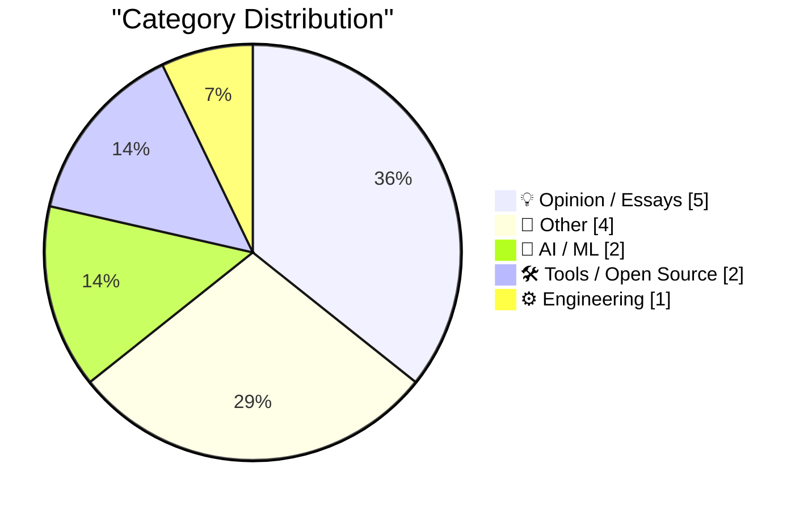
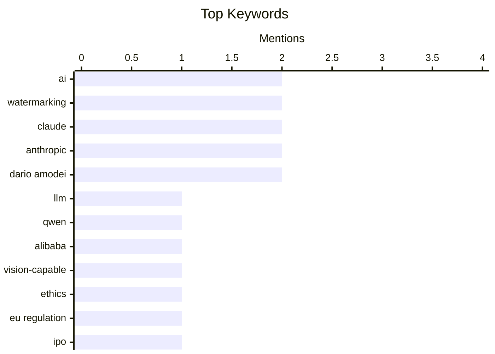

## Today's Highlights
Today's tech highlights underscore a rapidly evolving and scrutinized AI landscape. New models like Qwen 3.8 27B showcase advanced capabilities, yet the industry faces increasing ethical debates. Companies such as Anthropic are under fire for practices like text watermarking and perceived IPO over-hyping, fueling discussions on AI regulation and public perception. This critical examination signals a significant shift in human-computer interaction and the ongoing push for responsible AI development.
---
## Must Read Today
1. **Qwen 3.8 27B is excellent, but it defaults to wildly overthinking things**
[Qwen 3.8 27B is excellent, but it defaults to wildly overthinking things](https://simonwillison.net/2026/Aug/16/qwen-38-27b/) — simonwillison.net · 16h ago · 🤖 AI / ML
> The Qwen 3.8 27B LLM, an Apache 2 licensed, vision-capable model from Alibaba, exhibits a default behavior of overthinking prompts, leading to verbose responses. This 27B parameter model is well-suited for running on reasonably specced laptops, building on its impressive predecessor, Qwen 3.6 27B. However, its tendency to provide extensive explanations and disclaimers, even for simple requests, means users often need to explicitly prompt it for brevity. Despite its power, effective prompting is crucial to mitigate its default verbosity and achieve concise outputs. Qwen 3.8 27B is a highly capable LLM, but users should be aware of its default verbosity and learn to prompt it effectively for concise outputs.
💡 **Why read it**: It provides a practical review of a new, powerful, and deployable LLM, highlighting a common usability challenge and potential solutions.
🏷️ LLM, Qwen, Alibaba, Vision-capable
2. **★ Anthropic’s ‘Watermark’ Text Adulteration in Claude Is a Perversion of Writing**
[★ Anthropic’s ‘Watermark’ Text Adulteration in Claude Is a Perversion of Writing](https://daringfireball.net/2026/08/anthropics_watermark_text_adulteration_in_claude_is_a_perversion_of_writing) — daringfireball.net · 18h ago · 💡 Opinion / Essays
> The article strongly criticizes Anthropic's decision to embed 'watermarks' or hidden clues within text generated by Claude, deeming it an unacceptable compromise of output quality. The author argues that a tool's primary function is to serve the user's needs for clarity, coherence, and meaning, not to sacrifice these for embedding provenance metadata. This 'adulteration' is viewed as an offensive imposition, prioritizing external identification over the user's creative or informational intent. Embedding watermarks in AI-generated text is fundamentally flawed, as it prioritizes external regulatory or identification needs over the core quality and user-centric purpose of the writing.
💡 **Why read it**: It presents a strong, principled argument against AI text watermarking, focusing on user autonomy and the purity of generated content.
🏷️ AI, Watermarking, Claude, Ethics
3. **‘Anthropic’s Weak Watermarks Appease a Weak Law’**
[‘Anthropic’s Weak Watermarks Appease a Weak Law’](https://blog.j11y.io/2026-08-12_Anthropics-weak-watermarks-appease-a-weak-law/) — daringfireball.net · 20h ago · 💡 Opinion / Essays
> This article critiques Anthropic's text watermarking in Claude as a misguided response to a 'weak law,' arguing that such regulations misapply principles to AI tools. James Padolsey suggests the rationale for mandating AI watermarks is inconsistent, akin to demanding artifacts from calculators or spellcheckers. He implies that distinguishing between human and AI-generated content only when the AI becomes sufficiently capable (e.g., composing full sentences) lacks a principled basis. The watermarks are thus seen as an appeasement to an ill-conceived EU regulation rather than a necessary or logical feature. The implementation of AI text watermarks, particularly by Anthropic, is a misguided response to poorly conceived regulations that fail to apply consistent logic across different assistive technologies.
💡 **Why read it**: It offers a critical perspective on the regulatory motivations behind AI watermarking, questioning the underlying principles of such laws.
🏷️ AI, Watermarking, EU Regulation, Claude
---
## Data Overview
| Sources Scanned | Articles Fetched | Time Window | Selected |
|:---:|:---:|:---:|:---:|
| 87/92 | 2584 -> 14 | 24h | **14** |
### Category Distribution

### Top Keywords

<details>
<summary>Plain Text Keyword Chart (Terminal Friendly)</summary>
```
ai             │ ████████████████████ 2
watermarking   │ ████████████████████ 2
claude         │ ████████████████████ 2
anthropic      │ ████████████████████ 2
dario amodei   │ ████████████████████ 2
llm            │ ██████████░░░░░░░░░░ 1
qwen           │ ██████████░░░░░░░░░░ 1
alibaba        │ ██████████░░░░░░░░░░ 1
vision-capable │ ██████████░░░░░░░░░░ 1
ethics         │ ██████████░░░░░░░░░░ 1
```
</details>
### Topic Tags
**ai**(2) · **watermarking**(2) · **claude**(2) · anthropic(2) · dario amodei(2) · llm(1) · qwen(1) · alibaba(1) · vision-capable(1) · ethics(1) · eu regulation(1) · ipo(1) · ai hype(1) · market analysis(1) · ai risk(1) · public perception(1) · llms(1) · ai agents(1) · flexible schemas(1) · system design(1)
---
## Opinion / Essays
### 1. ★ Anthropic’s ‘Watermark’ Text Adulteration in Claude Is a Perversion of Writing
[★ Anthropic’s ‘Watermark’ Text Adulteration in Claude Is a Perversion of Writing](https://daringfireball.net/2026/08/anthropics_watermark_text_adulteration_in_claude_is_a_perversion_of_writing) — **daringfireball.net** · 18h ago · ⭐ 27/30
> The article strongly criticizes Anthropic's decision to embed 'watermarks' or hidden clues within text generated by Claude, deeming it an unacceptable compromise of output quality. The author argues that a tool's primary function is to serve the user's needs for clarity, coherence, and meaning, not to sacrifice these for embedding provenance metadata. This 'adulteration' is viewed as an offensive imposition, prioritizing external identification over the user's creative or informational intent. Embedding watermarks in AI-generated text is fundamentally flawed, as it prioritizes external regulatory or identification needs over the core quality and user-centric purpose of the writing.
🏷️ AI, Watermarking, Claude, Ethics
---
### 2. ‘Anthropic’s Weak Watermarks Appease a Weak Law’
[‘Anthropic’s Weak Watermarks Appease a Weak Law’](https://blog.j11y.io/2026-08-12_Anthropics-weak-watermarks-appease-a-weak-law/) — **daringfireball.net** · 20h ago · ⭐ 27/30
> This article critiques Anthropic's text watermarking in Claude as a misguided response to a 'weak law,' arguing that such regulations misapply principles to AI tools. James Padolsey suggests the rationale for mandating AI watermarks is inconsistent, akin to demanding artifacts from calculators or spellcheckers. He implies that distinguishing between human and AI-generated content only when the AI becomes sufficiently capable (e.g., composing full sentences) lacks a principled basis. The watermarks are thus seen as an appeasement to an ill-conceived EU regulation rather than a necessary or logical feature. The implementation of AI text watermarks, particularly by Anthropic, is a misguided response to poorly conceived regulations that fail to apply consistent logic across different assistive technologies.
🏷️ AI, Watermarking, EU Regulation, Claude
---
### 3. The hyping of Anthropic’s IPO
[The hyping of Anthropic’s IPO](https://garymarcus.substack.com/p/the-hyping-of-anthropics-ipo) — **garymarcus.substack.com** · 18h ago · ⭐ 25/30
> The article critically examines the 'strong claims' and perceived over-hyping surrounding Anthropic's Initial Public Offering (IPO). While the provided snippet is brief, the title and author (Gary Marcus, known for AI skepticism) suggest a dissection of ambitious statements and valuations. The piece likely scrutinizes Anthropic's technological achievements, market position, or future prospects against the backdrop of its IPO. The article serves as a critical analysis, urging readers to approach the enthusiastic claims surrounding Anthropic's IPO with skepticism and a demand for substantiated evidence.
🏷️ Anthropic, IPO, AI Hype, Market Analysis
---
### 4. Quoting Dario Amodei
[Quoting Dario Amodei](https://simonwillison.net/2026/Aug/16/dario-amodei/) — **simonwillison.net** · 22h ago · ⭐ 24/30
> Dario Amodei, CEO of Anthropic, addresses the public's negative perception of AI, asserting that AI leaders' warnings are not the primary cause. Amodei argues that public distrust stems from a broader 'crisis of trust' in companies, governments, and the tech industry. He believes ordinary people suspect these entities are always devising new ways to exploit them, indicating a systemic issue of public skepticism towards powerful institutions. This pre-existing distrust then extends to new technologies like AI. Public apprehension towards AI is rooted in a deeper, pre-existing distrust of powerful institutions, not solely in warnings from AI leaders.
🏷️ AI Risk, Public Perception, Dario Amodei
---
### 5. The Information Profiles Cami Clark — Dario Amodei’s Wife, Ivanka Trump’s Friend, One-Time Would-Be Pornographer, and Anthropic’s ‘First Lady’
[The Information Profiles Cami Clark — Dario Amodei’s Wife, Ivanka Trump’s Friend, One-Time Would-Be Pornographer, and Anthropic’s ‘First Lady’](https://www.theinformation.com/articles/anthropics-first-lady-took-winding-road-top?rc=jfy0lk) — **daringfireball.net** · 18h ago · ⭐ 17/30
> This article profiles Cami Clark, wife of Anthropic CEO Dario Amodei, highlighting her unconventional background and significant influence within the AI company. Described as Amodei’s "emotional ballast," Clark provides counsel during Anthropic's rapid growth and regulatory challenges. Her past includes a brief stint in adult entertainment and a friendship with Ivanka Trump, showcasing a diverse personal history. This unique background is presented as integral to her role in supporting Amodei amidst the high-stakes AI industry. The profile suggests Clark's experiences and personal support are crucial to Amodei's leadership and Anthropic's trajectory.
🏷️ Dario Amodei, Anthropic, Cami Clark
---
## Other
### 6. Trump Administration ‘Not in Favor’ of Apple Using Chinese RAM
[Trump Administration ‘Not in Favor’ of Apple Using Chinese RAM](https://www.wsj.com/tech/apple-china-memory-chip-plan-57773a83?st=vfe1SA) — **daringfireball.net** · 21h ago · ⭐ 18/30
> The Trump administration expressed strong disapproval of Apple's plans to use Chinese-manufactured RAM to alleviate supply chain issues. According to Lutnick, the administration explicitly stated it was 'not in favor' of Apple using Chinese memory chips, despite Apple exploring this option to address a supply crunch. The message was 'plainly' relayed to Apple, emphasizing a preference for 'other solutions' over using Chinese components. This stance reflects broader U.S. government rules requiring American companies to avoid Chinese memory chips, indicating a geopolitical tension impacting tech supply chains. The Trump administration actively opposed Apple's use of Chinese RAM, underscoring the significant geopolitical influence on technology supply chain decisions and the ongoing U.S.-China tech rivalry.
🏷️ Apple, Supply Chain, China, US Politics
---
### 7. Pluralistic: Jennifer Jenkins' 'Music Copyright, Creativity, and Culture' (17 Aug 2026)
[Pluralistic: Jennifer Jenkins' 'Music Copyright, Creativity, and Culture' (17 Aug 2026)](https://pluralistic.net/2026/08/17/great-sousas-ghost/) — **pluralistic.net** · 7h ago · ⭐ 16/30
> This entry highlights Jennifer Jenkins' textbook, "Music Copyright, Creativity, and Culture," which critically examines the intersection of music copyright law, artistic creation, and cultural impact. The textbook, presented with comics, offers a definitive resource on music copyright, exploring how current laws affect artists' ability to create and share. It implicitly critiques the existing copyright framework, suggesting it may hinder rather than foster creativity and cultural development, referencing historical perspectives like "Great Sousa's Ghost." Jenkins' work serves as a crucial educational tool for understanding the complexities and potential pitfalls of music copyright in the modern creative landscape.
🏷️ Copyright, Culture, Infosec, Link Digest
---
### 8. And then the men with guns tell you to do it anyway
[And then the men with guns tell you to do it anyway](https://shkspr.mobi/blog/2026/08/and-then-the-men-with-guns-tell-you-to-do-it-anyway/) — **shkspr.mobi** · 2h ago · ⭐ 16/30
> This article recounts how the Egyptian government used mobile network provider Vodafone to send pro-regime propaganda messages to citizens during the February 2011 revolution. During the 2011 Egyptian revolution, Vodafone's network was commandeered to send SMS messages, ostensibly from the provider, urging citizens to support the armed forces and confront "traitors." This incident demonstrated how state actors can compel private telecommunications companies to disseminate propaganda and control information flow during times of political unrest. The messages were explicitly pro-regime, highlighting a direct government intervention into private communication infrastructure. The event underscores the vulnerability of private communication infrastructure to state control and its potential weaponization for political manipulation during crises.
🏷️ Egypt, Revolution, Mobile Alerts, Politics
---
### 9. When the Internet reached half of US households
[When the Internet reached half of US households](https://dfarq.homeip.net/when-the-internet-reached-half-of-us-households/?utm_source=rss&#038;utm_medium=rss&#038;utm_campaign=when-the-internet-reached-half-of-us-households) — **dfarq.homeip.net** · 3h ago · ⭐ 15/30
> This article marks August 17, 2000, as a significant milestone when the Internet reached 50% of US households, signifying its transition into the mainstream. On this date, the Internet's penetration in US households crossed the 50% threshold, moving beyond a tool primarily for computer science students to one adopted by the general public for activities like buying books. This widespread adoption marked a pivotal shift in how the Internet was perceived and utilized, transforming it from a niche technology to an essential part of daily life. The article implicitly highlights the rapid growth and societal integration of digital connectivity. August 17, 2000, represents the moment the Internet achieved mainstream status in the US, fundamentally changing consumer behavior and societal interaction.
🏷️ Internet history, Mainstream adoption, US households, 2000
---
## AI / ML
### 10. Qwen 3.8 27B is excellent, but it defaults to wildly overthinking things
[Qwen 3.8 27B is excellent, but it defaults to wildly overthinking things](https://simonwillison.net/2026/Aug/16/qwen-38-27b/) — **simonwillison.net** · 16h ago · ⭐ 27/30
> The Qwen 3.8 27B LLM, an Apache 2 licensed, vision-capable model from Alibaba, exhibits a default behavior of overthinking prompts, leading to verbose responses. This 27B parameter model is well-suited for running on reasonably specced laptops, building on its impressive predecessor, Qwen 3.6 27B. However, its tendency to provide extensive explanations and disclaimers, even for simple requests, means users often need to explicitly prompt it for brevity. Despite its power, effective prompting is crucial to mitigate its default verbosity and achieve concise outputs. Qwen 3.8 27B is a highly capable LLM, but users should be aware of its default verbosity and learn to prompt it effectively for concise outputs.
🏷️ LLM, Qwen, Alibaba, Vision-capable
---
### 11. Oops, Should’ve Thought of That
[Oops, Should’ve Thought of That](https://blog.jim-nielsen.com/2026/oops-shouldve-thought-of-that/) — **blog.jim-nielsen.com** · 19h ago · ⭐ 24/30
> The article explores a fundamental shift in human-computer interaction, moving from computers requiring rigid, explicit instructions to understanding 'vibes' through Large Language Models (LLMs). Gordon Brander's quote highlights that traditional computers demand exacting detail, whereas LLMs can 'extrapolate what you mean (more or less) from just a few words.' This signifies a profound change where computers can now process and respond to less precise, more intuitive inputs. LLMs enable computers to understand abstract concepts and intentions, moving beyond strict logical specifications. LLMs are transforming human-computer interaction by allowing computers to interpret vague 'vibes' and extrapolate meaning, rather than demanding precise, detailed instructions.
🏷️ LLMs, AI agents, Flexible schemas, System design
---
## Tools / Open Source
### 12. XCancel — An Unofficial Twitter/X Mirror
[XCancel — An Unofficial Twitter/X Mirror](https://xcancel.com/about) — **daringfireball.net** · 23h ago · ⭐ 23/30
> XCancel is introduced as an unofficial, privacy-focused alternative front-end for Twitter/X, addressing concerns about privacy and performance on the official platform. XCancel is an instance of Nitter, a free and open-source project available on GitHub. It enables users to browse Twitter/X without JavaScript, significantly enhancing privacy by preventing tracking. Furthermore, Nitter instances like XCancel are approximately 15 times lighter than the official Twitter/X site and generally serve pages faster, improving user experience. XCancel, powered by Nitter, offers a superior, privacy-respecting, and performant way to access Twitter/X content by circumventing the official platform's resource-heavy and tracking-enabled design.
🏷️ Nitter, Twitter, Open Source, Privacy
---
### 13. Markdown SVG upgrades
[Markdown SVG upgrades](https://simonwillison.net/2026/Aug/16/markdown-svg-upgrades/) — **simonwillison.net** · 14h ago · ⭐ 20/30
> The article details significant feature enhancements to the `markdown-svg-renderer` tool, making it more robust for sharing Markdown transcripts with embedded SVG documents. Initially built in May, the `markdown-svg-renderer` has evolved into an 'ideal tool' for its specific niche. While specific new features are not detailed, the context implies improvements in rendering, integration, or user experience for combining Markdown text with SVG graphics. The author's 'proclivity for drawing pelicans' suggests a personal investment in visual content within text. The `markdown-svg-renderer` tool has received substantial upgrades, establishing it as a highly effective solution for integrating and sharing SVG documents within Markdown content.
🏷️ Markdown, SVG, Renderer, Tool
---
## Engineering
### 14. Proportion of 1s in a Hadamard matrix
[Proportion of 1s in a Hadamard matrix](https://www.johndcook.com/blog/2026/08/16/proportion-of-1s-in-a-hadamard-matrix/) — **johndcook.com** · 12h ago · ⭐ 18/30
> The article discusses the construction of Hadamard matrices and implicitly explores the properties, such as the proportion of 1s, within these matrices. It describes a method for constructing new Hadamard matrices (Hn+1) by taking the Kronecker product of an existing Hadamard matrix (Hn) with another Hadamard matrix (G). This iterative process, starting with H0, allows for the systematic generation of a sequence of Hadamard matrices. The focus on the 'Proportion of 1s' suggests an analysis of the distribution of elements within these constructed matrices. New Hadamard matrices can be systematically generated using Kronecker products, enabling further analysis of their structural properties like the distribution of 1s.
🏷️ Hadamard matrix, Kronecker product, Mathematics, Linear algebra
---
*Generated at 2026-08-17 14:01 | Scanned 87 sources -> 2584 articles -> selected 14*
*Based on the [Hacker News Popularity Contest 2025](https://refactoringenglish.com/tools/hn-popularity/) RSS source list recommended by [Andrej Karpathy](https://x.com/karpathy)*
*Produced by Dongdianr AI. Follow the same-name WeChat public account for more AI practical tips 💡*
