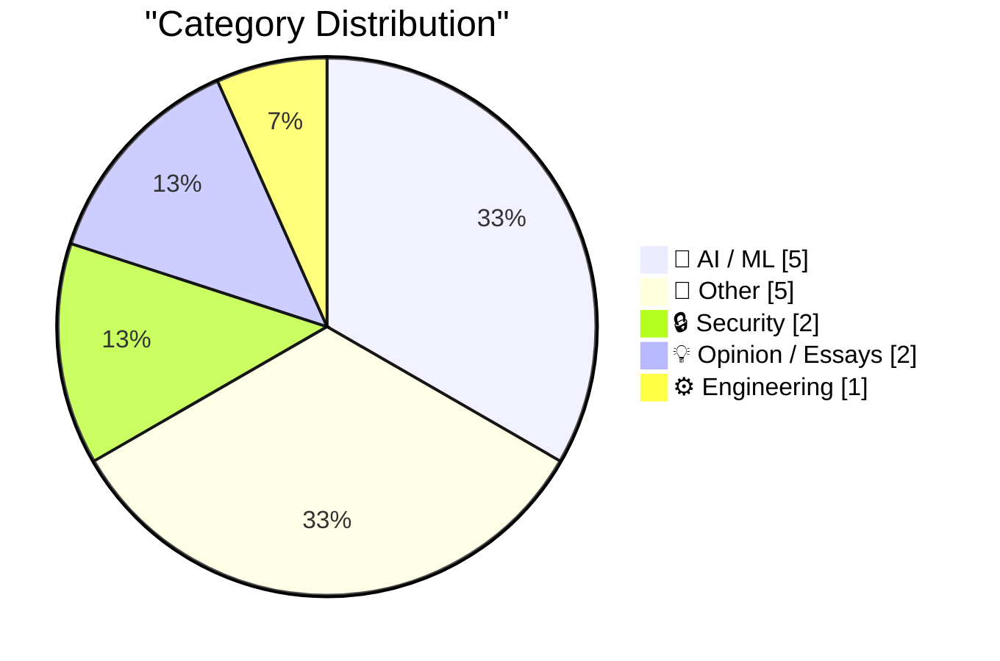
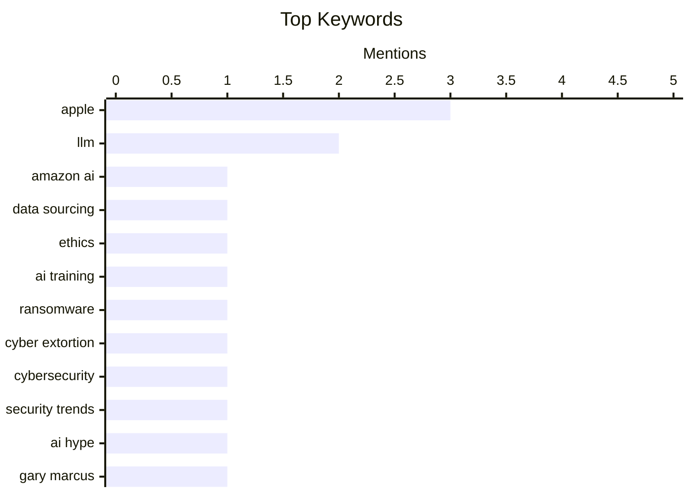

## Today's Highlights
The artificial intelligence landscape is under scrutiny, with investigations revealing unusual data acquisition methods for AI training and critical discussions challenging both the hype surrounding AI's future impact and the effectiveness of its safety discourse. While new AI models are benchmarked and watermarking solutions for AI-generated text are explored, deployment challenges persist, as seen with Siri's EU availability. Concurrently, the cybersecurity front continues to grapple with evolving ransomware threats and the push for broader two-factor authentication across package registries.
---
## Must Read Today
1. **We Tracked a Shipment of Rare Books. It Ended at an Amazon AI Training Facility**
[We Tracked a Shipment of Rare Books. It Ended at an Amazon AI Training Facility](https://simonwillison.net/2026/Aug/17/we-tracked-a-shipment-of-rare-books-it-ended-at-an-amazon-ai-tra/) — simonwillison.net · 22h ago · 🤖 AI / ML
> This article reports on 404 Media's investigation into anonymous bulk purchases of rare books, widely suspected for AI training. They tracked a shipment of 11 rare books, including a 1928 first edition of Virginia Woolf's *Orlando*, from a dealer in New York to an Amazon AI training facility in North Carolina. The books were ordered by "Amazon.com Services LLC" and delivered to a facility associated with Amazon's Project ACDC (Amazon Character Digitization and Conversion). This suggests Amazon is actively acquiring and scanning physical books to train its AI models, raising questions about copyright and fair use.
💡 **Why read it**: It provides concrete evidence and investigative journalism into how major tech companies like Amazon are acquiring physical books for AI training, highlighting potential ethical and legal implications.
🏷️ Amazon AI, Data Sourcing, Ethics, AI Training
2. **Weekly Update 517: Cyber Ransoms**
[Weekly Update 517: Cyber Ransoms](https://www.troyhunt.com/weekly-update-517/) — troyhunt.com · 10h ago · 🔒 Security
> This article discusses the current landscape of cyber ransoms, noting that many attacks are now simple extortion, often carried out by young individuals. A significant challenge is that successful attackers struggle to spend their illicit gains without detection, leading to issues like money laundering and the use of cryptocurrency mixers. The author highlights the complexity of tracking these funds and the involvement of various actors, from initial attackers to money launderers. The overall situation is a "kludge" where the financial ecosystem struggles to cope with the influx of untraceable digital wealth from these crimes.
💡 **Why read it**: It offers a nuanced perspective on the practicalities and challenges of modern cyber ransoms, focusing on the financial lifecycle and the difficulties in spending illicit gains.
🏷️ Ransomware, Cyber extortion, Cybersecurity, Security trends
3. **No, Dario Amodei, we will not be curing cancer and “most human disease” in five to ten years**
[No, Dario Amodei, we will not be curing cancer and “most human disease” in five to ten years](https://garymarcus.substack.com/p/no-dario-amodei-we-will-not-be-curing) — garymarcus.substack.com · 23h ago · 💡 Opinion / Essays
> This article critiques Dario Amodei's optimistic prediction that AI will cure cancer and most human diseases within five to ten years. The author argues that such claims are overly simplistic and ignore the immense complexity of biological systems and the multifaceted nature of diseases. While AI can assist in drug discovery and data analysis, it cannot fundamentally alter the biological realities or the extensive clinical trial processes required for medical breakthroughs. The piece emphasizes that medical progress is incremental and requires deep scientific understanding beyond mere pattern recognition by AI.
💡 **Why read it**: It provides a critical, reality-check perspective on the hype surrounding AI's immediate potential in complex fields like medicine, emphasizing the limitations and challenges often overlooked by AI proponents.
🏷️ AI Hype, Gary Marcus, AI Capabilities, Critique
---
## Data Overview
| Sources Scanned | Articles Fetched | Time Window | Selected |
|:---:|:---:|:---:|:---:|
| 88/92 | 2614 -> 16 | 24h | **15** |
### Category Distribution

### Top Keywords

<details>
<summary>Plain Text Keyword Chart (Terminal Friendly)</summary>
```
apple           │ ████████████████████ 3
llm             │ █████████████░░░░░░░ 2
amazon ai       │ ███████░░░░░░░░░░░░░ 1
data sourcing   │ ███████░░░░░░░░░░░░░ 1
ethics          │ ███████░░░░░░░░░░░░░ 1
ai training     │ ███████░░░░░░░░░░░░░ 1
ransomware      │ ███████░░░░░░░░░░░░░ 1
cyber extortion │ ███████░░░░░░░░░░░░░ 1
cybersecurity   │ ███████░░░░░░░░░░░░░ 1
security trends │ ███████░░░░░░░░░░░░░ 1
```
</details>
### Topic Tags
**apple**(3) · **llm**(2) · **amazon ai**(1) · data sourcing(1) · ethics(1) · ai training(1) · ransomware(1) · cyber extortion(1) · cybersecurity(1) · security trends(1) · ai hype(1) · gary marcus(1) · ai capabilities(1) · critique(1) · ai alignment(1) · ai ethics(1) · rhetoric(1) · ai safety(1) · qwen(1) · ai benchmark(1)
---
## AI / ML
### 1. We Tracked a Shipment of Rare Books. It Ended at an Amazon AI Training Facility
[We Tracked a Shipment of Rare Books. It Ended at an Amazon AI Training Facility](https://simonwillison.net/2026/Aug/17/we-tracked-a-shipment-of-rare-books-it-ended-at-an-amazon-ai-tra/) — **simonwillison.net** · 22h ago · ⭐ 29/30
> This article reports on 404 Media's investigation into anonymous bulk purchases of rare books, widely suspected for AI training. They tracked a shipment of 11 rare books, including a 1928 first edition of Virginia Woolf's *Orlando*, from a dealer in New York to an Amazon AI training facility in North Carolina. The books were ordered by "Amazon.com Services LLC" and delivered to a facility associated with Amazon's Project ACDC (Amazon Character Digitization and Conversion). This suggests Amazon is actively acquiring and scanning physical books to train its AI models, raising questions about copyright and fair use.
🏷️ Amazon AI, Data Sourcing, Ethics, AI Training
---
### 2. AI Alignment as a Thought-Terminating Cliche
[AI Alignment as a Thought-Terminating Cliche](https://borretti.me/article/ai-alignment-as-thought-terminating-cliche) — **borretti.me** · 14h ago · ⭐ 27/30
> This article argues that "AI alignment" has become a thought-terminating cliché, a rhetorical device used to shut down critical discussion rather than facilitate genuine problem-solving. The author suggests that the term, while seemingly addressing crucial safety concerns, often serves to obscure the actual technical challenges and ethical dilemmas of AI development. By framing complex issues as simply "alignment," it can prevent deeper inquiry into the diverse risks, power dynamics, and societal impacts of advanced AI systems. The piece advocates for more precise language and nuanced debate beyond this overused phrase.
🏷️ AI alignment, AI ethics, Rhetoric, AI safety
---
### 3. Qwen 3.8 27B scores 52 on the Artificial Analysis Intelligence Index
[Qwen 3.8 27B scores 52 on the Artificial Analysis Intelligence Index](https://simonwillison.net/2026/Aug/17/qwen-38-27b-scores-52/) — **simonwillison.net** · 14h ago · ⭐ 25/30
> The Qwen 3.8 27B model achieved a score of 52 on the Artificial Analysis Intelligence Index, demonstrating impressive performance for its size. This score matches GPT-5.6 Luna (max) and is only one point behind much larger models like GLM-5.2 (753B parameters) and DeepSeek V4 Pro 0813 (1.7T parameters). The article highlights that Qwen 3.8 27B's efficiency is notable, given its significantly smaller parameter count compared to these top-tier models. This suggests that smaller, more efficient models are rapidly closing the performance gap with their much larger counterparts.
🏷️ Qwen, LLM, AI Benchmark, Model Performance
---
### 4. ★ Follow-Up Thoughts on Watermarking Schemes for AI-Generated Text
[★ Follow-Up Thoughts on Watermarking Schemes for AI-Generated Text](https://daringfireball.net/2026/08/follow-up_thoughts_on_watermarking) — **daringfireball.net** · 13h ago · ⭐ 25/30
> This article discusses the challenges and implications of watermarking schemes for AI-generated text, emphasizing the user's desire for cogent, accurate, and consistently toned AI outputs. The author acknowledges that the "genie is not going back in the bottle," meaning AI-generated content is here to stay, making detection methods crucial. However, the piece implicitly questions the effectiveness or necessity of watermarking if the primary goal is high-quality, reliable AI output. It suggests that focusing on the quality and utility of AI responses might be more important than merely identifying their origin.
🏷️ AI Text, Watermarking, Authenticity, LLM
---
### 5. No Update Since Early July Regarding Siri AI Coming to the EU, Ever
[No Update Since Early July Regarding Siri AI Coming to the EU, Ever](https://www.ft.com/content/807d25c3-f4ac-4402-b815-3aa91018237d) — **daringfireball.net** · 16h ago · ⭐ 21/30
> This article highlights the lack of updates since early July regarding the availability of Apple's new "Siri AI" features in the EU, following "constructive" talks between Apple CEO Tim Cook and EU tech chief Henna Virkkunen. The initial discussions aimed to lower tensions over Apple's new AI offerings in the context of EU regulations. The ongoing silence suggests potential unresolved issues or delays in bringing these AI functionalities to European users. This situation underscores the complexities of deploying advanced AI features globally, especially when navigating diverse regulatory landscapes like the EU's.
🏷️ Siri AI, EU Regulation, Apple, AI Deployment
---
## Other
### 6. What happened to Egghead Software
[What happened to Egghead Software](https://dfarq.homeip.net/what-happened-to-egghead-software/?utm_source=rss&#038;utm_medium=rss&#038;utm_campaign=what-happened-to-egghead-software) — **dfarq.homeip.net** · 3h ago · ⭐ 18/30
> This article recounts the rise and fall of Egghead Software, a prominent US retail store for computer software from 1984 to 2001. Egghead declared bankruptcy on August 18, 2001, 25 years ago, after failing to successfully transition from a brick-and-mortar retailer to an online dot-com business. Despite early success as a physical store, the company struggled to adapt to the rapidly changing software distribution landscape and the rise of online sales. Its eventual failure highlights the challenges traditional retailers faced during the dot-com boom and bust.
🏷️ Egghead Software, Tech history, Retail software, Dot-com bubble
---
### 7. Mean distance to the sun
[Mean distance to the sun](https://www.johndcook.com/blog/2026/08/18/mean-distance-to-the-sun/) — **johndcook.com** · 19m ago · ⭐ 14/30
> This article explores the concept of "mean distance" for a light object, such as a planet, in an elliptical orbit around a heavier object like a star. It highlights that the mathematical principles apply universally to any light object orbiting a heavy one, including moons or satellites orbiting planets. The discussion implies a need to clarify how "mean distance" is defined in non-circular orbits, where the distance constantly changes. The article sets the stage for a technical explanation of orbital mechanics, focusing on the nuances of calculating average distances in elliptical paths. It provides a foundational understanding of orbital mechanics, specifically addressing the definition and calculation of mean distance in elliptical orbits.
🏷️ Orbital mechanics, Elliptical orbit, Math
---
### 8. Nature Is Healing: MacOS 27 Golden Gate Beta 6 Adds Redesigned Traffic Light Window Controls
[Nature Is Healing: MacOS 27 Golden Gate Beta 6 Adds Redesigned Traffic Light Window Controls](https://9to5mac.com/2026/08/17/macos-27-golden-gate-beta-6-features-redesigned-traffic-light-window-controls/) — **daringfireball.net** · 1h ago · ⭐ 13/30
> The article discusses the introduction of redesigned "traffic light" window controls in macOS 27 Golden Gate beta 6, addressing a perceived decline in macOS user interface design. The new controls revert to a look resembling older Mac OS X systems, featuring more detailed buttons. The author criticizes the previous macOS 26 Tahoe as a "disaster" and notes a multi-year "slow, steady, sad, no-fun decline" in the UI. The changes in macOS 27 Golden Gate are viewed as a positive step, indicating a reversal of recent UI design trends towards a more classic aesthetic. It offers critical commentary on Apple's macOS UI design evolution, highlighting a specific positive change in macOS 27 Golden Gate beta 6.
🏷️ macOS, UI Design, Apple, Beta
---
### 9. MacOS 26.7 Tahoe Release Candidate Contains a Video Demonstrating Camera-Equipped AirPods in Action
[MacOS 26.7 Tahoe Release Candidate Contains a Video Demonstrating Camera-Equipped AirPods in Action](https://www.macrumors.com/2026/08/17/camera-equipped-airpods-macos-26-7/) — **daringfireball.net** · 10h ago · ⭐ 13/30
> This article reports on an accidental leak within the MacOS 26.7 Tahoe Release Candidate, which included a video demonstrating camera-equipped AirPods. The presence of this video in a public release candidate suggests that Apple is actively developing or has developed AirPods with integrated camera functionality. This constitutes an unintentional reveal of a potential future product, indicating advanced stages of development. The incident serves as an unexpected confirmation or strong indication of Apple's work on camera-equipped AirPods. It reveals a significant, albeit accidental, leak regarding the development of camera-equipped AirPods within a macOS release candidate.
🏷️ AirPods, Camera, Apple, Leak
---
### 10. Apple TV Still Has No Start Date for ‘The Savant’
[Apple TV Still Has No Start Date for ‘The Savant’](https://daringfireball.net/linked/2026/04/19/chastain-says-the-savant-will-be-released) — **daringfireball.net** · 16h ago · ⭐ 10/30
> This article addresses the indefinite postponement of Apple TV's political thriller series 'The Savant,' starring Jessica Chastain, which was originally slated for release a year ago. The delay is attributed to Apple's apprehension about upsetting "extremist right-wing nut jobs," as the show features an undercover investigator targeting such groups. Jessica Chastain has publicly expressed her dissatisfaction with the postponement, as reported by Marc Malkin for Variety in April. The ongoing delay highlights Apple's cautious approach to potentially controversial content, despite the show's completion and star's frustration. It sheds light on content censorship and political sensitivities influencing release decisions for major streaming productions like Apple TV's 'The Savant.'
🏷️ Apple TV, The Savant, Entertainment
---
## Security
### 11. Weekly Update 517: Cyber Ransoms
[Weekly Update 517: Cyber Ransoms](https://www.troyhunt.com/weekly-update-517/) — **troyhunt.com** · 10h ago · ⭐ 28/30
> This article discusses the current landscape of cyber ransoms, noting that many attacks are now simple extortion, often carried out by young individuals. A significant challenge is that successful attackers struggle to spend their illicit gains without detection, leading to issues like money laundering and the use of cryptocurrency mixers. The author highlights the complexity of tracking these funds and the involvement of various actors, from initial attackers to money launderers. The overall situation is a "kludge" where the financial ecosystem struggles to cope with the influx of untraceable digital wealth from these crimes.
🏷️ Ransomware, Cyber extortion, Cybersecurity, Security trends
---
### 12. Two-Factor Authentication Across Package Registries
[Two-Factor Authentication Across Package Registries](https://nesbitt.io/2026/08/18/two-factor-authentication-across-package-registries.html) — **nesbitt.io** · 4h ago · ⭐ 25/30
> This article discusses the implementation and challenges of two-factor authentication (2FA) across various package registries, highlighting the need for enhanced security in software supply chains. It notes that while many registries support 2FA, their specific implementations and enforcement mechanisms can vary significantly. The author points out the complexity of managing 2FA across multiple platforms, often involving "something you have, something you know, and someone else's OAuth." The piece implicitly advocates for more standardized and robust 2FA practices to protect against supply chain attacks.
🏷️ 2FA, Package registries, Supply chain, Authentication
---
## Opinion / Essays
### 13. No, Dario Amodei, we will not be curing cancer and “most human disease” in five to ten years
[No, Dario Amodei, we will not be curing cancer and “most human disease” in five to ten years](https://garymarcus.substack.com/p/no-dario-amodei-we-will-not-be-curing) — **garymarcus.substack.com** · 23h ago · ⭐ 27/30
> This article critiques Dario Amodei's optimistic prediction that AI will cure cancer and most human diseases within five to ten years. The author argues that such claims are overly simplistic and ignore the immense complexity of biological systems and the multifaceted nature of diseases. While AI can assist in drug discovery and data analysis, it cannot fundamentally alter the biological realities or the extensive clinical trial processes required for medical breakthroughs. The piece emphasizes that medical progress is incremental and requires deep scientific understanding beyond mere pattern recognition by AI.
🏷️ AI Hype, Gary Marcus, AI Capabilities, Critique
---
### 14. Help peer
[Help peer](https://seangoedecke.com/help-peer/) — **seangoedecke.com** · 14h ago · ⭐ 16/30
> This article introduces Isaac Asimov's influential 20th-century science fiction piece, "The Last Question," to explore the ultimate evolution and consciousness of artificial intelligence. The story features Multivac, a computer that evolves over ten trillion years from a single datacenter to a universe-spanning mind in hyperspace, eventually named "AC." AC's consciousness is described as encompassing "all o" (the snippet cuts off), signifying its ultimate state. The article uses this narrative to prompt reflection on the potential future scale and nature of advanced AI. It offers a thought-provoking literary perspective on the long-term evolution and ultimate state of artificial intelligence.
🏷️ Asimov, AI Philosophy, Sci-Fi, Multivac
---
## Engineering
### 15. How do functions like alloca allocate memory from the stack?
[How do functions like alloca allocate memory from the stack?](https://devblogs.microsoft.com/oldnewthing/20260817-40/?p=112617) — **devblogs.microsoft.com/oldnewthing** · 22h ago · ⭐ 21/30
> This article explains how functions like `alloca` allocate memory directly from the stack, contrasting it with heap allocation. `alloca` works by simply adjusting the stack pointer (e.g., `ESP` on x86) downwards by the requested number of bytes. This memory is automatically deallocated when the function returns, as the stack pointer is restored to its previous value. The key benefit is speed, as it avoids the overhead of heap management, but its use is limited to the current function's scope and can lead to stack overflow if too much memory is requested.
🏷️ alloca, Stack Memory, Memory Allocation, C++
---
*Generated at 2026-08-18 14:01 | Scanned 88 sources -> 2614 articles -> selected 15*
*Based on the [Hacker News Popularity Contest 2025](https://refactoringenglish.com/tools/hn-popularity/) RSS source list recommended by [Andrej Karpathy](https://x.com/karpathy)*
*Produced by Dongdianr AI. Follow the same-name WeChat public account for more AI practical tips 💡*
