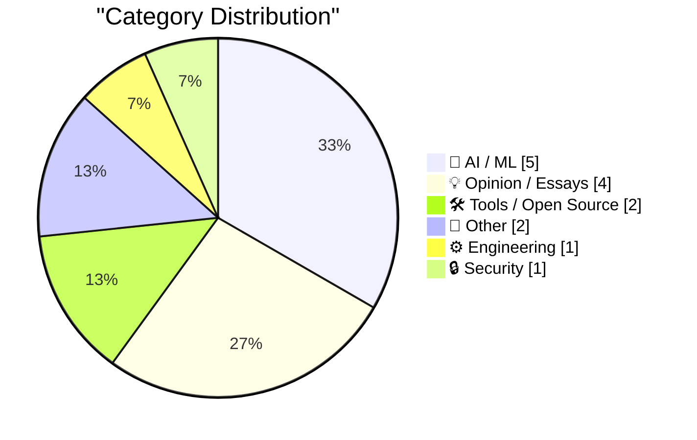
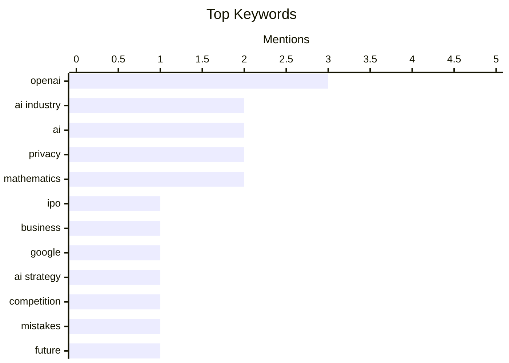

## Today's Highlights
The AI industry is navigating a turbulent period, marked by significant internal challenges at major players like OpenAI and Google's past missteps in the evolving landscape. This instability is mirrored by a growing public apprehension, as young adults express more concern than enthusiasm for AI, and new security threats emerge, including violent hijackings of valuable AI server chips. Despite these headwinds, innovation persists with the open-sourcing of AI-centric programming languages like Mojo and the continued development of autonomous AI agents. The sector faces a complex future, balancing rapid technological advancement with escalating societal and security risks.
---
## Must Read Today
1. **BREAKING: OpenAI’s unraveling has begun**
[BREAKING: OpenAI’s unraveling has begun](https://garymarcus.substack.com/p/breaking-openais-unraveling-has-begun) — garymarcus.substack.com · 7h ago · 🤖 AI / ML
> OpenAI is reportedly facing significant internal and external challenges, including a stalled IPO, eroded trust, and an escalating burn rate. The article suggests that internal dissent and a lack of clear leadership are contributing to the company's instability. High operational costs associated with large language models are exacerbating financial pressures. These combined factors indicate a potential period of significant difficulty or decline for OpenAI.
💡 **Why read it**: It provides a critical perspective on the current state and potential future challenges of a leading AI company, OpenAI.
🏷️ OpenAI, IPO, AI industry, business
2. **Google’s biggest mistake?**
[Google’s biggest mistake?](https://garymarcus.substack.com/p/googles-biggest-mistake) — garymarcus.substack.com · 17h ago · 🤖 AI / ML
> The article speculates on Google's significant missteps in the evolving AI landscape, particularly concerning its competitive position against rivals like OpenAI. It suggests that Google's cautious approach or internal bureaucracy may have hindered its ability to rapidly innovate and deploy cutting-edge AI products. The piece raises questions about specific strategic decisions that might have led to its perceived lagging. The author posits a theory about the root cause of Google's current challenges in the AI race and invites further discussion on its implications.
💡 **Why read it**: It offers a critical analysis of Google's strategic decisions in the AI domain and their potential long-term consequences.
🏷️ Google, AI strategy, competition, mistakes
3. **What Happens If OpenAI Dies?**
[What Happens If OpenAI Dies?](https://www.wheresyoured.at/what-happens-if-openai-dies/) — wheresyoured.at · 22h ago · 💡 Opinion / Essays
> This article explores the potential ramifications and market shifts if OpenAI, a prominent AI research and deployment company, were to cease operations. It discusses how the departure of a major player could impact competition, innovation, and the availability of key AI models and services. The piece considers the redistribution of talent, intellectual property, and market share among remaining AI companies. The article aims to provide a comprehensive analysis of the cascading effects on the AI industry and broader technological landscape should OpenAI fail.
💡 **Why read it**: It provides a speculative yet insightful analysis of the potential systemic impact on the AI industry if a major player like OpenAI were to fail.
🏷️ OpenAI, AI industry, future, speculation
---
## Data Overview
| Sources Scanned | Articles Fetched | Time Window | Selected |
|:---:|:---:|:---:|:---:|
| 88/92 | 2615 -> 19 | 24h | **15** |
### Category Distribution

### Top Keywords

<details>
<summary>Plain Text Keyword Chart (Terminal Friendly)</summary>
```
openai      │ ████████████████████ 3
ai industry │ █████████████░░░░░░░ 2
ai          │ █████████████░░░░░░░ 2
privacy     │ █████████████░░░░░░░ 2
mathematics │ █████████████░░░░░░░ 2
ipo         │ ███████░░░░░░░░░░░░░ 1
business    │ ███████░░░░░░░░░░░░░ 1
google      │ ███████░░░░░░░░░░░░░ 1
ai strategy │ ███████░░░░░░░░░░░░░ 1
competition │ ███████░░░░░░░░░░░░░ 1
```
</details>
### Topic Tags
**openai**(3) · **ai industry**(2) · **ai**(2) · privacy(2) · mathematics(2) · ipo(1) · business(1) · google(1) · ai strategy(1) · competition(1) · mistakes(1) · future(1) · speculation(1) · ai agents(1) · autonomy(1) · ethics(1) · societal impact(1) · mojo(1) · open source(1) · programming language(1)
---
## AI / ML
### 1. BREAKING: OpenAI’s unraveling has begun
[BREAKING: OpenAI’s unraveling has begun](https://garymarcus.substack.com/p/breaking-openais-unraveling-has-begun) — **garymarcus.substack.com** · 7h ago · ⭐ 28/30
> OpenAI is reportedly facing significant internal and external challenges, including a stalled IPO, eroded trust, and an escalating burn rate. The article suggests that internal dissent and a lack of clear leadership are contributing to the company's instability. High operational costs associated with large language models are exacerbating financial pressures. These combined factors indicate a potential period of significant difficulty or decline for OpenAI.
🏷️ OpenAI, IPO, AI industry, business
---
### 2. Google’s biggest mistake?
[Google’s biggest mistake?](https://garymarcus.substack.com/p/googles-biggest-mistake) — **garymarcus.substack.com** · 17h ago · ⭐ 26/30
> The article speculates on Google's significant missteps in the evolving AI landscape, particularly concerning its competitive position against rivals like OpenAI. It suggests that Google's cautious approach or internal bureaucracy may have hindered its ability to rapidly innovate and deploy cutting-edge AI products. The piece raises questions about specific strategic decisions that might have led to its perceived lagging. The author posits a theory about the root cause of Google's current challenges in the AI race and invites further discussion on its implications.
🏷️ Google, AI strategy, competition, mistakes
---
### 3. Asymmetric Agents
[Asymmetric Agents](https://shkspr.mobi/blog/2026/08/asymmetric-agents/) — **shkspr.mobi** · 2h ago · ⭐ 25/30
> The article discusses the long-standing promise of autonomous AI "agents" acting as personal servants, contrasting this vision with potential real-world complexities and power imbalances. It highlights the historical trope from the 1990s of "personal slave agents" negotiating on behalf of users, citing examples like finding a restaurant for a hot date with dietary preferences. The core issue raised is the "asymmetry" in capabilities or control between the user and the agent, or between different agents in a negotiation. The piece implicitly questions whether the idealized vision of helpful, subservient AI agents truly accounts for the potential for exploitation, manipulation, or unintended consequences arising from these power dynamics.
🏷️ AI agents, autonomy, ethics, societal impact
---
### 4. Pluralistic: IP can't save you from AI (18 Aug 2026)
[Pluralistic: IP can't save you from AI (18 Aug 2026)](https://pluralistic.net/2026/08/18/enron-corpus/) — **pluralistic.net** · 23h ago · ⭐ 24/30
> The article argues that intellectual property (IP) rights alone are insufficient to protect creators and workers in the age of AI. It posits that relying solely on property rights fails to address fundamental issues like labor rights and privacy rights, which are increasingly challenged by AI technologies. The author suggests that AI's capabilities for data ingestion and content generation fundamentally alter the landscape, making traditional IP protections less effective. The piece advocates for a broader framework that prioritizes labor and privacy rights alongside IP to genuinely safeguard individuals and their work from the disruptive impacts of AI.
🏷️ AI, intellectual property, labor rights, privacy
---
### 5. Pluralistic: The ordinariness of evil (19 Aug 2026)
[Pluralistic: The ordinariness of evil (19 Aug 2026)](https://pluralistic.net/2026/08/19/banaility/) — **pluralistic.net** · 6h ago · ⭐ 22/30
> The article critiques the pervasive and often normalized negative impacts of AI, framing them as "the ordinariness of evil." It suggests that many harmful applications of AI, such as surveillance, algorithmic bias, and job displacement, are becoming commonplace and accepted without sufficient scrutiny. The piece implicitly argues against the uncritical adoption and commercialization of AI technologies that may have detrimental societal consequences. The author urges readers to critically evaluate the ethical implications of AI development and deployment, particularly when profit motives overshadow human well-being and rights.
🏷️ AI ethics, policy, fair use
---
## Opinion / Essays
### 6. What Happens If OpenAI Dies?
[What Happens If OpenAI Dies?](https://www.wheresyoured.at/what-happens-if-openai-dies/) — **wheresyoured.at** · 22h ago · ⭐ 26/30
> This article explores the potential ramifications and market shifts if OpenAI, a prominent AI research and deployment company, were to cease operations. It discusses how the departure of a major player could impact competition, innovation, and the availability of key AI models and services. The piece considers the redistribution of talent, intellectual property, and market share among remaining AI companies. The article aims to provide a comprehensive analysis of the cascading effects on the AI industry and broader technological landscape should OpenAI fail.
🏷️ OpenAI, AI industry, future, speculation
---
### 7. Breaking: U.S. young adults are now more concerned about AI than enthusiastic
[Breaking: U.S. young adults are now more concerned about AI than enthusiastic](https://garymarcus.substack.com/p/breaking-us-young-adults-are-now) — **garymarcus.substack.com** · 19h ago · ⭐ 22/30
> A significant shift in public sentiment among U.S. young adults indicates growing concern over AI, surpassing their initial enthusiasm. This brief update highlights a trend where the perceived risks and negative implications of AI, such as job displacement, privacy issues, or misinformation, are now outweighing the perceived benefits. This marks a notable change from earlier periods of widespread optimism regarding AI's potential. The data suggests a maturing public perception of AI, with a younger demographic becoming increasingly wary of its societal impact.
🏷️ AI perception, public opinion, backlash, young adults
---
### 8. Apple Gives Legal Middle Finger to DOJ Challenge on Apple’s July Discovery Win
[Apple Gives Legal Middle Finger to DOJ Challenge on Apple’s July Discovery Win](https://9to5mac.com/2026/08/17/apple-dojs-latest-challenge-in-antitrust-case-fails-at-every-level/) — **daringfireball.net** · 15h ago · ⭐ 19/30
> The U.S. Department of Justice (DOJ) is pursuing an antitrust case against Apple, alleging anticompetitive features in its platforms, which Apple counters are privacy and security-related. Apple secured a significant discovery ruling in July, compelling 14 federal agencies, including the CIA, FBI, and NSA, to provide documents explaining their reasons for purchasing iPhones. The DOJ's subsequent challenge to this discovery win was rejected at every level. This indicates Apple's aggressive legal strategy to defend against antitrust claims by leveraging its security and privacy stance and challenging the government's evidentiary basis.
🏷️ Apple, antitrust, DOJ, privacy
---
### 9. OpenAI Pot Complains That Google Kettle Is Black
[OpenAI Pot Complains That Google Kettle Is Black](https://x.com/thsottiaux/status/2083373529081291076?s=12) — **daringfireball.net** · 23h ago · ⭐ 18/30
> OpenAI's Thibault Sottiaux criticized Google's Gmail for its 'zero-taste just-keep-cramming-shit-in approach' regarding new buttons and feature additions. The article highlights the irony of this criticism, suggesting a lack of self-awareness from the OpenAI executive. It points out that OpenAI's own products, particularly from the Codex team, often exhibit a similar design philosophy of continuously adding features without strong aesthetic or usability considerations. The piece concludes that the criticism of Google's design approach by an OpenAI executive is hypocritical, given the similar practices within OpenAI.
🏷️ UI/UX, Gmail, OpenAI, product design
---
## Tools / Open Source
### 10. Vim wants you to control, VSCode wants you to consume
[Vim wants you to control, VSCode wants you to consume](https://buttondown.com/hillelwayne/archive/vim-wants-you-to-control-vscode-wants-you-to/) — **buttondown.com/hillelwayne** · 21h ago · ⭐ 24/30
> The article contrasts the fundamental philosophies behind Vim and VSCode, arguing that Vim empowers user control while VSCode promotes consumption of features. Vim's design emphasizes deep customization, keyboard-driven workflows, and a steep learning curve that rewards mastery, giving users granular control over their editing environment. In contrast, VSCode prioritizes ease of use, a rich extension ecosystem, and a more opinionated, feature-rich experience that encourages users to consume pre-built functionalities. This philosophical divergence impacts how developers interact with their tools, with Vim fostering a sense of ownership and VSCode offering a more streamlined, but potentially less customizable, experience.
🏷️ Vim, VSCode, developer tools, philosophy
---
### 11. Hands-on with Raspberry Pi's CM5 Programming Jig
[Hands-on with Raspberry Pi's CM5 Programming Jig](https://www.jeffgeerling.com/blog/2026/cm5-programming-jig/) — **jeffgeerling.com** · 6h ago · ⭐ 19/30
> Flashing Raspberry Pi OS to multiple CM5s for cluster builds is a tedious and time-consuming process. Jeff Geerling addressed this by developing a custom CM5 Programming Jig, which simplifies the provisioning workflow. The jig utilizes a USB-C connection for power and data, a USB-A port for the CM5's USB 2.0 interface, and a micro-SD card slot for storage. This setup enables efficient flashing of CM5s via `rpiboot` over USB, significantly streamlining bulk deployments. The custom jig offers a practical solution to improve the efficiency of provisioning CM5s for cluster infrastructure.
🏷️ Raspberry Pi, CM5, programming jig, hardware
---
## Other
### 12. Big little hexagon
[Big little hexagon](https://www.johndcook.com/blog/2026/08/18/big-little-hexagon/) — **johndcook.com** · 13h ago · ⭐ 19/30
> The long-standing mathematical problem of finding the n-gon with diameter 1 and maximum area has been solved in a new paper, "The Maximum-Area Small Polygon Problem." For odd values of `n`, the solution is a regular n-gon, as commonly expected. However, for even `n`, the optimal shape is not a regular n-gon, presenting a more complex geometric configuration. This paper provides a definitive answer to a classic geometry challenge, differentiating optimal polygon shapes based on the parity of their sides.
🏷️ geometry, polygon, mathematics, research
---
### 13. The imbalance theorem
[The imbalance theorem](https://www.johndcook.com/blog/2026/08/18/the-imbalance-theorem/) — **johndcook.com** · 22h ago · ⭐ 19/30
> The 'imbalance conjecture' in graph theory has recently been proven by James Alexander Schreib and Yousof Yavari, elevating it to a formal theorem. This theorem applies to graphs where no edge connects two nodes of the same degree. For such a graph, calculating the absolute difference of the degrees of the endpoints for every edge. The theorem states that the sum of these absolute differences across all edges in the graph is always an even number. This proof establishes a new fundamental property concerning degree differences in specific types of graphs.
🏷️ graph theory, mathematics, theorem, proof
---
## Engineering
### 14. Mojo🔥 is now open source
[Mojo🔥 is now open source](https://simonwillison.net/2026/Aug/18/mojo-is-now-open-source/) — **simonwillison.net** · 16h ago · ⭐ 24/30
> The Mojo programming language, designed for AI development, has fulfilled its long-standing promise of becoming open source. Modular shipped Mojo 1.0 last week and subsequently released the compiler and toolchain under an Apache 2 license. This move, promised since May 2023, makes Mojo's high-performance capabilities, particularly its Pythonic syntax combined with systems-level performance, accessible to a broader developer community. The open-sourcing of Mojo 1.0 under an Apache 2 license marks a significant milestone, potentially accelerating its adoption and impact in the AI and machine learning ecosystem.
🏷️ Mojo, open source, programming language, AI
---
## Security
### 15. Organized Thieves Are Targeting AI Server Chips With Violent Highway Hijackings
[Organized Thieves Are Targeting AI Server Chips With Violent Highway Hijackings](https://www.wired.com/story/the-worst-ive-ever-seen-cargo-thieves-are-turning-violent-in-pursuit-of-ai-hardware/) — **daringfireball.net** · 19h ago · ⭐ 24/30
> Organized cargo thieves are increasingly targeting high-value AI server chips, resorting to violent highway hijackings. The incidents involved two separate shipments of high-value technology traveling from Silicon Valley to Southern California. Despite being escorted by private security professionals in unmarked vehicles, these shipments were violently intercepted, indicating a sophisticated and dangerous criminal operation. The rising demand and value of AI hardware are fueling a new wave of violent cargo theft, posing significant security challenges for the tech supply chain.
🏷️ AI chips, theft, supply chain, security
---
*Generated at 2026-08-19 14:01 | Scanned 88 sources -> 2615 articles -> selected 15*
*Based on the [Hacker News Popularity Contest 2025](https://refactoringenglish.com/tools/hn-popularity/) RSS source list recommended by [Andrej Karpathy](https://x.com/karpathy)*
*Produced by Dongdianr AI. Follow the same-name WeChat public account for more AI practical tips 💡*
