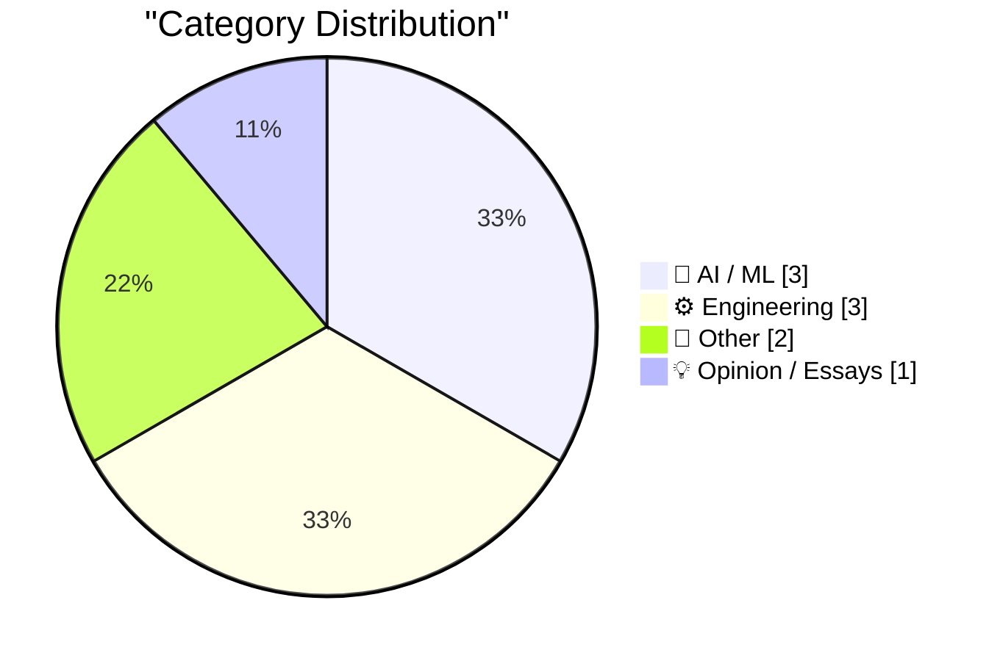
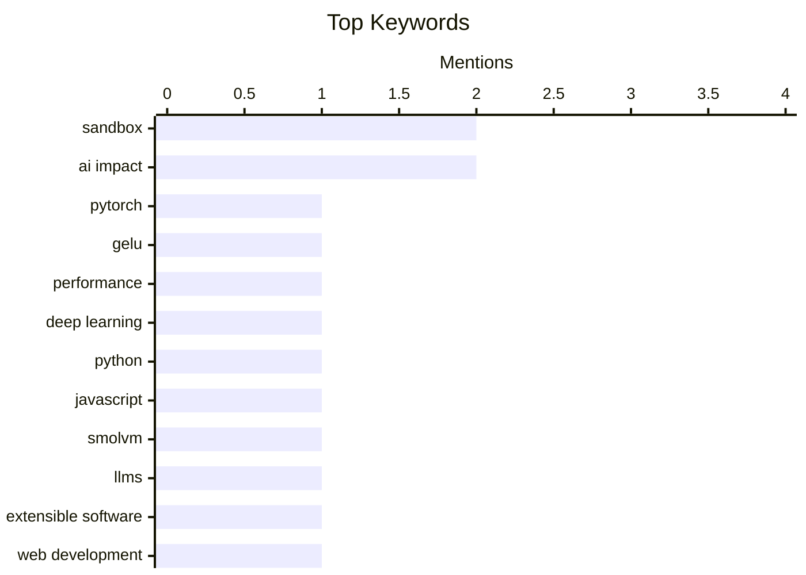

## Today's Highlights
Today's tech news highlights the dual focus on advancing AI/ML development and reinforcing core software engineering principles. Innovators are exploring creative AI applications, such as generating ASCII diagrams, while also refining best practices for efficiency. Meanwhile, engineers are tackling challenges like secure sandboxing for untrusted code and upholding conceptual integrity in design. Broader discussions also touch on the historical impact of tech giants and the evolving political scrutiny facing the industry.
---
## Must Read Today
1. **Use the built-in GELU, don't roll your own!**
[Use the built-in GELU, don't roll your own!](https://www.gilesthomas.com/2026/08/built-in-gelu) — gilesthomas.com · 12h ago · 🤖 AI / ML
> Use the built-in GELU, don't roll your own!
🏷️ PyTorch, GELU, performance, deep learning
2. **smolmachines / smolvm as a sandbox for untrusted Python & JavaScript**
[smolmachines / smolvm as a sandbox for untrusted Python & JavaScript](https://simonwillison.net/2026/Aug/19/smolmachines-untrusted-sandbox/) — simonwillison.net · 14h ago · ⚙️ Engineering
> smolmachines / smolvm as a sandbox for untrusted Python & JavaScript
🏷️ sandbox, Python, JavaScript, smolvm
3. **Quoting Jeremy Morrell**
[Quoting Jeremy Morrell](https://simonwillison.net/2026/Aug/19/jeremy-morrell/) — simonwillison.net · 15h ago · 🤖 AI / ML
> Quoting Jeremy Morrell
🏷️ LLMs, extensible software, sandbox, web development
---
## Data Overview
| Sources Scanned | Articles Fetched | Time Window | Selected |
|:---:|:---:|:---:|:---:|
| 87/92 | 2590 -> 9 | 24h | **9** |
### Category Distribution

### Top Keywords

<details>
<summary>Plain Text Keyword Chart (Terminal Friendly)</summary>
```
sandbox       │ ████████████████████ 2
ai impact     │ ████████████████████ 2
pytorch       │ ██████████░░░░░░░░░░ 1
gelu          │ ██████████░░░░░░░░░░ 1
performance   │ ██████████░░░░░░░░░░ 1
deep learning │ ██████████░░░░░░░░░░ 1
python        │ ██████████░░░░░░░░░░ 1
javascript    │ ██████████░░░░░░░░░░ 1
smolvm        │ ██████████░░░░░░░░░░ 1
llms          │ ██████████░░░░░░░░░░ 1
```
</details>
### Topic Tags
**sandbox**(2) · **ai impact**(2) · **pytorch**(1) · gelu(1) · performance(1) · deep learning(1) · python(1) · javascript(1) · smolvm(1) · llms(1) · extensible software(1) · web development(1) · conceptual integrity(1) · software development(1) · metrics(1) · ai art(1) · ascii diagrams(1) · incongruity(1) · generative ai(1) · git(1)
---
## AI / ML
### 1. Use the built-in GELU, don't roll your own!
[Use the built-in GELU, don't roll your own!](https://www.gilesthomas.com/2026/08/built-in-gelu) — **gilesthomas.com** · 12h ago · ⭐ 27/30
> Use the built-in GELU, don't roll your own!
🏷️ PyTorch, GELU, performance, deep learning
---
### 2. Quoting Jeremy Morrell
[Quoting Jeremy Morrell](https://simonwillison.net/2026/Aug/19/jeremy-morrell/) — **simonwillison.net** · 15h ago · ⭐ 24/30
> Quoting Jeremy Morrell
🏷️ LLMs, extensible software, sandbox, web development
---
### 3. AI-generated ASCII diagrams
[AI-generated ASCII diagrams](https://www.johndcook.com/blog/2026/08/20/ai-generated-ascii-diagrams/) — **johndcook.com** · 12m ago · ⭐ 18/30
> AI-generated ASCII diagrams
🏷️ AI art, ASCII diagrams, incongruity, generative AI
---
## Engineering
### 4. smolmachines / smolvm as a sandbox for untrusted Python & JavaScript
[smolmachines / smolvm as a sandbox for untrusted Python & JavaScript](https://simonwillison.net/2026/Aug/19/smolmachines-untrusted-sandbox/) — **simonwillison.net** · 14h ago · ⭐ 25/30
> smolmachines / smolvm as a sandbox for untrusted Python & JavaScript
🏷️ sandbox, Python, JavaScript, smolvm
---
### 5. Conceptual integrity and counting lines of code
[Conceptual integrity and counting lines of code](https://simonwillison.net/2026/Aug/19/conceptual-integrity-and-counting-lines-of-code/) — **simonwillison.net** · 15h ago · ⭐ 23/30
> Conceptual integrity and counting lines of code
🏷️ conceptual integrity, software development, AI impact, metrics
---
### 6. Issues in the Repo
[Issues in the Repo](https://nesbitt.io/2026/08/20/issues-in-the-repo.html) — **nesbitt.io** · 5h ago · ⭐ 17/30
> Issues in the Repo
🏷️ Git, repository, issue tracking, YAML
---
## Other
### 7. Breaking: The Republican party is panicking over its ties to Big Tech
[Breaking: The Republican party is panicking over its ties to Big Tech](https://garymarcus.substack.com/p/breaking-the-republican-party-is) — **garymarcus.substack.com** · 9h ago · ⭐ 14/30
> Breaking: The Republican party is panicking over its ties to Big Tech
🏷️ politics, Big Tech, Republican party, US news
---
### 8. Adobe Systems IPO August 20, 1986
[Adobe Systems IPO August 20, 1986](https://dfarq.homeip.net/adobe-systems-ipo-august-20-1986/?utm_source=rss&#038;utm_medium=rss&#038;utm_campaign=adobe-systems-ipo-august-20-1986) — **dfarq.homeip.net** · 3h ago · ⭐ 13/30
> Adobe Systems IPO August 20, 1986
🏷️ Adobe, IPO, tech history, business
---
## Opinion / Essays
### 9. Our Servants Will Do That For Us
[Our Servants Will Do That For Us](https://borretti.me/article/our-servants-will-do-that-for-us) — **borretti.me** · 14h ago · ⭐ 14/30
> Our Servants Will Do That For Us
🏷️ post-scarcity, utopia, society, AI impact
---
*Generated at 2026-08-20 14:01 | Scanned 87 sources -> 2590 articles -> selected 9*
*Based on the [Hacker News Popularity Contest 2025](https://refactoringenglish.com/tools/hn-popularity/) RSS source list recommended by [Andrej Karpathy](https://x.com/karpathy)*
*Produced by Dongdianr AI. Follow the same-name WeChat public account for more AI practical tips 💡*
