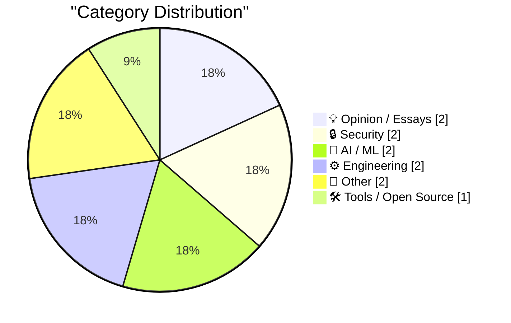
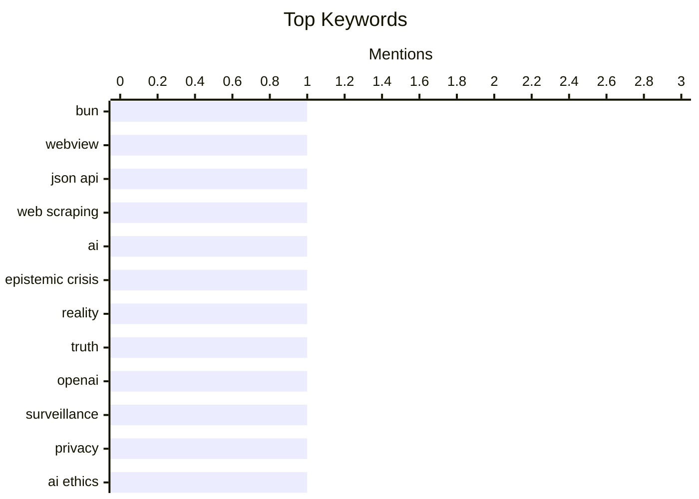

## Today's Highlights
The pervasive influence of artificial intelligence dominates headlines, with discussions ranging from AI's potential to create an "epistemic crisis" to OpenAI's evolving role as a surveillance entity. Adding to the complexity, human readers are reportedly unable to identify watermarked AI-generated text, even as platforms like ChatGPT expand their search capabilities. This rapidly advancing digital frontier also brings critical security concerns to the forefront, emphasizing that poorly designed interfaces pose significant liabilities. Together, these trends underscore the urgent need for vigilance in both AI development and digital security practices.
---
## Must Read Today
1. **A shot-scraper-style JSON API on Bun 1.4's new Bun.WebView**
[A shot-scraper-style JSON API on Bun 1.4's new Bun.WebView](https://simonwillison.net/2026/Aug/20/bun-webview-json-api/) — simonwillison.net · 22h ago · 🛠 Tools / Open Source
> This article explores creating a web scraping JSON API using Bun 1.4's new `Bun.WebView` feature, which integrates WebKit. It leverages `Bun.WebView` to load web pages, execute JavaScript, and extract data, mimicking the functionality of `shot-scraper`. This approach enables efficient, local web scraping without external browser dependencies, returning structured JSON output. The core finding is the practical utility of `Bun.WebView` for building powerful, self-contained web automation tools directly within the Bun runtime.
💡 **Why read it**: It demonstrates a novel application of Bun 1.4's `Bun.WebView` for efficient, local web scraping, offering a compelling alternative to traditional browser automation tools.
🏷️ Bun, WebView, JSON API, web scraping
2. **Pluralistic: The actual epistemic crisis (20 Aug 2026)**
[Pluralistic: The actual epistemic crisis (20 Aug 2026)](https://pluralistic.net/2026/08/20/epistemic-void/) — pluralistic.net · 14h ago · 💡 Opinion / Essays
> This article discusses the "actual epistemic crisis," arguing that AI's assault on reality is an opportunistic infection rather than the root cause. The core problem is a pre-existing breakdown in how society determines truth and knowledge, which AI then exploits. It suggests that the crisis stems from systemic issues that make societies vulnerable to misinformation, amplified by new technologies. The main takeaway is that addressing the epistemic crisis requires tackling its underlying societal and structural causes, not just the symptoms exacerbated by AI.
💡 **Why read it**: It offers a critical perspective on the "epistemic crisis," reframing AI's role from primary cause to opportunistic amplifier of existing societal vulnerabilities.
🏷️ AI, epistemic crisis, reality, truth
3. **OpenAI is becoming a surveillance company**
[OpenAI is becoming a surveillance company](https://garymarcus.substack.com/p/openai-is-becoming-a-surveillance) — garymarcus.substack.com · 14h ago · 🔒 Security
> The article posits that OpenAI is evolving into a surveillance company, moving beyond its initial AI research focus. It suggests that OpenAI's data collection practices and integration into various platforms are enabling extensive user monitoring. The author implies that this shift is not accidental but a deliberate strategy, potentially driven by commercial interests or control. The core conclusion is that users should be wary of the increasing data collection and surveillance capabilities embedded within OpenAI's products.
💡 **Why read it**: It raises a critical concern about OpenAI's expanding data collection and potential surveillance capabilities, urging users to consider the privacy implications of AI services.
🏷️ OpenAI, surveillance, privacy, AI ethics
---
## Data Overview
| Sources Scanned | Articles Fetched | Time Window | Selected |
|:---:|:---:|:---:|:---:|
| 87/92 | 2586 -> 11 | 24h | **11** |
### Category Distribution

### Top Keywords

<details>
<summary>Plain Text Keyword Chart (Terminal Friendly)</summary>
```
bun              │ ████████████████████ 1
webview          │ ████████████████████ 1
json api         │ ████████████████████ 1
web scraping     │ ████████████████████ 1
ai               │ ████████████████████ 1
epistemic crisis │ ████████████████████ 1
reality          │ ████████████████████ 1
truth            │ ████████████████████ 1
openai           │ ████████████████████ 1
surveillance     │ ████████████████████ 1
```
</details>
### Topic Tags
**bun**(1) · **webview**(1) · **json api**(1) · web scraping(1) · ai(1) · epistemic crisis(1) · reality(1) · truth(1) · openai(1) · surveillance(1) · privacy(1) · ai ethics(1) · security(1) · interface(1) · ui/ux(1) · ai security(1) · ai watermarking(1) · ai text(1) · authenticity(1) · detection(1)
---
## Opinion / Essays
### 1. Pluralistic: The actual epistemic crisis (20 Aug 2026)
[Pluralistic: The actual epistemic crisis (20 Aug 2026)](https://pluralistic.net/2026/08/20/epistemic-void/) — **pluralistic.net** · 14h ago · ⭐ 26/30
> This article discusses the "actual epistemic crisis," arguing that AI's assault on reality is an opportunistic infection rather than the root cause. The core problem is a pre-existing breakdown in how society determines truth and knowledge, which AI then exploits. It suggests that the crisis stems from systemic issues that make societies vulnerable to misinformation, amplified by new technologies. The main takeaway is that addressing the epistemic crisis requires tackling its underlying societal and structural causes, not just the symptoms exacerbated by AI.
🏷️ AI, epistemic crisis, reality, truth
---
### 2. Leopold’s Folly
[Leopold’s Folly](https://garymarcus.substack.com/p/leopolds-folly) — **garymarcus.substack.com** · 20h ago · ⭐ 14/30
> This article, titled "Leopold's Folly," appears to be a commentary on a specific event or action by a young man named Leopold, suggesting it could become symbolic of an entire era. Without further context from the provided snippet, the core problem or topic is the potential for a singular, perhaps misguided, act to represent broader societal trends or failures. The article likely delves into the implications of this act and its resonance within the current cultural or technological landscape. The main conclusion is that this "folly" serves as a powerful metaphor or warning for contemporary society.
🏷️ Leopold, era, symbolism, reflection
---
## Security
### 3. OpenAI is becoming a surveillance company
[OpenAI is becoming a surveillance company](https://garymarcus.substack.com/p/openai-is-becoming-a-surveillance) — **garymarcus.substack.com** · 14h ago · ⭐ 26/30
> The article posits that OpenAI is evolving into a surveillance company, moving beyond its initial AI research focus. It suggests that OpenAI's data collection practices and integration into various platforms are enabling extensive user monitoring. The author implies that this shift is not accidental but a deliberate strategy, potentially driven by commercial interests or control. The core conclusion is that users should be wary of the increasing data collection and surveillance capabilities embedded within OpenAI's products.
🏷️ OpenAI, surveillance, privacy, AI ethics
---
### 4. A Sloppy Interface Is a Security Liability 
[A Sloppy Interface Is a Security Liability ](https://blog.jim-nielsen.com/2026/sloppy-ui-is-security-liability/) — **blog.jim-nielsen.com** · 19h ago · ⭐ 26/30
> This article argues that poorly designed or "sloppy" user interfaces pose significant security risks, citing the Axios npm incident as an example. The maintainer was phished by a faux Microsoft Teams interface, highlighting how UI inconsistencies can be exploited for social engineering. The core problem is that users are trained to trust certain UI patterns, and deviations or poor design choices make them vulnerable to sophisticated phishing attacks. The main takeaway is that meticulous UI design is crucial for security, as it helps users distinguish legitimate interactions from malicious ones.
🏷️ Security, interface, UI/UX, AI security
---
## AI / ML
### 5. Readers can't identify watermarked AI text
[Readers can't identify watermarked AI text](https://seangoedecke.com/readers-cant-identify-watermarked-ai-text/) — **seangoedecke.com** · 14h ago · ⭐ 25/30
> The article investigates whether human readers can identify AI-generated text that has been watermarked. Contrary to common concerns, the author argues that AI watermarking is not anti-consumer and doesn't degrade output quality, citing academic papers like `arxiv.org/abs/2603.03410`. A practical test was conducted to see if readers could differentiate watermarked AI text from human-written text. The key finding is that readers generally cannot reliably identify watermarked AI text, suggesting that watermarking does not significantly impact human perception or readability.
🏷️ AI watermarking, AI text, authenticity, detection
---
### 6. ChatGPT search now uses the site:operator at scale
[ChatGPT search now uses the site:operator at scale](https://simonwillison.net/2026/Aug/20/chatgpt-search-now-uses-the-siteoperator-at-scale/) — **simonwillison.net** · 14h ago · ⭐ 24/30
> This article reports that ChatGPT's search functionality is now extensively utilizing the `site:operator` for web queries, as observed by Promptwatch. Promptwatch, a "Generative Engine Optimization" (GEO) tool, tracks how chatbots like ChatGPT respond to prompts. This development indicates a more targeted and potentially sophisticated approach to information retrieval within ChatGPT, allowing it to focus searches on specific domains. The main takeaway is that content creators and SEO professionals need to adapt to "GEO" strategies, as ChatGPT's search behavior directly impacts content visibility within AI responses.
🏷️ ChatGPT, site operator, GEO, search
---
## Engineering
### 7. How would you know whether an ancient culture had zero?
[How would you know whether an ancient culture had zero?](https://www.johndcook.com/blog/2026/08/21/ancient-number-system/) — **johndcook.com** · 47m ago · ⭐ 16/30
> The article explores the challenge of determining whether an ancient culture possessed the concept of zero in its number system. It contrasts the spreadsheet column labeling system (A-Z, AA-AZ), which resembles base 26 but lacks a true zero, with systems that explicitly represent zero. The core problem is that a positional numeral system without a zero placeholder can be ambiguous or inefficient for larger numbers. The article implicitly suggests that the presence of a placeholder for an empty position or a specific symbol for "nothing" would be key indicators.
🏷️ Number systems, zero, mathematics, spreadsheets
---
### 8. Microsoft QuickBasic remembered
[Microsoft QuickBasic remembered](https://dfarq.homeip.net/microsoft-quickbasic-remembered/?utm_source=rss&#038;utm_medium=rss&#038;utm_campaign=microsoft-quickbasic-remembered) — **dfarq.homeip.net** · 3h ago · ⭐ 12/30
> The article fondly recalls Microsoft QuickBasic, a commercially available programming language for MS-DOS released on August 18, 1985. It differentiates QuickBasic from Qbasic, the cut-down interpreter bundled with MS-DOS versions 5 and 6, noting that Qbasic lacked QuickBasic's ability to compile standalone executables. QuickBasic provided an Integrated Development Environment (IDE) and advanced features for its time, making programming more accessible. The main takeaway is that QuickBasic was a significant tool in personal computing history, enabling many to learn programming and create applications during the DOS era.
🏷️ QuickBasic, Qbasic, MS-DOS, programming history
---
## Other
### 9. Book Review: An Immense World - How Animal Senses Reveal the Hidden Realms Around Us by Ed Yong ★★★☆☆
[Book Review: An Immense World - How Animal Senses Reveal the Hidden Realms Around Us by Ed Yong ★★★☆☆](https://shkspr.mobi/blog/2026/08/book-review-an-immense-world-how-animal-senses-reveal-the-hidden-realms-around-us-by-ed-yong/) — **shkspr.mobi** · 2h ago · ⭐ 12/30
> This is a book review of "An Immense World" by Ed Yong, which comprehensively examines the diverse sensory capabilities of animals. The book explores both familiar senses like sight and sound, and more unusual ones such as magnetic detection, electro-sensing, echolocation, and tetrachromatic vision. It aims to reveal the "hidden realms" animals perceive, emphasizing that different species experience reality in vastly different ways. The review suggests the book is a detailed exploration rather than a comparative ranking, concluding that it offers a profound understanding of animal perception and the subjective nature of reality.
🏷️ Book review, animal senses, biology
---
### 10. In Purgatory Everyone Likes Crepes: My Time at a Greek All-Inclusive
[In Purgatory Everyone Likes Crepes: My Time at a Greek All-Inclusive](https://matduggan.com/in-purgatory-everyone-likes-crepes-my-time-at-a-greek-all-inclusive/) — **matduggan.com** · 5h ago · ⭐ 3/30
> The article introduces the author's initial sensory experience at a Greek all-inclusive waterpark. The author is immediately struck by the intense heat, a sensation they haven't felt in a considerable time. While standing near a children's play structure, they observe an international community gathered under the beating sun. This vivid opening sets the scene for a personal narrative reflecting on the environment and the specific experience of an all-inclusive resort.
🏷️ Travel, Vacation, Greece
---
## Tools / Open Source
### 11. A shot-scraper-style JSON API on Bun 1.4's new Bun.WebView
[A shot-scraper-style JSON API on Bun 1.4's new Bun.WebView](https://simonwillison.net/2026/Aug/20/bun-webview-json-api/) — **simonwillison.net** · 22h ago · ⭐ 27/30
> This article explores creating a web scraping JSON API using Bun 1.4's new `Bun.WebView` feature, which integrates WebKit. It leverages `Bun.WebView` to load web pages, execute JavaScript, and extract data, mimicking the functionality of `shot-scraper`. This approach enables efficient, local web scraping without external browser dependencies, returning structured JSON output. The core finding is the practical utility of `Bun.WebView` for building powerful, self-contained web automation tools directly within the Bun runtime.
🏷️ Bun, WebView, JSON API, web scraping
---
*Generated at 2026-08-21 14:01 | Scanned 87 sources -> 2586 articles -> selected 11*
*Based on the [Hacker News Popularity Contest 2025](https://refactoringenglish.com/tools/hn-popularity/) RSS source list recommended by [Andrej Karpathy](https://x.com/karpathy)*
*Produced by Dongdianr AI. Follow the same-name WeChat public account for more AI practical tips 💡*
