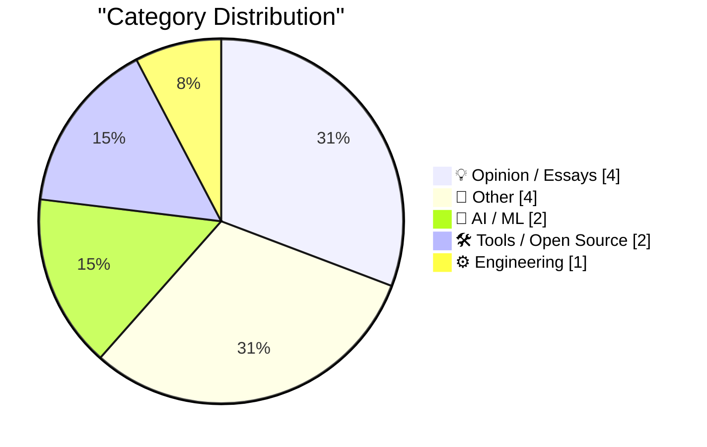
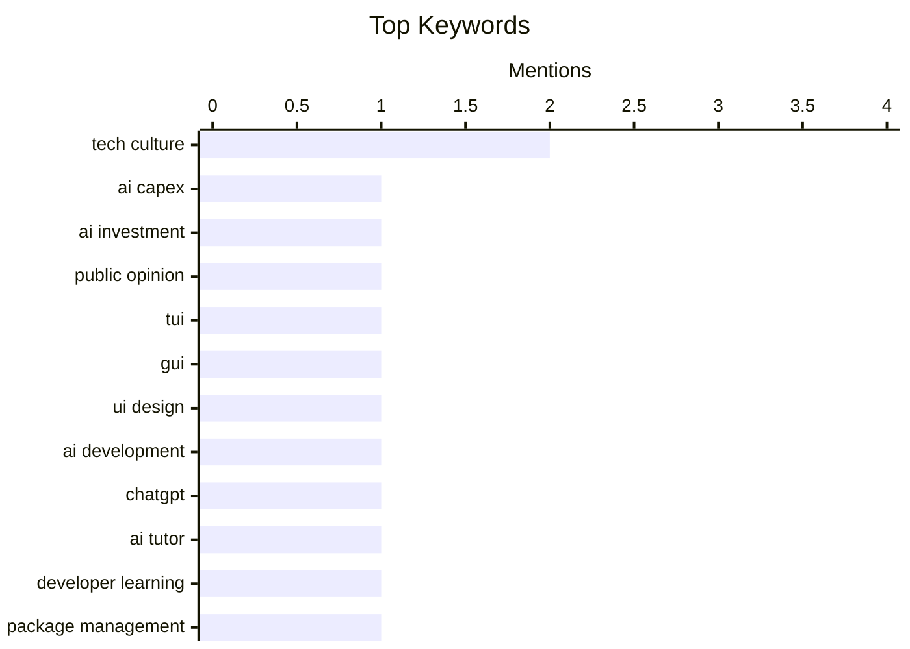

## Today's Highlights
The tech world is buzzing with AI's escalating influence, marked by massive data center investments and the practical application of LLMs as interactive tutors, alongside critical updates to AI development tools. Simultaneously, the software development landscape is actively evolving, with ongoing debates about user interface paradigms and significant shifts in package management and file format support, exemplified by Microsoft's adoption of Markdown. This dynamic environment highlights rapid advancements in AI capabilities and the continuous evolution of the tools and standards shaping our digital future.
---
## Must Read Today
1. **Data center madness**
[Data center madness](https://garymarcus.substack.com/p/data-center-madness) — garymarcus.substack.com · 16h ago · 🤖 AI / ML
> This article discusses the escalating capital expenditure (Capex) in AI data centers and the public's increasingly negative perception of AI. It highlights two estimates of "crazy" AI Capex, indicating significant financial investment in infrastructure. Additionally, it points out four new signs suggesting a souring of public opinion towards AI technologies. The core takeaway is that while AI investment is soaring, public sentiment is declining, creating a potential disconnect.
💡 **Why read it**: It provides a concise overview of the current financial and public relations challenges facing the AI industry.
🏷️ AI Capex, AI investment, public opinion
2. **Stop Making TUIs**
[Stop Making TUIs](https://simonwillison.net/2026/Aug/21/stop-making-tuis/) — simonwillison.net · 21h ago · 💡 Opinion / Essays
> This article advocates for discontinuing the development of Terminal User Interfaces (TUIs) in favor of native Graphical User Interfaces (GUIs), even for small personal tools. Thomas Ptacek argues that AI coding agents have drastically reduced the cost and effort required to create functional GUIs. The author references their own experience building "vibe-coded" macOS taskbar apps for bandwidth and GPU monitoring using SwiftUI. The main conclusion is that the barrier to entry for native GUI development has lowered significantly, making it the preferred approach over TUIs.
💡 **Why read it**: It challenges conventional wisdom in developer tooling by arguing that AI agents make native GUI development more accessible and efficient than TUIs.
🏷️ TUI, GUI, UI design, AI development
3. **Quoting Matt Webb**
[Quoting Matt Webb](https://simonwillison.net/2026/Aug/21/matt-webb/) — simonwillison.net · 22h ago · 🤖 AI / ML
> This article highlights Matt Webb's experience using ChatGPT as an interactive tutor to learn complex technical concepts. After releasing version 1.0 of an app, Webb needed to implement rotations and struggled with traditional learning methods like books and mathematician friends. He leveraged ChatGPT not to write code, but to educate him on quaternions, enabling him to understand just enough to make his application function. The core takeaway is that AI tools like ChatGPT can serve as effective, patient tutors, facilitating learning and problem-solving even for challenging technical topics.
💡 **Why read it**: It demonstrates a practical and effective application of AI as a personalized learning tool for complex technical subjects like quaternions.
🏷️ ChatGPT, AI tutor, developer learning
---
## Data Overview
| Sources Scanned | Articles Fetched | Time Window | Selected |
|:---:|:---:|:---:|:---:|
| 88/92 | 2615 -> 13 | 24h | **13** |
### Category Distribution

### Top Keywords

<details>
<summary>Plain Text Keyword Chart (Terminal Friendly)</summary>
```
tech culture   │ ████████████████████ 2
ai capex       │ ██████████░░░░░░░░░░ 1
ai investment  │ ██████████░░░░░░░░░░ 1
public opinion │ ██████████░░░░░░░░░░ 1
tui            │ ██████████░░░░░░░░░░ 1
gui            │ ██████████░░░░░░░░░░ 1
ui design      │ ██████████░░░░░░░░░░ 1
ai development │ ██████████░░░░░░░░░░ 1
chatgpt        │ ██████████░░░░░░░░░░ 1
ai tutor       │ ██████████░░░░░░░░░░ 1
```
</details>
### Topic Tags
**tech culture**(2) · **ai capex**(1) · **ai investment**(1) · public opinion(1) · tui(1) · gui(1) · ui design(1) · ai development(1) · chatgpt(1) · ai tutor(1) · developer learning(1) · package management(1) · releases(1) · advisories(1) · software updates(1) · llm tool(1) · python library(1) · dependency fix(1) · llm plugin(1) · openrouter(1)
---
## Opinion / Essays
### 1. Stop Making TUIs
[Stop Making TUIs](https://simonwillison.net/2026/Aug/21/stop-making-tuis/) — **simonwillison.net** · 21h ago · ⭐ 25/30
> This article advocates for discontinuing the development of Terminal User Interfaces (TUIs) in favor of native Graphical User Interfaces (GUIs), even for small personal tools. Thomas Ptacek argues that AI coding agents have drastically reduced the cost and effort required to create functional GUIs. The author references their own experience building "vibe-coded" macOS taskbar apps for bandwidth and GPU monitoring using SwiftUI. The main conclusion is that the barrier to entry for native GUI development has lowered significantly, making it the preferred approach over TUIs.
🏷️ TUI, GUI, UI design, AI development
---
### 2. The Fourth Horseman of the File-Format-Hegemony Apocalypse
[The Fourth Horseman of the File-Format-Hegemony Apocalypse](https://techcommunity.microsoft.com/blog/onedriveblog/introducing-markdown-support-in-sharepoint-and-onedrive/4512174) — **daringfireball.net** · 14h ago · ⭐ 20/30
> This article discusses Microsoft's recent addition of Markdown support to its OneDrive iPhone app, positioning it as a fourth core document type alongside Excel, Word, and PowerPoint. Previously, the app allowed creating only these three proprietary formats via a "+" button. The author notes the inclusion of a new, distinct file icon for Markdown, albeit with a critical comment on its design. The main takeaway is that Microsoft's adoption of Markdown signifies a notable shift in its traditional document format strategy, acknowledging the format's growing importance.
🏷️ Microsoft, OneDrive, file formats
---
### 3. You should never be angry at work
[You should never be angry at work](https://seangoedecke.com/you-should-never-be-angry-at-work/) — **seangoedecke.com** · 14h ago · ⭐ 18/30
> This article provides prescriptive advice against experiencing anger in a professional tech environment. While acknowledging diverse paths to success in tech, the author asserts that avoiding anger is universally beneficial, regardless of how projects are shipped or management is satisfied. The core argument is that anger is unproductive, detrimental to professional relationships, and hinders effective problem-solving. The article implies that maintaining emotional composure is a key factor in long-term career success and workplace well-being. The main conclusion is that eliminating anger from one's professional demeanor is crucial for navigating the tech industry effectively.
🏷️ workplace advice, tech culture
---
### 4. A Need for Speed
[A Need for Speed](https://www.filfre.net/2026/08/a-need-for-speed/) — **filfre.net** · 22h ago · ⭐ 10/30
> This article offers a personal reflection on the author's past as a "car guy" and their formative experiences with automobiles. It details the purchase of their first car, a 1966 Volkswagen Beetle, acquired for $800 in 1989 when the author was sixteen years old. The narrative likely explores the specific characteristics and challenges associated with owning a classic Beetle. The piece provides a nostalgic look into a particular era of car enthusiasm and a personal automotive journey.
🏷️ cars, personal story, nostalgia
---
## Other
### 5. Walmart Finally Caves, Will Soon Support Apple Pay
[Walmart Finally Caves, Will Soon Support Apple Pay](https://corporate.walmart.com/news/2026/08/21/more-ways-to-pay-tap-to-pay-is-coming-to-walmart-and-sams-club) — **daringfireball.net** · 18h ago · ⭐ 19/30
> This article announces that Walmart and Sam's Club will begin supporting "Tap to Pay" options, including Apple Pay, starting August 24th at select locations. Walmart states its commitment to providing customers with more payment choices for a simpler and more seamless checkout experience. This move marks a significant shift for Walmart, which has historically resisted third-party mobile payment systems in favor of its own Walmart Pay. The main conclusion is that Walmart is finally embracing broader mobile payment solutions to enhance customer convenience.
🏷️ Walmart, Apple Pay, mobile payments
---
### 6. Pluralistic: Born on technology's third base (21 Aug 2026)
[Pluralistic: Born on technology's third base (21 Aug 2026)](https://pluralistic.net/2026/08/21/world-historic-forces/) — **pluralistic.net** · 12h ago · ⭐ 19/30
> This article is a daily digest from Cory Doctorow's "Pluralistic" blog, presenting a collection of links and short commentary on various topics. The central theme, "Born on technology's third base," suggests an exploration of how material forces and technological advancements influence life chances. It covers diverse subjects including technology's societal impact, labor issues (iPods v unions), urban development (Gibson on cities), and public services (NYPL's open CDN). The main takeaway is that technology and its surrounding socio-economic structures profoundly shape individual and collective experiences.
🏷️ link digest, tech culture
---
### 7. Reading List 08/22/26
[Reading List 08/22/26](https://www.construction-physics.com/p/reading-list-082226) — **construction-physics.com** · 1h ago · ⭐ 13/30
> This article presents a curated reading list focusing on diverse topics within construction and infrastructure. It highlights discussions on urban development, specifically Los Angeles' Accessory Dwelling Units (ADUs), and critical manufacturing processes like electrical transformer production. Further topics include the operational aspects of gas turbine power plants and the complex usage patterns of water from the Colorado River. The list serves as a valuable resource for gaining broad insights into current issues and technical details across these essential domains.
🏷️ construction, infrastructure, energy, reading list
---
### 8. ★ When New DF Posts Drop in a Forest and No One Is There to Read Them
[★ When New DF Posts Drop in a Forest and No One Is There to Read Them](https://daringfireball.net/2026/08/df_posts_drop_in_a_forest) — **daringfireball.net** · 21h ago · ⭐ 3/30
> This article explores the hypothetical scenario of Daring Fireball (DF) posts being published without an immediate audience. It likely delves into the intrinsic motivations for online content creation and the dynamics of reader engagement in the digital age. The piece probably examines the value and purpose of writing when the reception or readership is uncertain. Ultimately, it offers a reflective meta-commentary on the relationship between online publishers and their audience, and the nature of content dissemination.
🏷️ empty content
---
## AI / ML
### 9. Data center madness
[Data center madness](https://garymarcus.substack.com/p/data-center-madness) — **garymarcus.substack.com** · 16h ago · ⭐ 28/30
> This article discusses the escalating capital expenditure (Capex) in AI data centers and the public's increasingly negative perception of AI. It highlights two estimates of "crazy" AI Capex, indicating significant financial investment in infrastructure. Additionally, it points out four new signs suggesting a souring of public opinion towards AI technologies. The core takeaway is that while AI investment is soaring, public sentiment is declining, creating a potential disconnect.
🏷️ AI Capex, AI investment, public opinion
---
### 10. Quoting Matt Webb
[Quoting Matt Webb](https://simonwillison.net/2026/Aug/21/matt-webb/) — **simonwillison.net** · 22h ago · ⭐ 25/30
> This article highlights Matt Webb's experience using ChatGPT as an interactive tutor to learn complex technical concepts. After releasing version 1.0 of an app, Webb needed to implement rotations and struggled with traditional learning methods like books and mathematician friends. He leveraged ChatGPT not to write code, but to educate him on quaternions, enabling him to understand just enough to make his application function. The core takeaway is that AI tools like ChatGPT can serve as effective, patient tutors, facilitating learning and problem-solving even for challenging technical topics.
🏷️ ChatGPT, AI tutor, developer learning
---
## Tools / Open Source
### 11. llm 0.32.1
[llm 0.32.1](https://simonwillison.net/2026/Aug/21/llm/) — **simonwillison.net** · 20h ago · ⭐ 23/30
> This article announces the release of `llm` version 0.32.1, a critical dot-release addressing a breaking change. Fresh installations of `llm` failed because the OpenAI Python library removed its `httpx` dependency, which `llm` transitively relied upon. The fix in 0.32.1 involves temporarily pinning the `openai` dependency to `<3` to restore functionality. A forthcoming 0.33 release is planned to implement a more permanent solution. The core takeaway is that dependency changes in external libraries can cause significant issues, requiring immediate patch releases.
🏷️ LLM tool, Python library, dependency fix
---
### 12. llm-openrouter 0.7
[llm-openrouter 0.7](https://simonwillison.net/2026/Aug/21/llm-openrouter/) — **simonwillison.net** · 21h ago · ⭐ 22/30
> This article announces the release of `llm-openrouter` version 0.7, a plugin update that introduces significant new functionality. The key enhancement is its compatibility with `LLM 0.32`, which enables the plugin to display reasoning traces for Large Language Models (LLMs) accessed via the OpenRouter service. This update improves transparency and debugging capabilities for users interacting with various LLMs through OpenRouter. The main conclusion is that `llm-openrouter 0.7` significantly enhances the diagnostic capabilities for OpenRouter-hosted LLMs by integrating with `LLM 0.32`'s tracing features.
🏷️ LLM plugin, OpenRouter, reasoning traces
---
## Engineering
### 13. This Week in Package Management: 22 August 2026
[This Week in Package Management: 22 August 2026](https://nesbitt.io/2026/08/22/this-week-in-package-management.html) — **nesbitt.io** · 4h ago · ⭐ 24/30
> This article serves as a weekly digest, compiling significant releases, security advisories, and relevant articles from the broader package management ecosystem. It aims to keep readers informed about the latest developments, updates, and potential vulnerabilities across various package managers and related tools. The content covers a range of topics pertinent to software dependency management and supply chain security. The main conclusion is that staying updated on package management news is crucial for developers and system administrators.
🏷️ package management, releases, advisories, software updates
---
*Generated at 2026-08-22 14:01 | Scanned 88 sources -> 2615 articles -> selected 13*
*Based on the [Hacker News Popularity Contest 2025](https://refactoringenglish.com/tools/hn-popularity/) RSS source list recommended by [Andrej Karpathy](https://x.com/karpathy)*
*Produced by Dongdianr AI. Follow the same-name WeChat public account for more AI practical tips 💡*
