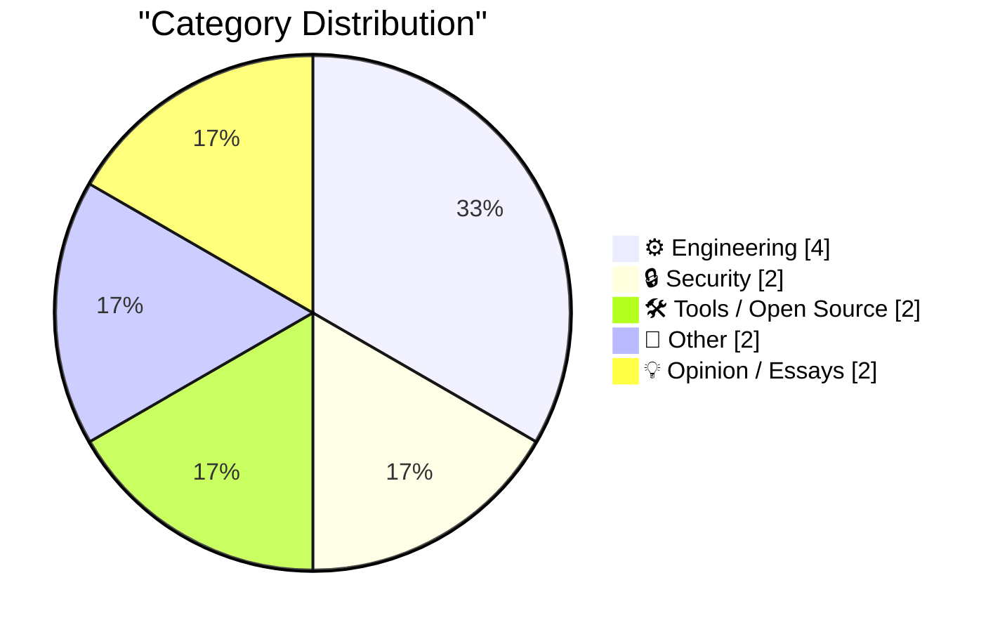
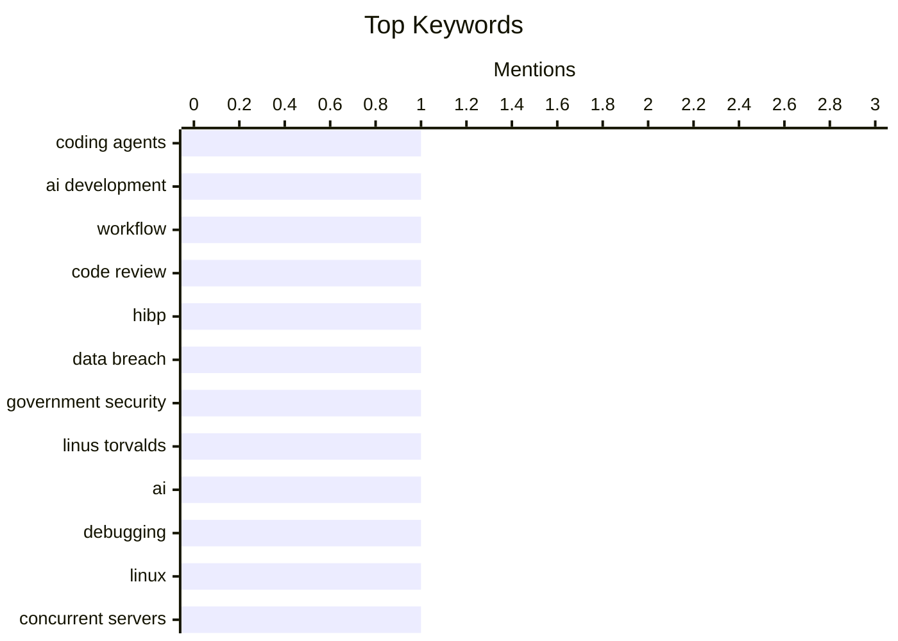

## Today's Highlights
Artificial intelligence continues to reshape the tech landscape, with developers like Linus Torvalds leveraging AI for debugging and new tools emerging to facilitate AI agent integration into applications. This surge in AI adoption also brings increased scrutiny, as evidenced by a major GDPR fine against Uber for automated driver account decisions. Meanwhile, efforts to bolster digital security and data breach awareness are expanding, with services like Have I Been Pwned extending their reach to government entities.
---
## Must Read Today
1. **More than just code review**
[More than just code review](https://simonwillison.net/2026/Aug/22/more-than-just-code-review/) — simonwillison.net · 22h ago · ⚙️ Engineering
> The core problem addressed is effectively validating changes made by coding agents. Traditional line-by-line code review is not always the most effective method for agent-generated code. The crucial skill lies in confidently instructing agents and verifying their changes, which can involve strategies beyond exhaustive code review. The main conclusion is that focus should shift from solely eyeballing every line to confident instruction and diverse verification methods when working with AI agents.
💡 **Why read it**: It offers a fresh perspective on validating AI-generated code, suggesting alternative verification strategies beyond traditional code review.
🏷️ coding agents, AI development, workflow, code review
2. **Welcoming the Sri Lankan Government to Have I Been Pwned**
[Welcoming the Sri Lankan Government to Have I Been Pwned](https://www.troyhunt.com/welcoming-the-sri-lankan-government-to-have-i-been-pwned/) — troyhunt.com · 7h ago · 🔒 Security
> This article announces the expansion of Have I Been Pwned's (HIBP) free government service. Sri Lanka has become the 48th government to onboard to HIBP's free gov service. Sri Lanka CERT now gains access to monitor Sri Lankan government domains against HIBP's extensive data. This capability enables them to identify exposed government accounts and respond proactively to new data breaches. HIBP continues to empower more governments to protect their digital assets from breaches.
💡 **Why read it**: It highlights the ongoing global adoption of Have I Been Pwned's service by governments for proactive data breach monitoring.
🏷️ HIBP, Data Breach, Government Security
3. **Quoting Linus Torvalds**
[Quoting Linus Torvalds](https://simonwillison.net/2026/Aug/22/linus-torvalds/) — simonwillison.net · 16h ago · ⚙️ Engineering
> The article shares Linus Torvalds' experience using AI for debugging a complex problem. Torvalds describes a 'debug session from hell' where an AI significantly helped with much of the 'grunt-work.' Despite the AI repeatedly stating the problem was 'impossible and unsolvable,' Torvalds' persistence ultimately led to a solution. This illustrates that while AI can be a powerful helper, human stubbornness and critical thinking remain essential, especially when AI reaches its perceived limits.
💡 **Why read it**: It provides a real-world anecdote from Linus Torvalds, illustrating both the utility and limitations of AI in complex debugging scenarios.
🏷️ Linus Torvalds, AI, debugging, Linux
---
## Data Overview
| Sources Scanned | Articles Fetched | Time Window | Selected |
|:---:|:---:|:---:|:---:|
| 88/92 | 2616 -> 12 | 24h | **12** |
### Category Distribution

### Top Keywords

<details>
<summary>Plain Text Keyword Chart (Terminal Friendly)</summary>
```
coding agents       │ ████████████████████ 1
ai development      │ ████████████████████ 1
workflow            │ ████████████████████ 1
code review         │ ████████████████████ 1
hibp                │ ████████████████████ 1
data breach         │ ████████████████████ 1
government security │ ████████████████████ 1
linus torvalds      │ ████████████████████ 1
ai                  │ ████████████████████ 1
debugging           │ ████████████████████ 1
```
</details>
### Topic Tags
**coding agents**(1) · **ai development**(1) · **workflow**(1) · code review(1) · hibp(1) · data breach(1) · government security(1) · linus torvalds(1) · ai(1) · debugging(1) · linux(1) · concurrent servers(1) · go(1) · network programming(1) · css(1) · pixels(1) · ch unit(1) · web development(1) · uber(1) · data privacy(1)
---
## Engineering
### 1. More than just code review
[More than just code review](https://simonwillison.net/2026/Aug/22/more-than-just-code-review/) — **simonwillison.net** · 22h ago · ⭐ 25/30
> The core problem addressed is effectively validating changes made by coding agents. Traditional line-by-line code review is not always the most effective method for agent-generated code. The crucial skill lies in confidently instructing agents and verifying their changes, which can involve strategies beyond exhaustive code review. The main conclusion is that focus should shift from solely eyeballing every line to confident instruction and diverse verification methods when working with AI agents.
🏷️ coding agents, AI development, workflow, code review
---
### 2. Quoting Linus Torvalds
[Quoting Linus Torvalds](https://simonwillison.net/2026/Aug/22/linus-torvalds/) — **simonwillison.net** · 16h ago · ⭐ 24/30
> The article shares Linus Torvalds' experience using AI for debugging a complex problem. Torvalds describes a 'debug session from hell' where an AI significantly helped with much of the 'grunt-work.' Despite the AI repeatedly stating the problem was 'impossible and unsolvable,' Torvalds' persistence ultimately led to a solution. This illustrates that while AI can be a powerful helper, human stubbornness and critical thinking remain essential, especially when AI reaches its perceived limits.
🏷️ Linus Torvalds, AI, debugging, Linux
---
### 3. Concurrent Servers: Part 8 - Go
[Concurrent Servers: Part 8 - Go](https://eli.thegreenplace.net/2026/concurrent-servers-part-8-go/) — **eli.thegreenplace.net** · 23h ago · ⭐ 24/30
> This article is the eighth part in a series exploring how to write concurrent network servers, specifically focusing on Go. It will delve into how Go tackles the challenges of concurrency that were described earlier in the series. The post will detail Go's mechanisms and design choices for handling concurrent operations. The article serves as a deep dive into Go's specific features and paradigms for building robust and efficient concurrent network servers.
🏷️ Concurrent Servers, Go, Network Programming
---
### 4. Death to px, long live ch!
[Death to px, long live ch!](https://shkspr.mobi/blog/2026/08/death-to-px-long-live-ch/) — **shkspr.mobi** · 2h ago · ⭐ 22/30
> The core problem discussed is the inherent inaccuracies and misrepresentations of the `px` unit in CSS. Pixels are described as a 'lie' because physical monitor pixels are not uniform, and CSS `1px` does not necessarily map to one physical device pixel, especially on HD displays. This leads to inconsistencies, similar to how `1cm` in CSS often doesn't correspond to a true centimeter. The article advocates for moving away from `px` in CSS due to its misleading nature and suggests alternative units like `ch` for more consistent and accurate rendering.
🏷️ CSS, pixels, ch unit, web development
---
## Security
### 5. Welcoming the Sri Lankan Government to Have I Been Pwned
[Welcoming the Sri Lankan Government to Have I Been Pwned](https://www.troyhunt.com/welcoming-the-sri-lankan-government-to-have-i-been-pwned/) — **troyhunt.com** · 7h ago · ⭐ 25/30
> This article announces the expansion of Have I Been Pwned's (HIBP) free government service. Sri Lanka has become the 48th government to onboard to HIBP's free gov service. Sri Lanka CERT now gains access to monitor Sri Lankan government domains against HIBP's extensive data. This capability enables them to identify exposed government accounts and respond proactively to new data breaches. HIBP continues to empower more governments to protect their digital assets from breaches.
🏷️ HIBP, Data Breach, Government Security
---
### 6. Dutch Regulator Fines Uber $1 Billion for Suspending Dishonest Drivers
[Dutch Regulator Fines Uber $1 Billion for Suspending Dishonest Drivers](https://www.reuters.com/world/dutch-regulator-fines-uber-966-million-automating-driver-suspensions-document-2026-08-21/) — **daringfireball.net** · 23h ago · ⭐ 21/30
> The article reports on a significant GDPR violation by Uber regarding its automated driver account deactivation system. The Dutch Data Protection Authority fined Uber €825 million ($966 million) for automatically deactivating driver accounts without adequately informing them. This penalty, issued on August 17, is the second-largest under Europe’s General Data Protection Regulation, following a €1.2 billion fine against Meta in 2023. This underscores the strict enforcement of GDPR regarding automated decision-making and the necessity of transparent communication with users.
🏷️ Uber, data privacy, automated systems, regulatory fine
---
## Tools / Open Source
### 7. llm 0.33
[llm 0.33](https://simonwillison.net/2026/Aug/22/llm/) — **simonwillison.net** · 21h ago · ⭐ 20/30
> This article announces the release of `llm` version 0.33, detailing key updates. The release includes an upgrade to the OpenAI Python library 3.x, ensuring compatibility with the latest API. Additionally, the HTTP client dependency has been switched from `httpx` to `httpx2`. These changes are documented in GitHub issues #1608 and pull request #1631. `llm 0.33` brings important dependency updates, improving its underlying HTTP client and OpenAI API integration.
🏷️ llm tool, OpenAI API, Python library, release
---
### 8. WorkOS: Agents Can Now Sign Up for Your App
[WorkOS: Agents Can Now Sign Up for Your App](https://workos.com/auth-md?utm_source=daringfireball&amp;utm_medium=newsletter&amp;utm_campaign=q32026) — **daringfireball.net** · 23h ago · ⭐ 19/30
> The core problem identified is that traditional app signup flows are designed for humans, causing AI agents to 'bounce off' and fail to register. WorkOS introduces 'Agent Registration' to convert AI agent traffic into successful signups. By enrolling via the dashboard, AuthKit publishes an `auth.md` file that agents can read to register for scoped, short-lived credentials. This solution enables seamless registration for AI agents, optimizing app onboarding for non-human users.
🏷️ WorkOS, agent registration, authentication, bots
---
## Other
### 9. The difference orbit inclination makes
[The difference orbit inclination makes](https://www.johndcook.com/blog/2026/08/22/inclination/) — **johndcook.com** · 14h ago · ⭐ 14/30
> The article discusses the impact of orbital inclination on calculating distances between planets. While planetary orbits are often approximated as ellipses in the same plane, a more accurate calculation of the distance between Earth and Mars requires considering Mars's orbital tilt. Mars's orbit is inclined about 1.85° relative to Earth's. Even small orbital inclinations, like Mars's 1.85° tilt, are crucial for precise astronomical calculations, demonstrating the importance of accounting for three-dimensional orbital mechanics.
🏷️ orbit, celestial mechanics, Earth, Mars
---
### 10. Mark Carney on the U.S. Under Trump: ‘Sometimes, Its Signature Is Written in Pencil’
[Mark Carney on the U.S. Under Trump: ‘Sometimes, Its Signature Is Written in Pencil’](https://www.nytimes.com/2026/08/22/world/canada/carney-tariffs-trade-trump.html?unlocked_article_code=1.7VA.r3Ue.GTc_tOhX0qSn) — **daringfireball.net** · 21h ago · ⭐ 9/30
> This article reports on Mark Carney's explanation to Canadians regarding his decision to withdraw from trade talks with the U.S. under Trump, which subsequently triggered new American tariffs. Carney characterized the U.S. proposal as "a bad deal," emphasizing Canada's recognition of a changed America where its commitments are perceived as unreliable, metaphorically stating, "its signature is written in pencil." He explicitly stated Canada's inability to accept the offered terms. The core takeaway is Canada's firm rejection of the U.S. trade offer due to its unfavorable nature and the perceived instability of U.S. policy.
🏷️ Mark Carney, trade policy, Trump, politics
---
## Opinion / Essays
### 11. ARR vs ARR. Watch out for this one sly trick.
[ARR vs ARR. Watch out for this one sly trick.](https://garymarcus.substack.com/p/arr-vs-arr-watch-out-for-this-one) — **garymarcus.substack.com** · 18h ago · ⭐ 13/30
> The article addresses the core problem of ambiguity and potential for misinterpretation of acronyms, specifically using "ARR" as an example. It warns about a "sly trick" where the same acronym can represent different concepts, leading to confusion or deliberate misdirection. The author emphasizes the need to "read between the lines" to understand the true meaning of an acronym. The main conclusion is the importance of scrutinizing acronyms and their specific definitions to avoid misunderstandings in technical or business contexts.
🏷️ acronyms, communication, Gary Marcus, clarity
---
### 12. Coming soon
[Coming soon](https://www.johndcook.com/blog/2026/08/22/coming-soon/) — **johndcook.com** · 22h ago · ⭐ 13/30
> This article introduces a future discussion on how to model the time until an event designated as "coming soon" actually occurs. The author poses the problem based on observing a pizza shop sign, prompting a thought experiment on estimating the number of days until such an event. It suggests exploring methods to predict the duration of a "coming soon" state. The article serves as a conceptual prelude to a deeper analysis of this specific temporal modeling challenge.
🏷️ coming soon, modeling, time, reflection
---
*Generated at 2026-08-23 14:01 | Scanned 88 sources -> 2616 articles -> selected 12*
*Based on the [Hacker News Popularity Contest 2025](https://refactoringenglish.com/tools/hn-popularity/) RSS source list recommended by [Andrej Karpathy](https://x.com/karpathy)*
*Produced by Dongdianr AI. Follow the same-name WeChat public account for more AI practical tips 💡*
