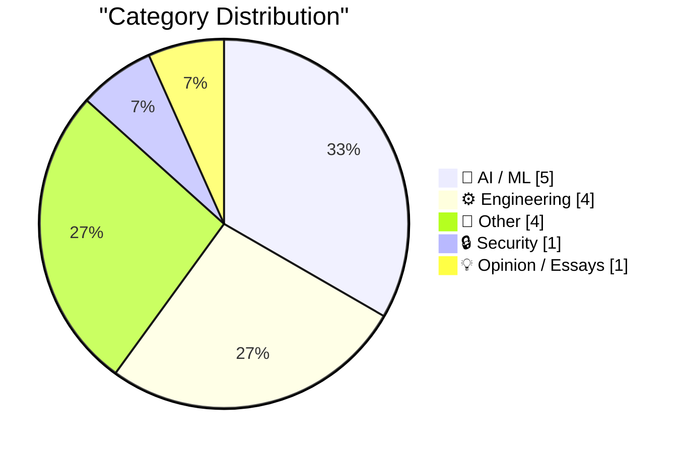
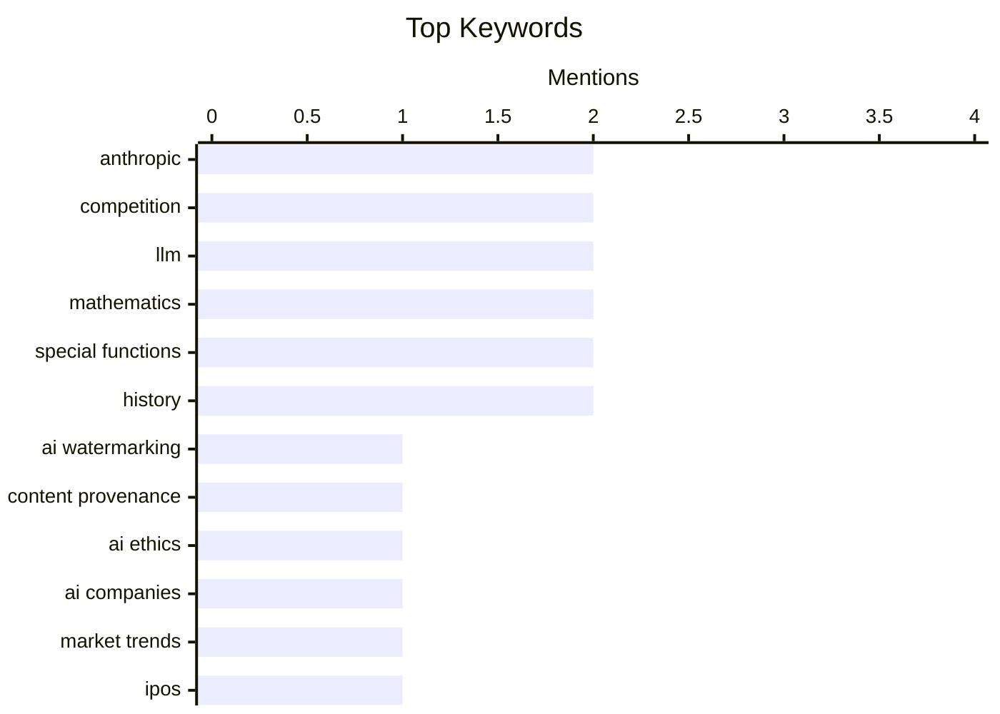

## Today's Highlights
The AI landscape is currently a tale of two realities: while frontier AI companies face significant business challenges and struggle with user adoption due to high costs, the technology is simultaneously proving invaluable for practical problem-solving. From automating complex metadata enrichment to debugging hardware, AI's utility is expanding, even as efforts to watermark AI-generated content emerge. Beyond AI, engineers are exploring innovative patterns like using SQLite databases as executables and enhancing IoT security.
---
## Must Read Today
1. **Cooper Sharp Proves That American Cheese Can Be Great Cheese**
[Cooper Sharp Proves That American Cheese Can Be Great Cheese](https://sixcolors.com/member/2026/08/this-week-in-apple-lets-fight/) — daringfireball.net · 20h ago · 🤖 AI / ML
> Anthropic announced a method to identify AI-generated content by watermarking all text it generates. This technical approach subtly alters the randomness at which its models pick the next word. While seemingly a "cromulent" means to a worthy goal, this method reportedly "rubbed John Gruber the wrong way." The article highlights the contentious reception of Anthropic's specific AI content identification strategy.
💡 **Why read it**: It discusses a novel technical approach to AI content identification and its immediate critical reception, revealing challenges in AI content provenance.
🏷️ Anthropic, AI watermarking, content provenance, AI ethics
2. **BREAKING: More bad news for the frontier AI companies**
[BREAKING: More bad news for the frontier AI companies](https://garymarcus.substack.com/p/breaking-more-bad-news-for-the-frontier) — garymarcus.substack.com · 22h ago · 🤖 AI / ML
> Frontier AI companies are facing significant challenges, particularly concerning their upcoming IPOs, as cheaper AI tools gain market traction. The article suggests that the thriving ecosystem of more affordable AI solutions is creating "bad news" for these high-end firms. This trend indicates a potential shift in market preference towards cost-effective alternatives over expensive, cutting-edge models. The rise of cheaper tools poses a substantial threat to the business models and investment prospects of leading frontier AI companies.
💡 **Why read it**: It highlights a critical market trend where the success of cheaper AI tools challenges the dominance and financial outlook of frontier AI companies.
🏷️ AI companies, market trends, competition, IPOs
3. **Anthropic’s best AI model struggles to attract users as cheaper tools thrive**
[Anthropic’s best AI model struggles to attract users as cheaper tools thrive](https://simonwillison.net/2026/Aug/23/anthropics-best-ai-model-struggles-to-attract-users-as-cheaper-t/) — simonwillison.net · 17h ago · 🤖 AI / ML
> Anthropic's most advanced AI model is struggling to attract users, even as the company's overall revenue shows significant growth. According to an FT story, Anthropic's annualized revenue reached $65 billion in July, up from $47 billion in May. This indicates a disconnect where the company's financial performance is strong, but its flagship product faces user adoption hurdles. The article suggests that the proliferation of cheaper AI tools may be drawing users away from Anthropic's premium offerings.
💡 **Why read it**: It provides specific financial figures and market insights into the competitive landscape for leading AI models, highlighting user adoption challenges for Anthropic despite revenue growth.
🏷️ Anthropic, AI models, market share, competition
---
## Data Overview
| Sources Scanned | Articles Fetched | Time Window | Selected |
|:---:|:---:|:---:|:---:|
| 86/92 | 2563 -> 15 | 24h | **15** |
### Category Distribution

### Top Keywords

<details>
<summary>Plain Text Keyword Chart (Terminal Friendly)</summary>
```
anthropic          │ ████████████████████ 2
competition        │ ████████████████████ 2
llm                │ ████████████████████ 2
mathematics        │ ████████████████████ 2
special functions  │ ████████████████████ 2
history            │ ████████████████████ 2
ai watermarking    │ ██████████░░░░░░░░░░ 1
content provenance │ ██████████░░░░░░░░░░ 1
ai ethics          │ ██████████░░░░░░░░░░ 1
ai companies       │ ██████████░░░░░░░░░░ 1
```
</details>
### Topic Tags
**anthropic**(2) · **competition**(2) · **llm**(2) · mathematics(2) · special functions(2) · history(2) · ai watermarking(1) · content provenance(1) · ai ethics(1) · ai companies(1) · market trends(1) · ipos(1) · ai models(1) · market share(1) · sqlite(1) · executable(1) · linux(1) · pattern(1) · ai development(1) · moore's law(1)
---
## AI / ML
### 1. Cooper Sharp Proves That American Cheese Can Be Great Cheese
[Cooper Sharp Proves That American Cheese Can Be Great Cheese](https://sixcolors.com/member/2026/08/this-week-in-apple-lets-fight/) — **daringfireball.net** · 20h ago · ⭐ 27/30
> Anthropic announced a method to identify AI-generated content by watermarking all text it generates. This technical approach subtly alters the randomness at which its models pick the next word. While seemingly a "cromulent" means to a worthy goal, this method reportedly "rubbed John Gruber the wrong way." The article highlights the contentious reception of Anthropic's specific AI content identification strategy.
🏷️ Anthropic, AI watermarking, content provenance, AI ethics
---
### 2. BREAKING: More bad news for the frontier AI companies
[BREAKING: More bad news for the frontier AI companies](https://garymarcus.substack.com/p/breaking-more-bad-news-for-the-frontier) — **garymarcus.substack.com** · 22h ago · ⭐ 27/30
> Frontier AI companies are facing significant challenges, particularly concerning their upcoming IPOs, as cheaper AI tools gain market traction. The article suggests that the thriving ecosystem of more affordable AI solutions is creating "bad news" for these high-end firms. This trend indicates a potential shift in market preference towards cost-effective alternatives over expensive, cutting-edge models. The rise of cheaper tools poses a substantial threat to the business models and investment prospects of leading frontier AI companies.
🏷️ AI companies, market trends, competition, IPOs
---
### 3. Anthropic’s best AI model struggles to attract users as cheaper tools thrive
[Anthropic’s best AI model struggles to attract users as cheaper tools thrive](https://simonwillison.net/2026/Aug/23/anthropics-best-ai-model-struggles-to-attract-users-as-cheaper-t/) — **simonwillison.net** · 17h ago · ⭐ 26/30
> Anthropic's most advanced AI model is struggling to attract users, even as the company's overall revenue shows significant growth. According to an FT story, Anthropic's annualized revenue reached $65 billion in July, up from $47 billion in May. This indicates a disconnect where the company's financial performance is strong, but its flagship product faces user adoption hurdles. The article suggests that the proliferation of cheaper AI tools may be drawing users away from Anthropic's premium offerings.
🏷️ Anthropic, AI models, market share, competition
---
### 4. Quoting Drew Breunig
[Quoting Drew Breunig](https://simonwillison.net/2026/Aug/23/drew-breunig/) — **simonwillison.net** · 18h ago · ⭐ 24/30
> The article quotes Drew Breunig on how the high cost of the "incredible" Fable AI model has fundamentally shifted development strategies. Previously, developers often neglected optimizing coding harnesses or context strategies, anticipating that new, cheaper models would inherently resolve most problems. However, Fable's significant cost made "good enough" alternatives like Opus, 5.6, K3, and GLM more attractive for most code generation tasks. This economic reality now compels developers to prioritize optimization and cost-efficiency rather than solely relying on the continuous arrival of more powerful, yet potentially expensive, models.
🏷️ AI development, Moore's Law, coding strategies, model improvement
---
### 5. Getting an LLM to Make Me a Tool for Enriching the Color Metadata in My Icon Collection
[Getting an LLM to Make Me a Tool for Enriching the Color Metadata in My Icon Collection](https://blog.jim-nielsen.com/2026/use-llm-to-add-color-metadata/) — **blog.jim-nielsen.com** · 19h ago · ⭐ 24/30
> The author sought to automate the process of enriching color metadata for their extensive icon collections on sites like iOS Icon Gallery and macOS Icon Gallery. Historically, color tags such as "blue" or "orange" were manually assigned to icons for browsing purposes. The author successfully leveraged an LLM to generate a custom tool capable of analyzing icons and automatically assigning these predominant color metadata tags. This demonstrates the practical utility of LLMs for creating bespoke data enrichment tools, even for highly specific and previously manual tasks.
🏷️ LLM, Icon metadata, Automation, Prompt engineering
---
## Engineering
### 6. Your executable is a SQLite database
[Your executable is a SQLite database](https://simonwillison.net/2026/Aug/24/your-executable-is-a-sqlite-database/) — **simonwillison.net** · 2h ago · ⭐ 24/30
> Farid Zakaria describes an innovative Linux pattern that allows a SQLite database file to function directly as an executable binary. The core technical trick involves setting the SQLite file format's 4-byte application ID, located 68 bytes into the file, to "SELF." This "SELF" identifier stands for Structured Executable & Linkable Format, enabling the various components of the ELF executable format to be embedded within the SQLite file. This method provides a unique way to combine data storage and executable functionality within a single file on Linux systems.
🏷️ SQLite, executable, Linux, pattern
---
### 7. Fixing an eMachines EL1200 BIOS bug with Claude
[Fixing an eMachines EL1200 BIOS bug with Claude](https://www.downtowndougbrown.com/2026/08/fixing-an-emachines-el1200-bios-bug-with-claude/) — **downtowndougbrown.com** · 18h ago · ⭐ 24/30
> The author tackled a challenging BIOS bug in an eMachines EL1200 motherboard that prevented the system from utilizing its full 16 GB of RAM. This issue mirrored a previous experience with ACPI table misconfigurations that required a one-line GRUB hack. For the EL1200 bug, the author enlisted the Claude AI model to assist in diagnosing and resolving the complex hardware and firmware problem. This showcases Claude's capability as a valuable tool for troubleshooting intricate, low-level system issues, even on legacy hardware.
🏷️ BIOS bug, ACPI, LLM, Debugging
---
### 8. What exactly is modified about a modified Bessel function?
[What exactly is modified about a modified Bessel function?](https://www.johndcook.com/blog/2026/08/23/modified-bessel-function/) — **johndcook.com** · 19h ago · ⭐ 19/30
> The article clarifies the specific mathematical "modification" that defines modified Bessel functions, addressing the often-confusing terminology in special functions. Modified Bessel functions are fundamentally solutions to the Bessel differential equation when its argument is imaginary. This is mathematically equivalent to flipping the sign of the second term within the differential equation itself. This alteration transforms the characteristic oscillatory behavior of standard Bessel functions into exponential decay or growth patterns.
🏷️ Bessel function, mathematics, special functions, scientific computing
---
### 9. Why special function terminology is arcane
[Why special function terminology is arcane](https://www.johndcook.com/blog/2026/08/23/arcane-terminology/) — **johndcook.com** · 20h ago · ⭐ 19/30
> The article explores the reasons behind the often arcane and confusing terminology associated with special functions in mathematics. A primary factor is that special functions are highly useful and thus frequently discovered independently by different researchers. This independent discovery process often leads to the proliferation of varying definitions and notations for the same function. For example, the article notes that there are two widely used definitions for a particular function, contributing to the perceived complexity.
🏷️ Special functions, Mathematics, Terminology, History
---
## Other
### 10. Why do audience members choose specific shows at the Edinburgh Fringe?
[Why do audience members choose specific shows at the Edinburgh Fringe?](https://shkspr.mobi/blog/2026/08/why-do-audience-members-choose-specific-shows-at-the-edinburgh-fringe/) — **shkspr.mobi** · 2h ago · ⭐ 10/30
> This article critiques Edinburgh Fringe performers for their lack of effort in understanding audience show selection, despite significant financial investments. Performers often spend tens of thousands of pounds to stage shows, relying heavily on ticket sales for cost recoupment. However, they frequently neglect to gather crucial feedback on why audiences choose specific acts, missing vital insights into marketing effectiveness and show appeal. This oversight represents a missed opportunity to optimize their strategy and improve financial viability. The article concludes that understanding audience motivations is vital for performers to enhance show selection, marketing, and financial returns at expensive events like the Fringe.
🏷️ Edinburgh Fringe, audience behavior, marketing, performing arts
---
### 11. A few words about Canada and the US
[A few words about Canada and the US](https://garymarcus.substack.com/p/a-few-words-about-canada-and-the) — **garymarcus.substack.com** · 21h ago · ⭐ 9/30
> This article serves as a brief announcement from the author, Gary Marcus, indicating a departure from his usual focus on Artificial Intelligence. He explicitly states that the content is not about AI, but rather about Canada and the US. The author expresses a personal compulsion to speak out on this particular topic, suggesting a shift in focus for this specific post. This highlights that even experts in specific fields occasionally address broader societal or personal interests. The main takeaway is that authors sometimes prioritize personal commentary over their typical technical content.
🏷️ Canada, US, politics, social commentary
---
### 12. Windows 95 released August 24, 1995
[Windows 95 released August 24, 1995](https://dfarq.homeip.net/happy-20th-birthday-to-windows-95/?utm_source=rss&#038;utm_medium=rss&#038;utm_campaign=happy-20th-birthday-to-windows-95) — **dfarq.homeip.net** · 3h ago · ⭐ 9/30
> This article commemorates the 20th anniversary of the highly anticipated release of Windows 95 on August 24, 1995. It highlights that Windows 95 was the most widely anticipated Windows release of all time, with no other version generating comparable public excitement. The launch was a significant cultural event, drawing crowds of people who lined up for blocks to purchase the new operating system. This unprecedented public enthusiasm underscored its importance as a pivotal moment in computing history. The article concludes that Windows 95's launch was a monumental event, marked by extraordinary public anticipation and impact.
🏷️ Windows 95, Operating system, History, Microsoft
---
### 13. Know your paradoxes
[Know your paradoxes](https://blog.coredump.cx/p/know-your-paradoxes) — **lcamtuf.substack.com** · 14h ago · ⭐ 5/30
> This article, though extremely brief, introduces the concept of paradoxes through a single, thought-provoking statement. The core message is encapsulated in the quote: "The matter is too important to be taken seriously." This suggests that some profound or complex issues, like paradoxes, might be best understood or approached with a non-serious or even lighthearted perspective. It implies that a rigid, overly serious attitude can hinder true comprehension. The main takeaway is that a flexible, perhaps counter-intuitive, mindset is often necessary to grasp the nature of paradoxes.
🏷️ Paradoxes, philosophy, wisdom
---
## Security
### 14. Weekly Update 518: IoT Doorlock Nirvana with UniFi
[Weekly Update 518: IoT Doorlock Nirvana with UniFi](https://www.troyhunt.com/weekly-update-518/) — **troyhunt.com** · 9h ago · ⭐ 20/30
> Troy Hunt details his successful implementation of an IoT door lock system for a residential house, aiming for optimal reliability and integration. His approach centers on utilizing Ubiquiti's UniFi ecosystem, with a key tenet being reliance on main power to eliminate battery-related issues. The article outlines how to effectively integrate these UniFi components to create a coherent and functional smart home security solution. This setup achieves a "nirvana" state for IoT door locks by prioritizing consistent power and robust ecosystem integration.
🏷️ IoT, Door lock, UniFi, Smart home
---
## Opinion / Essays
### 15. Anger, Anxiety and Agency
[Anger, Anxiety and Agency](https://lucumr.pocoo.org/2026/8/24/anger-anxiety-agency/) — **lucumr.pocoo.org** · 14h ago · ⭐ 18/30
> This article discusses the counterproductive nature of expressing anger in a professional work environment. While anger can serve as a signal for underlying issues, its direct expression at work rarely improves situations and often negatively impacts colleagues who may lack control over the problem. The author emphasizes the importance of aligning with a company's shared vision, advocating for constructive engagement over emotional outbursts when disagreements arise. The core takeaway is that managing anger and engaging constructively are crucial for fostering a positive and productive workplace. This approach benefits both individual well-being and team dynamics.
🏷️ Workplace, anger, emotions, agency
---
*Generated at 2026-08-24 14:01 | Scanned 86 sources -> 2563 articles -> selected 15*
*Based on the [Hacker News Popularity Contest 2025](https://refactoringenglish.com/tools/hn-popularity/) RSS source list recommended by [Andrej Karpathy](https://x.com/karpathy)*
*Produced by Dongdianr AI. Follow the same-name WeChat public account for more AI practical tips 💡*
