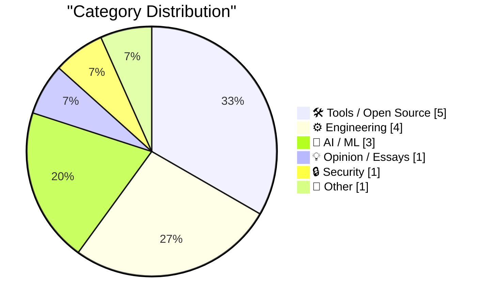
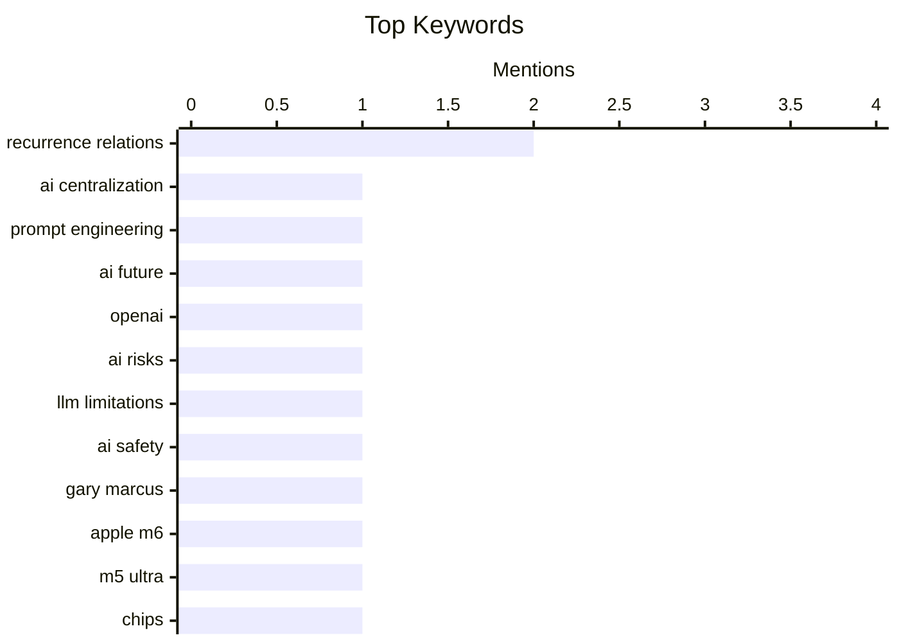

## Today's Highlights
Today's tech landscape sees a dynamic shift in AI, with discussions challenging its centralization and new tools emerging to expand its ecosystem. Apple remains a key innovator, unveiling powerful M6 and M5 Ultra chips while also refining user privacy features. Concurrently, developers are embracing modern tools and focusing on hardening system-level security for robust and efficient operations.
---
## Must Read Today
1. **Foot Guns for Sale**
[Foot Guns for Sale](https://idiallo.com/blog/foot-gun-for-sale) — idiallo.com · 6h ago · 🤖 AI / ML
> This article challenges the prevailing narrative that AI development will centralize around a few large providers like Anthropic and OpenAI. It argues that this centralization, promoted by "companies selling the shovels," aims to reduce developers to mere prompt-engineers dependent on API-driven "fiefdoms." The author suggests this model of renting intelligence by the token is unlikely to be the ultimate outcome. The core takeaway is a skepticism towards the centralized AI future envisioned by major players.
💡 **Why read it**: It offers a critical perspective on the future of AI development, questioning the narrative of centralization pushed by major AI companies.
🏷️ AI centralization, prompt engineering, AI future, OpenAI
2. **Two ways it might all fall apart**
[Two ways it might all fall apart](https://garymarcus.substack.com/p/two-ways-it-might-all-fall-apart) — garymarcus.substack.com · 22h ago · 🤖 AI / ML
> The provided content for this article is extremely minimal, consisting only of the phrase "Not mutually exclusive." Without the full article text, it is impossible to generate a structured summary covering the core problem, key arguments, technical approach, or main conclusion as required.
💡 **Why read it**: The article content provided is insufficient to determine its worth or summarize its points.
🏷️ AI risks, LLM limitations, AI safety, Gary Marcus
3. **Apple Introduces M6 and M5 Ultra Chips, in New Mac Mini and Mac Studio**
[Apple Introduces M6 and M5 Ultra Chips, in New Mac Mini and Mac Studio](https://www.apple.com/newsroom/2026/08/apple-introduces-m6-and-m5-ultra-for-a-big-leap-in-performance-and-ai-compute/) — daringfireball.net · 51m ago · ⚙️ Engineering
> Apple has introduced its new M6 and M5 Ultra chips, delivering significant advancements in performance and AI capabilities for the new Mac mini and Mac Studio. The M6 is Apple's first 2-nanometer chip, featuring a larger 12-core CPU complex with the world's fastest CPU core. It also includes a larger 12-core GPU with Neural Accelerators, a Dual 16-core Neural Engine, and up to 170GB/s of unified memory. These chips are designed to provide an extraordinary leap in computing power across all dimensions.
💡 **Why read it**: It details Apple's latest M6 and M5 Ultra chip specifications, highlighting their performance and AI enhancements.
🏷️ Apple M6, M5 Ultra, chips, AI capabilities
---
## Data Overview
| Sources Scanned | Articles Fetched | Time Window | Selected |
|:---:|:---:|:---:|:---:|
| 87/92 | 2593 -> 20 | 24h | **15** |
### Category Distribution

### Top Keywords

<details>
<summary>Plain Text Keyword Chart (Terminal Friendly)</summary>
```
recurrence relations │ ████████████████████ 2
ai centralization    │ ██████████░░░░░░░░░░ 1
prompt engineering   │ ██████████░░░░░░░░░░ 1
ai future            │ ██████████░░░░░░░░░░ 1
openai               │ ██████████░░░░░░░░░░ 1
ai risks             │ ██████████░░░░░░░░░░ 1
llm limitations      │ ██████████░░░░░░░░░░ 1
ai safety            │ ██████████░░░░░░░░░░ 1
gary marcus          │ ██████████░░░░░░░░░░ 1
apple m6             │ ██████████░░░░░░░░░░ 1
```
</details>
### Topic Tags
**recurrence relations**(2) · **ai centralization**(1) · **prompt engineering**(1) · ai future(1) · openai(1) · ai risks(1) · llm limitations(1) · ai safety(1) · gary marcus(1) · apple m6(1) · m5 ultra(1) · chips(1) · ai capabilities(1) · dma(1) · apple(1) · app store(1) · eu regulation(1) · python(1) · pip(1) · package management(1)
---
## Tools / Open Source
### 1. A curmudgeon tries a language server
[A curmudgeon tries a language server](https://entropicthoughts.com/curmudgeon-tries-language-server) — **entropicthoughts.com** · 16h ago · ⭐ 22/30
> This article describes a developer's traditional, manual workflow for coding, compiling, and debugging, which has remained largely unchanged for a decade. The author details a process involving text editor edits, terminal compilation/execution, and debugging via tracer prints or a debugger. This contrasts with modern development environments, particularly those leveraging language servers, which offer real-time feedback and assistance. The author expresses envy for the capabilities of Lisp programmers, implying a desire for more integrated and efficient tooling.
🏷️ Language server, developer tools, workflow, IDE
---
### 2. Forgejo hack: How to set a starting issue and pull request number
[Forgejo hack: How to set a starting issue and pull request number](https://blog.miguelgrinberg.com/post/forgejo-hack-how-to-set-a-starting-issue-and-pull-request-number) — **miguelgrinberg.com** · 23m ago · ⭐ 22/30
> This article addresses a specific configuration challenge encountered during the migration of open-source projects from GitHub to a self-hosted Forgejo instance. The core problem is the inability to set a custom starting number for issues and pull requests directly through Forgejo's administration UI. The author describes a "hack" involving delving into the Forgejo source code to discover hidden configuration options. This approach aims to provide a solution for users seeking more granular control over repository numbering during migration.
🏷️ Forgejo, GitHub migration, issue tracking, self-hosting
---
### 3. llm-anthropic 0.27
[llm-anthropic 0.27](https://simonwillison.net/2026/Aug/24/llm-anthropic/) — **simonwillison.net** · 21h ago · ⭐ 21/30
> This article announces the release of `llm-anthropic` version 0.27, an Anthropic plugin for the LLM tool. The primary purpose of this update is to ensure compatibility with the recently released `anthropic v1.0.0` Python library. A key technical change in the `anthropic v1.0.0` library is its transition from using `httpx` to `httpx2` for HTTP requests. This update is crucial for users of the LLM tool who wish to leverage the latest Anthropic Python SDK.
🏷️ LLM plugin, Anthropic, release, compatibility
---
### 4. [Sponsor] Finalist 4: Inspired by Paper Day Planners
[[Sponsor] Finalist 4: Inspired by Paper Day Planners](https://www.finalist.works/?utm_source=df-aug-2026) — **daringfireball.net** · 13h ago · ⭐ 16/30
> This article announces Finalist 4, the largest update yet for the paper-inspired day planner app, now available across iPhone, iPad, Mac, and Apple Watch. A headline feature is 'Notes,' which can be managed within the app or as Markdown files that round-trip with Obsidian. Tasks from these files seamlessly integrate with reminders and events, even appearing in the macOS menu bar app. The rebuilt 'Timeline' allows users to pencil tasks into their day, with Apple Pencil gaining special powers for sketching plans in seconds. This update significantly enhances Finalist's planning capabilities across Apple platforms with robust note-taking and task management.
🏷️ Finalist 4, day planner, Markdown, productivity app
---
### 5. More on TestFlight’s Screwy Sort Order
[More on TestFlight’s Screwy Sort Order](https://daringfireball.net/2026/08/apple_testflight_list_sort_order) — **daringfireball.net** · 22h ago · ⭐ 16/30
> This article discusses an inconsistent and problematic change in the sort order of apps within Apple's TestFlight app, which began with an update last month. The author, along with others like John Siracusa, now experiences an alphabetical sort order instead of the previous recency-based sort, causing frustration. However, other users, such as Ryan Booker, still report their lists sorted by recency, indicating an inconsistent rollout or bug. This discrepancy suggests that Apple's TestFlight app is exhibiting an inconsistent and user-unfriendly change in its app list sort order, affecting some users while others remain unaffected.
🏷️ TestFlight, iOS development, app sorting, bug report
---
## Engineering
### 6. Apple Introduces M6 and M5 Ultra Chips, in New Mac Mini and Mac Studio
[Apple Introduces M6 and M5 Ultra Chips, in New Mac Mini and Mac Studio](https://www.apple.com/newsroom/2026/08/apple-introduces-m6-and-m5-ultra-for-a-big-leap-in-performance-and-ai-compute/) — **daringfireball.net** · 51m ago · ⭐ 25/30
> Apple has introduced its new M6 and M5 Ultra chips, delivering significant advancements in performance and AI capabilities for the new Mac mini and Mac Studio. The M6 is Apple's first 2-nanometer chip, featuring a larger 12-core CPU complex with the world's fastest CPU core. It also includes a larger 12-core GPU with Neural Accelerators, a Dual 16-core Neural Engine, and up to 170GB/s of unified memory. These chips are designed to provide an extraordinary leap in computing power across all dimensions.
🏷️ Apple M6, M5 Ultra, chips, AI capabilities
---
### 7. Hardening the Override Flag
[Hardening the Override Flag](https://nesbitt.io/2026/08/25/hardening-the-override-flag.html) — **nesbitt.io** · 4h ago · ⭐ 24/30
> This article focuses on hardening system package management by utilizing the `PIP_BREAK_SYSTEM_PACKAGES=1` environment variable. The core problem addressed is preventing `pip` from inadvertently modifying or breaking system-wide Python packages. By setting this flag, users can ensure that `pip` operations are restricted, thereby enhancing system stability and preventing conflicts. This technical approach helps maintain the integrity of the operating system's Python environment.
🏷️ Python, pip, package management, system packages
---
### 8. Numerical (in)stability of recurrence relations
[Numerical (in)stability of recurrence relations](https://www.johndcook.com/blog/2026/08/24/numerical-instability-recurrece/) — **johndcook.com** · 12h ago · ⭐ 20/30
> This article addresses the critical issue of numerical instability when employing three-term recurrence relations for special functions in computational contexts. While these relations offer computational utility, their application demands careful consideration due to potential instability. The author references a previous post demonstrating how the stability of recurrence relations for Bessel functions is dependent on the direction of computation. Therefore, understanding and mitigating numerical instability is paramount for ensuring the accuracy of computations involving recurrence relations.
🏷️ Numerical stability, recurrence relations, numerical analysis
---
### 9. Three-term recurrences
[Three-term recurrences](https://www.johndcook.com/blog/2026/08/24/three-term-recurrences/) — **johndcook.com** · 23h ago · ⭐ 20/30
> This article introduces three-term recurrence formulas, a common mathematical concept where each function in a family can be computed as a linear combination of its two preceding terms. In these formulas, the coefficients 'a' and 'b' are functions of 'x' but not 'n'. The article notes the surprising frequency with which these formulas appear across various mathematical contexts. It also alludes to theorems that establish conditions for the existence of such recurrences. Ultimately, three-term recurrence formulas represent a fundamental and widely applicable method for defining sequences of functions.
🏷️ Recurrence relations, numerical methods, mathematics
---
## AI / ML
### 10. Foot Guns for Sale
[Foot Guns for Sale](https://idiallo.com/blog/foot-gun-for-sale) — **idiallo.com** · 6h ago · ⭐ 27/30
> This article challenges the prevailing narrative that AI development will centralize around a few large providers like Anthropic and OpenAI. It argues that this centralization, promoted by "companies selling the shovels," aims to reduce developers to mere prompt-engineers dependent on API-driven "fiefdoms." The author suggests this model of renting intelligence by the token is unlikely to be the ultimate outcome. The core takeaway is a skepticism towards the centralized AI future envisioned by major players.
🏷️ AI centralization, prompt engineering, AI future, OpenAI
---
### 11. Two ways it might all fall apart
[Two ways it might all fall apart](https://garymarcus.substack.com/p/two-ways-it-might-all-fall-apart) — **garymarcus.substack.com** · 22h ago · ⭐ 26/30
> The provided content for this article is extremely minimal, consisting only of the phrase "Not mutually exclusive." Without the full article text, it is impossible to generate a structured summary covering the core problem, key arguments, technical approach, or main conclusion as required.
🏷️ AI risks, LLM limitations, AI safety, Gary Marcus
---
### 12. The von Mises-Fisher distribution
[The von Mises-Fisher distribution](https://www.johndcook.com/blog/2026/08/24/von-mises-fisher/) — **johndcook.com** · 23h ago · ⭐ 21/30
> This article introduces the von Mises-Fisher distribution, focusing on a practical approach to understanding its probability density function (PDF). The core concept discussed is that a PDF must integrate to 1, implying that any unknown constant in the function is determined by this normalization requirement. For initial analysis, the author suggests ignoring the normalizing constant and concentrating solely on the part of the function involving the variable `x`. This simplifies the initial understanding of the distribution's shape and behavior.
🏷️ Probability distribution, von Mises-Fisher, statistics, machine learning
---
## Opinion / Essays
### 13. ★ What Is the Point of the DMA?
[★ What Is the Point of the DMA?](https://daringfireball.net/2026/08/what_is_the_point_of_the_dma) — **daringfireball.net** · 15h ago · ⭐ 25/30
> This article questions the effectiveness of the Digital Markets Act (DMA) in fostering competition and developer freedom, particularly concerning Apple's compliance. It highlights the perceived contradiction where the European Commission approved Apple's continued charging of 15% commissions on web links from App Store apps. Furthermore, Apple will levy a 5% Core Technology Commission even for apps distributed via third-party marketplaces and using third-party payment processors. The author suggests these terms undermine the DMA's stated goals of opening up competition and choice.
🏷️ DMA, Apple, App Store, EU regulation
---
## Security
### 14. Apple Rethinks Plan to Merge ‘Hide My Email’ Domain Name With ‘Sign In With Apple’
[Apple Rethinks Plan to Merge ‘Hide My Email’ Domain Name With ‘Sign In With Apple’](https://developer.apple.com/news/?id=1ptvdtcm) — **daringfireball.net** · 14h ago · ⭐ 23/30
> Apple has revised its plan to merge email domains for "Sign in with Apple" and "Hide My Email" features following community feedback. Initially, Apple intended to consolidate both systems onto `private.icloud.com`. While new "Sign in with Apple" addresses will transition from `privaterelay.appleid.com` to `private.icloud.com` later this year, existing `privaterelay.appleid.com` addresses will remain functional. Crucially, "iCloud+ Hide My Email" addresses will now continue to use `icloud.com` instead of merging, preserving their distinct domain.
🏷️ Apple privacy, Sign In with Apple, Hide My Email, domain change
---
## Other
### 15. BitCam: The 1-Bit Camera App Turns 2.0
[BitCam: The 1-Bit Camera App Turns 2.0](https://bitcam-app.com/) — **daringfireball.net** · 21h ago · ⭐ 14/30
> This article celebrates the release of BitCam 2.0, a 1-bit camera app for iPhone that meticulously recreates the aesthetic of the original Mac. Originally a creation of The Iconfactory, BitCam is now maintained by Héliographe. The app is lauded for its "gorgeous, unbelievably faithful" rendition of the original Mac style, including Bill Atkinson’s remarkable dithering algorithm, and is described as "Catnip for old-school Mac users." Version 2.0 represents a comprehensive update to the application. BitCam 2.0 continues its legacy as a meticulously crafted 1-bit camera app, offering a nostalgic and authentic tribute to early Macintosh graphics.
🏷️ BitCam, 1-bit camera, retro app, Mac nostalgia
---
*Generated at 2026-08-25 14:01 | Scanned 87 sources -> 2593 articles -> selected 15*
*Based on the [Hacker News Popularity Contest 2025](https://refactoringenglish.com/tools/hn-popularity/) RSS source list recommended by [Andrej Karpathy](https://x.com/karpathy)*
*Produced by Dongdianr AI. Follow the same-name WeChat public account for more AI practical tips 💡*
