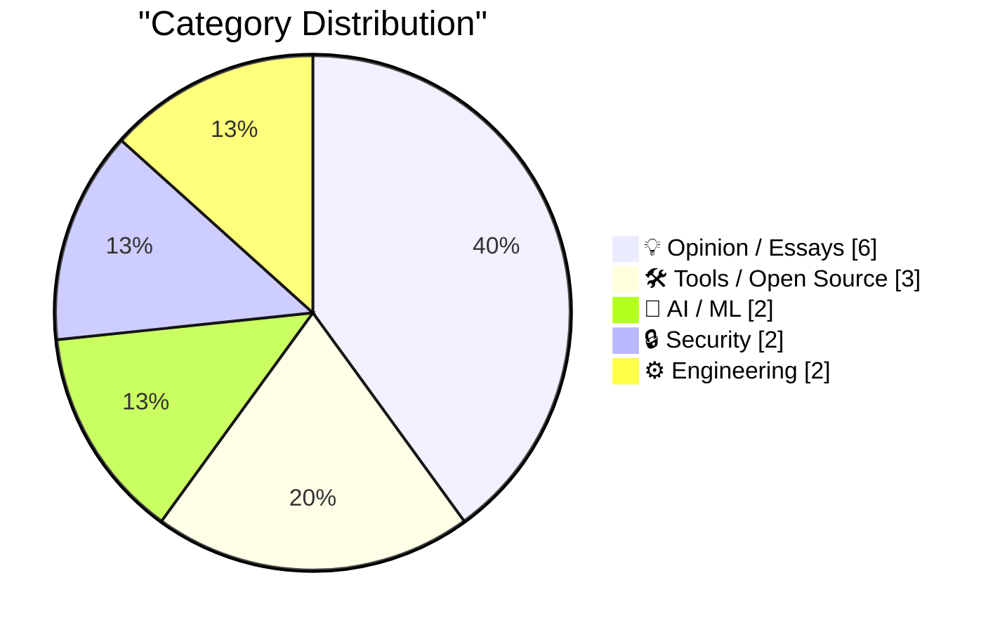
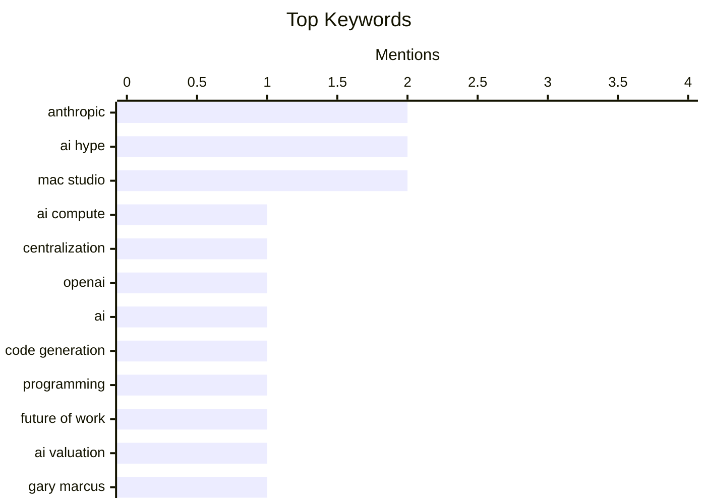

## Today's Highlights
Artificial Intelligence continues its rapid ascent, with projections of significant compute centralization by 2028 and impressive capabilities in software development. This growth, however, is met with scrutiny over ambitious valuations and critical viewpoints. Meanwhile, the broader tech industry navigates practical challenges, from detailed hardware configurations and software migrations to ongoing struggles with data security, privacy regulations, and platform control.
---
## Must Read Today
1. **Dylan Patel – Anthropic & OpenAI will have most of the world’s compute by 2028**
[Dylan Patel – Anthropic & OpenAI will have most of the world’s compute by 2028](https://www.dwarkesh.com/p/dylan-patel-3) — dwarkesh.com · 22h ago · 🤖 AI / ML
> This article discusses Dylan Patel's projection that AI compute will centralize significantly by 2028. Patel argues that Anthropic and OpenAI are poised to control the majority of global AI compute, driven by massive capital investments and the increasing scale required for frontier AI models. This centralization is fueled by the economics of large-scale AI training, where only a few players can afford the necessary infrastructure and talent. The main takeaway is that the AI industry is rapidly consolidating, leading to a future dominated by a handful of powerful AI labs.
💡 **Why read it**: It provides a compelling, data-driven forecast on the future centralization of AI compute power, highlighting the economic and strategic implications for the industry.
🏷️ AI compute, centralization, Anthropic, OpenAI
2. **Quoting Paul Dix**
[Quoting Paul Dix](https://simonwillison.net/2026/Aug/26/paul-dix/) — simonwillison.net · 5h ago · 🤖 AI / ML
> This article quotes Paul Dix on the impressive capabilities of AI in software development, specifically mentioning an instance where AI generated 1 million lines of code (LOC). Dix highlights that the AI refined this code over several months to produce reliable software now running on millions of developer machines. While acknowledging the argument that an "oracle" for comparison might simplify language translation tasks, Dix emphasizes that this achievement is still profoundly significant. The core takeaway is that AI's ability to autonomously generate and refine large-scale, functional software represents a transformative shift in programming.
💡 **Why read it**: It offers a thought-provoking perspective on the current advanced capabilities of AI in generating and refining substantial codebases, challenging traditional views on software development.
🏷️ AI, code generation, programming, future of work
3. **Anthropic’s $30 trillion fantasy**
[Anthropic’s $30 trillion fantasy](https://garymarcus.substack.com/p/anthropics-30-trillion-fantasy) — garymarcus.substack.com · 14h ago · 💡 Opinion / Essays
> This article critiques Anthropic's ambitious $30 trillion valuation projection, comparing it to the perceived overvaluation of SpaceX's S-1. Gary Marcus argues that such a valuation is highly speculative and unrealistic, given the current state and uncertainties surrounding AI's economic impact. He implies that these projections often rely on optimistic, unproven assumptions about future AI capabilities and market penetration. The main conclusion is that Anthropic's financial targets are likely an exaggerated "fantasy" rather than a grounded assessment of their potential.
💡 **Why read it**: It provides a critical, skeptical analysis of the inflated financial projections common in the AI industry, using Anthropic's $30 trillion valuation as a case study.
🏷️ Anthropic, AI valuation, AI hype, Gary Marcus
---
## Data Overview
| Sources Scanned | Articles Fetched | Time Window | Selected |
|:---:|:---:|:---:|:---:|
| 87/92 | 2589 -> 20 | 24h | **15** |
### Category Distribution

### Top Keywords

<details>
<summary>Plain Text Keyword Chart (Terminal Friendly)</summary>
```
anthropic       │ ████████████████████ 2
ai hype         │ ████████████████████ 2
mac studio      │ ████████████████████ 2
ai compute      │ ██████████░░░░░░░░░░ 1
centralization  │ ██████████░░░░░░░░░░ 1
openai          │ ██████████░░░░░░░░░░ 1
ai              │ ██████████░░░░░░░░░░ 1
code generation │ ██████████░░░░░░░░░░ 1
programming     │ ██████████░░░░░░░░░░ 1
future of work  │ ██████████░░░░░░░░░░ 1
```
</details>
### Topic Tags
**anthropic**(2) · **ai hype**(2) · **mac studio**(2) · ai compute(1) · centralization(1) · openai(1) · ai(1) · code generation(1) · programming(1) · future of work(1) · ai valuation(1) · gary marcus(1) · mac mini(1) · apple silicon(1) · hardware(1) · data breach(1) · verification(1) · cybercrime(1) · troy hunt(1) · python 3(1)
---
## Opinion / Essays
### 1. Anthropic’s $30 trillion fantasy
[Anthropic’s $30 trillion fantasy](https://garymarcus.substack.com/p/anthropics-30-trillion-fantasy) — **garymarcus.substack.com** · 14h ago · ⭐ 26/30
> This article critiques Anthropic's ambitious $30 trillion valuation projection, comparing it to the perceived overvaluation of SpaceX's S-1. Gary Marcus argues that such a valuation is highly speculative and unrealistic, given the current state and uncertainties surrounding AI's economic impact. He implies that these projections often rely on optimistic, unproven assumptions about future AI capabilities and market penetration. The main conclusion is that Anthropic's financial targets are likely an exaggerated "fantasy" rather than a grounded assessment of their potential.
🏷️ Anthropic, AI valuation, AI hype, Gary Marcus
---
### 2. XCancel, the Twitter/X Mirror, Shuts Down After Cease and Desist From the Fine Folks at X Corp
[XCancel, the Twitter/X Mirror, Shuts Down After Cease and Desist From the Fine Folks at X Corp](https://xcancel.com/) — **daringfireball.net** · 15h ago · ⭐ 23/30
> This article reports the shutdown of XCancel, a mirror service for Twitter/X content, following a cease and desist letter from X Corp. XCancel, which had been operating for two years, announced its immediate cessation of service on Monday, August 24th, at 8 PM EST, while seeking legal advice. The author notes that the threat of legal action was always apparent, influencing his decision to link directly to x.com rather than XCancel. The main takeaway is that X Corp is actively enforcing its intellectual property and terms of service against third-party services mirroring its content.
🏷️ X Corp, cease and desist, platform policy, XCancel
---
### 3. The AI Hater's Manifesto
[The AI Hater's Manifesto](https://www.wheresyoured.at/the-ai-haters-manifesto/) — **wheresyoured.at** · 21h ago · ⭐ 22/30
> This article, titled "The AI Hater's Manifesto," likely presents a critical or skeptical viewpoint on the rapid advancements and widespread adoption of artificial intelligence. While the provided snippet is minimal, the title suggests a strong counter-narrative to the prevalent optimism surrounding AI. The author probably articulates various concerns, potential downsides, or criticisms regarding AI's societal, economic, or ethical implications. The main takeaway is that the article offers a deliberately contrarian and critical perspective on AI, challenging its perceived benefits and highlighting its potential negative aspects.
🏷️ AI critique, AI hype, manifesto
---
### 4. Update Regarding the Base Prices of the M5 Max Mac Studio
[Update Regarding the Base Prices of the M5 Max Mac Studio](https://daringfireball.net/2026/08/configurations_and_pricing_for_new_mac_minis_and_mac_studios) — **daringfireball.net** · 15h ago · ⭐ 21/30
> This article corrects a previous error regarding the base price of the M5 Max Mac Studio, attributing the confusion to a "sneaky design" in Apple's purchasing interface. The author clarifies that while both M5 Max SoCs feature 18-core CPUs, the entry model at $2,500 has a 32-core GPU, whereas the upgraded chip includes a 40-core GPU. Apple's interface misleadingly labels the 40-core GPU as a "+ $300" upgrade, implying a $2,800 starting price for that configuration, rather than a distinct base model. The main takeaway is a warning about Apple's potentially confusing pricing presentation for Mac Studio configurations, specifically concerning GPU upgrades.
🏷️ Apple, Mac Studio, M5 Max, pricing
---
### 5. Digg v4 and lessons not learned
[Digg v4 and lessons not learned](https://dfarq.homeip.net/digg-v4-and-lessons-not-learned/?utm_source=rss&#038;utm_medium=rss&#038;utm_campaign=digg-v4-and-lessons-not-learned) — **dfarq.homeip.net** · 3h ago · ⭐ 20/30
> The article uses Digg v4 as a cautionary tale about the risks associated with major website redesigns. Digg, a once-prominent Web 2.0 news aggregation site, implemented a significant overhaul to v4 that fundamentally alienated its established user base. This redesign failed to incorporate user feedback and community expectations, prioritizing new features and a different content model over the existing user experience. The drastic changes led to a rapid decline in user engagement and ultimately diminished Digg's relevance. The main conclusion is that high-profile platforms must carefully consider user community and feedback when making substantial changes to avoid severe consequences.
🏷️ Digg v4, product management, tech history, lessons learned
---
### 6. Pluralistic: The age of disinvention (25 Aug 2026)
[Pluralistic: The age of disinvention (25 Aug 2026)](https://pluralistic.net/2026/08/25/gammamax/) — **pluralistic.net** · 10h ago · ⭐ 18/30
> This article is a curated link aggregation post from Cory Doctorow's Pluralistic blog, centered around the theme "The age of disinvention." It presents a collection of short, annotated links covering diverse topics such as "Object permanence," "Metacrap," and the retirement of CmdrTaco. The post also includes personal updates on the author's upcoming and recent appearances, as well as his latest book releases. It serves as a concise digest of critical commentary on current events and technological trends. The main takeaway is a broad, critical perspective on contemporary issues, framed by Doctorow's unique insights.
🏷️ link digest, tech policy, Cory Doctorow
---
## Tools / Open Source
### 7. ★ Memory and Storage Configurations and Pricing for the New Mac Minis (M6/M5 Pro) and Mac Studios (M5 Max/M5 Ultra)
[★ Memory and Storage Configurations and Pricing for the New Mac Minis (M6/M5 Pro) and Mac Studios (M5 Max/M5 Ultra)](https://daringfireball.net/2026/08/configurations_and_pricing_for_new_mac_minis_and_mac_studios) — **daringfireball.net** · 23h ago · ⭐ 25/30
> This article provides a detailed breakdown of the RAM and SSD configurations and pricing for Apple's new Mac Minis (featuring M6/M5 Pro chips) and Mac Studios (with M5 Max/M5 Ultra chips). It presents condensed tables to clearly show the available memory and storage options for each specific chip variant. The author aims to simplify the complex configuration choices and their associated costs for potential buyers. The core takeaway is a comprehensive guide to understanding the upgrade paths and pricing structures for Apple's latest professional desktop offerings.
🏷️ Mac Mini, Mac Studio, Apple Silicon, hardware
---
### 8. Adding diagrams to my static site generator with D2
[Adding diagrams to my static site generator with D2](https://www.gilesthomas.com/2026/08/adding-d2) — **gilesthomas.com** · 15h ago · ⭐ 21/30
> The author addressed the challenge of efficiently producing high-quality diagrams for blog posts, which previously led to their underuse. They integrated D2, a text-to-diagram language, into their static site generator to automate diagram creation. This involved developing a custom shortcode that allows embedding D2 code directly into posts, which is then rendered into SVG images. This approach significantly streamlined the workflow, making it easier to incorporate complex visual explanations. The successful D2 integration provides a practical solution for enhancing technical content with easily maintainable diagrams.
🏷️ D2, static site generator, diagrams, technical writing
---
### 9. Have You Heard the Good News About Microlighter?
[Have You Heard the Good News About Microlighter?](https://blog.jim-nielsen.com/2026/shipping-microlighter/) — **blog.jim-nielsen.com** · 19h ago · ⭐ 21/30
> This article introduces Microlighter, a new tool designed for efficient syntax highlighting on the web. Microlighter distinguishes itself by leveraging the CSS Custom Highlights API, offering a modern and performant approach compared to traditional JavaScript-heavy solutions. The author quickly adopted Microlighter, implementing a PR for their blog on the day of its release, demonstrating its ease of integration. This tool promises improved performance and greater customization for code snippets. The main takeaway is that Microlighter provides a promising, API-driven alternative for web-based syntax highlighting.
🏷️ Microlighter, syntax highlighting, web development, Custom Highlight API
---
## AI / ML
### 10. Dylan Patel – Anthropic & OpenAI will have most of the world’s compute by 2028
[Dylan Patel – Anthropic & OpenAI will have most of the world’s compute by 2028](https://www.dwarkesh.com/p/dylan-patel-3) — **dwarkesh.com** · 22h ago · ⭐ 28/30
> This article discusses Dylan Patel's projection that AI compute will centralize significantly by 2028. Patel argues that Anthropic and OpenAI are poised to control the majority of global AI compute, driven by massive capital investments and the increasing scale required for frontier AI models. This centralization is fueled by the economics of large-scale AI training, where only a few players can afford the necessary infrastructure and talent. The main takeaway is that the AI industry is rapidly consolidating, leading to a future dominated by a handful of powerful AI labs.
🏷️ AI compute, centralization, Anthropic, OpenAI
---
### 11. Quoting Paul Dix
[Quoting Paul Dix](https://simonwillison.net/2026/Aug/26/paul-dix/) — **simonwillison.net** · 5h ago · ⭐ 27/30
> This article quotes Paul Dix on the impressive capabilities of AI in software development, specifically mentioning an instance where AI generated 1 million lines of code (LOC). Dix highlights that the AI refined this code over several months to produce reliable software now running on millions of developer machines. While acknowledging the argument that an "oracle" for comparison might simplify language translation tasks, Dix emphasizes that this achievement is still profoundly significant. The core takeaway is that AI's ability to autonomously generate and refine large-scale, functional software represents a transformative shift in programming.
🏷️ AI, code generation, programming, future of work
---
## Security
### 12. A Cautionary Tale About Data Breach Claims, Verification and Carhartt
[A Cautionary Tale About Data Breach Claims, Verification and Carhartt](https://www.troyhunt.com/a-cautionary-tale-about-data-breach-claims-verification-and-carhartt/) — **troyhunt.com** · 16h ago · ⭐ 25/30
> This article serves as a cautionary tale about the unreliability of data breach claims, particularly those made by cybercriminals, using Carhartt as an example. Troy Hunt emphasizes that information from malicious actors or even initial reports can be inaccurate or misleading. He underscores the critical importance of independent verification and thorough investigation before confirming a data breach. The main takeaway is that skepticism and rigorous validation are essential when assessing alleged data breaches to avoid spreading misinformation.
🏷️ Data breach, verification, cybercrime, Troy Hunt
---
### 13. Footnote Regarding the GDPR and Cookie Permission Prompts
[Footnote Regarding the GDPR and Cookie Permission Prompts](https://daringfireball.net/2026/08/what_is_the_point_of_the_dma#fn1-2026-08-24) — **daringfireball.net** · 22h ago · ⭐ 24/30
> This article, presented as a footnote to a piece on the DMA, critically examines the effectiveness and perceived impact of the GDPR, specifically regarding ubiquitous cookie permission prompts. The author argues that despite the GDPR going into effect 10 years ago, the prevalence of intrusive cookie banners suggests regulators are either satisfied with the status quo or ineffective in enforcing user-friendly compliance. The piece implies that these prompts, often seen as annoying "dickovers," are an unintended consequence that regulators now view as a successful demonstration of the GDPR's presence. The main takeaway is a cynical view that the GDPR's primary visible outcome has been the proliferation of frustrating cookie consent pop-ups, which regulators seem to accept.
🏷️ GDPR, DMA, privacy, regulation
---
## Engineering
### 14. EVE Online: The Move to Python 3 Begins!
[EVE Online: The Move to Python 3 Begins!](https://simonwillison.net/2026/Aug/25/eve-online-move-to-python-3/) — **simonwillison.net** · 15h ago · ⭐ 24/30
> This article announces that EVE Online, a long-running MMORPG, is finally beginning its migration from Python 2 to Python 3. EVE Online has historically been a significant case study for Python at scale, having run on Stackless Python since its 2003 launch and last undergoing a major upgrade to Stackless Python 2.7 sixteen years ago. The move to Python 3 addresses the challenges of maintaining a large, complex codebase on an unsupported language version. The main takeaway is that this migration marks a crucial modernization effort for one of the most prominent Python-powered games.
🏷️ Python 3, EVE Online, migration, legacy systems
---
### 15. Debugging Ubiquiti's 5G Backup on AT&T
[Debugging Ubiquiti's 5G Backup on AT&T](https://www.jeffgeerling.com/blog/2026/unifi-u5g-backup-debugging/) — **jeffgeerling.com** · 18h ago · ⭐ 18/30
> The author details the debugging process for integrating Ubiquiti's 5G Backup device into a mobile 'mini homelab' project, specifically using AT&T as the primary "on-the-go" connection. The goal was to enable seamless switching between 5G and wired internet, requiring careful configuration and troubleshooting. The article highlights challenges in achieving reliable connectivity and performance, noting an observed speed of 20 Mbps in a studio environment. This post provides practical insights into setting up and optimizing Ubiquiti's 5G backup for flexible network deployments. The main takeaway is the importance of thorough debugging and configuration for optimal performance of 5G backup solutions.
🏷️ 5G, Ubiquiti, networking, debugging
---
*Generated at 2026-08-26 14:01 | Scanned 87 sources -> 2589 articles -> selected 15*
*Based on the [Hacker News Popularity Contest 2025](https://refactoringenglish.com/tools/hn-popularity/) RSS source list recommended by [Andrej Karpathy](https://x.com/karpathy)*
*Produced by Dongdianr AI. Follow the same-name WeChat public account for more AI practical tips 💡*
