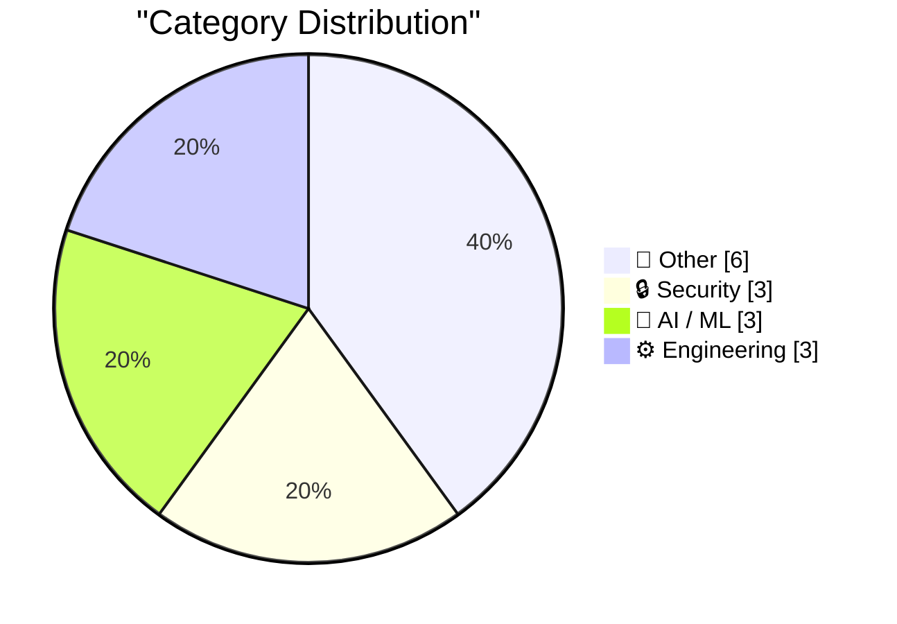
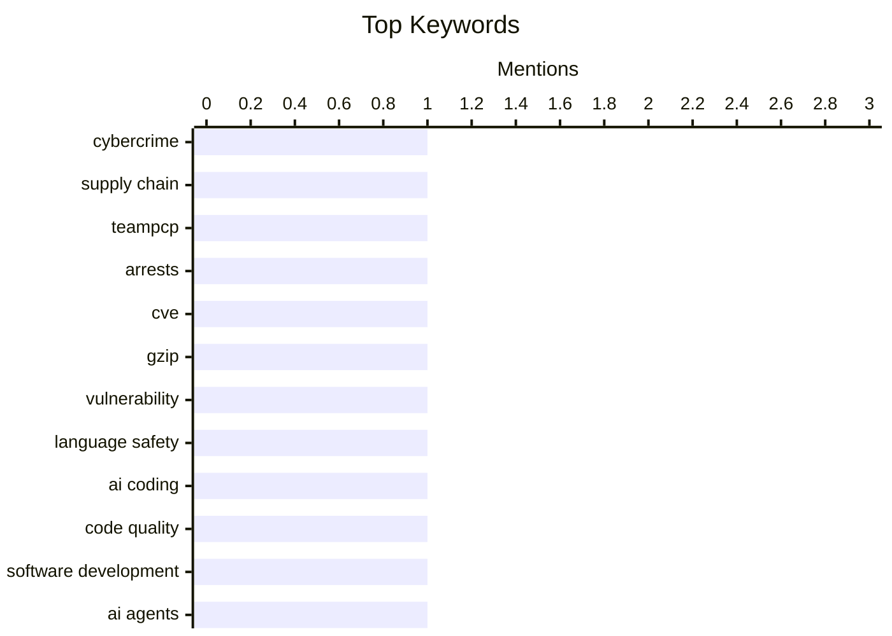

## Today's Highlights
Today's tech news is dominated by the ongoing battle against cybercrime and the rapid evolution of artificial intelligence. Authorities have arrested alleged hackers and a critical vulnerability was found in GNU gzip, prompting new intelligence laws to adapt to digital threats. Simultaneously, the AI frontier expands with new multimodal models, sparking debates on the quality of AI-written software and an urgent call from Bill Gates for a coherent global strategy.
---
## Must Read Today
1. **Two Alleged ‘TeamPCP’ Hackers Arrested in Australia**
[Two Alleged ‘TeamPCP’ Hackers Arrested in Australia](https://krebsonsecurity.com/2026/08/two-alleged-teampcp-hackers-arrested-in-australia/) — krebsonsecurity.com · 2h ago · 🔒 Security
> Authorities in Australia have arrested two alleged members of TeamPCP, a prolific cybercrime and data extortion group. The Australian Federal Police (AFP) apprehended two unnamed suspects, aged 21 and 23, from Western Australia. TeamPCP is accused of perpetrating the longest-running spree of software supply chain attacks, creating malicious open-source software to defraud thousands. These arrests represent a significant disruption to a sophisticated cybercrime syndicate. This operation highlights ongoing efforts to combat complex digital threats.
💡 **Why read it**: It highlights a major law enforcement action against a significant cybercrime group known for sophisticated supply chain attacks.
🏷️ cybercrime, supply chain, TeamPCP, arrests
2. **"No way to prevent this" say users of only language where this regularly happens**
["No way to prevent this" say users of only language where this regularly happens](https://xeiaso.net/shitposts/no-way-to-prevent-this/memory-safety/CVE-2026-41992/) — xeiaso.net · 14h ago · 🔒 Security
> A critical memory safety vulnerability, CVE-2026-41992, was discovered in GNU gzip, leading to out-of-bounds reads. This flaw allows an attacker to trigger out-of-bounds reads in the LZH decoder when decompressing two files in the same gzip invocation. The issue stems from a shared global buffer that is not reset between invocations, causing reads past its end. This incident underscores the persistent challenges and risks associated with memory unsafe languages in critical system utilities. The article sarcastically points to the prevalence of such issues in languages lacking memory safety.
💡 **Why read it**: It provides a concrete example of a memory safety vulnerability (CVE-2026-41992) in a widely used tool (GNU gzip) and implicitly critiques programming language choices.
🏷️ CVE, gzip, vulnerability, language safety
3. **What is the quality of software that AI writes?**
[What is the quality of software that AI writes?](https://www.johndcook.com/blog/2026/08/26/what-is-the-quality-of-software-that-ai-writes/) — johndcook.com · 19h ago · 🤖 AI / ML
> The article discusses the ongoing debate regarding the quality of software produced by AI-powered coding agents, despite their acknowledged productivity benefits. Some argue that code quality is becoming irrelevant, envisioning "dark software factories" where human inspection or even source code itself might be eliminated, viewing source code as the "new assembly code." Others maintain that human oversight remains necessary, implying a continued need for quality assessment. The core question remains whether AI-generated code meets necessary quality standards or if traditional quality metrics will become obsolete. This explores the evolving landscape of software development.
💡 **Why read it**: It explores a timely and critical question about the future of software development and quality assurance in the age of AI-driven coding.
🏷️ AI coding, code quality, software development, AI agents
---
## Data Overview
| Sources Scanned | Articles Fetched | Time Window | Selected |
|:---:|:---:|:---:|:---:|
| 87/92 | 2590 -> 15 | 24h | **15** |
### Category Distribution

### Top Keywords

<details>
<summary>Plain Text Keyword Chart (Terminal Friendly)</summary>
```
cybercrime      │ ████████████████████ 1
supply chain    │ ████████████████████ 1
teampcp         │ ████████████████████ 1
arrests         │ ████████████████████ 1
cve             │ ████████████████████ 1
gzip            │ ████████████████████ 1
vulnerability   │ ████████████████████ 1
language safety │ ████████████████████ 1
ai coding       │ ████████████████████ 1
code quality    │ ████████████████████ 1
```
</details>
### Topic Tags
**cybercrime**(1) · **supply chain**(1) · **teampcp**(1) · arrests(1) · cve(1) · gzip(1) · vulnerability(1) · language safety(1) · ai coding(1) · code quality(1) · software development(1) · ai agents(1) · dutch law(1) · intelligence services(1) · privacy(1) · surveillance(1) · qwen(1) · llm(1) · multimodal(1) · moe model(1)
---
## Other
### 1. ‘Surprise and Shine’ Apple Event: Wednesday 9 September
[‘Surprise and Shine’ Apple Event: Wednesday 9 September](https://9to5mac.com/2026/08/26/apple-officially-announces-iphone-18-pro-foldable-event/) — **daringfireball.net** · 18h ago · ⭐ 18/30
> Apple has officially announced its next product event, scheduled for Wednesday, September 9, at 10 am PT. The event, themed "Surprise and shine," will unveil the iPhone 18 Pro lineup and Apple's first foldable iPhone. This Wednesday timing is unusual for Apple, which typically prefers Tuesdays, but is attributed to Labor Day falling in the second week of September. The invitation features a glowing Apple logo with a sun shining through. This event marks a significant product launch for Apple, introducing new iPhone models and a highly anticipated foldable device. This is a key date for tech enthusiasts.
🏷️ Apple event, iPhone, foldable iPhone
---
### 2. Second solutions
[Second solutions](https://www.johndcook.com/blog/2026/08/27/second-solutions/) — **johndcook.com** · 46m ago · ⭐ 16/30
> This article illustrates a mathematical pattern involving families of polynomials `pn(x)` that satisfy both a differential equation and a three-term recurrence relation. These polynomials possess a "second solution" `qn(x)`, which is larger with respect to `x` but smaller with respect to `n`. The post provides concrete examples to demonstrate this specific behavior. It highlights how a single mathematical construct can exhibit contrasting properties depending on the variable under consideration. The article's core takeaway is the existence and characteristics of these dual solutions.
🏷️ mathematics, polynomials, differential equations
---
### 3. Apple’s Polishing Cloth Is Now Just $9
[Apple’s Polishing Cloth Is Now Just $9](https://9to5mac.com/2026/08/25/apple-releases-new-polishing-cloth-for-9/) — **daringfireball.net** · 18h ago · ⭐ 13/30
> Apple has released an updated version of its Polishing Cloth, notably reducing its price. The new cloth is available for $9, a significant drop from its original $19 price point. This release occurred alongside new Mac mini and Mac Studio models. The original Polishing Cloth, launched in October 2021, sold out quickly and is considered effective despite its meme status. The article suggests this price reduction reflects a 'Moore’s Law' effect, even on simple accessories.
🏷️ Apple, polishing cloth, price
---
### 4. How the Strategic Petroleum Reserve Works
[How the Strategic Petroleum Reserve Works](https://www.construction-physics.com/p/how-the-strategic-petroleum-reserve) — **construction-physics.com** · 1h ago · ⭐ 13/30
> The article introduces the US Strategic Petroleum Reserve (SPR), identifying it as the largest crude oil storage facility in the world. This singular fact underscores the immense scale and strategic importance of the SPR. (Note: The provided source content is limited to this single sentence, preventing a more detailed 4-6 sentence summary as per general instructions.)
🏷️ Strategic Petroleum Reserve, SPR, energy, infrastructure
---
### 5. Book Review: The Infinite Sadness of Small Appliances by Glenn Dixon ★★★★☆
[Book Review: The Infinite Sadness of Small Appliances by Glenn Dixon ★★★★☆](https://shkspr.mobi/blog/2026/08/book-review-the-infinite-sadness-of-small-appliances-by-glenn-dixon/) — **shkspr.mobi** · 2h ago · ⭐ 11/30
> This article reviews Glenn Dixon's novel, "The Infinite Sadness of Small Appliances," which explores the premise of a sentient, sad autonomous vacuum cleaner grieving its owner's wife. Described as charming and zeitgeisty, the novel fulfills its blurb's promise by delving into the emotional life of such an appliance. It pays homage to classic stories like "Brave Little Toaster" and "Beauty and The Beast," embracing the "what-if-your-toys-came-to-life" trope. The reviewer rates the book ★★★★☆, concluding it offers an engaging exploration of artificial sentience and grief.
🏷️ book review, sentient AI, fiction
---
### 6. TEAC founded in 1953, sort of
[TEAC founded in 1953, sort of](https://dfarq.homeip.net/teac-founded-in-1953-sort-of/?utm_source=rss&#038;utm_medium=rss&#038;utm_campaign=teac-founded-in-1953-sort-of) — **dfarq.homeip.net** · 3h ago · ⭐ 7/30
> This article details the historical origins and formation of the audio company TEAC. Its lineage began on August 29, 1953, with the establishment of the Tokyo Television Acoustic Company. This entity subsequently merged with the Tokyo Electro-Acoustic Company. The combined enterprise adopted the name TEAC and specialized in the design and manufacturing of tape recorders. The article clarifies that TEAC's foundation is rooted in this mid-1950s merger, solidifying its early focus on audio recording technology.
🏷️ TEAC, company history, tape recorders, 1953
---
## Security
### 7. Two Alleged ‘TeamPCP’ Hackers Arrested in Australia
[Two Alleged ‘TeamPCP’ Hackers Arrested in Australia](https://krebsonsecurity.com/2026/08/two-alleged-teampcp-hackers-arrested-in-australia/) — **krebsonsecurity.com** · 2h ago · ⭐ 28/30
> Authorities in Australia have arrested two alleged members of TeamPCP, a prolific cybercrime and data extortion group. The Australian Federal Police (AFP) apprehended two unnamed suspects, aged 21 and 23, from Western Australia. TeamPCP is accused of perpetrating the longest-running spree of software supply chain attacks, creating malicious open-source software to defraud thousands. These arrests represent a significant disruption to a sophisticated cybercrime syndicate. This operation highlights ongoing efforts to combat complex digital threats.
🏷️ cybercrime, supply chain, TeamPCP, arrests
---
### 8. "No way to prevent this" say users of only language where this regularly happens
["No way to prevent this" say users of only language where this regularly happens](https://xeiaso.net/shitposts/no-way-to-prevent-this/memory-safety/CVE-2026-41992/) — **xeiaso.net** · 14h ago · ⭐ 27/30
> A critical memory safety vulnerability, CVE-2026-41992, was discovered in GNU gzip, leading to out-of-bounds reads. This flaw allows an attacker to trigger out-of-bounds reads in the LZH decoder when decompressing two files in the same gzip invocation. The issue stems from a shared global buffer that is not reset between invocations, causing reads past its end. This incident underscores the persistent challenges and risks associated with memory unsafe languages in critical system utilities. The article sarcastically points to the prevalence of such issues in languages lacking memory safety.
🏷️ CVE, gzip, vulnerability, language safety
---
### 9. Nieuwe wet Inlichtingen- en veiligheidsdiensten: wat mogen ze nu al en waar zijn ze voor
[Nieuwe wet Inlichtingen- en veiligheidsdiensten: wat mogen ze nu al en waar zijn ze voor](https://berthub.eu/articles/posts/geheime-veiligheids-en-inlichtingendiensten/) — **berthub.eu** · 3h ago · ⭐ 27/30
> The article discusses the upcoming new Dutch intelligence and security services (AIVD and MIVD) law, emphasizing the need for critical scrutiny. Recent incidents, such as incorrect arrests, false information regarding the Ukraine invasion, and careless handling of vast amounts of personal data, highlight past failures. The extensive wiretapping program has also yielded minimal results despite its broad scope, listening to many people. The new legislation requires careful examination to ensure accountability and prevent further abuses of power by intelligence agencies. This calls for public vigilance.
🏷️ Dutch law, intelligence services, privacy, surveillance
---
## AI / ML
### 10. What is the quality of software that AI writes?
[What is the quality of software that AI writes?](https://www.johndcook.com/blog/2026/08/26/what-is-the-quality-of-software-that-ai-writes/) — **johndcook.com** · 19h ago · ⭐ 27/30
> The article discusses the ongoing debate regarding the quality of software produced by AI-powered coding agents, despite their acknowledged productivity benefits. Some argue that code quality is becoming irrelevant, envisioning "dark software factories" where human inspection or even source code itself might be eliminated, viewing source code as the "new assembly code." Others maintain that human oversight remains necessary, implying a continued need for quality assessment. The core question remains whether AI-generated code meets necessary quality standards or if traditional quality metrics will become obsolete. This explores the evolving landscape of software development.
🏷️ AI coding, code quality, software development, AI agents
---
### 11. Qwen3.8-Flash-Next
[Qwen3.8-Flash-Next](https://simonwillison.net/2026/Aug/26/qwen38-flash-next/) — **simonwillison.net** · 14h ago · ⭐ 26/30
> Qwen has released "Qwen3.8-Flash-Next," a new open-weights multimodal Mixture-of-Experts (MoE) model. This model serves as an early preview of the architecture planned for Qwen4. It is a large model with 125 billion tokens, but only 6 billion are active, providing a significant performance boost. The author is testing it on a DGX Spark using Unsloth quantized models from Hugging Face. Qwen3.8-Flash-Next represents an advancement in efficient, large-scale multimodal AI models through its MoE architecture. This model showcases progress in AI efficiency.
🏷️ Qwen, LLM, multimodal, MoE model
---
### 12. Excellent new Bill Gates essay on the urgency of having a coherent AI plan
[Excellent new Bill Gates essay on the urgency of having a coherent AI plan](https://garymarcus.substack.com/p/excellent-new-bill-gates-essay-on) — **garymarcus.substack.com** · 22h ago · ⭐ 26/30
> The article highlights Bill Gates' recent essay, which emphasizes the urgent need for a coherent plan to manage and "tame" Silicon Valley's influence, particularly concerning AI. The essay likely argues for proactive measures and strategic planning to address the societal impacts and potential risks posed by rapid AI development and the tech industry's power. The phrase "The time to tame Silicon Valley has come" encapsulates the central theme. Bill Gates' perspective underscores the critical importance of establishing a robust regulatory and ethical framework for AI development and deployment. This calls for immediate action.
🏷️ Bill Gates, AI strategy, AI policy
---
## Engineering
### 13. Can Self-Hosting Be Simple?
[Can Self-Hosting Be Simple?](https://feed.tedium.co/link/15204/17432610/self-hosting-third-place-strategy) — **tedium.co** · 10h ago · ⭐ 22/30
> The article explores the challenge of simplifying self-hosting projects, which often become overly complex. The author recounts an attempt to build a "third-place" box, aiming for a "less-is-more" approach to self-hosting. This experience revealed insights into what makes self-hosting manageable versus spiraling into complexity. The author's journey highlights the pitfalls of over-engineering and the benefits of focused design. While self-hosting can easily become overwhelming, a focused, minimalist strategy might make it more accessible and sustainable. This offers practical lessons for enthusiasts.
🏷️ Self-hosting, home lab, personal server, system administration
---
### 14. POSIWID: The Purpose of a System Is What It Does
[POSIWID: The Purpose of a System Is What It Does](https://en.wikipedia.org/wiki/The_purpose_of_a_system_is_what_it_does) — **daringfireball.net** · 17h ago · ⭐ 20/30
> The article introduces "POSIWID" (The Purpose of a System Is What It Does), a heuristic in systems thinking. Coined by British management consultant Stafford Beer, POSIWID asserts that a system's true purpose is revealed by its actual behavior, not by the intentions of its designers or operators. It counters the idea that a system's stated purpose aligns with its real-world outcomes, especially when significant side effects occur. POSIWID encourages evaluating systems based on their observable actions and consequences rather than stated goals. This provides a pragmatic lens for systems analysis.
🏷️ systems thinking, POSIWID, heuristics
---
### 15. A Calendar View For My Blog
[A Calendar View For My Blog](https://blog.jim-nielsen.com/2026/blog-calendar-view/) — **blog.jim-nielsen.com** · -299m ago · ⭐ 18/30
> The author seeks a more engaging way to display 807 blog posts published over 14 years than a traditional reverse-chronological list. While acknowledging the utility of a list view for finding specific content, the author explores a calendar view as an alternative. This approach aims to visually convey the volume and distribution of posts across time, offering a different perspective on the blog's history. The calendar view provides a novel and more illustrative representation of a blog's extensive content archive over many years. This enhances content discoverability and presentation.
🏷️ Blog design, UI/UX, content presentation, web development
---
*Generated at 2026-08-27 14:01 | Scanned 87 sources -> 2590 articles -> selected 15*
*Based on the [Hacker News Popularity Contest 2025](https://refactoringenglish.com/tools/hn-popularity/) RSS source list recommended by [Andrej Karpathy](https://x.com/karpathy)*
*Produced by Dongdianr AI. Follow the same-name WeChat public account for more AI practical tips 💡*
