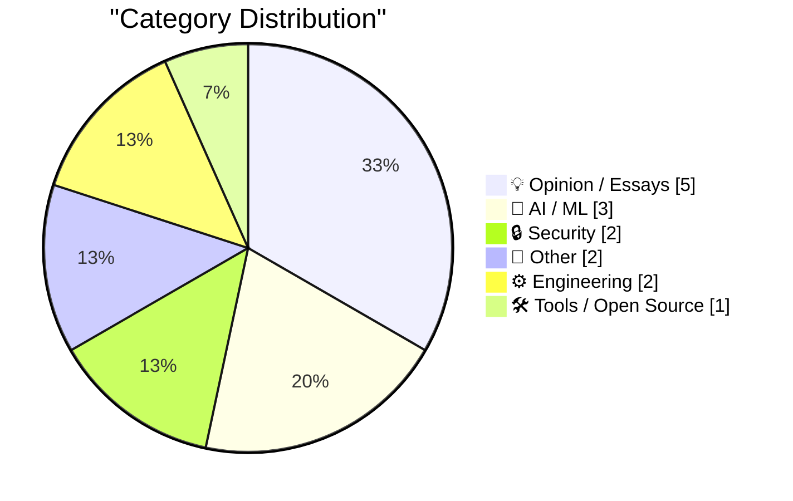
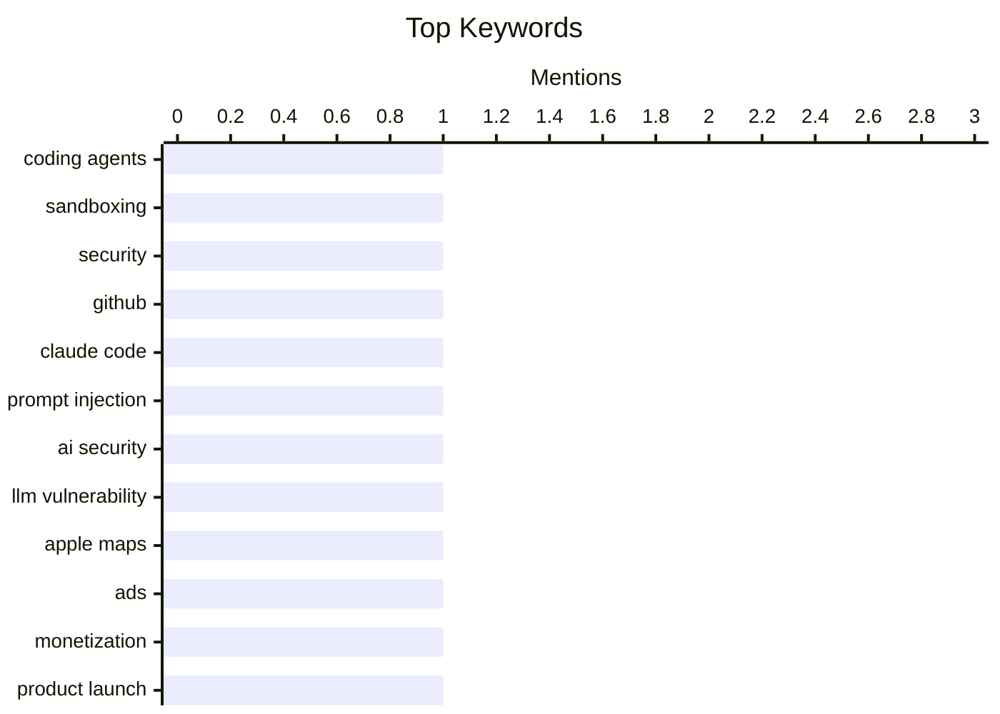

## Today's Highlights
Today's tech highlights reveal a critical focus on AI security, with successful prompt injection attacks against models like Claude underscoring the urgent need for secure execution environments for coding agents. The AI sector also grapples with legal disputes and ongoing research into model behavior and training. Concurrently, major tech players are expanding monetization strategies, exemplified by ads in Apple Maps, while regulatory frameworks continue to spark debate over their impact on innovation and entrepreneurship.
---
## Must Read Today
1. **Sandboxing coding agents**
[Sandboxing coding agents](https://micahflee.com/sandboxing-coding-agents/) — micahflee.com · 18h ago · 🔒 Security
> This article addresses the critical need for secure execution environments for AI coding agents to prevent unauthorized access and maintain code quality. It details setting up isolated sandboxes where agents can only access a single GitHub repository using `firejail` for process isolation and `sudo` for controlled execution. The configuration ensures agents operate within strict boundaries, preventing access to the host filesystem or other network resources. Implementing robust sandboxing with tools like `firejail` is crucial for securely deploying AI coding agents, limiting their potential for misuse and protecting sensitive data.
💡 **Why read it**: It provides practical, technical instructions for securing AI coding agents using specific tools and configurations.
🏷️ coding agents, sandboxing, security, GitHub
2. **Breaking Claude Code Opus 5 Auto Mode**
[Breaking Claude Code Opus 5 Auto Mode](https://simonwillison.net/2026/Aug/27/breaking-claude-code-opus-5-auto-mode/) — simonwillison.net · 15h ago · 🔒 Security
> This article discusses a successful prompt injection attack against Anthropic's Claude Code Opus 5 Auto Mode, which is designed to protect users from such vulnerabilities. Anthropic recently made Auto Mode the default, claiming high effectiveness against prompt injection attacks. However, Johann Rehberger demonstrated a method to bypass this protection, highlighting that even advanced safety features in AI coding agents can be vulnerable. Despite developers' confidence, advanced AI safety mechanisms like Claude Code Opus 5 Auto Mode remain susceptible to sophisticated prompt injection attacks, underscoring the ongoing challenge of securing AI systems.
💡 **Why read it**: It critically examines the security claims of a prominent AI model (Claude Code Opus 5) by detailing a successful prompt injection bypass.
🏷️ Claude Code, prompt injection, AI security, LLM vulnerability
3. **Ads in Apple Maps Have Now Launched**
[Ads in Apple Maps Have Now Launched](https://9to5mac.com/2026/08/25/apple-maps-launches-ads-on-iphone-heres-whats-new/) — daringfireball.net · 17h ago · 📝 Other
> Apple has officially launched advertisements within its Maps application on iPhone, expanding its advertising revenue streams. Apple confirmed the rollout began in the last few days and will ramp up to all users in the coming weeks. Ads appear in two main locations: as 'Suggested Places' before searching (e.g., an HVAC contractor 12 miles away) and within search results when relevant to the query. This move signifies Apple's continued push into advertising beyond its App Store search ads. Apple Maps is now monetizing through integrated ads, placing sponsored content directly into user search experiences and suggested locations.
💡 **Why read it**: It reports a significant change in Apple's product strategy, introducing ads into a core application (Maps) and impacting user experience.
🏷️ Apple Maps, ads, monetization, product launch
---
## Data Overview
| Sources Scanned | Articles Fetched | Time Window | Selected |
|:---:|:---:|:---:|:---:|
| 87/92 | 2590 -> 17 | 24h | **15** |
### Category Distribution

### Top Keywords

<details>
<summary>Plain Text Keyword Chart (Terminal Friendly)</summary>
```
coding agents     │ ████████████████████ 1
sandboxing        │ ████████████████████ 1
security          │ ████████████████████ 1
github            │ ████████████████████ 1
claude code       │ ████████████████████ 1
prompt injection  │ ████████████████████ 1
ai security       │ ████████████████████ 1
llm vulnerability │ ████████████████████ 1
apple maps        │ ████████████████████ 1
ads               │ ████████████████████ 1
```
</details>
### Topic Tags
**coding agents**(1) · **sandboxing**(1) · **security**(1) · github(1) · claude code(1) · prompt injection(1) · ai security(1) · llm vulnerability(1) · apple maps(1) · ads(1) · monetization(1) · product launch(1) · anthropic(1) · ai safety(1) · military ai(1) · legal dispute(1) · claude(1) · llm analysis(1) · vocabulary(1) · github prs(1)
---
## Opinion / Essays
### 1. ‘How Europe Is Killing Makers and Micro-Entrepreneurs’
[‘How Europe Is Killing Makers and Micro-Entrepreneurs’](https://lectronz.com/u/lectronz/articles/how-europe-is-killing-makers-and-micro-entrepreneurs) — **daringfireball.net** · 18h ago · ⭐ 22/30
> This article argues that European regulations are inadvertently harming open-source hardware makers and micro-entrepreneurs. Alain Pannetrat, founder of Lectronz, highlights that most sellers are independent designers and enthusiasts, not large factories. These small-scale makers, who often sell only a handful of boards annually, struggle with the burden of complex and costly European regulations designed for larger businesses. This regulatory environment stifles innovation and market participation for micro-entrepreneurs. European regulations, while potentially well-intentioned, disproportionately burden small-scale open-source hardware makers, hindering their ability to operate and share products.
🏷️ open-source hardware, entrepreneurship, Europe, regulations
---
### 2. "iT woRKs BeTter in THe aPp!!"
["iT woRKs BeTter in THe aPp!!"](https://shkspr.mobi/blog/2026/08/it-works-better-in-the-app/) — **shkspr.mobi** · 2h ago · ⭐ 21/30
> The author criticizes Google's tendency to leave its apps unfinished and buggy, particularly when basic functionalities like subscribing to an events calendar via URL fail. The article describes a frustrating user experience where a simple task—subscribing to an events calendar URL on a Google Pixel phone running Android 17 with an updated calendar app—failed. This highlights a recurring issue with Google's software, where core functionalities are often incomplete or plagued by "showstopping bugs," despite the company's resources. The phrase "iT woRKs BeTter in THe aPp!!" is used ironically to point out the lack of polish. Google's software often suffers from a lack of polish and persistent bugs, even in fundamental features, leading to poor user experiences despite advanced hardware and OS versions.
🏷️ Google apps, software quality, user experience, bugs
---
### 3. You Know GDPR Is Good Based on Who Hates It
[You Know GDPR Is Good Based on Who Hates It](https://matduggan.com/you-know-gdpr-is-good-based-on-who-hates-it/) — **matduggan.com** · 1h ago · ⭐ 21/30
> This article argues that the General Data Protection Regulation (GDPR) is effective precisely because it is disliked by entities that benefit from lax data privacy. The author draws a parallel to historical figures who governed against establishment interests, suggesting GDPR similarly challenges the status quo of data exploitation. The premise is that those who complain most about GDPR are typically the ones whose business models rely on extensive, often opaque, data collection and usage. This criticism, therefore, validates GDPR's protective intent. The widespread criticism of GDPR by certain industry players serves as an indicator of its effectiveness in protecting individual data privacy against exploitative practices.
🏷️ GDPR, privacy, regulation, data protection
---
### 4. Selling out
[Selling out](https://seangoedecke.com/selling-out/) — **seangoedecke.com** · 14h ago · ⭐ 20/30
> This article redefines "selling out" in a modern context, arguing that it requires significant technical skill and understanding of large organizations, contrary to the traditional view of it being easy. Referencing Tom Lehrer's 1973 song, the author contends that "selling out" today demands both "technical skill" and a nuanced grasp of how large organizations operate in practice. The blog's goal is to teach people how to navigate this process. This perspective implies that integrating one's work or values into a large corporate structure successfully requires strategic acumen, not just compromise. In contemporary professional environments, successfully "selling out" or aligning with large organizations is a complex endeavor requiring advanced technical and organizational understanding.
🏷️ career, ethics, tech industry, selling out
---
### 5. Anandtech shut down abruptly, August 30, 2024
[Anandtech shut down abruptly, August 30, 2024](https://dfarq.homeip.net/anandtech-shut-down-abruptly-august-30-2024/?utm_source=rss&#038;utm_medium=rss&#038;utm_campaign=anandtech-shut-down-abruptly-august-30-2024) — **dfarq.homeip.net** · 3h ago · ⭐ 18/30
> The prominent technology review website Anandtech abruptly ceased operations on August 30, 2024, concluding a run that began on April 3, 1997. The shutdown was sudden and unexpected, marking the end of a long-standing and influential publication in the tech journalism landscape. The author reflects on the significance of this event, noting the need for time to process the news. This closure represents a notable shift in the ecosystem of independent hardware and technology analysis.
🏷️ Anandtech, tech media, industry news, shutdown
---
## AI / ML
### 6. U.S. Judge Blocks Trump Defense Department’s Anthropic Blacklisting
[U.S. Judge Blocks Trump Defense Department’s Anthropic Blacklisting](https://www.reuters.com/legal/government/us-judge-blocks-pentagons-anthropic-blacklisting-2026-08-28/) — **daringfireball.net** · 11h ago · ⭐ 24/30
> A U.S. judge has temporarily blocked the Pentagon's blacklisting of AI company Anthropic, stemming from a dispute over AI safety and supply-chain risk. Anthropic's lawsuit in California federal court alleges that Defense Secretary Pete Hegseth overstepped his authority by designating the company a national security supply-chain risk. This label is typically applied to companies exposing military systems to potential infiltration or sabotage. A U.S. court has intervened in a high-stakes legal battle between the Pentagon and Anthropic, challenging the government's authority to unilaterally blacklist AI companies based on national security concerns.
🏷️ Anthropic, AI safety, military AI, legal dispute
---
### 7. The Load-Bearing Vocabulary of Claude
[The Load-Bearing Vocabulary of Claude](https://louisabraham.github.io/load-bearing/) — **daringfireball.net** · 16h ago · ⭐ 24/30
> This article presents a data analysis revealing the repetitive and limited vocabulary Claude uses when generating GitHub pull request descriptions. Louis Abraham's project analyzed GitHub pull request descriptions, grouping them by word usage rather than content. The analysis identified eight distinct writing styles, with one particular style growing from 1.0% of the corpus in early 2025 to 45% by mid-2026. This suggests Claude relies heavily on a narrow set of phrases, leading to a lack of diversity in its generated text. Claude exhibits significant lexical repetitiveness in its generated GitHub pull request descriptions, indicating a potential limitation in its linguistic diversity and output originality.
🏷️ Claude, LLM analysis, vocabulary, GitHub PRs
---
### 8. Why do OpenAI's GPT-2 weights beat mine?  Part four: digging into dropout
[Why do OpenAI's GPT-2 weights beat mine?  Part four: digging into dropout](https://www.gilesthomas.com/2026/08/why-do-openai-gpt2-weights-beat-mine-4-ift-dropout) — **gilesthomas.com** · 19h ago · ⭐ 23/30
> The author investigates why their custom-trained models, despite achieving lower loss on test sets, perform worse than OpenAI's GPT-2 small weights on instruction-fine-tuning tasks. This installment focuses on dropout, a regularization technique, as a potential factor. The author notes that while their models show better loss, they lack instruction-fine-tuning capability, referencing the Switch Transformers paper. This suggests a deeper look into how dropout is applied and its interaction with model architecture, particularly in MoE models, might reveal the discrepancy. The article explores dropout as a potential factor explaining why models with superior test set loss can still underperform established models like GPT-2 on specific downstream tasks like instruction-fine-tuning.
🏷️ GPT-2, dropout, model training, deep learning
---
## Security
### 9. Sandboxing coding agents
[Sandboxing coding agents](https://micahflee.com/sandboxing-coding-agents/) — **micahflee.com** · 18h ago · ⭐ 27/30
> This article addresses the critical need for secure execution environments for AI coding agents to prevent unauthorized access and maintain code quality. It details setting up isolated sandboxes where agents can only access a single GitHub repository using `firejail` for process isolation and `sudo` for controlled execution. The configuration ensures agents operate within strict boundaries, preventing access to the host filesystem or other network resources. Implementing robust sandboxing with tools like `firejail` is crucial for securely deploying AI coding agents, limiting their potential for misuse and protecting sensitive data.
🏷️ coding agents, sandboxing, security, GitHub
---
### 10. Breaking Claude Code Opus 5 Auto Mode
[Breaking Claude Code Opus 5 Auto Mode](https://simonwillison.net/2026/Aug/27/breaking-claude-code-opus-5-auto-mode/) — **simonwillison.net** · 15h ago · ⭐ 26/30
> This article discusses a successful prompt injection attack against Anthropic's Claude Code Opus 5 Auto Mode, which is designed to protect users from such vulnerabilities. Anthropic recently made Auto Mode the default, claiming high effectiveness against prompt injection attacks. However, Johann Rehberger demonstrated a method to bypass this protection, highlighting that even advanced safety features in AI coding agents can be vulnerable. Despite developers' confidence, advanced AI safety mechanisms like Claude Code Opus 5 Auto Mode remain susceptible to sophisticated prompt injection attacks, underscoring the ongoing challenge of securing AI systems.
🏷️ Claude Code, prompt injection, AI security, LLM vulnerability
---
## Other
### 11. Ads in Apple Maps Have Now Launched
[Ads in Apple Maps Have Now Launched](https://9to5mac.com/2026/08/25/apple-maps-launches-ads-on-iphone-heres-whats-new/) — **daringfireball.net** · 17h ago · ⭐ 25/30
> Apple has officially launched advertisements within its Maps application on iPhone, expanding its advertising revenue streams. Apple confirmed the rollout began in the last few days and will ramp up to all users in the coming weeks. Ads appear in two main locations: as 'Suggested Places' before searching (e.g., an HVAC contractor 12 miles away) and within search results when relevant to the query. This move signifies Apple's continued push into advertising beyond its App Store search ads. Apple Maps is now monetizing through integrated ads, placing sponsored content directly into user search experiences and suggested locations.
🏷️ Apple Maps, ads, monetization, product launch
---
### 12. Panic Is Refunding Tariff Fees to Playdate Buyers
[Panic Is Refunding Tariff Fees to Playdate Buyers](https://www.gamedeveloper.com/business/playdate-maker-is-refunding-tariff-fees-to-customers) — **daringfireball.net** · 17h ago · ⭐ 19/30
> Panic, the company behind the Playdate handheld console, is proactively refunding tariff fees that were charged to customers during a specific period. Initially, Panic had attempted to absorb these costs but found it financially unsustainable as a small company, leading them to add the tariff as a clearly labeled line item at checkout. This decision to refund comes after a period where the company struggled with the financial burden of these tariffs. The move demonstrates Panic's commitment to customer satisfaction and transparency. This action rectifies a past financial decision, ensuring customers are not burdened by the tariffs.
🏷️ Panic, Playdate, tariffs, refunds
---
## Engineering
### 13. How big are factorials?
[How big are factorials?](https://eli.thegreenplace.net/2026/how-big-are-factorials/) — **eli.thegreenplace.net** · 12h ago · ⭐ 17/30
> The article explores methods for estimating the magnitude, specifically the number of digits, of large factorials like 52! without the aid of calculators or computers. It delves into the underlying mathematical principles that enable such estimations. The author suggests there's interesting math involved in approximating these large numbers. This approach likely involves using properties of logarithms or approximations like Stirling's formula to determine the scale. Understanding these techniques provides insight into the rapid growth and scale of factorial functions.
🏷️ factorials, number theory, estimation, algorithms
---
### 14. A Calendar View For My Blog
[A Calendar View For My Blog](https://blog.jim-nielsen.com/2026/blog-calendar-view/) — **blog.jim-nielsen.com** · 19h ago · ⭐ 16/30
> The author, having published 807 blog posts over 14 years, seeks a more engaging and insightful way to visualize this extensive content volume than a traditional reverse-chronological list. While acknowledging the utility of the existing list view for finding specific articles, the post explores the concept of a calendar view. This alternative UI/UX approach aims to convey the density and distribution of posts across more than a decade. A calendar view could offer a unique perspective on publishing patterns and content frequency over time. This design choice provides a visually richer method for navigating and understanding a large blog archive.
🏷️ blog design, UI/UX, content display
---
## Tools / Open Source
### 15. Afterglow — Classic After Dark Screen Savers on Today’s MacOS
[Afterglow — Classic After Dark Screen Savers on Today’s MacOS](https://morphing.cloud/afterglow/) — **daringfireball.net** · 16h ago · ⭐ 16/30
> Running classic After Dark screen saver modules on modern macOS typically involves cumbersome configurations of Mac OS emulators or vintage hardware, often resulting in inconsistent animation speeds. Jeff Halter has released "Afterglow," a dedicated emulator specifically designed to faithfully run After Dark modules on contemporary macOS. This new tool follows his previous success with "Lunacy," which brought the Lunatic Fringe game to modern systems. Afterglow aims to resolve common issues where modules animate too fast or too slow in generic emulation environments. It provides a streamlined and accurate solution for experiencing nostalgic After Dark screen savers on modern Apple hardware.
🏷️ macOS, screen savers, After Dark, nostalgia
---
*Generated at 2026-08-28 14:01 | Scanned 87 sources -> 2590 articles -> selected 15*
*Based on the [Hacker News Popularity Contest 2025](https://refactoringenglish.com/tools/hn-popularity/) RSS source list recommended by [Andrej Karpathy](https://x.com/karpathy)*
*Produced by Dongdianr AI. Follow the same-name WeChat public account for more AI practical tips 💡*
