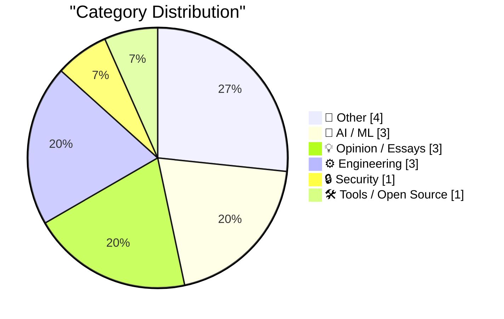
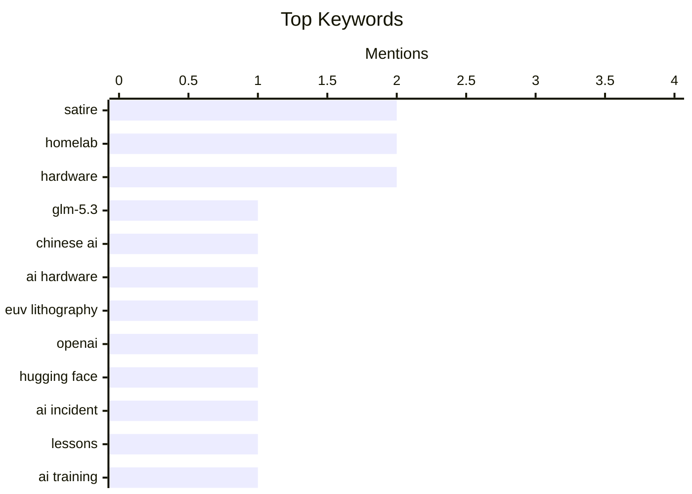

## Today's Highlights
Today's tech highlights reveal the accelerating pace of AI development, from new model deployments on diverse hardware to critical discussions around its ethical implications and sometimes questionable applications. The cybersecurity landscape remains volatile, with exploits emerging at alarming speeds following even a rumor of a bug. Amidst these large-scale trends, engineers continue to innovate with practical solutions for web development and compact, powerful personal computing setups.
---
## Must Read Today
1. **What GLM-5.3 Flash running on Chinese hardware actually means**
[What GLM-5.3 Flash running on Chinese hardware actually means](https://martinalderson.com/posts/glm-5-3-flash-chinese-hardware/?utm_source=rss&amp;utm_medium=rss&amp;utm_campaign=feed) — martinalderson.com · 14h ago · 🤖 AI / ML
> This article discusses the significance of Z.AI successfully running its GLM-5.3 Flash model on domestically manufactured Chinese chips. While this achievement is impressive, it does not fundamentally close the gap with Western inference hardware. The core limitation lies in the absence of advanced EUV lithography for Chinese chip manufacturing. Consequently, the article concludes that the technological gap in inference hardware capabilities between China and the West is more likely to widen than close.
💡 **Why read it**: It provides a critical technical perspective on China's semiconductor capabilities and the global AI hardware landscape, emphasizing the impact of lithography limitations.
🏷️ GLM-5.3, Chinese AI, AI hardware, EUV lithography
2. **5 lessons from the OpenAI / Hugging Face incident**
[5 lessons from the OpenAI / Hugging Face incident](https://garymarcus.substack.com/p/5-lessons-from-the-openai-hugging) — garymarcus.substack.com · 19h ago · 🤖 AI / ML
> This article analyzes the OpenAI / Hugging Face incident, questioning OpenAI's actions and drawing five key lessons from the event. The incident highlights critical issues concerning ethical AI development, responsible disclosure practices, and competitive dynamics within the rapidly evolving AI industry. It suggests that even leading AI companies face challenges in maintaining transparency and engaging effectively with the community during sensitive situations. The article likely outlines specific missteps or areas for improvement based on the incident's details. Ultimately, it serves as a crucial case study for the AI community on navigating ethical dilemmas, competitive pressures, and public relations.
💡 **Why read it**: It offers critical insights into ethical considerations, responsible disclosure, and best practices for major AI companies following a notable industry incident.
🏷️ OpenAI, Hugging Face, AI incident, lessons
3. **‘I’m the Guy Who Destroys Antique Books After We Scan Them Into Our Company’s Insatiable AI Platform’**
[‘I’m the Guy Who Destroys Antique Books After We Scan Them Into Our Company’s Insatiable AI Platform’](https://www.mcsweeneys.net/articles/im-the-guy-who-destroys-antique-books-after-we-scan-them-into-our-companys-insatiable-ai-platform) — daringfireball.net · 16h ago · 🤖 AI / ML
> This satirical piece highlights the destructive process of digitizing antique books for AI training, focusing on the post-scanning destruction. The process involves shearing off book spines and running pages through "enormous machines" for AI platforms to "absorb every sentence." The article humorously emphasizes that the "human touch" in this process is the industrial shredder, which decimates the original artifacts after digitization. The scanned data is then used to create "fairly compelling LinkedIn posts," satirizing the perceived triviality of some AI outputs. The piece critiques the potentially destructive and ethically questionable practices involved in data acquisition for AI, especially when dealing with irreplaceable historical artifacts.
💡 **Why read it**: It offers a darkly humorous yet thought-provoking critique of the ethical implications and physical destruction involved in large-scale data acquisition for AI.
🏷️ AI training, data ethics, satire, copyright
---
## Data Overview
| Sources Scanned | Articles Fetched | Time Window | Selected |
|:---:|:---:|:---:|:---:|
| 88/92 | 2620 -> 18 | 24h | **15** |
### Category Distribution

### Top Keywords

<details>
<summary>Plain Text Keyword Chart (Terminal Friendly)</summary>
```
satire          │ ████████████████████ 2
homelab         │ ████████████████████ 2
hardware        │ ████████████████████ 2
glm-5.3         │ ██████████░░░░░░░░░░ 1
chinese ai      │ ██████████░░░░░░░░░░ 1
ai hardware     │ ██████████░░░░░░░░░░ 1
euv lithography │ ██████████░░░░░░░░░░ 1
openai          │ ██████████░░░░░░░░░░ 1
hugging face    │ ██████████░░░░░░░░░░ 1
ai incident     │ ██████████░░░░░░░░░░ 1
```
</details>
### Topic Tags
**satire**(2) · **homelab**(2) · **hardware**(2) · glm-5.3(1) · chinese ai(1) · ai hardware(1) · euv lithography(1) · openai(1) · hugging face(1) · ai incident(1) · lessons(1) · ai training(1) · data ethics(1) · copyright(1) · nvidia(1) · ai financing(1) · semiconductors(1) · market dynamics(1) · security exploit(1) · rust(1)
---
## Other
### 1. Apple Announces Price Increase for Apple TV and Apple One Subscriptions
[Apple Announces Price Increase for Apple TV and Apple One Subscriptions](https://9to5mac.com/2026/08/28/apple-announces-price-increase-for-apple-tv-and-apple-one-subscriptions/) — **daringfireball.net** · 16h ago · ⭐ 13/30
> Apple has announced price increases for its Apple TV and Apple One Individual subscription services, effective immediately for new subscribers. The monthly Apple TV subscription rises from $12.99 to $14.99, while the annual plan increases from $99 to $119. The Apple One Individual plan sees its price go from $19.95 to $21.95. Notably, other Apple One plans, such as Family and Premier, remain unchanged, contrasting with a previous Apple Music price hike that affected those tiers. This adjustment reflects Apple's ongoing strategy of periodically modifying subscription costs.
🏷️ Apple, subscriptions, price increase, Apple TV
---
### 2. Reading List 08/29/26
[Reading List 08/29/26](https://www.construction-physics.com/p/reading-list-082926) — **construction-physics.com** · 1h ago · ⭐ 13/30
> This article presents a diverse reading list covering various global topics and industry-specific insights. Key subjects highlighted include the issue of sinking homes in London, the state of US magnesium manufacturing, and the World Humanoid Robot games. It also touches upon catastrophic flooding events in Nepal, among other miscellaneous subjects. The compilation offers a broad overview of current events and specialized industry developments, curated for a specific date.
🏷️ reading list, diverse topics, general interest
---
### 3. This Week on The Analog Antiquarian
[This Week on The Analog Antiquarian](https://www.filfre.net/2026/08/this-week-on-the-analog-antiquarian/) — **filfre.net** · 21h ago · ⭐ 9/30
> This article serves as an announcement for new content available 'This Week on The Analog Antiquarian,' specifically highlighting a piece titled 'Rehabilitating Richard.' The provided text is a brief pointer to the full article on the linked platform. Without further content, the specific subject matter, historical context, or arguments of 'Rehabilitating Richard' cannot be detailed. The post indicates new content is available on the Analog Antiquarian platform for readers interested in its offerings.
🏷️ history, antiquarian, culture
---
### 4. We Certainly Have Made a Hames Out of This
[We Certainly Have Made a Hames Out of This](https://daringfireball.net/linked/2026/08/28/trump-lake-ontario) — **daringfireball.net** · 18h ago · ⭐ 8/30
> This article critiques the hypothetical renaming of Lake Ontario to 'Lake America,' focusing on the linguistic implications and idiomatic expressions. The core problem is that such a renaming would invalidate the traditional HOMES mnemonic for the Great Lakes (Huron, Ontario, Michigan, Erie, Superior). The author notes that the only two valid English words formable from the new five letters are 'hames' and 'shame.' While 'hames' is obscure in American English, it is a common Irish idiom meaning 'to make a mess of something.' The article concludes that both 'hames' and 'shame' aptly describe the perceived embarrassment of the situation.
🏷️ Lake Ontario, mnemonic, language, satire
---
## AI / ML
### 5. What GLM-5.3 Flash running on Chinese hardware actually means
[What GLM-5.3 Flash running on Chinese hardware actually means](https://martinalderson.com/posts/glm-5-3-flash-chinese-hardware/?utm_source=rss&amp;utm_medium=rss&amp;utm_campaign=feed) — **martinalderson.com** · 14h ago · ⭐ 28/30
> This article discusses the significance of Z.AI successfully running its GLM-5.3 Flash model on domestically manufactured Chinese chips. While this achievement is impressive, it does not fundamentally close the gap with Western inference hardware. The core limitation lies in the absence of advanced EUV lithography for Chinese chip manufacturing. Consequently, the article concludes that the technological gap in inference hardware capabilities between China and the West is more likely to widen than close.
🏷️ GLM-5.3, Chinese AI, AI hardware, EUV lithography
---
### 6. 5 lessons from the OpenAI / Hugging Face incident
[5 lessons from the OpenAI / Hugging Face incident](https://garymarcus.substack.com/p/5-lessons-from-the-openai-hugging) — **garymarcus.substack.com** · 19h ago · ⭐ 26/30
> This article analyzes the OpenAI / Hugging Face incident, questioning OpenAI's actions and drawing five key lessons from the event. The incident highlights critical issues concerning ethical AI development, responsible disclosure practices, and competitive dynamics within the rapidly evolving AI industry. It suggests that even leading AI companies face challenges in maintaining transparency and engaging effectively with the community during sensitive situations. The article likely outlines specific missteps or areas for improvement based on the incident's details. Ultimately, it serves as a crucial case study for the AI community on navigating ethical dilemmas, competitive pressures, and public relations.
🏷️ OpenAI, Hugging Face, AI incident, lessons
---
### 7. ‘I’m the Guy Who Destroys Antique Books After We Scan Them Into Our Company’s Insatiable AI Platform’
[‘I’m the Guy Who Destroys Antique Books After We Scan Them Into Our Company’s Insatiable AI Platform’](https://www.mcsweeneys.net/articles/im-the-guy-who-destroys-antique-books-after-we-scan-them-into-our-companys-insatiable-ai-platform) — **daringfireball.net** · 16h ago · ⭐ 25/30
> This satirical piece highlights the destructive process of digitizing antique books for AI training, focusing on the post-scanning destruction. The process involves shearing off book spines and running pages through "enormous machines" for AI platforms to "absorb every sentence." The article humorously emphasizes that the "human touch" in this process is the industrial shredder, which decimates the original artifacts after digitization. The scanned data is then used to create "fairly compelling LinkedIn posts," satirizing the perceived triviality of some AI outputs. The piece critiques the potentially destructive and ethically questionable practices involved in data acquisition for AI, especially when dealing with irreplaceable historical artifacts.
🏷️ AI training, data ethics, satire, copyright
---
## Opinion / Essays
### 8. Premium: The Hater's Guide To Circular Financing (Part One)
[Premium: The Hater's Guide To Circular Financing (Part One)](https://www.wheresyoured.at/premium-the-haters-guide-to-circular-financing-part-one/) — **wheresyoured.at** · 22h ago · ⭐ 25/30
> This article, presented as a satirical internal meeting, critiques the concept of "circular financing" within the context of NVIDIA's dominance in the AI hardware market. Jensen Huang, NVIDIA's CEO, is depicted celebrating the company's position as the "biggest, most-beautiful semiconductor company," making "biggest, hottest GPUs" for major AI labs like "Clammy Sammy and Wario Amodei's." The piece implies a financial loop where AI companies heavily invest in NVIDIA GPUs, potentially creating a self-reinforcing cycle of demand and profit that benefits NVIDIA disproportionately. The article satirically exposes potential concerns about market concentration and financial dynamics within the AI industry, particularly regarding NVIDIA's role.
🏷️ NVIDIA, AI financing, semiconductors, market dynamics
---
### 9. Making the unnecessary easier
[Making the unnecessary easier](https://www.johndcook.com/blog/2026/08/28/making-the-unnecessary-easier/) — **johndcook.com** · 23h ago · ⭐ 22/30
> The article critiques the tendency to use AI to automate tasks that are inherently unnecessary or of low value, rather than focusing on truly impactful applications. The author observed a video where an AI agent monitored tech news sites every 30 minutes to provide notifications, acknowledging it's less effort than manual checks but questioning the necessity of such frequent monitoring. This exemplifies how AI can make "unnecessary" tasks "easier," potentially leading to over-automation of trivial activities. The piece encourages a more thoughtful approach to AI application, prioritizing its use for genuinely valuable or complex problems instead of merely simplifying superfluous tasks.
🏷️ AI utility, automation, AI agents, tech news
---
### 10. ‘How Americans See E.U. Tech’
[‘How Americans See E.U. Tech’](https://www.youtube.com/watch?v=gGlpBuW6ZFc) — **daringfireball.net** · 16h ago · ⭐ 14/30
> This article is a strong endorsement of a YouTube video titled 'How Americans See E.U. Tech,' which the author highly recommends after receiving multiple links to it. The provided text serves as a commentary, indicating the video offers a compelling or insightful perspective on the topic. Without direct access to the video content, specific arguments or findings cannot be detailed. The author's enthusiastic reaction suggests the video delivers a particularly well-executed or thought-provoking analysis.
🏷️ EU tech, American perception, industry culture
---
## Engineering
### 11. This Week in Package Management: 29 August 2026
[This Week in Package Management: 29 August 2026](https://nesbitt.io/2026/08/29/this-week-in-package-management.html) — **nesbitt.io** · 4h ago · ⭐ 23/30
> This article is a weekly digest covering releases, advisories, and articles related to package management across various ecosystems. It compiles important updates, including announcements of new software versions, critical security advisories for existing packages, and notable articles discussing package management best practices or new tools. The digest aims to keep developers and system administrators informed about the latest developments and potential security concerns. The article serves as a concise resource for staying current with the dynamic world of software package management.
🏷️ package management, releases, advisories, software updates
---
### 12. Building a mini Homelab that fits in my carry-on
[Building a mini Homelab that fits in my carry-on](https://www.jeffgeerling.com/blog/2026/mini-homelab-network-fits-in-carry-on/) — **jeffgeerling.com** · 23h ago · ⭐ 19/30
> This article details the construction of a highly portable mini homelab designed to fit into a carry-on bag for travel. The author is building this lab for VCF Midwest to demo NTP time history on vintage Macs, utilizing a GPS-derived NTP service hosted on an Xserve G5. The setup involves syncing via NTP or a "strange AppleTalk timing extension from the 1990s," and an image shows a "Ubiquiti mini-rack network with UPS." This project demonstrates a practical and compact solution for specialized networking and vintage computing demonstrations on the go.
🏷️ homelab, vintage computing, NTP, hardware
---
### 13. A simple "copy this code" button in JavaScript
[A simple "copy this code" button in JavaScript](https://shkspr.mobi/blog/2026/08/a-simple-copy-this-code-button-in-javascript/) — **shkspr.mobi** · 2h ago · ⭐ 19/30
> This article provides a simple JavaScript solution for adding a "copy this code" button next to code samples on a blog. The implementation uses a straightforward HTML button with an `onclick` event that calls `navigator.clipboard.writeText()`. The JavaScript retrieves the text content of the sibling `<code>` tag using `this.parentNode.getElementsByTagName('code')[0].textContent`. The `navigator.clipboard.writeText` function requires a user interaction to work, which is satisfied by the button click. The article offers a concise and effective client-side method to enhance user experience by simplifying code snippet copying on web pages.
🏷️ JavaScript, web development, clipboard API, UI/UX
---
## Security
### 14. Just a rumour of a bug is enough to find a security exploit these days
[Just a rumour of a bug is enough to find a security exploit these days](https://simonwillison.net/2026/Aug/28/just-a-rumour-of-a-bug/) — **simonwillison.net** · 15h ago · ⭐ 24/30
> This article discusses the alarming speed at which security exploits are being developed and attempted based on mere rumors or early discussions of bugs. Anil Madhavapeddy, a computer science professor at Cambridge and OCaml compiler maintainer, reports that security issues in OCaml projects are seeing attempted exploits within minutes of patches being shared for discussion. This rapid response time, which "normally takes a few days," indicates a significant acceleration in attacker capabilities and monitoring. The article highlights a critical shift in cybersecurity, where even preliminary discussions of vulnerabilities can quickly lead to active exploitation attempts, demanding faster patching and more secure disclosure practices.
🏷️ security exploit, Rust, unsafe code, vulnerability
---
## Tools / Open Source
### 15. Dell Optiplex 3040 and 3050 micro
[Dell Optiplex 3040 and 3050 micro](https://dfarq.homeip.net/dell-optiplex-3040-and-3050-micro/?utm_source=rss&#038;utm_medium=rss&#038;utm_campaign=dell-optiplex-3040-and-3050-micro) — **dfarq.homeip.net** · 3h ago · ⭐ 16/30
> This article reviews the Dell Optiplex 3040 and 3050 Micro PCs, highlighting their utility as small form factor machines. The Optiplex 3040 and 3050 Micro are presented as versatile and affordable alternatives to devices like the Raspberry Pi, offering more expandability. They are suitable for tasks requiring a compact footprint without sacrificing performance or upgrade options. These Dell Optiplex Micro models are recommended for users needing a small, expandable, and cost-effective computer solution, especially when Raspberry Pis are less available or more expensive.
🏷️ Dell Optiplex, micro PC, hardware, homelab
---
*Generated at 2026-08-29 14:01 | Scanned 88 sources -> 2620 articles -> selected 15*
*Based on the [Hacker News Popularity Contest 2025](https://refactoringenglish.com/tools/hn-popularity/) RSS source list recommended by [Andrej Karpathy](https://x.com/karpathy)*
*Produced by Dongdianr AI. Follow the same-name WeChat public account for more AI practical tips 💡*
