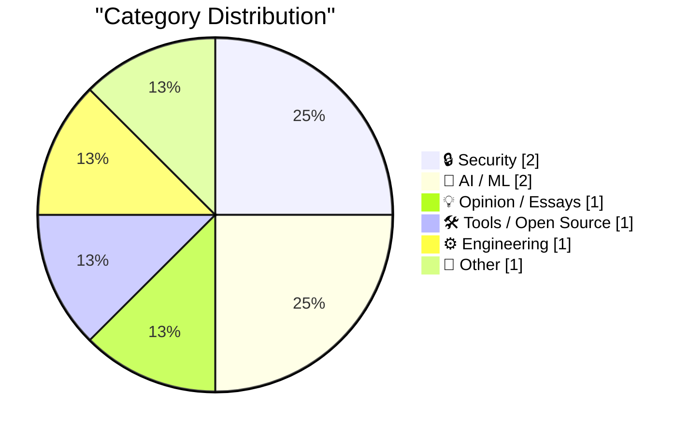
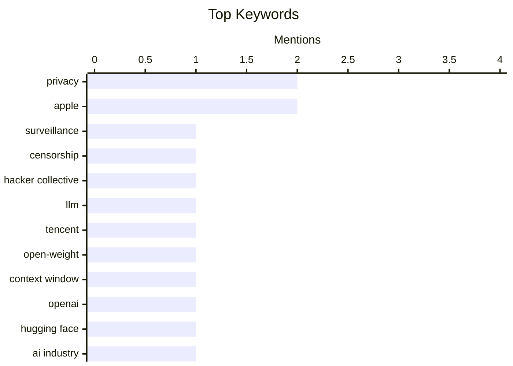

## Today's Highlights
The artificial intelligence landscape continues its rapid evolution, marked by the introduction of new open-weight large language models and ongoing shifts in industry dynamics. This progress also sparks critical discussions on how AI is reshaping professional skills and assessment. Concurrently, a strong focus remains on digital privacy and decentralization, with initiatives supporting censorship-resistant communication and open-source alternatives to mainstream services. These efforts underscore a broader push for more secure, private, and community-driven technology.
---
## Must Read Today
1. **The Server Called Paranoia: Defend Autistici/Inventati**
[The Server Called Paranoia: Defend Autistici/Inventati](https://micahflee.com/the-server-called-paranoia-defend-autistici-inventati/) — micahflee.com · 18h ago · 🔒 Security
> An Italian hacker collective, Autistici/Inventati, which has built censorship-resistant communications infrastructure for 25 years, was designated a terrorist organization by the United States on August 26, with its wind-down period ending September 25. This designation threatens their long-standing work providing secure, private communication tools designed to survive surveillance and police raids. The collective is known for defending digital rights and privacy against state overreach, and this US action could dismantle a critical resource for activists and privacy advocates. The article highlights the broader implications for digital freedom and privacy if Autistici/Inventati is forced to cease operations. It urges support for the collective against this designation.
💡 **Why read it**: It highlights a critical threat to a long-standing digital rights and privacy collective, raising important questions about state power and online censorship.
🏷️ privacy, surveillance, censorship, hacker collective
2. **Introducing Hy4 Preview**
[Introducing Hy4 Preview](https://simonwillison.net/2026/Aug/29/hy4/) — simonwillison.net · 14h ago · 🤖 AI / ML
> Tencent has released a preview of Hy4, a new open-weight text-input Large Language Model (LLM) without vision capabilities. Hy4 features 770B total parameters with 49B active parameters, a 1M token context window, and a substantial 1.56TB model size on Hugging Face. This represents a significant increase from its predecessor, Hy3, which had 295B total parameters, 21B active parameters, and a 256,000 token context window. Hy4 marks a substantial advancement in Tencent's LLM development, offering increased scale and context capabilities for text-based AI applications.
💡 **Why read it**: It announces a significant new open-weight LLM from Tencent, providing key technical specifications and a comparison to its predecessor.
🏷️ LLM, Tencent, open-weight, context window
3. **The Rise and Fall of Agent Civilizations**
[The Rise and Fall of Agent Civilizations](https://www.dwarkesh.com/p/openai-huggingface) — dwarkesh.com · 15h ago · 🤖 AI / ML
> The article aims to explain the complex relationship and historical narrative between OpenAI and Hugging Face in plain English. It likely delves into how OpenAI's proprietary, closed-source approach contrasts with Hugging Face's open-source ethos and community-driven development in the AI space. The "Rise and Fall of Agent Civilizations" metaphor suggests a discussion on the evolving dominance and strategic shifts between these two major players in AI development. The article provides an accessible overview of the differing philosophies and market positions that have shaped the trajectories of OpenAI and Hugging Face.
💡 **Why read it**: It offers a simplified explanation of the contrasting strategies and historical dynamics between two major AI entities, OpenAI and Hugging Face.
🏷️ OpenAI, Hugging Face, AI industry, agent civilizations
---
## Data Overview
| Sources Scanned | Articles Fetched | Time Window | Selected |
|:---:|:---:|:---:|:---:|
| 88/92 | 2620 -> 8 | 24h | **8** |
### Category Distribution

### Top Keywords

<details>
<summary>Plain Text Keyword Chart (Terminal Friendly)</summary>
```
privacy           │ ████████████████████ 2
apple             │ ████████████████████ 2
surveillance      │ ██████████░░░░░░░░░░ 1
censorship        │ ██████████░░░░░░░░░░ 1
hacker collective │ ██████████░░░░░░░░░░ 1
llm               │ ██████████░░░░░░░░░░ 1
tencent           │ ██████████░░░░░░░░░░ 1
open-weight       │ ██████████░░░░░░░░░░ 1
context window    │ ██████████░░░░░░░░░░ 1
openai            │ ██████████░░░░░░░░░░ 1
```
</details>
### Topic Tags
**privacy**(2) · **apple**(2) · **surveillance**(1) · censorship(1) · hacker collective(1) · llm(1) · tencent(1) · open-weight(1) · context window(1) · openai(1) · hugging face(1) · ai industry(1) · agent civilizations(1) · software engineers(1) · ai impact(1) · career(1) · value assessment(1) · fediverse(1) · nlnet grant(1) · activitybot(1)
---
## Security
### 1. The Server Called Paranoia: Defend Autistici/Inventati
[The Server Called Paranoia: Defend Autistici/Inventati](https://micahflee.com/the-server-called-paranoia-defend-autistici-inventati/) — **micahflee.com** · 18h ago · ⭐ 28/30
> An Italian hacker collective, Autistici/Inventati, which has built censorship-resistant communications infrastructure for 25 years, was designated a terrorist organization by the United States on August 26, with its wind-down period ending September 25. This designation threatens their long-standing work providing secure, private communication tools designed to survive surveillance and police raids. The collective is known for defending digital rights and privacy against state overreach, and this US action could dismantle a critical resource for activists and privacy advocates. The article highlights the broader implications for digital freedom and privacy if Autistici/Inventati is forced to cease operations. It urges support for the collective against this designation.
🏷️ privacy, surveillance, censorship, hacker collective
---
### 2. A Roku alternative streaming device
[A Roku alternative streaming device](https://dfarq.homeip.net/a-roku-alternative-streaming-device/?utm_source=rss&#038;utm_medium=rss&#038;utm_campaign=a-roku-alternative-streaming-device) — **dfarq.homeip.net** · 21h ago · ⭐ 17/30
> The author expresses concern over the lack of privacy associated with current streaming media devices like Roku and seeks an alternative. The article implies that popular streaming devices collect excessive user data, raising significant privacy issues. The search for an "alternative streaming device" suggests a need for solutions that offer greater control over personal data, potentially open-source hardware, or platforms with stronger privacy policies. The article advocates for streaming solutions that prioritize user privacy over data collection, addressing a growing concern among consumers.
🏷️ Roku, streaming, privacy, media devices
---
## AI / ML
### 3. Introducing Hy4 Preview
[Introducing Hy4 Preview](https://simonwillison.net/2026/Aug/29/hy4/) — **simonwillison.net** · 14h ago · ⭐ 26/30
> Tencent has released a preview of Hy4, a new open-weight text-input Large Language Model (LLM) without vision capabilities. Hy4 features 770B total parameters with 49B active parameters, a 1M token context window, and a substantial 1.56TB model size on Hugging Face. This represents a significant increase from its predecessor, Hy3, which had 295B total parameters, 21B active parameters, and a 256,000 token context window. Hy4 marks a substantial advancement in Tencent's LLM development, offering increased scale and context capabilities for text-based AI applications.
🏷️ LLM, Tencent, open-weight, context window
---
### 4. The Rise and Fall of Agent Civilizations
[The Rise and Fall of Agent Civilizations](https://www.dwarkesh.com/p/openai-huggingface) — **dwarkesh.com** · 15h ago · ⭐ 25/30
> The article aims to explain the complex relationship and historical narrative between OpenAI and Hugging Face in plain English. It likely delves into how OpenAI's proprietary, closed-source approach contrasts with Hugging Face's open-source ethos and community-driven development in the AI space. The "Rise and Fall of Agent Civilizations" metaphor suggests a discussion on the evolving dominance and strategic shifts between these two major players in AI development. The article provides an accessible overview of the differing philosophies and market positions that have shaped the trajectories of OpenAI and Hugging Face.
🏷️ OpenAI, Hugging Face, AI industry, agent civilizations
---
## Opinion / Essays
### 5. You have to beat the models at something
[You have to beat the models at something](https://seangoedecke.com/you-have-to-beat-the-models-at-something/) — **seangoedecke.com** · 14h ago · ⭐ 24/30
> The article discusses a necessary shift in how software engineers should be assessed, moving beyond traditional metrics to "value over replacement." The author previously advocated for evaluating engineers based on their value compared to an average engineer, rather than just product revenue or completed JIRA tickets. This approach emphasizes an engineer's unique contribution and ability to outperform baseline expectations, especially as AI models automate routine tasks. The phrase "beat the models" implies a focus on skills and contributions that AI cannot easily replicate. Engineers must demonstrate unique value and capabilities that surpass what AI models can achieve to remain competitive and relevant.
🏷️ software engineers, AI impact, career, value assessment
---
## Tools / Open Source
### 6. ActivityBot is the recipient of an NLnet grant!
[ActivityBot is the recipient of an NLnet grant!](https://shkspr.mobi/blog/2026/08/activitybot-is-the-recipient-of-an-nlnet-grant/) — **shkspr.mobi** · 2h ago · ⭐ 19/30
> ActivityBot, a single-file ActivityPub server, has been awarded an NLnet grant under the Next Generation Zero program. The NLnet grant, ranging from 5,000 to 50,000 euro, supports Fediverse projects aimed at "rewilding the social media landscape" and "reclaiming the public nature of the internet." ActivityBot's design as a lightweight, single-file ActivityPub server makes it an accessible tool for decentralized social media. This funding will enable further development of ActivityBot, contributing to the growth and decentralization of the Fediverse.
🏷️ Fediverse, NLnet grant, ActivityBot, social media
---
## Engineering
### 7. Apple prevails over Franklin, August 30, 1983
[Apple prevails over Franklin, August 30, 1983](https://dfarq.homeip.net/apple-prevails-over-franklin-august-30-1983/?utm_source=rss&#038;utm_medium=rss&#038;utm_campaign=apple-prevails-over-franklin-august-30-1983) — **dfarq.homeip.net** · 3h ago · ⭐ 19/30
> The article recounts the landmark legal case where Apple successfully sued Franklin Computer for copyright infringement on August 30, 1983. Prior to this case, the applicability of copyright law to computer software was legally unsettled. Apple sued Franklin for directly copying its ROMs and operating system, specifically the Apple II's operating system. The ruling established a crucial precedent that computer software, including operating systems and code embedded in ROMs, is protected under copyright law. The Apple vs. Franklin case was pivotal in solidifying software copyright, fundamentally shaping intellectual property rights in the nascent computer industry.
🏷️ software copyright, Apple, legal history, computer law
---
## Other
### 8. ★ Thoughts and Observations on Apple’s First Immersive MLB Broadcast, a Yankees 1-0 Win Over the Red Sox
[★ Thoughts and Observations on Apple’s First Immersive MLB Broadcast, a Yankees 1-0 Win Over the Red Sox](https://daringfireball.net/2026/08/thoughts_and_observations_apple_immersive_mlb_broadcast) — **daringfireball.net** · 20h ago · ⭐ 18/30
> The article provides observations on Apple's inaugural immersive Major League Baseball broadcast, specifically a Yankees 1-0 victory over the Red Sox. The author describes the experience as "profound" and "something new and different," suggesting a significant leap beyond traditional TV broadcasts. This implies the use of advanced spatial audio, high-resolution visuals, and potentially interactive elements unique to Apple's platform, likely Vision Pro. The immersive nature aims to bridge the gap between watching on TV and merely listening on radio, offering a deeply engaging viewing experience. Apple's immersive MLB broadcast represents a groundbreaking shift in sports media, offering a profoundly new and distinct viewing experience compared to traditional methods.
🏷️ Apple, MLB, immersive broadcast, media
---
*Generated at 2026-08-30 14:01 | Scanned 88 sources -> 2620 articles -> selected 8*
*Based on the [Hacker News Popularity Contest 2025](https://refactoringenglish.com/tools/hn-popularity/) RSS source list recommended by [Andrej Karpathy](https://x.com/karpathy)*
*Produced by Dongdianr AI. Follow the same-name WeChat public account for more AI practical tips 💡*
