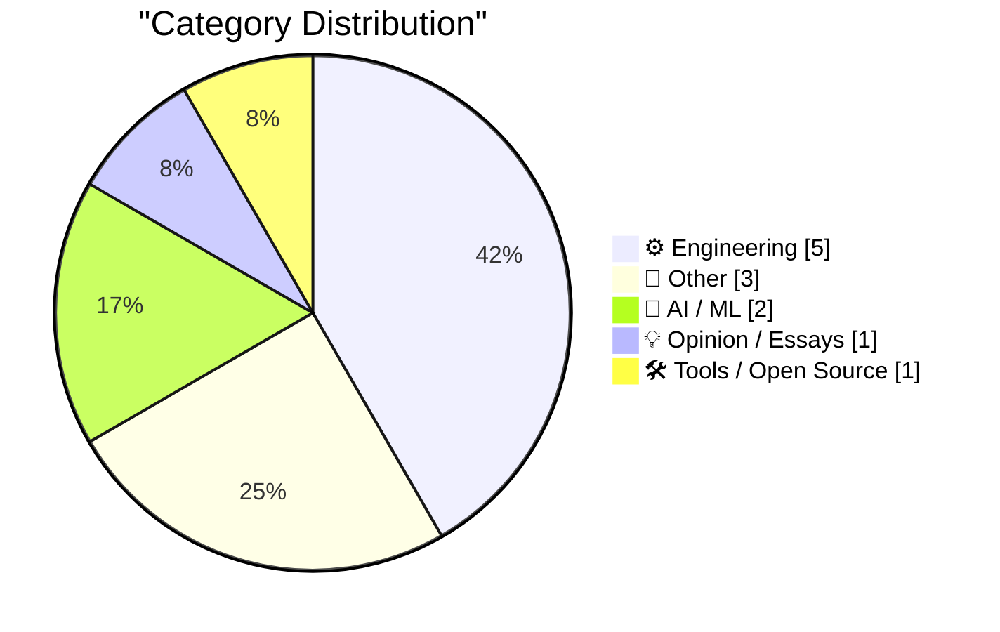
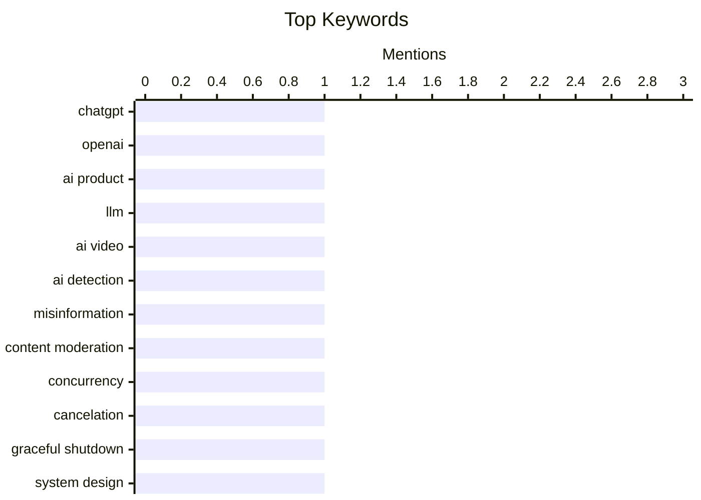

## Today's Highlights
Today's tech news highlights a dual focus on demystifying AI and revisiting foundational engineering. Articles emphasize the need for clearer labeling and product definitions in the rapidly evolving AI landscape. Concurrently, there's a deep dive into historical computing, from 1980s space memory to early network protocols. These insights are often juxtaposed with modern challenges like reducing codebase cognitive debt and refining software terminology, underscoring a continuous drive for clarity and efficiency.
---
## Must Read Today
1. **Understanding ChatGPT Work**
[Understanding ChatGPT Work](https://simonwillison.net/2026/Aug/30/understanding-chatgpt-work/) — simonwillison.net · 14h ago · 🤖 AI / ML
> The article clarifies that OpenAI's "ChatGPT Work" is actually two distinct products: a cloud-based version accessible via chatgpt.com and a local version. OpenAI has been rapidly iterating on these offerings since their July 9th announcement. The cloud version is highlighted as particularly powerful yet confusing due to its evolving nature. The main takeaway is that understanding the distinction between these two products is crucial for users engaging with OpenAI's new enterprise-focused ChatGPT services.
💡 **Why read it**: It clarifies the confusing distinction between the two 'ChatGPT Work' products offered by OpenAI, helping users understand their capabilities and access methods.
🏷️ ChatGPT, OpenAI, AI product, LLM
2. **Here's a good way to present AI videos**
[Here's a good way to present AI videos](https://idiallo.com/blog/a-good-way-to-present-ai-videos-on-youtube) — idiallo.com · 6h ago · 🤖 AI / ML
> The article argues that current "AI-generated" tags on platforms like YouTube are ineffective for preventing deception, often being missed by users or absent from clearly AI-generated content. It likens these tags to insignificant "Sponsored" labels, failing to adequately inform the public, including older generations. The author proposes a more prominent and effective warning system, similar to movie ratings, to clearly distinguish AI-generated content. The core conclusion is that a more robust and visible warning mechanism is essential to combat misinformation from AI videos.
💡 **Why read it**: It proposes a practical solution for effectively labeling AI-generated video content to prevent deception, addressing the shortcomings of current methods.
🏷️ AI video, AI detection, misinformation, content moderation
3. **Cancelation Terminology**
[Cancelation Terminology](https://matklad.github.io/2026/08/31/cancelation-terminology.html) — matklad.github.io · 14h ago · ⚙️ Engineering
> This short note aims to clarify the distinct concepts behind different types of cancellation in software systems. It differentiates between synchronous cancellation, asynchronous cancellation, and graceful shutdown, emphasizing that these are three fundamentally different mechanisms. While not strictly attached to the specific terms, the article stresses the importance of understanding the underlying behaviors to avoid confusion. The main point is that correctly distinguishing these cancellation patterns is critical for designing robust and predictable concurrent systems.
💡 **Why read it**: It provides a clear distinction between synchronous cancellation, asynchronous cancellation, and graceful shutdown, which is crucial for precise communication and design in concurrent programming.
🏷️ Concurrency, cancelation, graceful shutdown, system design
---
## Data Overview
| Sources Scanned | Articles Fetched | Time Window | Selected |
|:---:|:---:|:---:|:---:|
| 88/92 | 2622 -> 12 | 24h | **12** |
### Category Distribution

### Top Keywords

<details>
<summary>Plain Text Keyword Chart (Terminal Friendly)</summary>
```
chatgpt            │ ████████████████████ 1
openai             │ ████████████████████ 1
ai product         │ ████████████████████ 1
llm                │ ████████████████████ 1
ai video           │ ████████████████████ 1
ai detection       │ ████████████████████ 1
misinformation     │ ████████████████████ 1
content moderation │ ████████████████████ 1
concurrency        │ ████████████████████ 1
cancelation        │ ████████████████████ 1
```
</details>
### Topic Tags
**chatgpt**(1) · **openai**(1) · **ai product**(1) · llm(1) · ai video(1) · ai detection(1) · misinformation(1) · content moderation(1) · concurrency(1) · cancelation(1) · graceful shutdown(1) · system design(1) · codebase(1) · cognitive debt(1) · ai agents(1) · quizzes(1) · core memory(1) · spacelab(1) · vintage computer(1) · hardware(1)
---
## Engineering
### 1. Cancelation Terminology
[Cancelation Terminology](https://matklad.github.io/2026/08/31/cancelation-terminology.html) — **matklad.github.io** · 14h ago · ⭐ 24/30
> This short note aims to clarify the distinct concepts behind different types of cancellation in software systems. It differentiates between synchronous cancellation, asynchronous cancellation, and graceful shutdown, emphasizing that these are three fundamentally different mechanisms. While not strictly attached to the specific terms, the article stresses the importance of understanding the underlying behaviors to avoid confusion. The main point is that correctly distinguishing these cancellation patterns is critical for designing robust and predictable concurrent systems.
🏷️ Concurrency, cancelation, graceful shutdown, system design
---
### 2. Reducing codebase cognitive debt through... quizzes?
[Reducing codebase cognitive debt through... quizzes?](https://martinalderson.com/posts/codebase-cognitive-debt-quizzes/?utm_source=rss&amp;utm_medium=rss&amp;utm_campaign=feed) — **martinalderson.com** · 14h ago · ⭐ 24/30
> The article introduces a novel technique to manage increasing codebase cognitive debt, especially when coding agents are modifying code faster than humans can review it. The proposed solution involves asking the AI agent itself to generate quizzes about the changes it has made. This method helps developers quickly grasp the modifications and understand the updated codebase. The core idea is to leverage AI to facilitate human learning and reduce the mental overhead of keeping up with rapid, AI-driven code evolution.
🏷️ codebase, cognitive debt, AI agents, quizzes
---
### 3. Cores in space: The core memory module from a 1980 Spacelab computer
[Cores in space: The core memory module from a 1980 Spacelab computer](http://www.righto.com/feeds/4645676918273740492/comments/default) — **righto.com** · 21h ago · ⭐ 20/30
> This article details the core memory module used in the Mitra 125 MS minicomputer, a French-built system deployed in the 1980 Spacelab aboard the Space Shuttle. The Spacelab computer utilized 128 KB of core memory, contrasting with the Shuttle's IBM AP-101 systems. The article likely explores the technical specifications and historical context of this magnetic core memory, a robust technology suitable for space environments. It provides insight into the hardware choices and memory technologies prevalent in early space computing.
🏷️ Core memory, Spacelab, vintage computer, hardware
---
### 4. Before NTP there were Time and Daytime
[Before NTP there were Time and Daytime](https://www.jeffgeerling.com/blog/2026/rfc-867-868-time/) — **jeffgeerling.com** · 15h ago · ⭐ 17/30
> The article explores two precursor protocols to NTP (Network Time Protocol): RFC 867 for the 'Daytime' Protocol and RFC 868 for the 'Time' Protocol. Discovered while building an NTP demo for old Macs, these RFCs describe simpler methods for network time synchronization. The 'Daytime' protocol typically returns a human-readable string representing the current date and time, while the 'Time' protocol returns a 32-bit unsigned integer representing seconds since January 1, 1900. The article highlights the historical evolution of network time services, predating the more complex and accurate NTP.
🏷️ NTP, Time protocol, Daytime protocol, RFC
---
### 5. Recreating a 2010 Experiment
[Recreating a 2010 Experiment](http://xania.org/202608/recreating-a-2010-experiment?utm_source=feed&amp;utm_medium=rss) — **xania.org** · 18h ago · ⭐ 14/30
> The article describes the recreation of a 2010 experiment involving hooking up a BBC Master computer as a serial terminal to browse the web. This project revisits a historical method of internet access using vintage hardware. It likely details the technical setup, challenges, and specific software or configurations required to achieve web browsing on such an old system. The core finding is the successful demonstration of connecting a BBC Master to the modern internet, showcasing the enduring capabilities of retro computing.
🏷️ Retrocomputing, BBC Master, serial terminal, vintage hardware
---
## Other
### 6. Adobe’s August 1994 acquisition of Aldus
[Adobe’s August 1994 acquisition of Aldus](https://dfarq.homeip.net/adobes-august-1994-acquisition-of-aldus/?utm_source=rss&#038;utm_medium=rss&#038;utm_campaign=adobes-august-1994-acquisition-of-aldus) — **dfarq.homeip.net** · 3h ago · ⭐ 15/30
> The article recounts Adobe's acquisition of Aldus for $446 million on August 31, 1994, a significant event in the graphics software industry. Both companies were prominent for their graphics products; Aldus was known for PageMaker, a pioneering page layout program, while Adobe was famous for Illustrator and Photoshop. This acquisition consolidated key desktop publishing and graphics tools under Adobe, shaping the future of digital content creation. The main takeaway is that this merger was a pivotal moment, bringing together industry-leading applications and strengthening Adobe's market position.
🏷️ Adobe, Aldus, acquisition, software history
---
### 7. Finalist 4
[Finalist 4](https://www.finalist.works/?utm_source=df-aug-2026) — **daringfireball.net** · 19h ago · ⭐ 12/30
> This article introduces Finalist, an ambitious and novel planner app for iPhone, iPad, and Mac, developed by indie developer Slaven Radic. Inspired by paper day planners, the app focuses on the idea of adding tasks. The author has been consistently using Finalist since its initial sponsorship in December, reiterating that it is a "really good app." The main takeaway is that Finalist effectively translates the utility of paper day planners into a digital format, making it a highly recommended tool.
🏷️ Finalist app, planner, iOS, productivity
---
### 8. Review: Ruined Theatre's A Midsummer Night's Dream ★★★★☆
[Review: Ruined Theatre's A Midsummer Night's Dream ★★★★☆](https://shkspr.mobi/blog/2026/08/review-ruined-theatres-a-midsummer-nights-dream/) — **shkspr.mobi** · 2h ago · ⭐ 8/30
> This article reviews Ruined Theatre's production of Shakespeare's "A Midsummer Night's Dream," focusing on its unique setting and interpretation. The production innovatively transposes the play from a traditional proscenium arch to a living wood, utilizing the natural environment as the sun sets to create an immersive, magical atmosphere. It features a brilliant cast of seasoned West End performers, demonstrating the play's adaptability to diverse settings. This approach highlights how Shakespeare's core narrative can remain virtually unchanged even when its context shifts dramatically. The review concludes that this innovative outdoor staging, combined with strong performances, offers a compelling and immersive experience of the classic play.
🏷️ Shakespeare, theater, review, arts
---
## AI / ML
### 9. Understanding ChatGPT Work
[Understanding ChatGPT Work](https://simonwillison.net/2026/Aug/30/understanding-chatgpt-work/) — **simonwillison.net** · 14h ago · ⭐ 26/30
> The article clarifies that OpenAI's "ChatGPT Work" is actually two distinct products: a cloud-based version accessible via chatgpt.com and a local version. OpenAI has been rapidly iterating on these offerings since their July 9th announcement. The cloud version is highlighted as particularly powerful yet confusing due to its evolving nature. The main takeaway is that understanding the distinction between these two products is crucial for users engaging with OpenAI's new enterprise-focused ChatGPT services.
🏷️ ChatGPT, OpenAI, AI product, LLM
---
### 10. Here's a good way to present AI videos
[Here's a good way to present AI videos](https://idiallo.com/blog/a-good-way-to-present-ai-videos-on-youtube) — **idiallo.com** · 6h ago · ⭐ 24/30
> The article argues that current "AI-generated" tags on platforms like YouTube are ineffective for preventing deception, often being missed by users or absent from clearly AI-generated content. It likens these tags to insignificant "Sponsored" labels, failing to adequately inform the public, including older generations. The author proposes a more prominent and effective warning system, similar to movie ratings, to clearly distinguish AI-generated content. The core conclusion is that a more robust and visible warning mechanism is essential to combat misinformation from AI videos.
🏷️ AI video, AI detection, misinformation, content moderation
---
## Opinion / Essays
### 11. My Experience Has Nuance, Yours Is a Data Point
[My Experience Has Nuance, Yours Is a Data Point](https://blog.jim-nielsen.com/2026/nuance-for-me-none-for-you/) — **blog.jim-nielsen.com** · -299m ago · ⭐ 20/30
> The article discusses the limitations of current feedback mechanisms, exemplified by Netflix's content rating icons, in capturing the full nuance of human experience. It references Eric Bailey's proposal for more expressive feedback buttons beyond simple "like" or "dislike" to better reflect complex user interactions and preferences. The core argument is that platforms often reduce individual, nuanced experiences into simplistic data points, leading to inadequate recommendations and user frustration. The main takeaway is the need for richer, more granular feedback options to truly understand and cater to diverse user experiences.
🏷️ UX, data, feedback, user experience
---
## Tools / Open Source
### 12. Forgejo hack #2: Integration with Read The Docs
[Forgejo hack #2: Integration with Read The Docs](https://blog.miguelgrinberg.com/post/forgejo-hack-2-integration-with-read-the-docs) — **miguelgrinberg.com** · 21h ago · ⭐ 19/30
> This article, the second in a "Forgejo Hack" series, details how to integrate a self-hosted Forgejo Git repository with Read the Docs. The process enables automatic documentation builds triggered by commits to the Forgejo repository, mirroring the functionality available with GitHub. It provides practical steps for connecting these two platforms, ensuring that documentation remains synchronized with code changes. The main conclusion is that users can achieve seamless, automated documentation workflows with Forgejo and Read the Docs, similar to popular commercial alternatives.
🏷️ Forgejo, Read The Docs, documentation, git integration
---
*Generated at 2026-08-31 14:01 | Scanned 88 sources -> 2622 articles -> selected 12*
*Based on the [Hacker News Popularity Contest 2025](https://refactoringenglish.com/tools/hn-popularity/) RSS source list recommended by [Andrej Karpathy](https://x.com/karpathy)*
*Produced by Dongdianr AI. Follow the same-name WeChat public account for more AI practical tips 💡*
