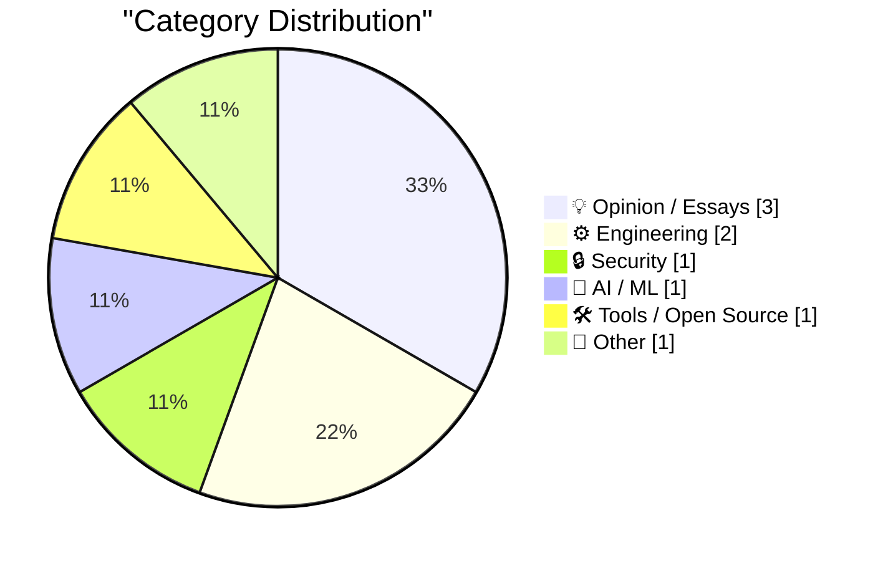
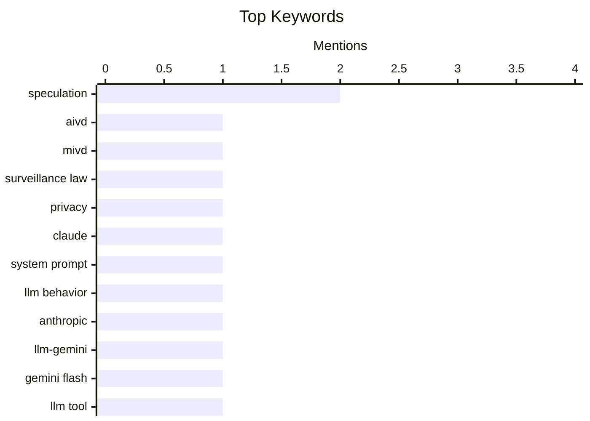

## Today's Highlights
Today's tech headlines reveal a dual focus on artificial intelligence, with new tools driving development while ethical controls are tightened to manage AI behavior. Concurrently, digital security and internet governance are paramount, highlighted by new intelligence legislation and evolving web standards. This comes as core tech platforms continue to innovate, and the influence of prominent tech figures sparks ongoing debate.
---
## Must Read Today
1. **De nieuwe AIVD/MIVD wet: een eerste overzicht**
[De nieuwe AIVD/MIVD wet: een eerste overzicht](https://berthub.eu/articles/posts/de-wiv-202x/) — berthub.eu · 2h ago · 🔒 Security
> This article critically reviews a new proposed Dutch intelligence law (AIVD/MIVD wet) that aims to significantly expand the powers of intelligence services. The author argues that the new legislation grants more extensive authorities with substantially less oversight compared to existing laws. It is characterized as a total erosion of the rule of law by services perceived as detached from society and lacking self-reflection. The article concludes that the proposed law represents a concerning expansion of state surveillance powers with insufficient democratic control.
💡 **Why read it**: It provides a critical first overview of a proposed Dutch intelligence law, highlighting concerns about expanded powers and reduced oversight.
🏷️ AIVD, MIVD, surveillance law, privacy
2. **Claude's new system prompt really doesn't want to reproduce song lyrics**
[Claude's new system prompt really doesn't want to reproduce song lyrics](https://simonwillison.net/2026/Sep/2/claudes-new-system-prompt/) — simonwillison.net · 23h ago · 🤖 AI / ML
> Anthropic has updated the system prompts for its Claude AI consumer applications (Claude.ai and mobile apps) to specifically prevent the reproduction of song lyrics. Anthropic transparently publishes these system prompts, including historical changes, allowing observation of their evolution. The latest update includes a strong directive within the prompt to avoid generating copyrighted content like song lyrics. This reflects ongoing efforts to mitigate legal risks associated with AI-generated content. This transparency allows users to observe how AI models are being constrained to address issues like copyright infringement.
💡 **Why read it**: It highlights how AI developers like Anthropic are using system prompts to control model behavior, specifically to avoid copyright infringement by not reproducing song lyrics.
🏷️ Claude, system prompt, LLM behavior, Anthropic
3. **llm-gemini 0.34**
[llm-gemini 0.34](https://simonwillison.net/2026/Sep/2/llm-gemini/) — simonwillison.net · 21h ago · 🛠 Tools / Open Source
> This article announces the release of `llm-gemini` version 0.34, an update to a tool for interacting with Google's Gemini models. Version 0.34 introduces support for the new `gemini-3.8-flash` model, which offers low, medium, and high "thinking levels." Additionally, the update fixes a bug where async responses failed to record the resolved model. This enhancement improves the `llm-gemini` tool by integrating a new, more efficient model and enhancing its reliability for asynchronous operations.
💡 **Why read it**: It details a specific software update, `llm-gemini 0.34`, which adds support for the `gemini-3.8-flash` model and fixes an async response recording bug.
🏷️ llm-gemini, Gemini Flash, LLM tool, release
---
## Data Overview
| Sources Scanned | Articles Fetched | Time Window | Selected |
|:---:|:---:|:---:|:---:|
| 88/92 | 2622 -> 9 | 24h | **9** |
### Category Distribution

### Top Keywords

<details>
<summary>Plain Text Keyword Chart (Terminal Friendly)</summary>
```
speculation      │ ████████████████████ 2
aivd             │ ██████████░░░░░░░░░░ 1
mivd             │ ██████████░░░░░░░░░░ 1
surveillance law │ ██████████░░░░░░░░░░ 1
privacy          │ ██████████░░░░░░░░░░ 1
claude           │ ██████████░░░░░░░░░░ 1
system prompt    │ ██████████░░░░░░░░░░ 1
llm behavior     │ ██████████░░░░░░░░░░ 1
anthropic        │ ██████████░░░░░░░░░░ 1
llm-gemini       │ ██████████░░░░░░░░░░ 1
```
</details>
### Topic Tags
**speculation**(2) · **aivd**(1) · **mivd**(1) · surveillance law(1) · privacy(1) · claude(1) · system prompt(1) · llm behavior(1) · anthropic(1) · llm-gemini(1) · gemini flash(1) · llm tool(1) · release(1) · elon musk(1) · ai predictions(1) · media(1) · gary marcus(1) · http signatures(1) · activitypub(1) · fediverse(1)
---
## Opinion / Essays
### 1. Elon Musk is on a prediction rampage, and most of the media can’t seem to figure out what to do about it.
[Elon Musk is on a prediction rampage, and most of the media can’t seem to figure out what to do about it.](https://garymarcus.substack.com/p/elon-musk-is-on-a-prediction-rampage) — **garymarcus.substack.com** · 17h ago · ⭐ 23/30
> The article addresses Elon Musk's frequent and often unsubstantiated predictions, and the media's struggle to appropriately cover them. Gary Marcus criticizes Musk's "prediction rampage," implying a lack of accountability or critical analysis from many media outlets. The article suggests that this phenomenon is not isolated to Musk, indicating a broader issue with how public figures' speculative claims are reported. It raises concerns about the media's role in amplifying unverified predictions from influential figures, potentially misleading the public.
🏷️ Elon Musk, AI predictions, media, Gary Marcus
---
### 2. Second Quest
[Second Quest](https://feed.tedium.co/link/15204/17438215/mapquest-unexpected-revival) — **tedium.co** · 10h ago · ⭐ 14/30
> The article observes an unexpected "cultural revival" of MapQuest in 2026, despite its age and perceived obsolescence. It highlights the unusual nature of a "gray-haired" company like MapQuest experiencing a resurgence in contemporary culture. The author suggests this revival is contrary to "normal culture," implying a shift in user preferences or nostalgia. The article points to an intriguing phenomenon where an older technology platform is regaining relevance in an unexpected way.
🏷️ MapQuest, tech history, cultural revival, speculation
---
### 3. Pluralistic: Preparing for a post-Trump internet (03 Sep 2026)
[Pluralistic: Preparing for a post-Trump internet (03 Sep 2026)](https://pluralistic.net/2026/09/03/broken-arrows/) — **pluralistic.net** · 5h ago · ⭐ 9/30
> This article, titled "Preparing for a post-Trump internet," discusses the potential future landscape of the internet, particularly in a post-Trump political era. The author suggests that a "post-Trump internet" might also necessitate a "post-American internet," implying significant geopolitical shifts in internet governance and control. Other topics mentioned include "Barnum and Bailey v journalism," Wired's Wikipedia article, Singapore's national wifi, and Twitter arguments, indicating a broader commentary on media, information, and digital infrastructure. The article prompts readers to consider profound changes in the internet's structure and control, extending beyond immediate political figures to global power dynamics.
🏷️ internet policy, post-Trump, speculation, politics
---
## Engineering
### 4. A reasonably practical guide to validating RFC 9421 HTTP Signatures for ActivityPub in PHP
[A reasonably practical guide to validating RFC 9421 HTTP Signatures for ActivityPub in PHP](https://shkspr.mobi/blog/2026/09/a-reasonably-practical-guide-to-validating-rfc-9421-http-signatures-for-activitypub-in-php/) — **shkspr.mobi** · 2h ago · ⭐ 21/30
> This article provides a practical guide for validating RFC 9421 HTTP Signatures, specifically those used by Mastodon and other Fediverse servers for ActivityPub, using PHP. It acknowledges the difficulty in parsing and deciphering these new signatures. The guide offers a basic, albeit incomplete, implementation that has been tested with signatures observed "in the wild." This resource serves as a starting point for PHP developers to implement HTTP Signature validation for ActivityPub, despite potential edge cases.
🏷️ HTTP Signatures, ActivityPub, Fediverse, PHP
---
### 5. iOS 27 Introduces New ‘iPhone Handoff’ Feature
[iOS 27 Introduces New ‘iPhone Handoff’ Feature](https://www.macrumors.com/2026/09/02/ios-27-iphone-handoff-feature/) — **daringfireball.net** · 17h ago · ⭐ 11/30
> iOS 27 introduces a new "iPhone Handoff" feature designed to seamlessly switch between multiple iPhones using the same phone number. Users can set up a main and companion iPhone via the Settings app under the Cellular menu. The main eSIM remains on the primary device, while the companion iPhone receives a companion eSIM. This setup enables users to switch between devices while maintaining a single phone number. This feature enhances multi-device usability for iPhone users by simplifying the management of a single phone number across different handsets.
🏷️ iOS, iPhone Handoff, eSIM, Apple
---
## Security
### 6. De nieuwe AIVD/MIVD wet: een eerste overzicht
[De nieuwe AIVD/MIVD wet: een eerste overzicht](https://berthub.eu/articles/posts/de-wiv-202x/) — **berthub.eu** · 2h ago · ⭐ 25/30
> This article critically reviews a new proposed Dutch intelligence law (AIVD/MIVD wet) that aims to significantly expand the powers of intelligence services. The author argues that the new legislation grants more extensive authorities with substantially less oversight compared to existing laws. It is characterized as a total erosion of the rule of law by services perceived as detached from society and lacking self-reflection. The article concludes that the proposed law represents a concerning expansion of state surveillance powers with insufficient democratic control.
🏷️ AIVD, MIVD, surveillance law, privacy
---
## AI / ML
### 7. Claude's new system prompt really doesn't want to reproduce song lyrics
[Claude's new system prompt really doesn't want to reproduce song lyrics](https://simonwillison.net/2026/Sep/2/claudes-new-system-prompt/) — **simonwillison.net** · 23h ago · ⭐ 24/30
> Anthropic has updated the system prompts for its Claude AI consumer applications (Claude.ai and mobile apps) to specifically prevent the reproduction of song lyrics. Anthropic transparently publishes these system prompts, including historical changes, allowing observation of their evolution. The latest update includes a strong directive within the prompt to avoid generating copyrighted content like song lyrics. This reflects ongoing efforts to mitigate legal risks associated with AI-generated content. This transparency allows users to observe how AI models are being constrained to address issues like copyright infringement.
🏷️ Claude, system prompt, LLM behavior, Anthropic
---
## Tools / Open Source
### 8. llm-gemini 0.34
[llm-gemini 0.34](https://simonwillison.net/2026/Sep/2/llm-gemini/) — **simonwillison.net** · 21h ago · ⭐ 23/30
> This article announces the release of `llm-gemini` version 0.34, an update to a tool for interacting with Google's Gemini models. Version 0.34 introduces support for the new `gemini-3.8-flash` model, which offers low, medium, and high "thinking levels." Additionally, the update fixes a bug where async responses failed to record the resolved model. This enhancement improves the `llm-gemini` tool by integrating a new, more efficient model and enhancing its reliability for asynchronous operations.
🏷️ llm-gemini, Gemini Flash, LLM tool, release
---
## Other
### 9. Microsoft 6502 Basic released as open source Sept 3, 2025
[Microsoft 6502 Basic released as open source Sept 3, 2025](https://dfarq.homeip.net/microsoft-6502-basic-released-as-open-source-sept-3-2025/?utm_source=rss&#038;utm_medium=rss&#038;utm_campaign=microsoft-6502-basic-released-as-open-source-sept-3-2025) — **dfarq.homeip.net** · 3h ago · ⭐ 14/30
> On September 3, 2025, Microsoft released version 1.1 of its 6502 Basic as open source. This specific code formed the foundational basis for iconic systems like Applesoft Basic on the Apple II series and Commodore Basic across all of Commodore's 8-bit computers. The open-sourcing makes this historically significant software accessible for study and development. The release provides valuable insight into the origins of foundational programming languages for early personal computing platforms.
🏷️ 6502 Basic, Microsoft, open source, retro computing
---
*Generated at 2026-09-03 14:01 | Scanned 88 sources -> 2622 articles -> selected 9*
*Based on the [Hacker News Popularity Contest 2025](https://refactoringenglish.com/tools/hn-popularity/) RSS source list recommended by [Andrej Karpathy](https://x.com/karpathy)*
*Produced by Dongdianr AI. Follow the same-name WeChat public account for more AI practical tips 💡*
