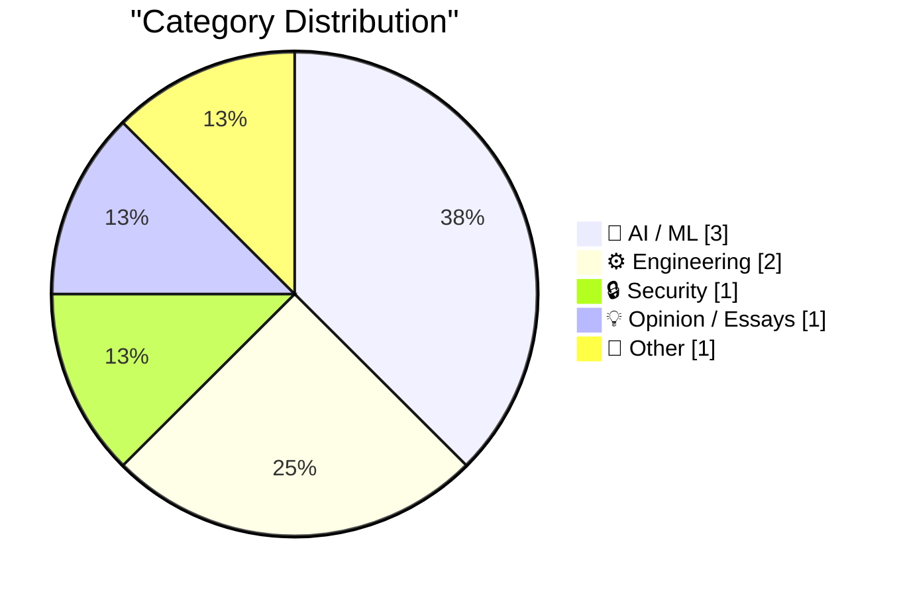
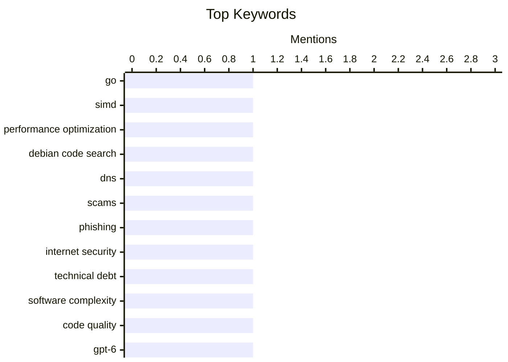

## Today's Highlights
Today's tech highlights showcase a rapid evolution in AI, with new models like GPT-6 Astra empowering developers and practical integrations bringing AI coding agents to creative platforms such as Blender. Underlying this innovation, core engineering efforts continue to push performance boundaries, exemplified by Debian Code Search's Go SIMD optimizations, while grappling with the inherent challenges of software quality. These advancements are set against a backdrop of critical scrutiny, from provocative claims about DNS vulnerabilities enabling scams to broader societal reflections on comfort and increasing pressure for accountability.
---
## Must Read Today
1. **Debian Code Search: Fast TurboPFor with Go SIMD**
[Debian Code Search: Fast TurboPFor with Go SIMD](https://michael.stapelberg.ch/posts/2026-09-06-dcs-fast-turbopfor-go-simd/) — michael.stapelberg.ch · 7h ago · ⚙️ Engineering
> Debian Code Search (DCS) previously relied on CGo for its TurboPFor integer compression codec, a performance bottleneck and dependency challenge. The author successfully eliminated the last CGo dependency by reimplementing TurboPFor in Go, leveraging Go's recently introduced SIMD support. This new Go implementation, utilizing AVX512 instructions, proved more efficient than the reference C version. This achievement significantly streamlines DCS's codebase and enhances its performance. Go's SIMD capabilities now enable high-performance, CGo-free implementations of critical components, benefiting projects like Debian Code Search.
💡 **Why read it**: It demonstrates how Go's new SIMD support can replace CGo for performance-critical integer compression, offering a practical example for Go developers.
🏷️ Go, SIMD, performance optimization, Debian Code Search
2. **The purpose of DNS is to spread scams**
[The purpose of DNS is to spread scams](https://shkspr.mobi/blog/2026/09/the-purpose-of-dns-is-to-spread-scams/) — shkspr.mobi · 2h ago · 🔒 Security
> The article provocatively argues that DNS, while foundational for the internet, inadvertently serves as a primary vector for spreading scams. Scammers exploit the ease of DNS domain registration to create deceptive URLs, such as "Genuine-Tax-Payment-Website.fart" or "Almost-The-Right-Acronym.ak," mimicking legitimate services. This accessibility, combined with human susceptibility to phishing, allows malicious actors to weaponize DNS for widespread fraud. Despite its essential role, DNS's inherent design, particularly the ease of domain creation, makes it a significant enabler for online scams and phishing attempts.
💡 **Why read it**: It offers a thought-provoking, albeit cynical, perspective on how a fundamental internet technology like DNS is exploited by scammers, highlighting a critical cybersecurity challenge.
🏷️ DNS, scams, phishing, internet security
3. **Quoting Zach Kehs**
[Quoting Zach Kehs](https://simonwillison.net/2026/Sep/6/zach-kehs/) — simonwillison.net · 5h ago · ⚙️ Engineering
> The article quotes Zach Kehs on the unique and unbounded capacity for software quality to degrade, contrasting it with physical structures. Kehs states that unlike a building that collapses if floors are added forever, software faces no such constraint. Code can "always get worse" through new layers of indirection or reductions in performance, accumulating complexity and inefficiency indefinitely. This highlights the distinct challenge in software development where quality degradation can occur without a natural breaking point. Software's abstract nature allows for continuous decline, emphasizing the need for constant vigilance against increasing complexity.
💡 **Why read it**: It provides a concise, memorable analogy from Zach Kehs about the unique and often overlooked problem of software's unbounded capacity for degradation.
🏷️ technical debt, software complexity, code quality
---
## Data Overview
| Sources Scanned | Articles Fetched | Time Window | Selected |
|:---:|:---:|:---:|:---:|
| 88/92 | 2625 -> 8 | 24h | **8** |
### Category Distribution

### Top Keywords

<details>
<summary>Plain Text Keyword Chart (Terminal Friendly)</summary>
```
go                       │ ████████████████████ 1
simd                     │ ████████████████████ 1
performance optimization │ ████████████████████ 1
debian code search       │ ████████████████████ 1
dns                      │ ████████████████████ 1
scams                    │ ████████████████████ 1
phishing                 │ ████████████████████ 1
internet security        │ ████████████████████ 1
technical debt           │ ████████████████████ 1
software complexity      │ ████████████████████ 1
```
</details>
### Topic Tags
**go**(1) · **simd**(1) · **performance optimization**(1) · debian code search(1) · dns(1) · scams(1) · phishing(1) · internet security(1) · technical debt(1) · software complexity(1) · code quality(1) · gpt-6(1) · ai(1) · prank(1) · viral video(1) · blender(1) · coding agents(1) · llms(1) · macos(1) · social media(1)
---
## AI / ML
### 1. Introducing GPT-6 Astra for developers
[Introducing GPT-6 Astra for developers](https://simonwillison.net/2026/Sep/5/introducing-gpt-6-astra-for-developers/) — **simonwillison.net** · 14h ago · ⭐ 21/30
> The article introduces "GPT-6 Astra for developers," highlighting its advanced capabilities, particularly in 3D model generation. GPT-6 Astra is presented as having enhanced attention to detail, a better understanding of user prompts, and the ability to produce more sophisticated outputs. A notable feature is its excellence in building "incredible" 3D models, as demonstrated in a linked video where a familiar creature appears at the 1m59s mark. This new iteration represents a significant leap in AI capabilities for developers, especially in complex tasks like 3D model creation.
🏷️ GPT-6, AI, prank, viral video
---
### 2. Using Blender with coding agents on macOS
[Using Blender with coding agents on macOS](https://simonwillison.net/2026/Sep/5/blender-coding-agents-macos/) — **simonwillison.net** · 22h ago · ⭐ 21/30
> The article describes a straightforward method for integrating Blender with AI coding agents like ChatGPT Codex on macOS for generative art and 3D scene creation. The technical approach involves installing the full Blender application from blender.org. Users then provide a prompt within the coding agent, such as "Use the already installed /Applications/Blender to render a scene of a pelican," allowing the agent to directly interact with the local Blender installation. This integration enables powerful generative capabilities for 3D rendering and scene creation. The process is presented as an easy "Today I Learned" tip.
🏷️ Blender, coding agents, LLMs, macOS
---
### 3. Proof of the rank-trace theorem
[Proof of the rank-trace theorem](https://www.johndcook.com/blog/2026/09/05/proof-of-the-rank-trace-theorem/) — **johndcook.com** · 20h ago · ⭐ 18/30
> This article provides a concise proof of the rank-trace theorem for real symmetric matrices, following a previous post discussing its motivation and application. The rank-trace inequality states that the rank of a real symmetric matrix A is less than or equal to its trace (the sum of its diagonal elements). The proof, described as "terse," relies fundamentally on the property of diagonalizing the real symmetric matrix A. By diagonalizing A, the relationship between its rank and trace becomes evident. The article concludes that the rank-trace theorem for real symmetric matrices can be elegantly proven through matrix diagonalization.
🏷️ linear algebra, rank-trace theorem, mathematical proof
---
## Engineering
### 4. Debian Code Search: Fast TurboPFor with Go SIMD
[Debian Code Search: Fast TurboPFor with Go SIMD](https://michael.stapelberg.ch/posts/2026-09-06-dcs-fast-turbopfor-go-simd/) — **michael.stapelberg.ch** · 7h ago · ⭐ 28/30
> Debian Code Search (DCS) previously relied on CGo for its TurboPFor integer compression codec, a performance bottleneck and dependency challenge. The author successfully eliminated the last CGo dependency by reimplementing TurboPFor in Go, leveraging Go's recently introduced SIMD support. This new Go implementation, utilizing AVX512 instructions, proved more efficient than the reference C version. This achievement significantly streamlines DCS's codebase and enhances its performance. Go's SIMD capabilities now enable high-performance, CGo-free implementations of critical components, benefiting projects like Debian Code Search.
🏷️ Go, SIMD, performance optimization, Debian Code Search
---
### 5. Quoting Zach Kehs
[Quoting Zach Kehs](https://simonwillison.net/2026/Sep/6/zach-kehs/) — **simonwillison.net** · 5h ago · ⭐ 21/30
> The article quotes Zach Kehs on the unique and unbounded capacity for software quality to degrade, contrasting it with physical structures. Kehs states that unlike a building that collapses if floors are added forever, software faces no such constraint. Code can "always get worse" through new layers of indirection or reductions in performance, accumulating complexity and inefficiency indefinitely. This highlights the distinct challenge in software development where quality degradation can occur without a natural breaking point. Software's abstract nature allows for continuous decline, emphasizing the need for constant vigilance against increasing complexity.
🏷️ technical debt, software complexity, code quality
---
## Security
### 6. The purpose of DNS is to spread scams
[The purpose of DNS is to spread scams](https://shkspr.mobi/blog/2026/09/the-purpose-of-dns-is-to-spread-scams/) — **shkspr.mobi** · 2h ago · ⭐ 25/30
> The article provocatively argues that DNS, while foundational for the internet, inadvertently serves as a primary vector for spreading scams. Scammers exploit the ease of DNS domain registration to create deceptive URLs, such as "Genuine-Tax-Payment-Website.fart" or "Almost-The-Right-Acronym.ak," mimicking legitimate services. This accessibility, combined with human susceptibility to phishing, allows malicious actors to weaponize DNS for widespread fraud. Despite its essential role, DNS's inherent design, particularly the ease of domain creation, makes it a significant enabler for online scams and phishing attempts.
🏷️ DNS, scams, phishing, internet security
---
## Opinion / Essays
### 7. ‘Bob and Van’
[‘Bob and Van’](https://marco.org/2026/09/04/bob-and-van) — **daringfireball.net** · 21h ago · ⭐ 18/30
> The article reflects on a perceived decline in societal comfort and the increasing pressure to scrutinize every aspect of public life. Marco Arment expresses a sentiment that society might have been "better off before we knew everyone’s hot takes on everything." He uses the example of a town coffee shop, which was once just a place to socialize, but now might be publicly shamed due to an owner's controversial views. This constant availability of public opinions and scrutiny, he argues, erodes the ability to enjoy simple, everyday experiences without moral or social judgment. The piece suggests a loss of innocent enjoyment in public spaces.
🏷️ social media, public discourse, online culture
---
## Other
### 8. Gloria Steinem’s Final Essay
[Gloria Steinem’s Final Essay](https://www.newyorker.com/culture/life-and-letters/gloria-steinems-final-essay?cndid=66114350) — **daringfireball.net** · 18h ago · ⭐ 14/30
> The article quotes Gloria Steinem's posthumous essay for The New Yorker, where she defines feminism and discusses alternative terminology. Steinem states that for her, feminism has always meant believing in "the social, economic, and political equality of all males and females of all races and groups," acknowledging that equality remains an exception. She considers "egalitarianism" or "humanism" as potential alternatives but notes humanism's frequent misinterpretation as anti-religion, making it less inclusive. Steinem's essay reaffirms feminism's core tenet of universal equality while exploring the nuances and challenges of terminology. This final essay offers a profound reflection on the movement's enduring principles.
🏷️ feminism, equality, Gloria Steinem
---
*Generated at 2026-09-06 14:01 | Scanned 88 sources -> 2625 articles -> selected 8*
*Based on the [Hacker News Popularity Contest 2025](https://refactoringenglish.com/tools/hn-popularity/) RSS source list recommended by [Andrej Karpathy](https://x.com/karpathy)*
*Produced by Dongdianr AI. Follow the same-name WeChat public account for more AI practical tips 💡*
