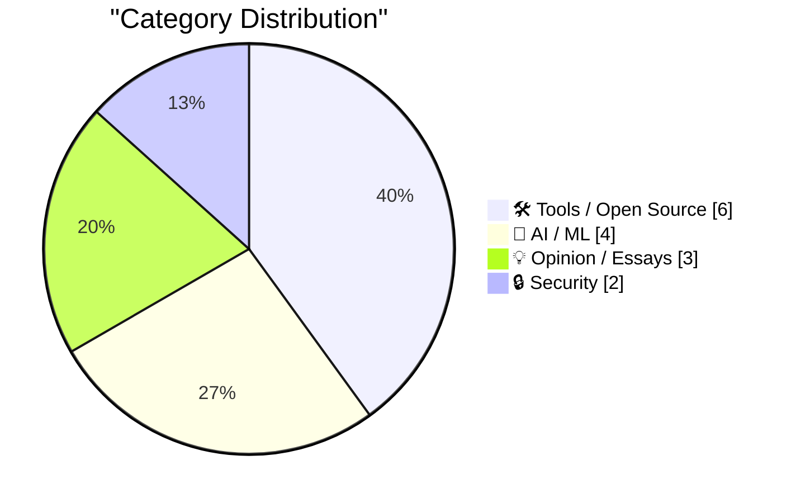
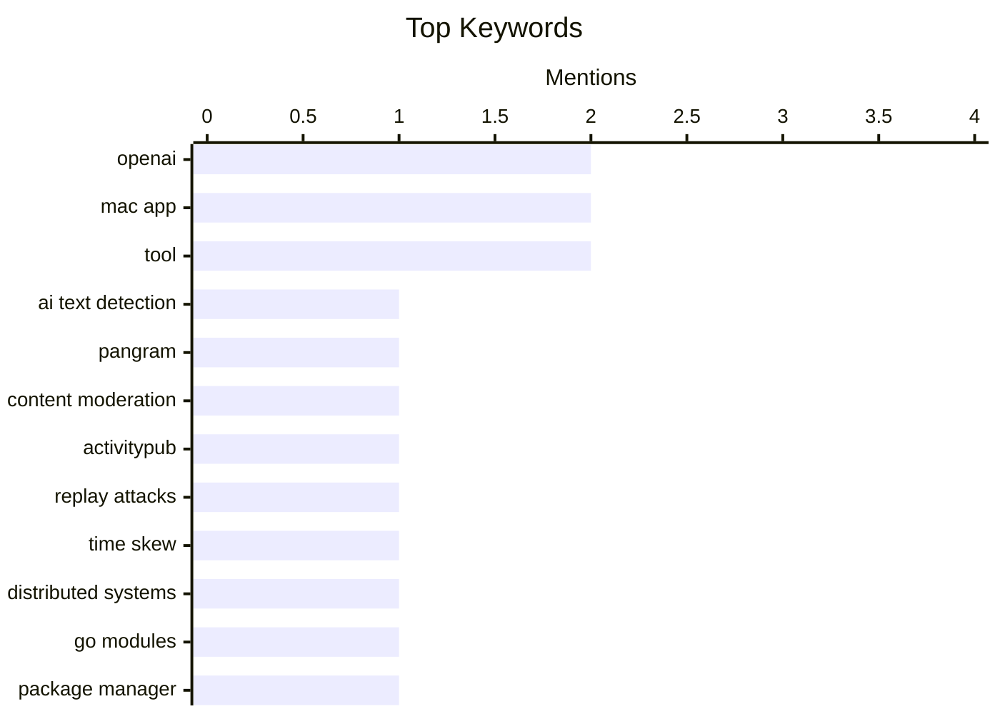

## Today's Highlights
Today's tech landscape is dominated by advancements and challenges in artificial intelligence, with new tools like llm 0.35 emerging alongside a critical need for AI-driven defensive systems and effective AI text detection. Security remains a paramount concern, as developers grapple with protecting distributed systems from replay attacks and mitigating the severe impact of abusive web crawlers. Meanwhile, new developer tools like git-pkgs updates and the McKinley 1.0 Mac app aim to streamline creation and editing workflows.
---
## Must Read Today
1. **Automatically detecting AI text in my browser**
[Automatically detecting AI text in my browser](https://seangoedecke.com/deckard/) — seangoedecke.com · 14h ago · 🤖 AI / ML
> The niche for automated AI text detection is underserved, with only Pangram being a prominent solution. The author developed "Deckard," a browser extension that uses a local, quantized Llama 3 8B model to detect AI-generated text. It operates entirely client-side, sending no data to external servers, and can process text in under 100ms on an M2 MacBook Air. Deckard aims to provide a privacy-preserving, fast alternative to existing services. This project demonstrates the feasibility and benefits of local, privacy-focused AI text detection directly within the browser, offering a competitive alternative to server-side solutions.
💡 **Why read it**: This article is worth reading for its practical demonstration of client-side AI text detection using local LLMs, highlighting privacy and performance benefits.
🏷️ AI text detection, Pangram, content moderation
2. **ActivityPub - Is it worth defending against replay attacks and message/signature time skew?**
[ActivityPub - Is it worth defending against replay attacks and message/signature time skew?](https://shkspr.mobi/blog/2026/09/activitypub-is-it-worth-defending-against-replay-attacks-and-message-signature-time-skew/) — shkspr.mobi · 2h ago · 🔒 Security
> The author's ActivityPub server, ActivityBot, sometimes receives messages sent months ago, raising concerns about replay attacks and message/signature time skew. The article explores causes like server downtime and assesses risks, arguing that for typical ActivityPub content (public posts, likes, follows), replay attacks are not a significant threat as content is often idempotent or publicly visible. While signatures have expiration dates, the author suggests the cost of implementing robust replay attack defenses (e.g., nonce tracking, strict timestamp checks) outweighs the minimal security benefit. For most ActivityPub implementations, the effort to defend against replay attacks and strict time skew is likely not worth it due to low risk and high implementation complexity.
💡 **Why read it**: This article offers a pragmatic security analysis for ActivityPub developers, questioning the necessity of complex replay attack defenses for common use cases.
🏷️ ActivityPub, Replay attacks, Time skew, Distributed systems
3. **What’s new in git-pkgs**
[What’s new in git-pkgs](https://nesbitt.io/2026/09/08/whats-new-in-git-pkgs.html) — nesbitt.io · 5h ago · 🛠 Tools / Open Source
> The article announces updates to `git-pkgs`, a collection of small Go modules designed for building package-manager tooling. The latest release introduces `git-pkgs/git-pkg`, a new module that provides a `Pkg` type representing a Git repository as a package. This `Pkg` type includes methods for fetching, checking out, and interacting with Git repositories, simplifying package management operations. It also integrates with `git-pkgs/git-url` for robust URL parsing and `git-pkgs/git-ref` for handling Git references. The `git-pkgs` update, particularly the new `git-pkg` module, streamlines the development of package managers by offering a structured, Go-native way to interact with Git repositories as packages.
💡 **Why read it**: This article is valuable for Go developers interested in building package management tools, providing insights into a new module designed to simplify Git repository interactions.
🏷️ Go modules, Package manager, Tooling, git-pkgs
---
## Data Overview
| Sources Scanned | Articles Fetched | Time Window | Selected |
|:---:|:---:|:---:|:---:|
| 87/92 | 2598 -> 19 | 24h | **15** |
### Category Distribution

### Top Keywords

<details>
<summary>Plain Text Keyword Chart (Terminal Friendly)</summary>
```
openai              │ ████████████████████ 2
mac app             │ ████████████████████ 2
tool                │ ████████████████████ 2
ai text detection   │ ██████████░░░░░░░░░░ 1
pangram             │ ██████████░░░░░░░░░░ 1
content moderation  │ ██████████░░░░░░░░░░ 1
activitypub         │ ██████████░░░░░░░░░░ 1
replay attacks      │ ██████████░░░░░░░░░░ 1
time skew           │ ██████████░░░░░░░░░░ 1
distributed systems │ ██████████░░░░░░░░░░ 1
```
</details>
### Topic Tags
**openai**(2) · **mac app**(2) · **tool**(2) · ai text detection(1) · pangram(1) · content moderation(1) · activitypub(1) · replay attacks(1) · time skew(1) · distributed systems(1) · go modules(1) · package manager(1) · tooling(1) · git-pkgs(1) · ai safety(1) · ai defense(1) · alignment(1) · llm(1) · gpt-6-astra(1) · release(1)
---
## Tools / Open Source
### 1. What’s new in git-pkgs
[What’s new in git-pkgs](https://nesbitt.io/2026/09/08/whats-new-in-git-pkgs.html) — **nesbitt.io** · 5h ago · ⭐ 26/30
> The article announces updates to `git-pkgs`, a collection of small Go modules designed for building package-manager tooling. The latest release introduces `git-pkgs/git-pkg`, a new module that provides a `Pkg` type representing a Git repository as a package. This `Pkg` type includes methods for fetching, checking out, and interacting with Git repositories, simplifying package management operations. It also integrates with `git-pkgs/git-url` for robust URL parsing and `git-pkgs/git-ref` for handling Git references. The `git-pkgs` update, particularly the new `git-pkg` module, streamlines the development of package managers by offering a structured, Go-native way to interact with Git repositories as packages.
🏷️ Go modules, Package manager, Tooling, git-pkgs
---
### 2. McKinley 1.0
[McKinley 1.0](https://mckinleysymbols.com/) — **daringfireball.net** · 18h ago · ⭐ 20/30
> The article announces McKinley 1.0, a new Mac app designed to streamline the creation and editing of custom SF Symbols, addressing the need for a dedicated, powerful tool. McKinley is an all-in-one studio that bundles vector tools with specific knowledge of the SF Symbols structure. It allows users to edit objects across multiple weights, sizes, and colors simultaneously. Users can import SVG files or start from scratch, live preview their work using Apple's own renderer, and export directly to Xcode, eliminating the need for Apple's native SF Symbols app. McKinley 1.0 offers a comprehensive and efficient workflow for designers and developers to create and manage custom SF Symbols, integrating seamlessly with Xcode.
🏷️ McKinley, SF Symbols, Mac app, UI design
---
### 3. Video compressor
[Video compressor](https://simonwillison.net/2026/Sep/7/video-compressor/) — **simonwillison.net** · 19h ago · ⭐ 19/30
> This article addresses the need for an optimized video compression tool for web publishing. Simon Willison utilized Claude Fable 5.1 in Claude Code for web to develop a video compressor tool. This tool leverages WebAssembly to perform FFMPEG-based video optimization directly within the browser. The main conclusion is that AI-assisted development can rapidly create practical web-based tools for common tasks like video compression, utilizing powerful underlying technologies such as FFMPEG and WebAssembly.
🏷️ video compressor, tool, optimization
---
### 4. [Sponsor] Glyphs 4
[[Sponsor] Glyphs 4](https://glyphsapp.com/) — **daringfireball.net** · 15h ago · ⭐ 19/30
> This article introduces Glyphs 4, a Mac-native application designed for professional font, lettering, icon, and pictogram creation. The app features flexible stroke drawing, efficient shape reuse across extensive glyph sets, and complex higher-order interpolation for variable vector designs. It facilitates building and managing massive font families and icon sets, supporting export to all modern font formats, SVG, PNG, and PDF, alongside hundreds of refinements and native Tahoe support. Glyphs 4 provides a powerful and refined toolset for professional type designers and illustrators, streamlining the creation and management of diverse vector assets on macOS.
🏷️ Glyphs 4, font creation, Mac app, design
---
### 5. Trackables 1.5
[Trackables 1.5](https://trackables.app/) — **daringfireball.net** · 16h ago · ⭐ 19/30
> This article addresses the common issues of bloat, subscription models, and data harvesting prevalent in many health tracking apps. Trackables offers a simpler, private, and completely free alternative, developed by a small team of ex-Apple employees. It transparently displays health data—including activity, sleep, steps, and heart rate—collected by the Apple Watch through a clear and friendly interface. The main conclusion is that Trackables provides a user-friendly, privacy-focused, and free health tracking experience by leveraging Apple Watch data without the typical drawbacks of other apps.
🏷️ Trackables, health tracking, Apple Watch
---
### 6. Mercator ↔ Equal Earth
[Mercator ↔ Equal Earth](https://simonwillison.net/2026/Sep/7/equal-earth/) — **simonwillison.net** · 21h ago · ⭐ 16/30
> This article focuses on visualizing and understanding the differences between the Mercator and Equal Earth map projections. Simon Willison used GPT-6 Astra (medium) in ChatGPT Work to build a tool that animates the transition between these two projections. This development was prompted by the UN's recent vote on the Equal Earth projection. The main conclusion is that AI-powered development can effectively create interactive visualization tools to explore complex geographical concepts, such as map projections, and highlight their implications.
🏷️ map projection, Mercator, Equal Earth, tool
---
## AI / ML
### 7. Automatically detecting AI text in my browser
[Automatically detecting AI text in my browser](https://seangoedecke.com/deckard/) — **seangoedecke.com** · 14h ago · ⭐ 26/30
> The niche for automated AI text detection is underserved, with only Pangram being a prominent solution. The author developed "Deckard," a browser extension that uses a local, quantized Llama 3 8B model to detect AI-generated text. It operates entirely client-side, sending no data to external servers, and can process text in under 100ms on an M2 MacBook Air. Deckard aims to provide a privacy-preserving, fast alternative to existing services. This project demonstrates the feasibility and benefits of local, privacy-focused AI text detection directly within the browser, offering a competitive alternative to server-side solutions.
🏷️ AI text detection, Pangram, content moderation
---
### 8. Quoting Jakub Pachocki
[Quoting Jakub Pachocki](https://simonwillison.net/2026/Sep/7/jakub-pachocki/) — **simonwillison.net** · 15h ago · ⭐ 25/30
> The article quotes Jakub Pachocki on the critical need for advanced AI to develop defensive systems against the dangers posed by other AI. Pachocki argues that continuing to train much smarter models quickly is essential for building "scalable defense" against potential AI threats. He emphasizes that powerful, aligned AI will be necessary to secure infrastructure, protect against rogue agents in real-time, and invent new protective measures. This defensive capability is a primary focus for OpenAI's deployment efforts. The development of highly capable, aligned AI is presented as a necessary defensive strategy to mitigate risks from other AI systems, rather than solely as a source of risk itself.
🏷️ AI safety, AI defense, alignment, OpenAI
---
### 9. llm 0.35
[llm 0.35](https://simonwillison.net/2026/Sep/7/llm/) — **simonwillison.net** · 14h ago · ⭐ 23/30
> The article announces the release of `llm` version 0.35, a tool for interacting with large language models. The main new feature in `llm 0.35` is the addition of support for the new OpenAI model, `gpt-6-astra`. This update allows users of the `llm` tool to access and utilize the capabilities of OpenAI's latest flagship model directly through the command-line interface or Python library. `llm 0.35` provides immediate access to OpenAI's `gpt-6-astra` model, keeping the tool current with the latest advancements in LLM technology.
🏷️ LLM, OpenAI, gpt-6-astra, release
---
### 10. Recursion into madness
[Recursion into madness](https://blog.coredump.cx/p/recursion-into-madness) — **lcamtuf.substack.com** · 16h ago · ⭐ 23/30
> The article title and snippet "Raymond Chandler would have loved generative AI" suggest a discussion about the nature of generative AI, possibly in relation to creative writing or its potential for complex, self-referential outputs. The article likely explores how generative AI can produce intricate, recursive, or even self-referential content, drawing a parallel to the complex narratives often found in Raymond Chandler's works. It might delve into the challenges or fascinating aspects of AI-generated text that exhibits deep, layered structures. Generative AI's capacity for complex and potentially recursive content generation presents both intriguing possibilities and challenges, reminiscent of sophisticated human creativity.
🏷️ Generative AI, AI impact, Creativity, Raymond Chandler
---
## Opinion / Essays
### 11. I found an old interview mine (2017)
[I found an old interview mine (2017)](https://idiallo.com/byte-size/interviewing-with-thatsoftware-dude) — **idiallo.com** · 14h ago · ⭐ 22/30
> The author rediscovered an old interview from 2017, reflecting on their past challenges and insights as a software engineer. The interview highlights that the author's biggest challenge wasn't coding itself, but effectively explaining their coding intentions and complex thoughts to others. This difficulty in translating internal ideas into coherent, understandable explanations for colleagues was a significant hurdle. The author notes that this challenge remains relevant even years later. Effective communication, particularly the ability to clearly articulate complex technical ideas, is a persistent and often underestimated challenge for software engineers, surpassing the difficulty of coding itself.
🏷️ Senior engineer, Interview, Communication, Coding challenges
---
### 12. Clickable whitespace
[Clickable whitespace](https://idiallo.com/blog/clickable-whitespace) — **idiallo.com** · 16h ago · ⭐ 21/30
> The author recounts a past ethical dilemma faced early in their career when asked by a lead developer to make a `div` clickable, which presented a conflict between technical simplicity and user experience/accessibility best practices. The request, while technically simple, raised concerns about creating non-standard UI elements that could confuse users, break accessibility, or lead to poor UX. The author hesitated, considering the implications of making an arbitrary `div` clickable instead of using semantically appropriate elements like buttons or links. This experience highlighted the tension between following instructions and adhering to design principles. The article underscores the importance of advocating for good user experience and accessibility, even when faced with seemingly simple technical requests that might compromise these principles.
🏷️ Workplace ethics, Career dilemmas, Developer autonomy, Moral choices
---
### 13. Matt Birchler’s Folding iPhone Predictions
[Matt Birchler’s Folding iPhone Predictions](https://birchtree.me/blog/my-folding-iphone-predictions/) — **daringfireball.net** · 18h ago · ⭐ 20/30
> This article predicts the market performance and adoption of a future folding iPhone model. The author anticipates that initial unit sales will significantly lag behind the iPhone 18 Pro, normal iPhone 18, Air 2, and 18e models, a trend expected to continue into the following year. Despite this, the folding iPhone is not projected to fail, with sales expected to increase annually for its first few years, especially if its price decreases. The main takeaway is that a folding iPhone will likely start as a niche product with steady growth, rather than a failure, though it may never become Apple's most popular iPhone model.
🏷️ Folding iPhone, Apple predictions, Consumer tech, Market analysis
---
## Security
### 14. ActivityPub - Is it worth defending against replay attacks and message/signature time skew?
[ActivityPub - Is it worth defending against replay attacks and message/signature time skew?](https://shkspr.mobi/blog/2026/09/activitypub-is-it-worth-defending-against-replay-attacks-and-message-signature-time-skew/) — **shkspr.mobi** · 2h ago · ⭐ 26/30
> The author's ActivityPub server, ActivityBot, sometimes receives messages sent months ago, raising concerns about replay attacks and message/signature time skew. The article explores causes like server downtime and assesses risks, arguing that for typical ActivityPub content (public posts, likes, follows), replay attacks are not a significant threat as content is often idempotent or publicly visible. While signatures have expiration dates, the author suggests the cost of implementing robust replay attack defenses (e.g., nonce tracking, strict timestamp checks) outweighs the minimal security benefit. For most ActivityPub implementations, the effort to defend against replay attacks and strict time skew is likely not worth it due to low risk and high implementation complexity.
🏷️ ActivityPub, Replay attacks, Time skew, Distributed systems
---
### 15. Creepy crawlies
[Creepy crawlies](https://simonwillison.net/2026/Sep/7/creepy-crawlies/) — **simonwillison.net** · 14h ago · ⭐ 20/30
> Konstantin Ryabitsev from `git.kernel.org` highlights the severe impact of abusive web crawlers on server resources, describing it as "background radiation." The article reveals that `git.kernel.org` spends more CPU cycles rendering commits for scrapers than on all other legitimate access combined, including `git clone` operations. This indicates a significant and disproportionate resource drain caused by automated bots that disregard `robots.txt` and other polite crawling conventions. The sheer volume of these "creepy crawlies" is a major operational burden. Abusive web crawlers pose a substantial and often underestimated operational challenge for public-facing services, consuming excessive resources and impacting legitimate user access.
🏷️ crawlers, git.kernel.org, abuse, security
---
*Generated at 2026-09-08 14:01 | Scanned 87 sources -> 2598 articles -> selected 15*
*Based on the [Hacker News Popularity Contest 2025](https://refactoringenglish.com/tools/hn-popularity/) RSS source list recommended by [Andrej Karpathy](https://x.com/karpathy)*
*Produced by Dongdianr AI. Follow the same-name WeChat public account for more AI practical tips 💡*
