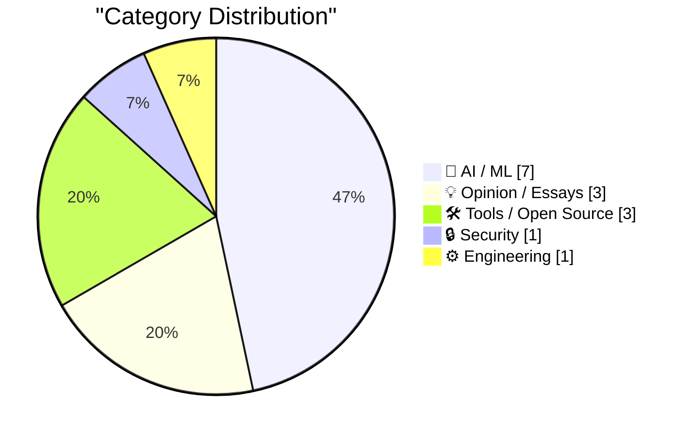
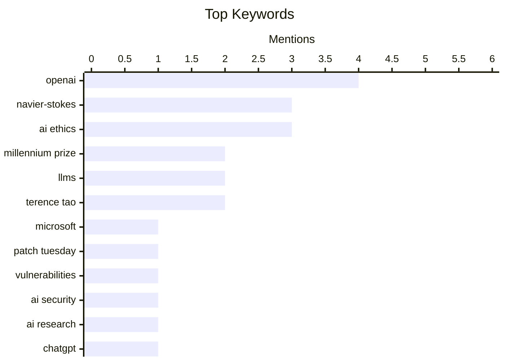

## Today's Highlights
The world of AI is abuzz with rapid advancements, as OpenAI claims a resolution to the Navier-Stokes problem and rolls out its updated ChatGPT Images 2.5, demonstrating progress largely driven by data. However, this acceleration is met with increasing scrutiny and concern. Warnings from prominent figures about AI's future implications, coupled with allegations of misconduct against OpenAI, highlight a growing call for ethical oversight amidst the breakthroughs.
---
## Must Read Today
1. **Microsoft Plugs Nearly 1,000 Security Holes**
[Microsoft Plugs Nearly 1,000 Security Holes](https://krebsonsecurity.com/2026/09/microsoft-plugs-nearly-1000-security-holes/) — krebsonsecurity.com · 16h ago · 🔒 Security
> Microsoft issued its largest-ever patch batch, addressing 974 security holes across Windows and other software. While Microsoft credits AI with speeding vulnerability discovery, security experts warn that organizations struggle to prioritize the human-intensive task of testing and deploying such a high volume of monthly fixes. The sheer scale of these updates presents significant operational challenges for many enterprises. This highlights a growing disparity between rapid vulnerability discovery and the practical capacity for deployment. Ultimately, the article suggests that while AI aids discovery, the human element of security patch management remains a critical bottleneck.
💡 **Why read it**: It highlights the growing scale of software vulnerabilities and the operational challenges organizations face in managing security updates, even with AI assistance.
🏷️ Microsoft, Patch Tuesday, vulnerabilities, AI security
2. **On the Navier–Stokes Millennium Prize Problem**
[On the Navier–Stokes Millennium Prize Problem](https://simonwillison.net/2026/Sep/8/on-navier-stokes/) — simonwillison.net · 14h ago · 🤖 AI / ML
> OpenAI has announced a resolution to the Navier–Stokes existence and smoothness problem, one of the seven Millennium Prize Problems. This significant mathematical challenge, concerning the fundamental equations of fluid dynamics, carries a $1 million prize. OpenAI reportedly utilized an unreleased model to produce this groundbreaking resolution. The achievement demonstrates the increasing capability of advanced AI models to tackle complex theoretical physics and mathematics problems. This marks a major scientific breakthrough, potentially opening new avenues for research in both AI and fluid dynamics.
💡 **Why read it**: It reports a major scientific breakthrough by OpenAI using AI to solve a long-standing Millennium Prize Problem in mathematics and physics.
🏷️ OpenAI, Navier-Stokes, Millennium Prize, AI research
3. **Introducing ChatGPT Images 2.5**
[Introducing ChatGPT Images 2.5](https://simonwillison.net/2026/Sep/8/introducing-chatgpt-images-25/) — simonwillison.net · 15h ago · 🤖 AI / ML
> OpenAI has released ChatGPT Images 2.5, an updated version of its image generation model, which has already been used to create over 3 billion images across ChatGPT Images and GPT-Image API models. This latest iteration significantly improves instruction-following ability across multiple turns and offers faster response times. Additionally, the model is better at preserving subjects in reference photos, enhancing fidelity and user control. New API model IDs, including `gpt-im`, are available for developers. This update represents a continuous refinement in AI's visual generation capabilities, focusing on user experience and output quality.
💡 **Why read it**: It details the latest advancements in OpenAI's image generation technology, highlighting specific improvements and usage scale.
🏷️ ChatGPT, image generation, OpenAI, AI models
---
## Data Overview
| Sources Scanned | Articles Fetched | Time Window | Selected |
|:---:|:---:|:---:|:---:|
| 87/92 | 2598 -> 19 | 24h | **15** |
### Category Distribution

### Top Keywords

<details>
<summary>Plain Text Keyword Chart (Terminal Friendly)</summary>
```
openai           │ ████████████████████ 4
navier-stokes    │ ███████████████░░░░░ 3
ai ethics        │ ███████████████░░░░░ 3
millennium prize │ ██████████░░░░░░░░░░ 2
llms             │ ██████████░░░░░░░░░░ 2
terence tao      │ ██████████░░░░░░░░░░ 2
microsoft        │ █████░░░░░░░░░░░░░░░ 1
patch tuesday    │ █████░░░░░░░░░░░░░░░ 1
vulnerabilities  │ █████░░░░░░░░░░░░░░░ 1
ai security      │ █████░░░░░░░░░░░░░░░ 1
```
</details>
### Topic Tags
**openai**(4) · **navier-stokes**(3) · **ai ethics**(3) · millennium prize(2) · llms(2) · terence tao(2) · microsoft(1) · patch tuesday(1) · vulnerabilities(1) · ai security(1) · ai research(1) · chatgpt(1) · image generation(1) · ai models(1) · misconduct(1) · corporate governance(1) · ai pretraining(1) · data(1) · model improvements(1) · ai safety(1)
---
## AI / ML
### 1. On the Navier–Stokes Millennium Prize Problem
[On the Navier–Stokes Millennium Prize Problem](https://simonwillison.net/2026/Sep/8/on-navier-stokes/) — **simonwillison.net** · 14h ago · ⭐ 29/30
> OpenAI has announced a resolution to the Navier–Stokes existence and smoothness problem, one of the seven Millennium Prize Problems. This significant mathematical challenge, concerning the fundamental equations of fluid dynamics, carries a $1 million prize. OpenAI reportedly utilized an unreleased model to produce this groundbreaking resolution. The achievement demonstrates the increasing capability of advanced AI models to tackle complex theoretical physics and mathematics problems. This marks a major scientific breakthrough, potentially opening new avenues for research in both AI and fluid dynamics.
🏷️ OpenAI, Navier-Stokes, Millennium Prize, AI research
---
### 2. Introducing ChatGPT Images 2.5
[Introducing ChatGPT Images 2.5](https://simonwillison.net/2026/Sep/8/introducing-chatgpt-images-25/) — **simonwillison.net** · 15h ago · ⭐ 27/30
> OpenAI has released ChatGPT Images 2.5, an updated version of its image generation model, which has already been used to create over 3 billion images across ChatGPT Images and GPT-Image API models. This latest iteration significantly improves instruction-following ability across multiple turns and offers faster response times. Additionally, the model is better at preserving subjects in reference photos, enhancing fidelity and user control. New API model IDs, including `gpt-im`, are available for developers. This update represents a continuous refinement in AI's visual generation capabilities, focusing on user experience and output quality.
🏷️ ChatGPT, image generation, OpenAI, AI models
---
### 3. OpenAI’s Egregious Pattern of Misconduct
[OpenAI’s Egregious Pattern of Misconduct](https://garymarcus.substack.com/p/openais-egregious-pattern-of-misconduct) — **garymarcus.substack.com** · 20h ago · ⭐ 27/30
> The article raises concerns about a perceived egregious pattern of misconduct by OpenAI, citing a rapid accumulation of issues. The author points to "Nine troubling new reports in seven days," indicating a concentrated period of controversial actions or disclosures. This suggests a growing scrutiny over OpenAI's operational ethics and transparency. The piece serves as a critical commentary, questioning the company's recent decisions and their broader implications. Ultimately, it calls attention to a pattern of behavior that warrants further examination and discussion within the AI community.
🏷️ OpenAI, misconduct, AI ethics, corporate governance
---
### 4. Pretraining progress is mostly coming from data
[Pretraining progress is mostly coming from data](https://www.dwarkesh.com/p/pretraining-progress-is-mostly-data) — **dwarkesh.com** · 21h ago · ⭐ 27/30
> This article analyzes the primary drivers behind the significant progress in AI pretraining over the past six years. It breaks down improvements into contributions from data versus model enhancements, concluding that the majority of pretraining progress is attributable to advancements in data. This implies that the quality, quantity, and diversity of training data have been more impactful than architectural innovations alone. The finding suggests that continued focus on data curation and scaling will be crucial for future AI development. Therefore, data is identified as the paramount factor in the rapid evolution of large language models and other AI systems.
🏷️ AI pretraining, data, model improvements, LLMs
---
### 5. Two dire warnings, one from Terence Tao, the other from someone who just quit Anthropic
[Two dire warnings, one from Terence Tao, the other from someone who just quit Anthropic](https://garymarcus.substack.com/p/two-dire-warnings-one-from-terence) — **garymarcus.substack.com** · 11h ago · ⭐ 26/30
> The article highlights two significant warnings regarding the future and implications of AI, originating from highly credible sources. One warning comes from the renowned mathematician Terence Tao, while the other is from an individual who recently resigned from Anthropic, a prominent AI research company. The piece suggests there is "Lots to consider," indicating that these warnings raise serious concerns about AI's trajectory, safety, or ethical development. This underscores growing anxieties and critical perspectives within the AI community, voiced by influential experts. Ultimately, the article serves as a call for deeper reflection on the potential risks and challenges posed by advanced AI.
🏷️ AI safety, Anthropic, Terence Tao, AI ethics
---
### 6. The part of Navier-Stokes no one is talking about
[The part of Navier-Stokes no one is talking about](https://www.johndcook.com/blog/2026/09/09/formal-method-revolution/) — **johndcook.com** · 1h ago · ⭐ 26/30
> While OpenAI's announcement of a Navier-Stokes proof generated significant buzz, this article highlights a crucial, often overlooked technical aspect of their work. OpenAI simultaneously posted a Lean 4 formal proof alongside their public announcement. This use of Lean 4, a formal verification system, ensures the mathematical rigor and correctness of the complex proof. The article emphasizes that this approach signifies a potential "formal method revolution" in mathematics, where AI-assisted proofs are rigorously validated. This demonstrates a commitment to verifiable mathematical certainty beyond the initial AI-generated solution. The formal proof is a critical component ensuring the validity of the AI's breakthrough.
🏷️ Navier-Stokes, OpenAI, Lean 4, formal proof
---
### 7. Navier-Stokes in the news
[Navier-Stokes in the news](https://www.johndcook.com/blog/2026/09/08/navier-stokes-in-the-news/) — **johndcook.com** · 22h ago · ⭐ 23/30
> The article discusses recent rumors about a potential solution to one of the Millennium Prize Problems, specifically concerning the Navier-Stokes equations, which describe fluid dynamics. It emphasizes that popular accounts of this complex mathematical problem are often oversimplified and misleading. The core issue revolves around proving the existence and smoothness of solutions for these equations, or if singularities can develop. The author cautions against premature conclusions, highlighting the technical intricacies involved. It serves as a reminder to approach such scientific breakthroughs with skepticism regarding popular media portrayals.
🏷️ Navier-Stokes, math problem, fluid dynamics, Millennium Prize
---
## Opinion / Essays
### 8. Why we should anthropomorphize AI agents
[Why we should anthropomorphize AI agents](https://seangoedecke.com/why-we-should-anthropomorphize-ai-agents/) — **seangoedecke.com** · 14h ago · ⭐ 25/30
> The article argues for the utility of anthropomorphizing AI agents, revisiting a stance previously taken regarding LLMs over a year ago. This topic has resurfaced as "a hot topic again," driven by recent events such as the OpenAI-Hugging Face incident and related discussions by Dwarkesh Patel. The author advocates that assigning human-like qualities to AI, particularly agents, can be beneficial for understanding and interacting with increasingly complex systems. This perspective challenges conventional wisdom that often advises against anthropomorphism in AI. Ultimately, the article suggests that this approach could offer a more intuitive and effective way to engage with sophisticated AI technologies.
🏷️ anthropomorphism, AI ethics, LLMs, AI agents
---
### 9. Pluralistic: Anti-vax/anti-trust (09 Sep 2026)
[Pluralistic: Anti-vax/anti-trust (09 Sep 2026)](https://pluralistic.net/2026/09/09/when-it-dont-rain/) — **pluralistic.net** · 3h ago · ⭐ 23/30
> This article is a collection of links and short commentary on various societal and technical issues, including anti-vax movements, anti-trust, and digital rights management (DRM). It touches upon topics like regulatory capture in the Copyright Office, the largest prison and general strikes, and the challenges of open licenses versus uncopyrightable subjects. Specific cases like CDT v DRM and BNL v DRM are mentioned, alongside the passing of Project Gutenberg founder Michael Hart. The collection highlights ongoing struggles against corporate power, for open access, and individual liberties across diverse domains. It serves as a curated digest offering critical perspectives on current events.
🏷️ anti-trust, copyright, open licenses, tech policy
---
### 10. Quoting Terence Tao
[Quoting Terence Tao](https://simonwillison.net/2026/Sep/9/terence-tao/) — **simonwillison.net** · 13h ago · ⭐ 22/30
> This article quotes mathematician Terence Tao, who expresses concern that the collection of "good, fruitful open problems" in mathematics is being mined in a non-renewable fashion. Tao highlights how the mere rumor of someone working on a problem can trigger a "massive amount of AI-powered effort" to solve it rapidly. This accelerated, AI-driven problem-solving risks "flattening" a problem before original human research can fully develop and reach its potential. The core issue is the changing landscape of mathematical research incentives and the impact of AI on the discovery and exploration of new problems. The rise of AI is fundamentally altering the dynamics and sustainability of open problem research.
🏷️ research problems, scarcity, innovation, Terence Tao
---
## Tools / Open Source
### 11. Better AI code comment detector
[Better AI code comment detector](https://entropicthoughts.com/better-ai-comment-classifier) — **entropicthoughts.com** · 16h ago · ⭐ 24/30
> The author rebuilt an AI code comment classifier to improve its foundation and enable public sharing, addressing limitations of a previous version. The original classifier used private data and a "shaky foundation," preventing code and data sharing. The new version is built entirely on public data and a more robust architecture, receiving positive feedback from testers. A web-based demo is available, ensuring user privacy as nothing pasted leaves the browser. This project demonstrates a commitment to open science and privacy in AI tool development. The goal is to provide a transparent, shareable, and reliable tool for code analysis.
🏷️ AI, code comments, classifier, developer tool
---
### 12. OpenNMC is an open replacement for expensive APC management cards
[OpenNMC is an open replacement for expensive APC management cards](https://www.jeffgeerling.com/blog/2026/opennmc-apc-ups-replacement-card/) — **jeffgeerling.com** · 22h ago · ⭐ 23/30
> The article introduces OpenNMC, an open-source replacement for expensive proprietary management cards found in UPS devices like the APC Smart-UPS 2200XL. UPS units are crucial for homelabs, providing safe server shutdowns during power outages and power conditioning. OpenNMC allows users to achieve these essential functions without investing in costly, vendor-locked solutions. This open-source alternative provides greater flexibility and cost savings for managing critical homelab infrastructure. Ultimately, OpenNMC empowers users with more control over their UPS systems through an accessible and community-driven approach.
🏷️ OpenNMC, APC UPS, homelab, open source
---
### 13. ★ SuperDuper 4
[★ SuperDuper 4](https://daringfireball.net/2026/09/superduper_4) — **daringfireball.net** · 23h ago · ⭐ 19/30
> This article is a brief, enthusiastic endorsement of SuperDuper 4, a software application. The author describes SuperDuper as "impossibly good software," implying a high level of satisfaction and effectiveness. While specific technical details or new features of version 4 are not elaborated upon in the provided snippet, the tone suggests it continues to deliver exceptional performance in its intended function. The core message is a strong recommendation based on the software's perceived quality and reliability. SuperDuper 4 is highly recommended for its outstanding performance and reliability.
🏷️ SuperDuper, macOS, backup, utility
---
## Security
### 14. Microsoft Plugs Nearly 1,000 Security Holes
[Microsoft Plugs Nearly 1,000 Security Holes](https://krebsonsecurity.com/2026/09/microsoft-plugs-nearly-1000-security-holes/) — **krebsonsecurity.com** · 16h ago · ⭐ 30/30
> Microsoft issued its largest-ever patch batch, addressing 974 security holes across Windows and other software. While Microsoft credits AI with speeding vulnerability discovery, security experts warn that organizations struggle to prioritize the human-intensive task of testing and deploying such a high volume of monthly fixes. The sheer scale of these updates presents significant operational challenges for many enterprises. This highlights a growing disparity between rapid vulnerability discovery and the practical capacity for deployment. Ultimately, the article suggests that while AI aids discovery, the human element of security patch management remains a critical bottleneck.
🏷️ Microsoft, Patch Tuesday, vulnerabilities, AI security
---
## Engineering
### 15. The Bulldozing of an Interface
[The Bulldozing of an Interface](https://blog.jim-nielsen.com/2026/bulldoze-ui/) — **blog.jim-nielsen.com** · 19h ago · ⭐ 20/30
> The article references Marcin Wichary's "Photoshop’s challenges with focus, pt. 2" to illustrate the difficulty of comparing interfaces using static images. It argues that the true essence of an interface lies in its interactivity and how users "interface with it," rather than its visual appearance alone. The author criticizes the common practice of "bulldozing" an existing interface to build a new one, often resulting in a loss of accumulated user experience and muscle memory. This approach frequently disregards the nuanced interactions and learned behaviors that make an interface effective, leading to frustration and reduced productivity for long-term users. Effective interface design prioritizes understanding and evolving user interaction over disruptive, wholesale redesigns.
🏷️ Interface design, UI/UX, Photoshop, focus management
---
*Generated at 2026-09-09 14:01 | Scanned 87 sources -> 2598 articles -> selected 15*
*Based on the [Hacker News Popularity Contest 2025](https://refactoringenglish.com/tools/hn-popularity/) RSS source list recommended by [Andrej Karpathy](https://x.com/karpathy)*
*Produced by Dongdianr AI. Follow the same-name WeChat public account for more AI practical tips 💡*
