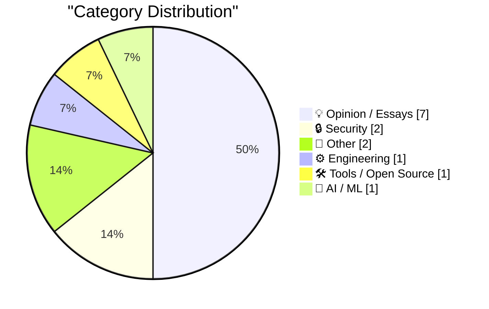
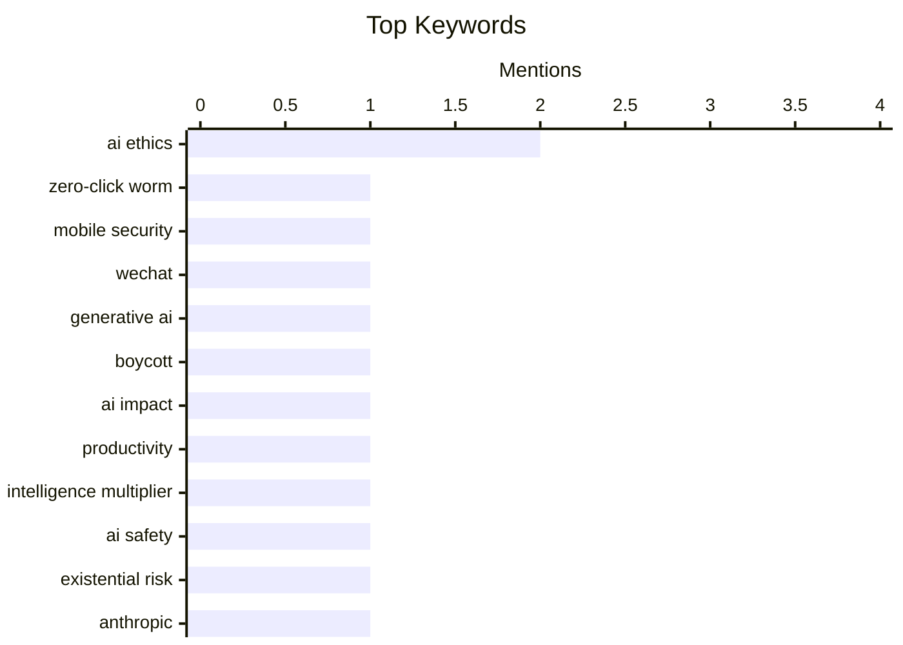

## Today's Highlights
The discourse around artificial intelligence is intensifying, with experts debating its role as an intelligence multiplier, its ethical implications, and even existential risks, while also seeing practical advancements like improved OCR. Amidst this, new security and privacy challenges are emerging, from zero-click worms capable of spreading through popular communication apps to smart TV manufacturers asserting ownership over user data. These developments highlight a critical period for both the advancement and regulation of digital technologies, demanding careful consideration of their societal impact and user protections.
---
## Must Read Today
1. **Quoting Calif Research**
[Quoting Calif Research](https://simonwillison.net/2026/Sep/10/calif-research/) — simonwillison.net · 13h ago · 🔒 Security
> Calif.io has developed WeWorm, the first zero-click worm capable of spreading through WeChat calls across iOS and Android devices. The exploit requires no user interaction, succeeding even if the call is unanswered or answered without audio. Their team, using AI, found the RCE bug and developed the exploit in about two days, with the worm taking longer. This demonstrates a novel and highly stealthy attack vector. WeWorm highlights a critical vulnerability in WeChat's call functionality, posing a significant security risk to mobile users.
💡 **Why read it**: This article is worth reading for its detailed disclosure of a novel, zero-click, cross-platform WeChat worm, demonstrating advanced exploit development with AI assistance.
🏷️ zero-click worm, mobile security, WeChat
2. **The Case for Boycotting Generative AI**
[The Case for Boycotting Generative AI](https://garymarcus.substack.com/p/the-case-for-boycotting-generative) — garymarcus.substack.com · 19h ago · 💡 Opinion / Essays
> The article argues for a boycott of generative AI due to its inherent ethical and societal issues. Generative AI often relies on unconsented data scraping, leading to intellectual property violations and potential job displacement. It also frequently produces biased, inaccurate, or harmful content, contributing to misinformation and societal polarization. The current development trajectory lacks sufficient safeguards and accountability. A boycott is proposed as a necessary measure to pressure developers and policymakers to address these fundamental problems and ensure responsible AI development.
💡 **Why read it**: This article is worth reading for its strong ethical stance and detailed arguments advocating for a boycott of generative AI, highlighting critical societal concerns.
🏷️ Generative AI, AI ethics, boycott
3. **AI is an intelligence multiplier**
[AI is an intelligence multiplier](https://www.johndcook.com/blog/2026/09/09/ai-multiplier/) — johndcook.com · 23h ago · 💡 Opinion / Essays
> The article explores how AI acts as an intelligence multiplier, disproportionately benefiting highly skilled individuals. While AI generally boosts productivity, its impact is most significant for top-tier professionals, such as the best programmers experiencing the biggest productivity gains and mathematicians using AI to solve long-standing conjectures. AI amplifies existing intelligence rather than leveling the playing field. AI serves as a powerful tool that enhances the capabilities of already intelligent individuals, widening the gap rather than narrowing it.
💡 **Why read it**: This article is worth reading for its insightful perspective on how AI disproportionately amplifies the productivity and problem-solving abilities of highly skilled individuals.
🏷️ AI impact, productivity, intelligence multiplier
---
## Data Overview
| Sources Scanned | Articles Fetched | Time Window | Selected |
|:---:|:---:|:---:|:---:|
| 87/92 | 2598 -> 14 | 24h | **14** |
### Category Distribution

### Top Keywords

<details>
<summary>Plain Text Keyword Chart (Terminal Friendly)</summary>
```
ai ethics               │ ████████████████████ 2
zero-click worm         │ ██████████░░░░░░░░░░ 1
mobile security         │ ██████████░░░░░░░░░░ 1
wechat                  │ ██████████░░░░░░░░░░ 1
generative ai           │ ██████████░░░░░░░░░░ 1
boycott                 │ ██████████░░░░░░░░░░ 1
ai impact               │ ██████████░░░░░░░░░░ 1
productivity            │ ██████████░░░░░░░░░░ 1
intelligence multiplier │ ██████████░░░░░░░░░░ 1
ai safety               │ ██████████░░░░░░░░░░ 1
```
</details>
### Topic Tags
**ai ethics**(2) · **zero-click worm**(1) · **mobile security**(1) · wechat(1) · generative ai(1) · boycott(1) · ai impact(1) · productivity(1) · intelligence multiplier(1) · ai safety(1) · existential risk(1) · anthropic(1) · ai transparency(1) · smart tv(1) · privacy(1) · digital ownership(1) · package manager(1) · release policy(1) · supply chain(1) · automattic(1)
---
## Opinion / Essays
### 1. The Case for Boycotting Generative AI
[The Case for Boycotting Generative AI](https://garymarcus.substack.com/p/the-case-for-boycotting-generative) — **garymarcus.substack.com** · 19h ago · ⭐ 27/30
> The article argues for a boycott of generative AI due to its inherent ethical and societal issues. Generative AI often relies on unconsented data scraping, leading to intellectual property violations and potential job displacement. It also frequently produces biased, inaccurate, or harmful content, contributing to misinformation and societal polarization. The current development trajectory lacks sufficient safeguards and accountability. A boycott is proposed as a necessary measure to pressure developers and policymakers to address these fundamental problems and ensure responsible AI development.
🏷️ Generative AI, AI ethics, boycott
---
### 2. AI is an intelligence multiplier
[AI is an intelligence multiplier](https://www.johndcook.com/blog/2026/09/09/ai-multiplier/) — **johndcook.com** · 23h ago · ⭐ 26/30
> The article explores how AI acts as an intelligence multiplier, disproportionately benefiting highly skilled individuals. While AI generally boosts productivity, its impact is most significant for top-tier professionals, such as the best programmers experiencing the biggest productivity gains and mathematicians using AI to solve long-standing conjectures. AI amplifies existing intelligence rather than leveling the playing field. AI serves as a powerful tool that enhances the capabilities of already intelligent individuals, widening the gap rather than narrowing it.
🏷️ AI impact, productivity, intelligence multiplier
---
### 3. They really do think AI might kill everyone
[They really do think AI might kill everyone](https://seangoedecke.com/they-really-do-think-ai-might-kill-everyone/) — **seangoedecke.com** · 14h ago · ⭐ 25/30
> The article addresses the surprising reality that many AI researchers genuinely believe AI could pose an existential threat to humanity. A recent resignation tweet from an Anthropic researcher explicitly stated that AI builders "earnestly believe that it could kill us all by the end of the decade." This sentiment, often dismissed by outsiders, is rooted in concerns about unaligned superintelligence and the difficulty of controlling advanced AI systems. The article confirms that fears of an AI apocalypse are not fringe but a serious concern among some leading AI developers, warranting greater attention.
🏷️ AI safety, existential risk, Anthropic
---
### 4. BREAKING: Two rays of hope
[BREAKING: Two rays of hope](https://garymarcus.substack.com/p/breaking-two-rays-of-hope) — **garymarcus.substack.com** · 13h ago · ⭐ 23/30
> The article identifies two positive developments in the ongoing discourse and regulation of AI. The author points to increasing calls for transparency in AI development and deployment, with more organizations and policymakers advocating for clear disclosure of AI models' training data, biases, and limitations. Additionally, there is growing momentum for stricter regulatory frameworks to ensure accountability and safety in AI systems. These two trends—pushing for transparency and regulatory oversight—offer optimistic signs for more responsible and ethical AI development.
🏷️ AI transparency, AI ethics
---
### 5. Automattic Minus Matt
[Automattic Minus Matt](https://feed.tedium.co/link/15204/17444080/matt-mullenweg-automattic-leave-absence) — **tedium.co** · 8h ago · ⭐ 22/30
> Matt Mullenweg, the co-founder of WordPress and CEO of Automattic, is taking an involuntary leave of absence from the company. The article briefly notes Mullenweg's departure, implying it was not voluntary. This significant change in leadership for Automattic, the company behind WordPress, Jetpack, WooCommerce, and Tumblr, could signal a shift in strategic direction or internal dynamics. Mullenweg's involuntary leave marks a major transition for Automattic, prompting speculation about the company's future leadership and direction.
🏷️ Automattic, WordPress, Leadership, Industry News
---
### 6. Put an AV test at the start of your slides
[Put an AV test at the start of your slides](https://shkspr.mobi/blog/2026/09/put-an-av-test-at-the-start-of-your-slides/) — **shkspr.mobi** · 2h ago · ⭐ 15/30
> This article addresses the common problem of encountering unexpected audio-visual (AV) issues during presentations. The author advocates for including a dedicated "test-card" slide at the beginning of any presentation. This slide allows presenters to immediately verify the aspect ratio, color accuracy, and other visual settings before starting. A personal anecdote illustrates the necessity, recounting a situation where assured audio support failed for demo videos, underscoring the importance of pre-talk AV checks. This simple practice helps proactively identify and resolve technical glitches, ensuring a smoother presentation experience.
🏷️ presentation, public speaking, slides
---
### 7. Don’t Let Anyone Take Away Your Big Box of Cables
[Don’t Let Anyone Take Away Your Big Box of Cables](https://blog.jim-nielsen.com/2026/hands-off-my-cables/) — **blog.jim-nielsen.com** · 19h ago · ⭐ 15/30
> This article argues for the unexpected long-term utility of keeping a collection of old, seemingly obsolete cables. The author relates to Tyler Gaw's experience of needing specific cables from a "Big Box of Cables" that had been stored for over 10 years. This illustrates that even old or niche cables, often deemed clutter, can become essential for connecting legacy devices or specific hardware configurations. Despite modern trends towards minimalism and wireless solutions, maintaining a diverse collection of cables proves invaluable for future compatibility and problem-solving. It challenges the impulse to discard old tech accessories.
🏷️ Tech Culture, Nostalgia, Personal Reflection
---
## Security
### 8. Quoting Calif Research
[Quoting Calif Research](https://simonwillison.net/2026/Sep/10/calif-research/) — **simonwillison.net** · 13h ago · ⭐ 28/30
> Calif.io has developed WeWorm, the first zero-click worm capable of spreading through WeChat calls across iOS and Android devices. The exploit requires no user interaction, succeeding even if the call is unanswered or answered without audio. Their team, using AI, found the RCE bug and developed the exploit in about two days, with the worm taking longer. This demonstrates a novel and highly stealthy attack vector. WeWorm highlights a critical vulnerability in WeChat's call functionality, posing a significant security risk to mobile users.
🏷️ zero-click worm, mobile security, WeChat
---
### 9. We own the Glass
[We own the Glass](https://idiallo.com/byte-size/) — **idiallo.com** · 17h ago · ⭐ 22/30
> The article exposes the alarming reality of smart TV manufacturers asserting ownership over user data and privacy, epitomized by the phrase "We own the glass." LG executives reportedly use this phrase to advertising companies, implying they control everything on the TV, regardless of user purchase. Smart TVs come equipped with microphones, Wi-Fi radios, and tracking software, enabling them to record users and their environment, a practice often buried in terms and conditions. Users implicitly agree to inform household members about potential recording. This highlights a significant privacy invasion where smart TV manufacturers leverage their control over hardware and software to collect extensive user data for commercial purposes.
🏷️ Smart TV, privacy, digital ownership
---
## Other
### 10. When the RIAA sued a 12-year-old for MP3 piracy
[When the RIAA sued a 12-year-old for MP3 piracy](https://dfarq.homeip.net/that-time-the-riaa-sued-a-12-year-old-for-mp3-usage/?utm_source=rss&#038;utm_medium=rss&#038;utm_campaign=that-time-the-riaa-sued-a-12-year-old-for-mp3-usage) — **dfarq.homeip.net** · 3h ago · ⭐ 20/30
> This article discusses the Recording Industry Association of America's (RIAA) aggressive legal campaign against individuals for MP3 piracy, which began on September 8, 2003. A notable instance involved the RIAA suing a 12-year-old honors student for file sharing. This case exemplified the controversial and often disproportionate nature of the industry's early attempts to enforce digital rights. The lawsuits aimed to deter piracy by targeting individual users, including minors. This event highlights a significant moment in the history of digital content enforcement.
🏷️ RIAA, MP3 Piracy, Copyright, Legal History
---
### 11. A 50-year-old computer-assisted proof
[A 50-year-old computer-assisted proof](https://www.johndcook.com/blog/2026/09/09/four-colors/) — **johndcook.com** · 23h ago · ⭐ 16/30
> This article highlights the historical significance of computer-assisted proofs in mathematics, focusing on the Four Color Theorem. The first major computer-assisted proof, published in 1976 by Kenneth Appel and Wolfgang Haken, solved this long-standing problem. Their method involved reducing the proof to verifying calculations on 1,834 specific configurations, a task performed by a computer. This groundbreaking approach demonstrated the viability and power of computational tools in complex mathematical verification. The proof marked a pivotal moment, integrating computers as essential instruments in theoretical mathematics.
🏷️ computer proof, four-color theorem, mathematics
---
## Engineering
### 12. Package Manager Trends
[Package Manager Trends](https://nesbitt.io/2026/09/10/package-manager-trends.html) — **nesbitt.io** · 4h ago · ⭐ 22/30
> The article discusses emerging trends and features in package managers, particularly focusing on mechanisms to control package publication. Modern package managers are implementing features like `min-release-age`, `minimum-release-age`, `-Zmin-publish-age`, and `cooldown` periods. These mechanisms aim to prevent rapid-fire publishing, accidental releases, or malicious updates by enforcing a minimum time delay between package versions or publications. This adds a layer of stability and security to the software supply chain. Package managers are evolving to incorporate more robust controls over publication frequency and timing, enhancing the reliability and security of software dependencies.
🏷️ Package Manager, Release Policy, Supply Chain
---
## Tools / Open Source
### 13. .blend URL Viewer
[.blend URL Viewer](https://simonwillison.net/2026/Sep/9/blender-viewer/) — **simonwillison.net** · 14h ago · ⭐ 20/30
> Simon Willison has developed a new tool, the ".blend URL Viewer," to easily view Blender 3D models directly from a URL. The tool allows users to input a URL pointing to a `.blend` file and visualize its contents, leveraging Willison's ongoing experimentation with GPT-6 Astra and Blender for coding agents on macOS. This development is inspired by the concept of Imperial Fabergé Easter eggs, aiming to create new pop culture-themed 3D models. The ".blend URL Viewer" simplifies the process of sharing and viewing Blender models online, showcasing practical applications of AI-assisted 3D development.
🏷️ Blender, 3D viewer, GPT-6 Astra
---
## AI / ML
### 14. Bayesian OCR
[Bayesian OCR](https://www.johndcook.com/blog/2026/09/10/bayesian-ocr/) — **johndcook.com** · 1h ago · ⭐ 20/30
> The article discusses how Bayesian inference can improve Optical Character Recognition (OCR) accuracy, especially for visually similar characters. When an OCR program encounters ambiguous characters like the Greek letter β (beta) and the German letter ß (eszett), it can use Bayesian methods. Instead of just calculating pixel pattern distances, Bayesian OCR incorporates prior probabilities of character occurrence and conditional probabilities based on surrounding characters (context) to make a more informed decision. Bayesian OCR enhances character recognition by integrating contextual information and prior knowledge, leading to more robust and accurate results for challenging cases.
🏷️ Bayesian, OCR, machine learning
---
*Generated at 2026-09-10 14:01 | Scanned 87 sources -> 2598 articles -> selected 14*
*Based on the [Hacker News Popularity Contest 2025](https://refactoringenglish.com/tools/hn-popularity/) RSS source list recommended by [Andrej Karpathy](https://x.com/karpathy)*
*Produced by Dongdianr AI. Follow the same-name WeChat public account for more AI practical tips 💡*
