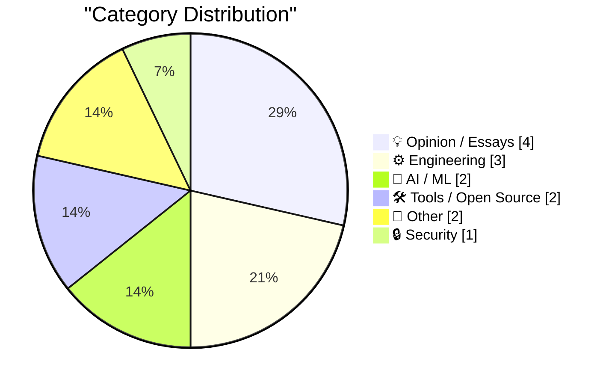
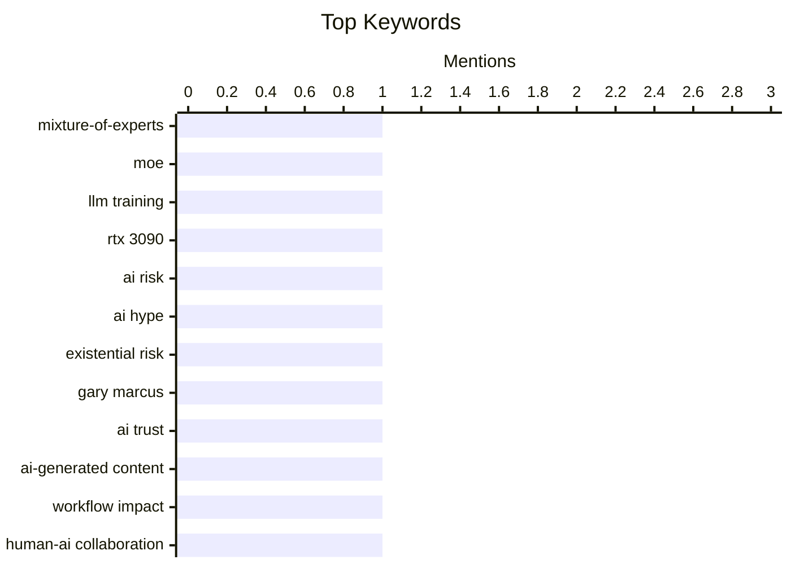

## Today's Highlights
Today's tech highlights underscore the multifaceted evolution of AI, from practical, hands-on model training to critical discussions debunking apocalyptic fears and addressing its impact on professional trust. Concurrently, the engineering world is buzzing with significant shifts, including Shopify's strategic pivot back to native mobile development. Developers are also gaining new capabilities with innovative tools like trynix.dev for browser-based Nix package execution, alongside crucial security updates and major OS releases from Apple.
---
## Must Read Today
1. **Extending Raschka's GPT-2: an MoE trained from scratch on an RTX 3090**
[Extending Raschka's GPT-2: an MoE trained from scratch on an RTX 3090](https://www.gilesthomas.com/2026/09/gpt-2-to-moe) — gilesthomas.com · 19h ago · 🤖 AI / ML
> The article discusses the implementation and training of a Mixture-of-Experts (MoE) model from scratch, extending Raschka's GPT-2, to achieve the benefits of large models with faster inference. MoE models offer inference speeds comparable to smaller models while retaining the knowledge of larger ones, despite using similar memory to equivalently-sized dense models. The author successfully trained this MoE model on an RTX 3090, demonstrating its feasibility for individual researchers. This approach highlights how MoE architectures can deliver powerful yet efficient large language models, even with limited computational resources.
💡 **Why read it**: It provides practical insights into building and training advanced MoE models from scratch on consumer-grade hardware, making complex AI architectures more accessible.
🏷️ Mixture-of-Experts, MoE, LLM training, RTX 3090
2. **No, Anderson Cooper, AI is not going to kill all humans by 2030**
[No, Anderson Cooper, AI is not going to kill all humans by 2030](https://garymarcus.substack.com/p/no-anderson-cooper-ai-is-not-going) — garymarcus.substack.com · 22h ago · 🤖 AI / ML
> The article critiques the prevalent focus on exaggerated, apocalyptic AI scenarios, specifically refuting the idea that AI will cause human extinction by 2030. While acknowledging real and current harms caused by AI, the author argues that sensationalist "end-of-the-world fantasies" distract from addressing these tangible risks. This constant focus on extreme outcomes is detrimental to a productive discussion about AI safety and regulation. It is crucial to shift the conversation from speculative doomsday predictions to the concrete, present-day harms and ethical challenges posed by AI.
💡 **Why read it**: It offers a critical perspective on the public discourse surrounding AI risks, advocating for a focus on immediate, actionable problems over speculative doomsday scenarios.
🏷️ AI risk, AI hype, existential risk, Gary Marcus
3. **AI Is Breaking This Thing We Call Trust**
[AI Is Breaking This Thing We Call Trust](https://terriblesoftware.org/2026/09/10/ai-is-breaking-this-thing-we-call-trust/) — terriblesoftware.org · 23h ago · 💡 Opinion / Essays
> The article explores how the use of AI-generated content is eroding trust within professional teams and workflows. AI-produced work often appears complete without being fully understood by its creator, leading to uncertainty among colleagues. This lack of understanding necessitates slower review processes, increases the burden on other team members to verify or complete the work, and ultimately diminishes overall team trust and efficiency. The superficial completeness of AI-generated output can mask underlying issues, creating a "trust deficit" that negatively impacts collaborative work environments.
💡 **Why read it**: It highlights a critical, often overlooked, social and organizational challenge introduced by AI adoption: the erosion of trust and its impact on team dynamics.
🏷️ AI trust, AI-generated content, workflow impact, human-AI collaboration
---
## Data Overview
| Sources Scanned | Articles Fetched | Time Window | Selected |
|:---:|:---:|:---:|:---:|
| 87/92 | 2598 -> 14 | 24h | **14** |
### Category Distribution

### Top Keywords

<details>
<summary>Plain Text Keyword Chart (Terminal Friendly)</summary>
```
mixture-of-experts   │ ████████████████████ 1
moe                  │ ████████████████████ 1
llm training         │ ████████████████████ 1
rtx 3090             │ ████████████████████ 1
ai risk              │ ████████████████████ 1
ai hype              │ ████████████████████ 1
existential risk     │ ████████████████████ 1
gary marcus          │ ████████████████████ 1
ai trust             │ ████████████████████ 1
ai-generated content │ ████████████████████ 1
```
</details>
### Topic Tags
**mixture-of-experts**(1) · **moe**(1) · **llm training**(1) · rtx 3090(1) · ai risk(1) · ai hype(1) · existential risk(1) · gary marcus(1) · ai trust(1) · ai-generated content(1) · workflow impact(1) · human-ai collaboration(1) · nix(1) · package manager(1) · trynix.dev(1) · browser environment(1) · mobile development(1) · shopify(1) · react native(1) · native apps(1)
---
## Opinion / Essays
### 1. AI Is Breaking This Thing We Call Trust
[AI Is Breaking This Thing We Call Trust](https://terriblesoftware.org/2026/09/10/ai-is-breaking-this-thing-we-call-trust/) — **terriblesoftware.org** · 23h ago · ⭐ 27/30
> The article explores how the use of AI-generated content is eroding trust within professional teams and workflows. AI-produced work often appears complete without being fully understood by its creator, leading to uncertainty among colleagues. This lack of understanding necessitates slower review processes, increases the burden on other team members to verify or complete the work, and ultimately diminishes overall team trust and efficiency. The superficial completeness of AI-generated output can mask underlying issues, creating a "trust deficit" that negatively impacts collaborative work environments.
🏷️ AI trust, AI-generated content, workflow impact, human-AI collaboration
---
### 2. I Am a Flat-Rate Monthly Responsibility Service
[I Am a Flat-Rate Monthly Responsibility Service](https://matduggan.com/i-am-a-flat-rate-monthly-responsibility-service/) — **matduggan.com** · 2h ago · ⭐ 21/30
> The article delves into the often-unspoken, pragmatic reasons behind people's career choices, moving beyond noble justifications. The author posits that individuals often "lie" about their motivations for their careers, not maliciously, but because the honest reasons are typically less grand. These reasons usually involve a combination of a decent paycheck, tolerable hours, and personal neuroses rather than lofty ideals. People's career choices are fundamentally driven by practical considerations and personal circumstances, functioning as a "flat-rate monthly responsibility service" to meet basic needs and personal quirks.
🏷️ Career, Motivation, Work, Responsibility
---
### 3. An Ode to Links
[An Ode to Links](https://blog.jim-nielsen.com/2026/ode-to-links/) — **blog.jim-nielsen.com** · 19h ago · ⭐ 20/30
> This article explores the dual nature of a "link," distinguishing between its technical definition (URL) and its profound cultural significance. While a URL is a technical construct involving hostname, path, port, and query parameters, a link is presented as a cultural artifact—an invitation, citation, gift, shortcut, and connection. The author highlights how language reflects this cultural importance, using phrases like "Drop me a link" and "Link in bio." The underlying simple idea is "a thing that points to another thing." Links are fundamental to our digital culture, serving as more than just technical pointers but as essential tools for human connection and information exchange.
🏷️ Links, URLs, Internet, Web
---
### 4. Joanna Stern on the iPhone Duo
[Joanna Stern on the iPhone Duo](https://youtu.be/VNzl-q0EGfg) — **daringfireball.net** · 20h ago · ⭐ 9/30
> This article is a brief commentary on a video featuring Joanna Stern reviewing the iPhone Duo, focusing on her handling of demo units. The author observes Stern's uninhibited and robust interaction with hands-on demo units, contrasting it with their own cautious approach. The author treats demo units "like museum pieces," while Stern treats them "like hot dog buns," implying a more realistic and less precious handling during a review. This difference suggests a more practical approach to product evaluation. Effective product reviews might benefit from a less delicate, more real-world interaction with demo devices to uncover practical usage insights.
🏷️ iPhone Duo, Joanna Stern, product review
---
## Engineering
### 5. Native is now the future of mobile at Shopify
[Native is now the future of mobile at Shopify](https://simonwillison.net/2026/Sep/10/shopify-react-native/) — **simonwillison.net** · 16h ago · ⭐ 25/30
> Shopify is transitioning its mobile development strategy from React Native back to separate native Swift and Kotlin codebases. Shopify initially adopted React Native in 2020 to avoid duplicating features, enable full-stack developers, and reduce time spent on platform-specific issues. However, they are now reverting to native development, implying that the benefits of React Native did not outweigh the challenges or that native development offers superior long-term advantages for their specific needs. Despite the initial appeal of cross-platform frameworks like React Native, large organizations like Shopify may find greater long-term value and performance in dedicated native mobile development.
🏷️ mobile development, Shopify, React Native, native apps
---
### 6. Apple’s OS 27 Updates Will Be Released on Monday, 14 September
[Apple’s OS 27 Updates Will Be Released on Monday, 14 September](https://9to5mac.com/2026/09/09/apple-confirms-macos-27-golden-gate-launch-date-september-14/) — **daringfireball.net** · 17h ago · ⭐ 23/30
> Apple is set to release its major OS 27 updates, including macOS 27 "Golden Gate" and iOS 27, on Monday, September 14th. The author notes that iOS 27 has been used full-time since WWDC and is in "excellent shape for a .0 release." However, for macOS 27, the author expresses a common sentiment of caution, planning to skip the initial 27.0 release and wait for 27.1 or 27.0.1 before upgrading their main Mac. While iOS 27 appears stable for its initial release, a cautious approach is recommended for macOS 27, suggesting users might wait for minor patch updates before upgrading.
🏷️ iOS 27, macOS 15, Apple, OS update
---
### 7. Where Has Construction Automation Been Successful?
[Where Has Construction Automation Been Successful?](https://www.construction-physics.com/p/where-has-construction-automation) — **construction-physics.com** · 1h ago · ⭐ 23/30
> The article investigates the areas where automation has successfully been implemented within the construction industry, which is notoriously labor-intensive. Direct labor accounts for nearly 50% of the cost of building a new single-family home in the US, significantly higher than the 6-8% in car manufacturing, highlighting construction's reliance on manual labor. The article aims to identify specific niches or processes within construction where automation has overcome these challenges and proven effective. Despite construction's high labor costs, the article seeks to pinpoint successful automation applications, suggesting that targeted automation can improve efficiency in specific segments of the industry.
🏷️ Construction, Automation, Labor, Efficiency
---
## AI / ML
### 8. Extending Raschka's GPT-2: an MoE trained from scratch on an RTX 3090
[Extending Raschka's GPT-2: an MoE trained from scratch on an RTX 3090](https://www.gilesthomas.com/2026/09/gpt-2-to-moe) — **gilesthomas.com** · 19h ago · ⭐ 28/30
> The article discusses the implementation and training of a Mixture-of-Experts (MoE) model from scratch, extending Raschka's GPT-2, to achieve the benefits of large models with faster inference. MoE models offer inference speeds comparable to smaller models while retaining the knowledge of larger ones, despite using similar memory to equivalently-sized dense models. The author successfully trained this MoE model on an RTX 3090, demonstrating its feasibility for individual researchers. This approach highlights how MoE architectures can deliver powerful yet efficient large language models, even with limited computational resources.
🏷️ Mixture-of-Experts, MoE, LLM training, RTX 3090
---
### 9. No, Anderson Cooper, AI is not going to kill all humans by 2030
[No, Anderson Cooper, AI is not going to kill all humans by 2030](https://garymarcus.substack.com/p/no-anderson-cooper-ai-is-not-going) — **garymarcus.substack.com** · 22h ago · ⭐ 27/30
> The article critiques the prevalent focus on exaggerated, apocalyptic AI scenarios, specifically refuting the idea that AI will cause human extinction by 2030. While acknowledging real and current harms caused by AI, the author argues that sensationalist "end-of-the-world fantasies" distract from addressing these tangible risks. This constant focus on extreme outcomes is detrimental to a productive discussion about AI safety and regulation. It is crucial to shift the conversation from speculative doomsday predictions to the concrete, present-day harms and ethical challenges posed by AI.
🏷️ AI risk, AI hype, existential risk, Gary Marcus
---
## Tools / Open Source
### 10. Any Nix package, live in your browser
[Any Nix package, live in your browser](https://simonwillison.net/2026/Sep/10/trynix/) — **simonwillison.net** · 14h ago · ⭐ 25/30
> The article introduces trynix.dev, a new tool that allows users to run any Nix package directly within their web browser. trynix.dev leverages qemu-wasm to provide an x86_64 Linux virtual machine, powered entirely by WebAssembly, within the browser. This VM can then boot with any specified Nix package, offering an unprecedented level of accessibility for testing and experimenting with Nix environments. trynix.dev represents a significant advancement in making Nix packages instantly accessible and runnable in a browser-based environment, simplifying experimentation and sharing.
🏷️ Nix, package manager, trynix.dev, browser environment
---
### 11. Don't sleep on wrapture
[Don't sleep on wrapture](https://simonwillison.net/2026/Sep/11/wrapture/) — **simonwillison.net** · 9m ago · ⭐ 24/30
> The article highlights `wrapture`, a new Python monkey patching package, as an indispensable tool that has received insufficient attention. Graham Dumpleton's `wrapture` package, released on August 31st, is designed for monkey patching in Python, a technique for modifying code at runtime. The author notes a lack of buzz despite daily tutorials being posted, suggesting its utility is being overlooked by the Python community. Python developers should explore `wrapture` for its powerful capabilities in monkey patching, as it promises to be a highly valuable addition to their toolkit.
🏷️ Python, wrapture, monkey patching, developer tool
---
## Other
### 12. [RSS Club] Sneak peek at new DOI functionality
[[RSS Club] Sneak peek at new DOI functionality](https://shkspr.mobi/blog/2026/09/rss-club-sneak-peek-at-new-doi-functionality/) — **shkspr.mobi** · 2h ago · ⭐ 20/30
> This article discusses the integration of Digital Object Identifiers (DOIs) with blog posts to enhance their persistence and discoverability. The author is experimenting with Rogue Scholar, an open-access publication platform that enables blogs to obtain persistent DOIs. The goal is for all new posts on the author's site to be assigned a DOI, making them citable and permanently accessible. This functionality is being tested within the "RSS Club" context. This initiative aims to elevate blog posts to a more formal, citable status, akin to academic publications, by leveraging DOI technology.
🏷️ DOI, RSS, Rogue Scholar, open access
---
### 13. Atari 2600 launch titles
[Atari 2600 launch titles](https://dfarq.homeip.net/atari-2600-launch-titles/?utm_source=rss&#038;utm_medium=rss&#038;utm_campaign=atari-2600-launch-titles) — **dfarq.homeip.net** · 3h ago · ⭐ 9/30
> This article details the launch of the Atari 2600 console and its initial game lineup. The Atari 2600 was released on September 11, 1977, accompanied by nine launch titles. While not the first home video game console to connect to a TV or use cartridges, it became a highly influential system. The article focuses on the historical context of its release and the games available from day one. The Atari 2600, despite not being a pioneer in every aspect, made a significant impact on the home video game market, starting with its foundational set of nine launch titles in 1977.
🏷️ Atari 2600, Retro gaming, History
---
## Security
### 14. Datasette 1.0a39 and 0.65.4 security releases
[Datasette 1.0a39 and 0.65.4 security releases](https://simonwillison.net/2026/Sep/11/datasette-security/) — **simonwillison.net** · 10h ago · ⭐ 24/30
> The article announces critical security releases for Datasette, specifically versions 1.0a39 and 0.65.4. These releases are security patches addressing vulnerabilities in both the current alpha series (1.0a39) and the stable 0.65.x family (0.65.4) of Datasette. Users are strongly advised to update their installations promptly to mitigate potential security risks. Users of Datasette must immediately upgrade to the latest security patch versions, 1.0a39 or 0.65.4, to ensure the security of their deployments.
🏷️ Datasette, security release, vulnerability, patch
---
*Generated at 2026-09-11 14:01 | Scanned 87 sources -> 2598 articles -> selected 14*
*Based on the [Hacker News Popularity Contest 2025](https://refactoringenglish.com/tools/hn-popularity/) RSS source list recommended by [Andrej Karpathy](https://x.com/karpathy)*
*Produced by Dongdianr AI. Follow the same-name WeChat public account for more AI practical tips 💡*
