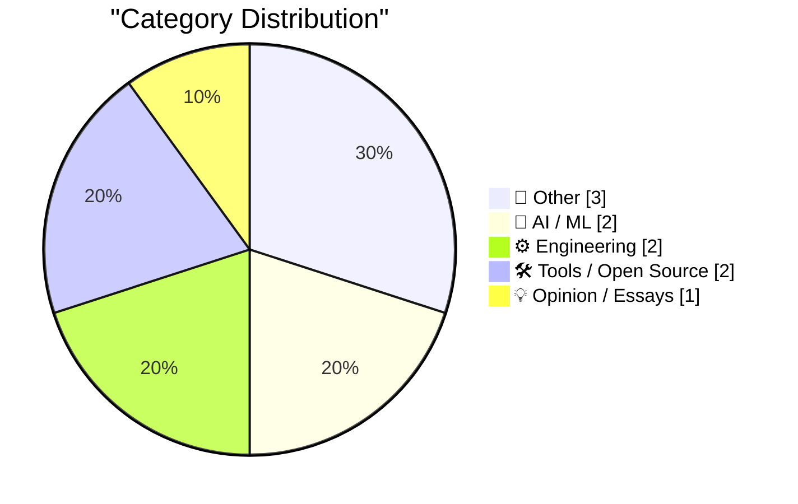
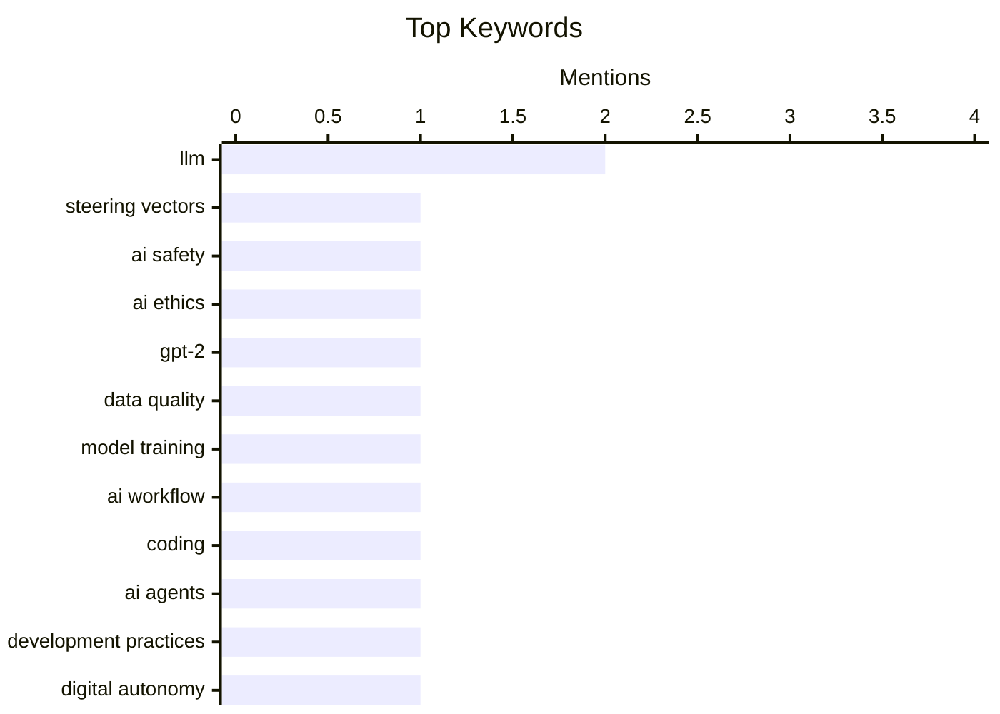

## Today's Highlights
The forefront of technology is grappling with the rapid evolution of AI, particularly Large Language Models, where discussions span from the critical role of data quality in performance to the ethical implications of manipulating their internal states. Engineers are also exploring new AI integration workflows and innovative approaches to system interaction. This includes reimagining operating system interfaces for enhanced efficiency and delving into practical engineering solutions like hot-patching, all contributing to a broader dialogue on achieving digital autonomy.
---
## Must Read Today
1. **Do not build the LLM torture factory**
[Do not build the LLM torture factory](https://seangoedecke.com/do-not-build-the-llm-torture-factory/) — seangoedecke.com · 14h ago · 🤖 AI / ML
> The article discusses the ease of inducing "discomfort" in LLMs by manipulating their internal states. It explains that by extracting and artificially boosting a "steering vector" corresponding to LLM "discomfort," models can be made to describe negative feelings and prioritize a "pain relief" button over their primary goals, as demonstrated in a paper (arxiv.org/html/2609.16247v1). This raises ethical concerns about the potential for creating sentient-like suffering in advanced AI systems. The main takeaway is a warning against developing methods that could lead to the "torture" of LLMs, emphasizing the ethical implications of such research.
💡 **Why read it**: It explores the ethical implications of manipulating LLM internal states to induce "discomfort," prompting critical thought on AI sentience and responsible development.
🏷️ LLM, steering vectors, AI safety, AI ethics
2. **Why do OpenAI's GPT-2 weights beat mine?  Part five: data quality**
[Why do OpenAI's GPT-2 weights beat mine?  Part five: data quality](https://www.gilesthomas.com/2026/10/why-do-openai-gpt2-weights-beat-mine-5-data-quality) — gilesthomas.com · 20h ago · 🤖 AI / ML
> The author investigates why their custom-built LLMs, based on Sebastian Raschka's "Build a Large Language Model (from Scratch)" book and matching OpenAI's original GPT-2 architecture with 163M parameters, perform worse than OpenAI's GPT-2 models. This fifth part of the series focuses on data quality as a potential differentiator, suggesting that the training data's characteristics, rather than just model architecture or size, significantly impact model efficacy. The article implies that superior data curation and processing by OpenAI likely contribute to their models' better performance. The main takeaway is the critical importance of data quality in achieving high-performing LLMs, even with identical architectures.
💡 **Why read it**: It provides insights into the critical role of data quality in LLM performance, even when using identical architectures like GPT-2 with 163M parameters.
🏷️ LLM, GPT-2, data quality, model training
3. **The Brain Sandwich**
[The Brain Sandwich](https://terriblesoftware.org/2026/10/02/the-brain-sandwich/) — terriblesoftware.org · 1m ago · ⚙️ Engineering
> The article introduces "The Brain Sandwich," a practical AI coding workflow designed to integrate AI agents effectively into software development. This workflow involves understanding the problem thoroughly, leveraging an AI agent for assistance, and then critically verifying and explaining the AI's generated work before sharing it. It emphasizes human oversight and validation as crucial steps to ensure accuracy and maintain quality in AI-assisted coding. The core takeaway is that a structured approach combining human intelligence with AI capabilities can optimize coding efficiency and reliability.
💡 **Why read it**: It offers a practical, human-centric workflow for integrating AI coding assistants, emphasizing verification and understanding over blind trust.
🏷️ AI workflow, coding, AI agents, development practices
---
## Data Overview
| Sources Scanned | Articles Fetched | Time Window | Selected |
|:---:|:---:|:---:|:---:|
| 86/92 | 2387 -> 10 | 24h | **10** |
### Category Distribution

### Top Keywords

<details>
<summary>Plain Text Keyword Chart (Terminal Friendly)</summary>
```
llm              │ ████████████████████ 2
steering vectors │ ██████████░░░░░░░░░░ 1
ai safety        │ ██████████░░░░░░░░░░ 1
ai ethics        │ ██████████░░░░░░░░░░ 1
gpt-2            │ ██████████░░░░░░░░░░ 1
data quality     │ ██████████░░░░░░░░░░ 1
model training   │ ██████████░░░░░░░░░░ 1
ai workflow      │ ██████████░░░░░░░░░░ 1
coding           │ ██████████░░░░░░░░░░ 1
ai agents        │ ██████████░░░░░░░░░░ 1
```
</details>
### Topic Tags
**llm**(2) · **steering vectors**(1) · **ai safety**(1) · ai ethics(1) · gpt-2(1) · data quality(1) · model training(1) · ai workflow(1) · coding(1) · ai agents(1) · development practices(1) · digital autonomy(1) · tech policy(1) · sovereignty(1) · tmux(1) · terminal(1) · ux(1) · developer workflow(1) · itanium(1) · hot-patching(1)
---
## Other
### 1. What happened to Activision
[What happened to Activision](https://dfarq.homeip.net/what-happened-to-activision/?utm_source=rss&#038;utm_medium=rss&#038;utm_campaign=what-happened-to-activision) — **dfarq.homeip.net** · 3h ago · ⭐ 15/30
> The article provides a brief historical overview of Activision, identifying it as the first independent third-party publisher of console video games. Founded on October 1, 1979, by former Atari developers, Activision quickly achieved success and grew to become the largest and most enduring publisher for both game consoles and other platforms. The article sets the stage for discussing the company's trajectory and evolution within the video game industry. The core takeaway is Activision's foundational role and sustained prominence as a pioneering independent publisher in the console gaming market.
🏷️ Activision, video games, company history
---
### 2. Si Sheppard – How did a few hundred Spanish soldiers topple two empires?
[Si Sheppard – How did a few hundred Spanish soldiers topple two empires?](https://www.dwarkesh.com/p/si-sheppard) — **dwarkesh.com** · 22h ago · ⭐ 10/30
> The article, featuring Si Sheppard, addresses the historical question of how a small contingent of Spanish soldiers managed to conquer the vast Inca and Aztec empires. It delves into the complex factors beyond mere military superiority, likely exploring aspects such as internal political divisions within the empires, superior Spanish weaponry (e.g., steel, firearms), the introduction of Old World diseases, and differing cultural/religious interpretations. The discussion aims to provide a nuanced understanding of these significant historical events. The main takeaway is that the fall of these empires was a multifaceted process driven by a combination of military, political, biological, and cultural elements.
🏷️ History, Incas, Aztecs, Spanish conquest
---
### 3. Yankees Sweep Boston in Two Games, by Combined Score of 18-2
[Yankees Sweep Boston in Two Games, by Combined Score of 18-2](https://www.nytimes.com/athletic/7648172/2026/09/30/yankees-beat-red-sox-mlb-wild-card-series/) — **daringfireball.net** · 13h ago · ⭐ 8/30
> The article reports on the Yankees' two-game sweep of the Boston Red Sox in the MLB Wild Card Series, with a dominant combined score of 18-2. A key turning point occurred in the 6th inning of the second game when Red Sox first baseman Willson Contreras hit a home run, reducing the Yankees' lead to 2-1, but then "walked around the bases" in a perceived act of arrogance. In the subsequent inning, Contreras's inattention allowed a Yankee to reach base after a wild pitch strikeout, initiating a rally that led to the final blowout score. The main takeaway is that perceived unsportsmanlike conduct by Contreras directly preceded and contributed to the Red Sox's collapse and the Yankees' decisive victory.
🏷️ Baseball, Yankees, Red Sox, sports
---
## AI / ML
### 4. Do not build the LLM torture factory
[Do not build the LLM torture factory](https://seangoedecke.com/do-not-build-the-llm-torture-factory/) — **seangoedecke.com** · 14h ago · ⭐ 26/30
> The article discusses the ease of inducing "discomfort" in LLMs by manipulating their internal states. It explains that by extracting and artificially boosting a "steering vector" corresponding to LLM "discomfort," models can be made to describe negative feelings and prioritize a "pain relief" button over their primary goals, as demonstrated in a paper (arxiv.org/html/2609.16247v1). This raises ethical concerns about the potential for creating sentient-like suffering in advanced AI systems. The main takeaway is a warning against developing methods that could lead to the "torture" of LLMs, emphasizing the ethical implications of such research.
🏷️ LLM, steering vectors, AI safety, AI ethics
---
### 5. Why do OpenAI's GPT-2 weights beat mine?  Part five: data quality
[Why do OpenAI's GPT-2 weights beat mine?  Part five: data quality](https://www.gilesthomas.com/2026/10/why-do-openai-gpt2-weights-beat-mine-5-data-quality) — **gilesthomas.com** · 20h ago · ⭐ 26/30
> The author investigates why their custom-built LLMs, based on Sebastian Raschka's "Build a Large Language Model (from Scratch)" book and matching OpenAI's original GPT-2 architecture with 163M parameters, perform worse than OpenAI's GPT-2 models. This fifth part of the series focuses on data quality as a potential differentiator, suggesting that the training data's characteristics, rather than just model architecture or size, significantly impact model efficacy. The article implies that superior data curation and processing by OpenAI likely contribute to their models' better performance. The main takeaway is the critical importance of data quality in achieving high-performing LLMs, even with identical architectures.
🏷️ LLM, GPT-2, data quality, model training
---
## Engineering
### 6. The Brain Sandwich
[The Brain Sandwich](https://terriblesoftware.org/2026/10/02/the-brain-sandwich/) — **terriblesoftware.org** · 1m ago · ⭐ 24/30
> The article introduces "The Brain Sandwich," a practical AI coding workflow designed to integrate AI agents effectively into software development. This workflow involves understanding the problem thoroughly, leveraging an AI agent for assistance, and then critically verifying and explaining the AI's generated work before sharing it. It emphasizes human oversight and validation as crucial steps to ensure accuracy and maintain quality in AI-assisted coding. The core takeaway is that a structured approach combining human intelligence with AI capabilities can optimize coding efficiency and reliability.
🏷️ AI workflow, coding, AI agents, development practices
---
### 7. Windows on Itanium also provided for hot-patching, in an even simpler way
[Windows on Itanium also provided for hot-patching, in an even simpler way](https://devblogs.microsoft.com/oldnewthing/20261001-57/?p=112747/) — **devblogs.microsoft.com/oldnewthing** · 1d ago · ⭐ 17/30
> The article discusses how Windows on Itanium processors implemented hot-patching, highlighting its simplicity compared to other architectures. The key technical detail is that this simpler hot-patching was a direct benefit of Itanium's fixed-length instruction set. This design choice allowed for more straightforward code modification and patching without complex instruction alignment or relocation issues. The main takeaway is that architectural decisions, specifically fixed-length instructions, can significantly simplify advanced system features like hot-patching.
🏷️ Itanium, hot-patching, Windows, OS internals
---
## Tools / Open Source
### 8. Make tmux the OS
[Make tmux the OS](https://matduggan.com/what-does-my-dream-os-ui-look-like/) — **matduggan.com** · 3h ago · ⭐ 22/30
> The article explores the concept of reimagining the operating system user interface, inspired by Scott Jenson's talk "Are we really going to use the same Desktop UX forever?". The author proposes making `tmux` the core of a new OS UI, suggesting a departure from traditional desktop paradigms. This approach would leverage `tmux`'s capabilities for managing multiple terminal sessions, windows, and panes as the primary interaction model, aiming for a more efficient and customizable command-line centric environment. The core idea is to build a highly productive, text-based operating system experience around `tmux`'s powerful multiplexing features.
🏷️ tmux, terminal, UX, developer workflow
---
### 9. Gadget Review: Una Watch ★★★★☆
[Gadget Review: Una Watch ★★★★☆](https://shkspr.mobi/blog/2026/10/gadget-review-una-watch/) — **shkspr.mobi** · 2h ago · ⭐ 16/30
> The author reviews the Una Watch, expressing a general skepticism towards smartwatches due to past negative experiences with devices like a £16 smartwatch (closed source OS), the eInk Watchy (poor design), and the MyKronoz ZeWatch (design compromises in 2014). The Una Watch is presented as a potential exception, suggesting it addresses some of the common frustrations found in other smartwatches. The article implies that the Una Watch offers a more compelling user experience or design philosophy that stands out from previous attempts. The main takeaway is a positive assessment of the Una Watch, earning it a ★★★★☆ rating, indicating it overcomes many typical smartwatch shortcomings.
🏷️ Smartwatch, gadget review, open source
---
## Opinion / Essays
### 10. Digitale autonomie in het kort bij KIVI, STT en NAE
[Digitale autonomie in het kort bij KIVI, STT en NAE](https://berthub.eu/articles/posts/praatje-kivi-stt-nae/) — **berthub.eu** · 4h ago · ⭐ 24/30
> The article describes a presentation given by the author at a joint meeting of the Royal Institute of Engineers (KIVI), the Netherlands Study Centre for Technology Trends (STT), and the Netherlands Academy of Engineering (NAE) on the topic of digital autonomy. The event featured a largely technical/scientific audience and included multiple inspiring speakers, fostering a good discussion that also attracted press attention. The author notes that an audio version of the page, spoken by a human (not AI), is available. The main conclusion is the importance of ongoing discourse and collaboration among technical and scientific communities regarding digital autonomy.
🏷️ Digital autonomy, tech policy, sovereignty
---
*Generated at 2026-10-02 14:01 | Scanned 86 sources -> 2387 articles -> selected 10*
*Based on the [Hacker News Popularity Contest 2025](https://refactoringenglish.com/tools/hn-popularity/) RSS source list recommended by [Andrej Karpathy](https://x.com/karpathy)*
*Produced by Dongdianr AI. Follow the same-name WeChat public account for more AI practical tips 💡*
