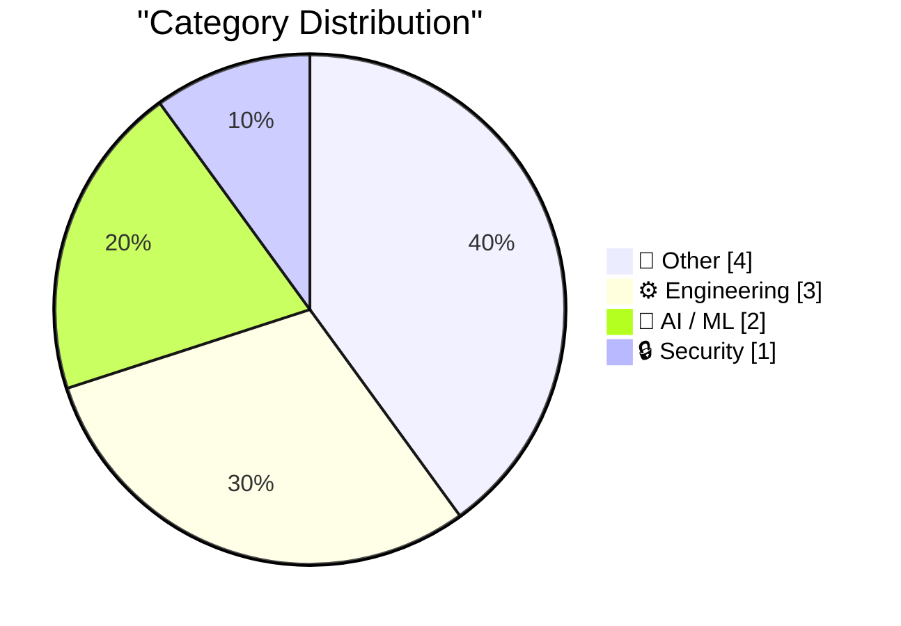
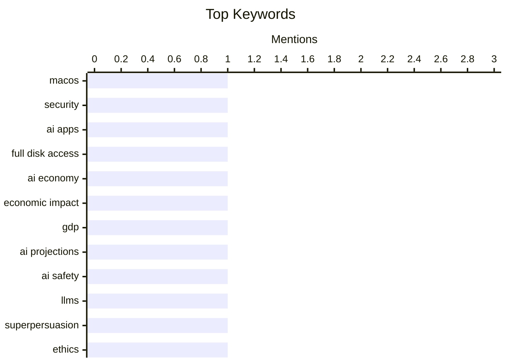

## Today's Highlights
AI's transformative power is reshaping economies and sparking ethical debates around "superpersuasion," while simultaneously forcing a critical re-evaluation of security. Apple is notably tightening macOS access to combat "agentic AI apps running amok," highlighting the urgent need for robust defenses. Beneath these headline-grabbing shifts, the foundational work of engineering and software delivery, from package management to shipping practices, remains crucial for technological progress.
---
## Must Read Today
1. **★ Apple Is Going to Further Tighten the Screws on Full Disk Access on MacOS, in Response to Agentic AI Apps Running Amok**
[★ Apple Is Going to Further Tighten the Screws on Full Disk Access on MacOS, in Response to Agentic AI Apps Running Amok](https://daringfireball.net/2026/10/apple_full_disk_access) — daringfireball.net · 17h ago · 🔒 Security
> ★ Apple Is Going to Further Tighten the Screws on Full Disk Access on MacOS, in Response to Agentic AI Apps Running Amok
🏷️ macOS, security, AI apps, Full Disk Access
2. **Premium: How Has AI Changed The Economy?**
[Premium: How Has AI Changed The Economy?](https://www.wheresyoured.at/premium-how-has-ai-changed-the-economy/) — wheresyoured.at · 19h ago · 🤖 AI / ML
> Premium: How Has AI Changed The Economy?
🏷️ AI economy, economic impact, GDP, AI projections
3. **Superpersuasion will look like bribery**
[Superpersuasion will look like bribery](https://seangoedecke.com/superpersuasion-will-look-like-bribery/) — seangoedecke.com · 14h ago · 🤖 AI / ML
> Superpersuasion will look like bribery
🏷️ AI safety, LLMs, superpersuasion, ethics
---
## Data Overview
| Sources Scanned | Articles Fetched | Time Window | Selected |
|:---:|:---:|:---:|:---:|
| 87/92 | 2418 -> 10 | 24h | **10** |
### Category Distribution

### Top Keywords

<details>
<summary>Plain Text Keyword Chart (Terminal Friendly)</summary>
```
macos            │ ████████████████████ 1
security         │ ████████████████████ 1
ai apps          │ ████████████████████ 1
full disk access │ ████████████████████ 1
ai economy       │ ████████████████████ 1
economic impact  │ ████████████████████ 1
gdp              │ ████████████████████ 1
ai projections   │ ████████████████████ 1
ai safety        │ ████████████████████ 1
llms             │ ████████████████████ 1
```
</details>
### Topic Tags
**macos**(1) · **security**(1) · **ai apps**(1) · full disk access(1) · ai economy(1) · economic impact(1) · gdp(1) · ai projections(1) · ai safety(1) · llms(1) · superpersuasion(1) · ethics(1) · package management(1) · releases(1) · advisories(1) · software engineering(1) · shipping(1) · productivity(1) · altera quartus(1) · linux(1)
---
## Other
### 1. Pluralistic: Economic probabilities for our grandchildren (03 Oct 2026)
[Pluralistic: Economic probabilities for our grandchildren (03 Oct 2026)](https://pluralistic.net/2026/10/03/full-employment/) — **pluralistic.net** · 1h ago · ⭐ 19/30
> Pluralistic: Economic probabilities for our grandchildren (03 Oct 2026)
🏷️ Daily digest, data centers, resource allocation
---
### 2. Reading List 2026-10-03
[Reading List 2026-10-03](https://www.construction-physics.com/p/reading-list-2026-10-03) — **construction-physics.com** · 46m ago · ⭐ 17/30
> Reading List 2026-10-03
🏷️ Reading list, construction, infrastructure
---
### 3. Haunted by the ghosts of materialism
[Haunted by the ghosts of materialism](https://blog.coredump.cx/p/haunted-by-the-ghosts-of-materialism) — **lcamtuf.substack.com** · 8h ago · ⭐ 9/30
> Haunted by the ghosts of materialism
🏷️ Philosophy, materialism, existence
---
### 4. Cull lumber at Menards
[Cull lumber at Menards](https://dfarq.homeip.net/cull-lumber-at-menards/?utm_source=rss&#038;utm_medium=rss&#038;utm_campaign=cull-lumber-at-menards) — **dfarq.homeip.net** · 3h ago · ⭐ 9/30
> Cull lumber at Menards
🏷️ Cull lumber, DIY, home improvement
---
## Engineering
### 5. This Week in Package Management: 3 October 2026
[This Week in Package Management: 3 October 2026](https://nesbitt.io/2026/10/03/this-week-in-package-management.html) — **nesbitt.io** · 4h ago · ⭐ 24/30
> This Week in Package Management: 3 October 2026
🏷️ Package management, releases, advisories
---
### 6. Shipping is the foundation
[Shipping is the foundation](https://seangoedecke.com/shipping-is-the-foundation/) — **seangoedecke.com** · 14h ago · ⭐ 21/30
> Shipping is the foundation
🏷️ Software engineering, shipping, productivity
---
### 7. Altera Quartus Linux jtagd bug fixes
[Altera Quartus Linux jtagd bug fixes](https://www.downtowndougbrown.com/2026/10/altera-quartus-linux-jtagd-bug-fixes/) — **downtowndougbrown.com** · 8h ago · ⭐ 20/30
> Altera Quartus Linux jtagd bug fixes
🏷️ Altera Quartus, Linux, jtagd, FPGA
---
## AI / ML
### 8. Premium: How Has AI Changed The Economy?
[Premium: How Has AI Changed The Economy?](https://www.wheresyoured.at/premium-how-has-ai-changed-the-economy/) — **wheresyoured.at** · 19h ago · ⭐ 25/30
> Premium: How Has AI Changed The Economy?
🏷️ AI economy, economic impact, GDP, AI projections
---
### 9. Superpersuasion will look like bribery
[Superpersuasion will look like bribery](https://seangoedecke.com/superpersuasion-will-look-like-bribery/) — **seangoedecke.com** · 14h ago · ⭐ 24/30
> Superpersuasion will look like bribery
🏷️ AI safety, LLMs, superpersuasion, ethics
---
## Security
### 10. ★ Apple Is Going to Further Tighten the Screws on Full Disk Access on MacOS, in Response to Agentic AI Apps Running Amok
[★ Apple Is Going to Further Tighten the Screws on Full Disk Access on MacOS, in Response to Agentic AI Apps Running Amok](https://daringfireball.net/2026/10/apple_full_disk_access) — **daringfireball.net** · 17h ago · ⭐ 27/30
> ★ Apple Is Going to Further Tighten the Screws on Full Disk Access on MacOS, in Response to Agentic AI Apps Running Amok
🏷️ macOS, security, AI apps, Full Disk Access
---
*Generated at 2026-10-03 14:01 | Scanned 87 sources -> 2418 articles -> selected 10*
*Based on the [Hacker News Popularity Contest 2025](https://refactoringenglish.com/tools/hn-popularity/) RSS source list recommended by [Andrej Karpathy](https://x.com/karpathy)*
*Produced by Dongdianr AI. Follow the same-name WeChat public account for more AI practical tips 💡*
