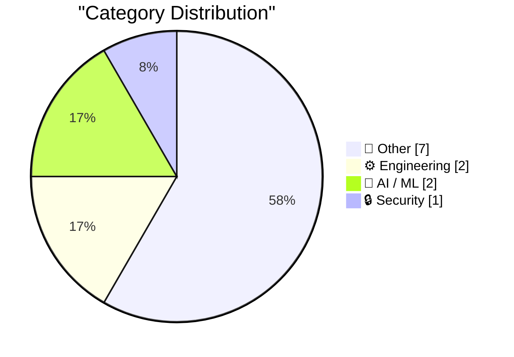
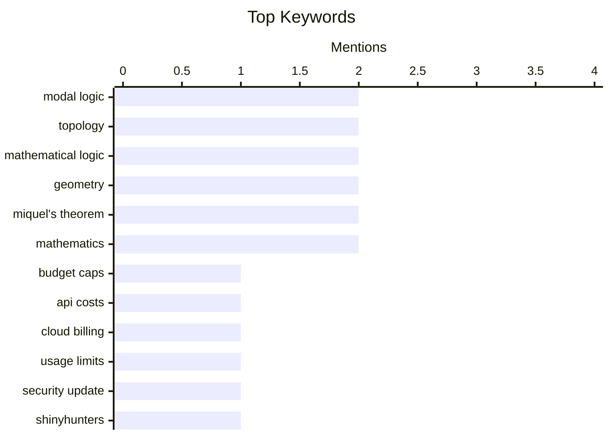

## Today's Highlights
Today's tech news highlights a dual focus on practical engineering challenges and theoretical AI advancements. Enterprises are grappling with the necessity of hard budget caps for pay-by-usage services and AI agents, alongside the complexities of integrating essential features like Single Sign-On. On the research front, deeper connections between modal logic and topology are being explored, pushing the boundaries of AI/ML foundations. However, not all news is forward-looking, as consumers contend with frustrating hardware issues, including cellular problems on new iPhones and persistent rebooting on laptops.
---
## Must Read Today
1. **We're going to need default hard budget caps on pretty much everything**
[We're going to need default hard budget caps on pretty much everything](https://simonwillison.net/2026/Oct/3/default-hard-budget-caps/) — simonwillison.net · 14h ago · ⚙️ Engineering
> The increasing prevalence of pay-by-usage services and AI agents necessitates robust cost control mechanisms to prevent unexpected financial burdens. The author advocates for "default hard budget caps" on all pay-by-usage APIs and services, arguing that soft caps (email warnings) are insufficient. These hard limits should automatically cut off service and return errors once a predefined spending threshold ($X/month) is reached. This is crucial for managing costs associated with potentially runaway AI agents or services. Implementing mandatory, default hard budget caps is essential for user protection and financial predictability in an economy increasingly reliant on usage-based billing.
💡 **Why read it**: It highlights a critical, often overlooked product feature—default hard budget caps—necessary for managing costs in the era of pay-by-usage services and AI agents.
🏷️ Budget caps, API costs, cloud billing, usage limits
2. **Weekly Update 524: Live From Copenhagen**
[Weekly Update 524: Live From Copenhagen](https://www.troyhunt.com/weekly-update-524/) — troyhunt.com · 2h ago · 🔒 Security
> This article provides a brief personal update from Troy Hunt, primarily focusing on his recent activities and significant news in the cybersecurity space. Hunt reports from Copenhagen after a successful event at GOTO. The main news concerns the arrests of two ShinyHunters members, Pepijn in the Netherlands and Saif, indicating progress in combating this notorious cybercrime group. The update combines personal travel notes with crucial cybersecurity news regarding recent arrests of prominent threat actors.
💡 **Why read it**: It offers a quick update on a prominent cybersecurity expert's activities and highlights recent significant arrests in the ShinyHunters cybercrime group.
🏷️ security update, ShinyHunters, cybercrime, arrests
3. **WorkOS**
[WorkOS](https://workos.com/guide/the-developers-guide-to-sso?utm_source=daringfireball&amp;utm_medium=newsletter&amp;utm_campaign=q32026) — daringfireball.net · 16h ago · ⚙️ Engineering
> Integrating Single Sign-On (SSO) is essential for enterprise deals but is technically complex, requiring developers to handle SAML controllers, parse XML assertions, and manage IdP-specific quirks. The article promotes WorkOS as a solution to simplify SSO integration. It highlights the challenges of building SSO in-house versus buying a solution, covering SAML flow mechanics, security best practices, routing, and user experience. WorkOS aims to abstract away these complexities, allowing developers to add SSO without extensive custom development. WorkOS provides a streamlined approach to implementing enterprise-grade SSO, saving developers from the intricate technical challenges of building it themselves.
💡 **Why read it**: It addresses the common developer challenge of implementing enterprise SSO, offering insights into SAML and presenting WorkOS as a solution to simplify this complex task.
🏷️ SSO, enterprise, SAML, WorkOS
---
## Data Overview
| Sources Scanned | Articles Fetched | Time Window | Selected |
|:---:|:---:|:---:|:---:|
| 87/92 | 2418 -> 12 | 24h | **12** |
### Category Distribution

### Top Keywords

<details>
<summary>Plain Text Keyword Chart (Terminal Friendly)</summary>
```
modal logic        │ ████████████████████ 2
topology           │ ████████████████████ 2
mathematical logic │ ████████████████████ 2
geometry           │ ████████████████████ 2
miquel's theorem   │ ████████████████████ 2
mathematics        │ ████████████████████ 2
budget caps        │ ██████████░░░░░░░░░░ 1
api costs          │ ██████████░░░░░░░░░░ 1
cloud billing      │ ██████████░░░░░░░░░░ 1
usage limits       │ ██████████░░░░░░░░░░ 1
```
</details>
### Topic Tags
**modal logic**(2) · **topology**(2) · **mathematical logic**(2) · geometry(2) · miquel's theorem(2) · mathematics(2) · budget caps(1) · api costs(1) · cloud billing(1) · usage limits(1) · security update(1) · shinyhunters(1) · cybercrime(1) · arrests(1) · sso(1) · enterprise(1) · saml(1) · workos(1) · formal methods(1) · axioms(1)
---
## Other
### 1. Apple Confirms iPhone 18 Pro Max AT&T Cellular Issues, Affected Devices Require Hardware Replacement
[Apple Confirms iPhone 18 Pro Max AT&T Cellular Issues, Affected Devices Require Hardware Replacement](https://9to5mac.com/2026/10/02/apple-confirms-iphone-18-pro-max-att-cellular-issues-affected-devices-require-hardware-replacement/) — **daringfireball.net** · 19h ago · ⭐ 17/30
> Apple has confirmed an issue affecting a "small number" of iPhone 18 Pro Max users on the AT&T network, causing devices to lose service and be unable to make calls. Apple released iOS 27.0.1 and a carrier settings update to prevent the issue from occurring in other devices. However, for already affected devices, Apple states that a hardware replacement is required, indicating a more severe underlying problem. While software updates aim to mitigate future occurrences, existing iPhone 18 Pro Max devices experiencing AT&T cellular issues necessitate a hardware replacement.
🏷️ iPhone, hardware issue, AT&T, cellular
---
### 2. Why My Asus Laptop Kept Rebooting After Sleep and How to Fix it
[Why My Asus Laptop Kept Rebooting After Sleep and How to Fix it](https://idiallo.com/blog/asus-laptop-keeps-rebooting-after-sleep) — **idiallo.com** · 11h ago · ⭐ 15/30
> The author's Asus Zenbook Pro 17 laptop consistently rebooted instead of resuming from sleep, a frustrating issue that persisted for three years. The problem was traced to the "Intel Management Engine Interface" driver. The fix involved uninstalling the existing driver (version 2130.1.16.0) and installing an older version (2108.100.0.1053) from the Asus support website. This specific driver downgrade resolved the unexpected reboots, allowing the laptop to properly enter and resume from sleep. Downgrading the Intel Management Engine Interface driver to an older, stable version can resolve persistent reboot-after-sleep issues on certain Asus laptops.
🏷️ Asus laptop, troubleshooting, sleep mode, hardware fix
---
### 3. Miquel’s pentagon theorem
[Miquel’s pentagon theorem](https://www.johndcook.com/blog/2026/10/04/miquels-pentagon-theorem/) — **johndcook.com** · 1h ago · ⭐ 15/30
> This article introduces Miquel's pentagon theorem, a plane geometry theorem discovered by Auguste Miquel in the 19th century. The theorem starts with any convex pentagon. By extending each side to form a star and then drawing five specific circles, the theorem describes a particular geometric relationship. While the article doesn't detail the exact relationship, it positions the theorem as a notable discovery in classical Euclidean geometry. Miquel's pentagon theorem is an elegant, relatively recent discovery in plane geometry involving a convex pentagon, its extended sides, and five associated circles.
🏷️ Geometry, Miquel's theorem, pentagon, mathematics
---
### 4. Miquel’s pivot theorem
[Miquel’s pivot theorem](https://www.johndcook.com/blog/2026/10/03/miquels-pivot-theorem/) — **johndcook.com** · 15h ago · ⭐ 15/30
> This article discusses Miquel's pivot theorem, another relatively recent discovery in Euclidean plane geometry. Despite Euclidean geometry dating back to Euclid (circa 300 BC), new theorems are still occasionally discovered. Miquel's pivot theorem is presented as one such elegant discovery, simple enough that it could have been found by ancient geometers. The article implies the theorem reveals a fundamental geometric property without delving into its specific construction or proof. Miquel's pivot theorem stands as a testament to the ongoing discovery of elegant, fundamental truths even within ancient fields like Euclidean plane geometry.
🏷️ Geometry, Miquel's theorem, Euclidean, mathematics
---
### 5. My Pitch for the New Season of Doctor Who
[My Pitch for the New Season of Doctor Who](https://shkspr.mobi/blog/2026/10/my-pitch-for-the-new-season-of-doctor-who/) — **shkspr.mobi** · 2h ago · ⭐ 8/30
> The author presents a fan-service-driven pitch for a new season of Doctor Who, inspired by the BBC tendering for a new series. The pitch is based on the observation that Hollywood often remakes successful films rather than unsuccessful ones. The author's concept aims to subvert this trend by proposing a Doctor Who season that reimagines or draws inspiration from less successful or overlooked elements of the show's history. This article offers a creative, fan-centric proposal for a new Doctor Who season, advocating for a fresh approach by re-exploring less celebrated aspects of its legacy.
🏷️ Doctor Who, TV series, fan pitch
---
### 6. Weekend content through the end of 2026
[Weekend content through the end of 2026](https://dfarq.homeip.net/weekend-content-through-the-end-of-2026/?utm_source=rss&#038;utm_medium=rss&#038;utm_campaign=weekend-content-through-the-end-of-2026) — **dfarq.homeip.net** · 1h ago · ⭐ 8/30
> This article briefly discusses the author's past adjustments to their content format and workflow, a process initiated approximately three and a half years ago. The author notes that such changes are a recurring part of their operational strategy. They imply a flexible and adaptive approach to content creation and publishing. The piece serves as a meta-commentary on the author's long-term content planning and workflow evolution. It suggests a continuous re-evaluation of their content delivery methods.
🏷️ content strategy, blogging, workflow
---
### 7. September sponsors-only newsletter
[September sponsors-only newsletter](https://simonwillison.net/2026/Oct/3/newsletter/) — **simonwillison.net** · 16h ago · ⭐ 7/30
> This article announces the September edition of Simon Willison's sponsors-only monthly newsletter, providing access details for current and new sponsors. The newsletter covers a range of technical topics, including advancements in Fable class models and discussions on a pricing war. It also delves into 3D graphics, specifically mentioning Blender and pixel art, and explores the emerging application of LLMs in mathematics. Additionally, the edition addresses the prevalence of accidental cyberattacks.
🏷️ Newsletter, sponsors, Simon Willison
---
## Engineering
### 8. We're going to need default hard budget caps on pretty much everything
[We're going to need default hard budget caps on pretty much everything](https://simonwillison.net/2026/Oct/3/default-hard-budget-caps/) — **simonwillison.net** · 14h ago · ⭐ 26/30
> The increasing prevalence of pay-by-usage services and AI agents necessitates robust cost control mechanisms to prevent unexpected financial burdens. The author advocates for "default hard budget caps" on all pay-by-usage APIs and services, arguing that soft caps (email warnings) are insufficient. These hard limits should automatically cut off service and return errors once a predefined spending threshold ($X/month) is reached. This is crucial for managing costs associated with potentially runaway AI agents or services. Implementing mandatory, default hard budget caps is essential for user protection and financial predictability in an economy increasingly reliant on usage-based billing.
🏷️ Budget caps, API costs, cloud billing, usage limits
---
### 9. WorkOS
[WorkOS](https://workos.com/guide/the-developers-guide-to-sso?utm_source=daringfireball&amp;utm_medium=newsletter&amp;utm_campaign=q32026) — **daringfireball.net** · 16h ago · ⭐ 20/30
> Integrating Single Sign-On (SSO) is essential for enterprise deals but is technically complex, requiring developers to handle SAML controllers, parse XML assertions, and manage IdP-specific quirks. The article promotes WorkOS as a solution to simplify SSO integration. It highlights the challenges of building SSO in-house versus buying a solution, covering SAML flow mechanics, security best practices, routing, and user experience. WorkOS aims to abstract away these complexities, allowing developers to add SSO without extensive custom development. WorkOS provides a streamlined approach to implementing enterprise-grade SSO, saving developers from the intricate technical challenges of building it themselves.
🏷️ SSO, enterprise, SAML, WorkOS
---
## AI / ML
### 10. Topological models of modal logic
[Topological models of modal logic](https://www.johndcook.com/blog/2026/10/04/topological-models-of-modal-logic/) — **johndcook.com** · 1h ago · ⭐ 20/30
> This article explores a deeper, non-superficial connection between modal logic and topology, building on previous discussions. McKinsey and Tarski developed a significant link between these two fields. The approach involves starting with a topological space X and a proposition p, then defining [[p]] as a specific set within that space. This method allows for the interpretation of modal logic concepts within a topological framework, moving beyond mere terminological overlaps like "regular" and "normal." McKinsey and Tarski established a profound mathematical relationship where topological spaces can serve as models for modal logic.
🏷️ Modal logic, topology, mathematical logic, formal methods
---
### 11. Modal logic and topology
[Modal logic and topology](https://www.johndcook.com/blog/2026/10/04/modal-topology/) — **johndcook.com** · 1h ago · ⭐ 18/30
> Discussing modal logic generally is difficult; specificity through axiom selection is required, similar to point-set topology. The article points out a superficial connection between modal logic and topology: both fields use terms like "regular" and "normal" to denote added sets of axioms. This linguistic overlap, however, does not imply a deeper mathematical relationship on its own. To make progress in either field, one must choose specific axioms, which ideally correspond to previously studied sets. While modal logic and point-set topology share some terminology, meaningful analysis in both fields necessitates the selection of specific axiom sets rather than broad generalizations.
🏷️ Modal logic, topology, axioms, mathematical logic
---
## Security
### 12. Weekly Update 524: Live From Copenhagen
[Weekly Update 524: Live From Copenhagen](https://www.troyhunt.com/weekly-update-524/) — **troyhunt.com** · 2h ago · ⭐ 24/30
> This article provides a brief personal update from Troy Hunt, primarily focusing on his recent activities and significant news in the cybersecurity space. Hunt reports from Copenhagen after a successful event at GOTO. The main news concerns the arrests of two ShinyHunters members, Pepijn in the Netherlands and Saif, indicating progress in combating this notorious cybercrime group. The update combines personal travel notes with crucial cybersecurity news regarding recent arrests of prominent threat actors.
🏷️ security update, ShinyHunters, cybercrime, arrests
---
*Generated at 2026-10-04 14:01 | Scanned 87 sources -> 2418 articles -> selected 12*
*Based on the [Hacker News Popularity Contest 2025](https://refactoringenglish.com/tools/hn-popularity/) RSS source list recommended by [Andrej Karpathy](https://x.com/karpathy)*
*Produced by Dongdianr AI. Follow the same-name WeChat public account for more AI practical tips 💡*
