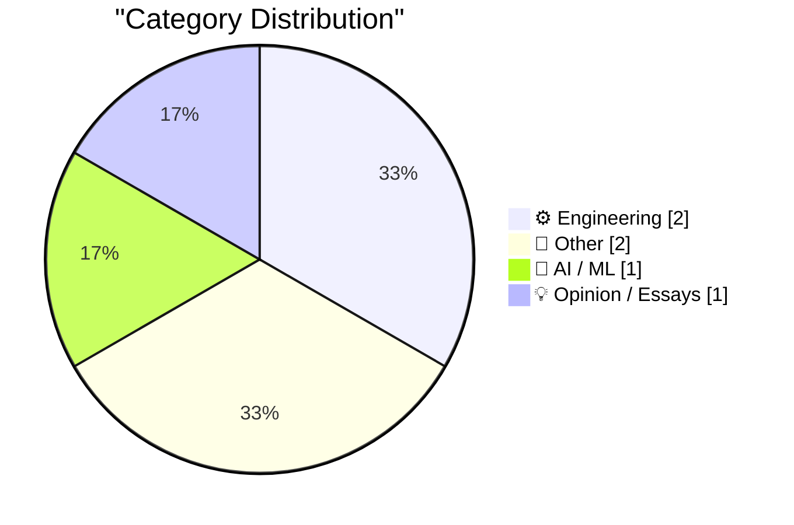
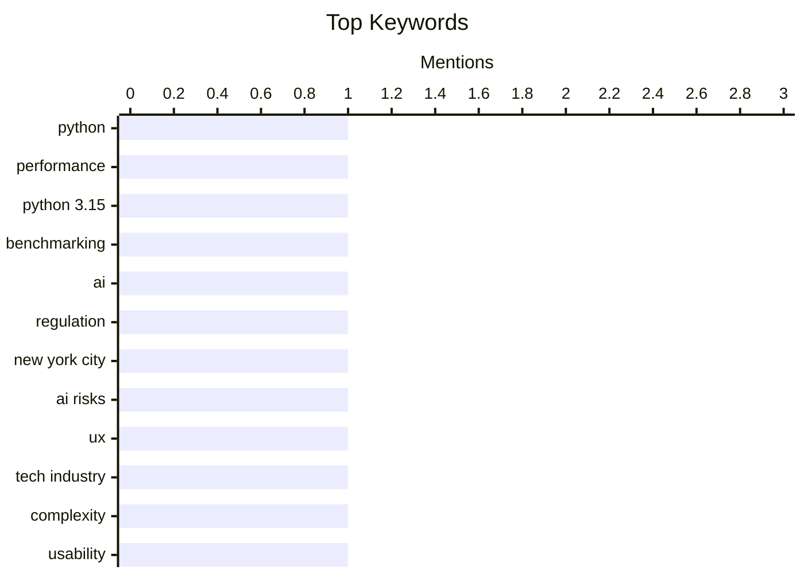

## Today's Highlights
The tech industry is grappling with its future, as New York City prepares for a public hearing on AI risks and some within the sector express embarrassment over its current trajectory. Amidst this introspection, core engineering continues to advance, with new benchmarks showcasing the performance of Python 3.15. This highlights a dual focus on ethical considerations and ongoing technical development.
---
## Must Read Today
1. **How fast is Python 3.15?**
[How fast is Python 3.15?](https://blog.miguelgrinberg.com/post/how-fast-is-python-3-15) — miguelgrinberg.com · 3h ago · ⚙️ Engineering
> This article aims to informally benchmark the performance of the new Python 3.15 release. The author compares Python 3.15 against previous interpreters, specifically going back to version 3.10. The post promises detailed charts and tables to illustrate the performance differences across these Python versions. This analysis provides an early look into the speed improvements or regressions in the latest Python iteration. The main takeaway is an objective performance comparison to inform developers about Python 3.15's efficiency.
💡 **Why read it**: It offers an early, informal performance benchmark of Python 3.15 against older versions, which is crucial for developers planning upgrades or optimizing Python applications.
🏷️ Python, performance, Python 3.15, benchmarking
2. **Coming soon: New York City’s hearing on AI risks**
[Coming soon: New York City’s hearing on AI risks](https://garymarcus.substack.com/p/coming-soon-new-york-citys-hearing) — garymarcus.substack.com · 11h ago · 🤖 AI / ML
> New York City is preparing to hold a public hearing specifically focused on the risks associated with Artificial Intelligence. This initiative reflects the city's commitment to addressing the societal implications of AI and 'taking care of its own.' The hearing is expected to explore various potential dangers and challenges posed by AI technologies. This proactive step by a major global city indicates a growing governmental interest in understanding and potentially regulating AI. The main conclusion is that NYC is taking a significant step towards public discourse and policy formation regarding AI risks.
💡 **Why read it**: It signals a proactive move by a major city to publicly address and potentially shape policy on the societal risks of Artificial Intelligence.
🏷️ AI, regulation, New York City, AI risks
3. **“I’m Embarrassed on Behalf of the Tech Industry”**
[“I’m Embarrassed on Behalf of the Tech Industry”](https://blog.jim-nielsen.com/2026/embarrassed-by-tech/) — blog.jim-nielsen.com · 19h ago · 💡 Opinion / Essays
> This article highlights a sentiment of embarrassment within the tech industry regarding the excessive complexity users face in managing their digital lives. Ben Thompson expressed this feeling after struggling to help his mother with convoluted digital tasks, finding the experience frustratingly difficult. The author reinforces this point with a personal anecdote of a family member encountering similar digital hurdles. This critique underscores a significant failure of the tech industry to prioritize user-friendliness and accessibility. The main takeaway is that the tech industry often creates overly complicated systems, alienating average users.
💡 **Why read it**: It offers a critical perspective on the tech industry's failure to prioritize user-friendliness, resonating with common frustrations experienced by non-technical users.
🏷️ UX, tech industry, complexity, usability
---
## Data Overview
| Sources Scanned | Articles Fetched | Time Window | Selected |
|:---:|:---:|:---:|:---:|
| 87/92 | 2418 -> 6 | 24h | **6** |
### Category Distribution

### Top Keywords

<details>
<summary>Plain Text Keyword Chart (Terminal Friendly)</summary>
```
python        │ ████████████████████ 1
performance   │ ████████████████████ 1
python 3.15   │ ████████████████████ 1
benchmarking  │ ████████████████████ 1
ai            │ ████████████████████ 1
regulation    │ ████████████████████ 1
new york city │ ████████████████████ 1
ai risks      │ ████████████████████ 1
ux            │ ████████████████████ 1
tech industry │ ████████████████████ 1
```
</details>
### Topic Tags
**python**(1) · **performance**(1) · **python 3.15**(1) · benchmarking(1) · ai(1) · regulation(1) · new york city(1) · ai risks(1) · ux(1) · tech industry(1) · complexity(1) · usability(1) · rss(1) · atom(1) · feed(1) · cdata(1) · ibm(1) · thinkpad(1) · history(1) · personal computer(1)
---
## Engineering
### 1. How fast is Python 3.15?
[How fast is Python 3.15?](https://blog.miguelgrinberg.com/post/how-fast-is-python-3-15) — **miguelgrinberg.com** · 3h ago · ⭐ 26/30
> This article aims to informally benchmark the performance of the new Python 3.15 release. The author compares Python 3.15 against previous interpreters, specifically going back to version 3.10. The post promises detailed charts and tables to illustrate the performance differences across these Python versions. This analysis provides an early look into the speed improvements or regressions in the latest Python iteration. The main takeaway is an objective performance comparison to inform developers about Python 3.15's efficiency.
🏷️ Python, performance, Python 3.15, benchmarking
---
### 2. [RSS Club] Changes to the RSS and Atom feeds
[[RSS Club] Changes to the RSS and Atom feeds](https://shkspr.mobi/blog/2026/10/rss-club-changes-to-the-rss-and-atom-feeds/) — **shkspr.mobi** · 2h ago · ⭐ 19/30
> The author addresses a recent issue where their RSS and Atom feeds inadvertently broke some subscribers' feed readers. The problem stemmed from the use of `<![CDATA[ ... ]]>` blocks within the feed content. While intended to allow raw HTML without escaping, some feed readers incorrectly unescaped text that should have remained escaped, leading to display errors. This highlights a compatibility challenge in how different feed readers interpret `CDATA` sections. The article's core message is a technical explanation and potential resolution for feed parsing inconsistencies.
🏷️ RSS, Atom, feed, CDATA
---
## Other
### 3. The IBM Thinkpad’s 1992 debut
[The IBM Thinkpad’s 1992 debut](https://dfarq.homeip.net/the-ibm-thinkpads-1992-debut/?utm_source=rss&#038;utm_medium=rss&#038;utm_campaign=the-ibm-thinkpads-1992-debut) — **dfarq.homeip.net** · 3h ago · ⭐ 11/30
> This article commemorates the debut of the iconic IBM Thinkpad, which was first released on October 5, 1992. IBM launched its initial three Thinkpad models on this date, marking a significant moment in portable computing history. While IBM had previous portable computers like the 1984 Portable PC and 1986 PC Convertible, none achieved the enduring success and recognition of the Thinkpad line. The article highlights the Thinkpad's lasting impact compared to its predecessors. The main conclusion is that the 1992 launch established the Thinkpad as a highly successful and influential brand for IBM.
🏷️ IBM, Thinkpad, history, personal computer
---
### 4. Zenith Data Systems, Part I
[Zenith Data Systems, Part I](https://www.abortretry.fail/p/zenith-data-systems-part-i) — **abortretry.fail** · 15h ago · ⭐ 9/30
> This article is the first installment of a series dedicated to exploring Zenith Data Systems (ZDS), a notable historical computer manufacturer. The piece introduces ZDS with the tagline, 'The quality goes in before the name goes on,' hinting at a focus on the company's commitment to product excellence. As 'Part I,' it sets the stage for an in-depth historical examination of ZDS's contributions and legacy in the computing industry. The article aims to shed light on a significant, though perhaps less-remembered, player in the evolution of personal computers. The main takeaway is the initiation of a comprehensive historical review of Zenith Data Systems.
🏷️ Zenith, computer history, hardware
---
## AI / ML
### 5. Coming soon: New York City’s hearing on AI risks
[Coming soon: New York City’s hearing on AI risks](https://garymarcus.substack.com/p/coming-soon-new-york-citys-hearing) — **garymarcus.substack.com** · 11h ago · ⭐ 24/30
> New York City is preparing to hold a public hearing specifically focused on the risks associated with Artificial Intelligence. This initiative reflects the city's commitment to addressing the societal implications of AI and 'taking care of its own.' The hearing is expected to explore various potential dangers and challenges posed by AI technologies. This proactive step by a major global city indicates a growing governmental interest in understanding and potentially regulating AI. The main conclusion is that NYC is taking a significant step towards public discourse and policy formation regarding AI risks.
🏷️ AI, regulation, New York City, AI risks
---
## Opinion / Essays
### 6. “I’m Embarrassed on Behalf of the Tech Industry”
[“I’m Embarrassed on Behalf of the Tech Industry”](https://blog.jim-nielsen.com/2026/embarrassed-by-tech/) — **blog.jim-nielsen.com** · 19h ago · ⭐ 22/30
> This article highlights a sentiment of embarrassment within the tech industry regarding the excessive complexity users face in managing their digital lives. Ben Thompson expressed this feeling after struggling to help his mother with convoluted digital tasks, finding the experience frustratingly difficult. The author reinforces this point with a personal anecdote of a family member encountering similar digital hurdles. This critique underscores a significant failure of the tech industry to prioritize user-friendliness and accessibility. The main takeaway is that the tech industry often creates overly complicated systems, alienating average users.
🏷️ UX, tech industry, complexity, usability
---
*Generated at 2026-10-05 14:01 | Scanned 87 sources -> 2418 articles -> selected 6*
*Based on the [Hacker News Popularity Contest 2025](https://refactoringenglish.com/tools/hn-popularity/) RSS source list recommended by [Andrej Karpathy](https://x.com/karpathy)*
*Produced by Dongdianr AI. Follow the same-name WeChat public account for more AI practical tips 💡*
