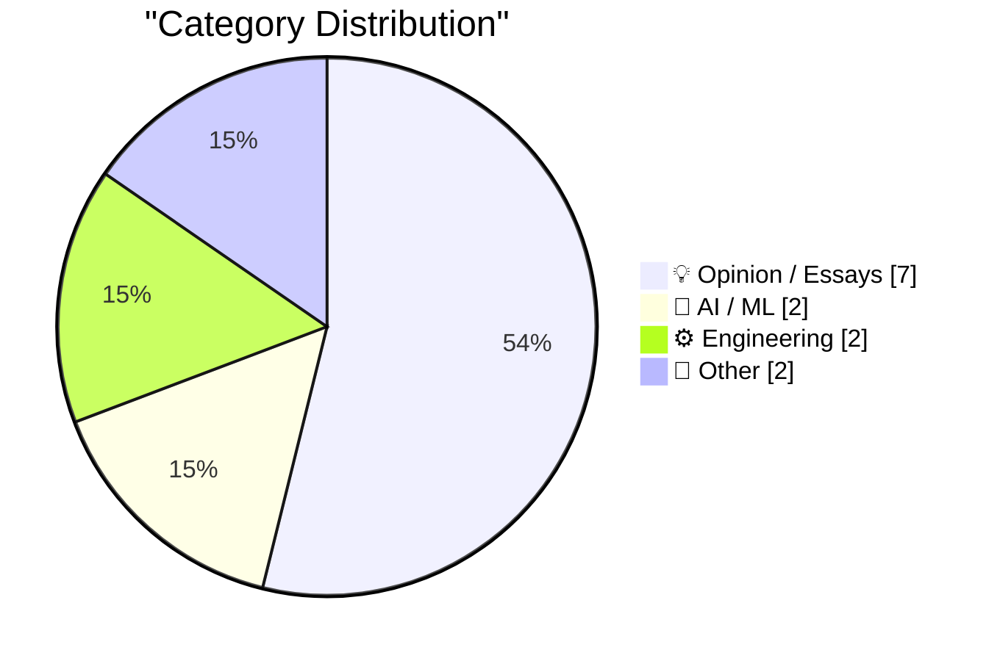
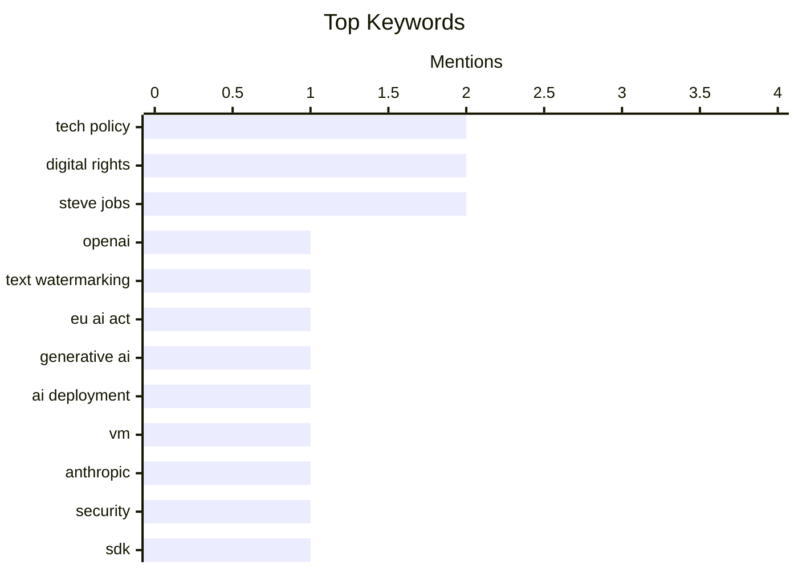

## Today's Highlights
Today's tech landscape is marked by significant strides in AI and practical engineering. Artificial intelligence is tackling authenticity with new text watermarking initiatives, while developers are pushing boundaries with smartwatch SDKs and code modernization tools. This progress is set against a backdrop of broader societal commentary, reflecting on economic shifts, the evolution of language, and historical lessons from tech pioneers.
---
## Must Read Today
1. **OpenAI Announces Their Text Watermarking Plans**
[OpenAI Announces Their Text Watermarking Plans](https://openai.com/index/eu-text-provenance/) — daringfireball.net · 15h ago · 🤖 AI / ML
> OpenAI Announces Their Text Watermarking Plans
🏷️ OpenAI, text watermarking, EU AI Act, generative AI
2. **Quoting Felix Rieseberg**
[Quoting Felix Rieseberg](https://simonwillison.net/2026/Oct/5/felix-rieseberg/) — simonwillison.net · 14h ago · 🤖 AI / ML
> Quoting Felix Rieseberg
🏷️ AI deployment, VM, Anthropic, security
3. **Una Watch - SDK and Writing Your First App**
[Una Watch - SDK and Writing Your First App](https://shkspr.mobi/blog/2026/10/una-watch-sdk-and-writing-your-first-app/) — shkspr.mobi · 2h ago · ⚙️ Engineering
> Una Watch - SDK and Writing Your First App
🏷️ SDK, app development, documentation, wearables
---
## Data Overview
| Sources Scanned | Articles Fetched | Time Window | Selected |
|:---:|:---:|:---:|:---:|
| 87/92 | 2418 -> 13 | 24h | **13** |
### Category Distribution

### Top Keywords

<details>
<summary>Plain Text Keyword Chart (Terminal Friendly)</summary>
```
tech policy       │ ████████████████████ 2
digital rights    │ ████████████████████ 2
steve jobs        │ ████████████████████ 2
openai            │ ██████████░░░░░░░░░░ 1
text watermarking │ ██████████░░░░░░░░░░ 1
eu ai act         │ ██████████░░░░░░░░░░ 1
generative ai     │ ██████████░░░░░░░░░░ 1
ai deployment     │ ██████████░░░░░░░░░░ 1
vm                │ ██████████░░░░░░░░░░ 1
anthropic         │ ██████████░░░░░░░░░░ 1
```
</details>
### Topic Tags
**tech policy**(2) · **digital rights**(2) · **steve jobs**(2) · openai(1) · text watermarking(1) · eu ai act(1) · generative ai(1) · ai deployment(1) · vm(1) · anthropic(1) · security(1) · sdk(1) · app development(1) · documentation(1) · wearables(1) · expertise(1) · link aggregation(1) · privacy(1) · drm(1) · peace(1)
---
## Opinion / Essays
### 1. Pluralistic: Swapping money for expertise (06 Oct 2026)
[Pluralistic: Swapping money for expertise (06 Oct 2026)](https://pluralistic.net/2026/10/06/nonfungible/) — **pluralistic.net** · 1h ago · ⭐ 19/30
> Pluralistic: Swapping money for expertise (06 Oct 2026)
🏷️ tech policy, digital rights, expertise, link aggregation
---
### 2. Pluralistic: Scrutinized (05 Oct 2026)
[Pluralistic: Scrutinized (05 Oct 2026)](https://pluralistic.net/2026/10/05/pervert-glasses/) — **pluralistic.net** · 19h ago · ⭐ 19/30
> Pluralistic: Scrutinized (05 Oct 2026)
🏷️ digital rights, privacy, DRM, tech policy
---
### 3. Predicting Peace
[Predicting Peace](https://entropicthoughts.com/forecasting-peace) — **entropicthoughts.com** · 16h ago · ⭐ 19/30
> Predicting Peace
🏷️ Peace, Prediction, Ukraine, Geopolitics
---
### 4. We are going to kill “unalive”
[We are going to kill “unalive”](https://anildash.com/2026/10/06/kill-unalive/) — **anildash.com** · 14h ago · ⭐ 16/30
> We are going to kill “unalive”
🏷️ Internet Culture, Language, Unalive, Communication
---
### 5. Steve Jobs, Walking Through a Mockup for Apple Park in 2010
[Steve Jobs, Walking Through a Mockup for Apple Park in 2010](https://book.stevejobsarchive.com/#photo-37) — **daringfireball.net** · 11h ago · ⭐ 14/30
> Steve Jobs, Walking Through a Mockup for Apple Park in 2010
🏷️ Steve Jobs, Apple history, Apple Park
---
### 6. Ternus and Cook Tweet Brief Remembrances on the 15th Anniversary of Steve Jobs’s Death
[Ternus and Cook Tweet Brief Remembrances on the 15th Anniversary of Steve Jobs’s Death](https://x.com/johnternus/status/2107093462118199562) — **daringfireball.net** · 18h ago · ⭐ 14/30
> This article reports on the remembrances shared by John Ternus and Tim Cook on the 15th anniversary of Steve Jobs's death. John Ternus highlighted Jobs's teaching on caring for every detail, experience, and person, which still guides Apple's work today. Tim Cook emphasized Jobs's world-changing impact and how his spirit lives on in his creations and inspirations. Both executives expressed profound gratitude and acknowledged Jobs's significant influence on their personal lives and the company's direction. The core takeaway is the enduring legacy and impact of Steve Jobs on Apple's culture and the lives of its current leaders.
🏷️ Steve Jobs, Apple, anniversary
---
### 7. Missing Link
[Missing Link](https://feed.tedium.co/link/15204/17490109/link-newspaper-virginian-pilot-remembrance) — **tedium.co** · 11h ago · ⭐ 9/30
> This article reflects on the newspaper "Link," which turned 20 years old, and the author's profound personal connection to it. The author expresses deep nostalgia, still missing the job 18 years after working there. It highlights the significant, life-changing impact "Link" had on the author's life. The piece serves as a personal remembrance of a specific publication and the lasting influence a past job can have on an individual.
🏷️ personal reflection, newspaper, career
---
## AI / ML
### 8. OpenAI Announces Their Text Watermarking Plans
[OpenAI Announces Their Text Watermarking Plans](https://openai.com/index/eu-text-provenance/) — **daringfireball.net** · 15h ago · ⭐ 29/30
> OpenAI Announces Their Text Watermarking Plans
🏷️ OpenAI, text watermarking, EU AI Act, generative AI
---
### 9. Quoting Felix Rieseberg
[Quoting Felix Rieseberg](https://simonwillison.net/2026/Oct/5/felix-rieseberg/) — **simonwillison.net** · 14h ago · ⭐ 24/30
> Quoting Felix Rieseberg
🏷️ AI deployment, VM, Anthropic, security
---
## Engineering
### 10. Una Watch - SDK and Writing Your First App
[Una Watch - SDK and Writing Your First App](https://shkspr.mobi/blog/2026/10/una-watch-sdk-and-writing-your-first-app/) — **shkspr.mobi** · 2h ago · ⭐ 22/30
> Una Watch - SDK and Writing Your First App
🏷️ SDK, app development, documentation, wearables
---
### 11. What is Codemode
[What is Codemode](https://lucumr.pocoo.org/2026/10/6/codemode/) — **lucumr.pocoo.org** · 14h ago · ⭐ 17/30
> What is Codemode
🏷️ debugging, game development, Codemode
---
## Other
### 12. Lotus: Second largest software publisher in the world (in 1983)
[Lotus: Second largest software publisher in the world (in 1983)](https://dfarq.homeip.net/lotus-second-largest-software-publisher-in-the-world-in-1983/?utm_source=rss&#038;utm_medium=rss&#038;utm_campaign=lotus-second-largest-software-publisher-in-the-world-in-1983) — **dfarq.homeip.net** · 3h ago · ⭐ 15/30
> Lotus: Second largest software publisher in the world (in 1983)
🏷️ Lotus, Software History, 1-2-3, IPO
---
### 13. [Sponsor] Sunnny
[[Sponsor] Sunnny](https://sunnny.com/) — **daringfireball.net** · 14h ago · ⭐ 9/30
> This article is a brief promotional announcement for a B2B software product named Sunnny. It uses a rhetorical question to tease the unique appeal of B2B software, aiming to generate interest. The announcement specifies that early access drops on October 19th, encouraging potential users to engage. The core message is a concise marketing teaser for an upcoming B2B software launch, highlighting its availability date and distinctive proposition.
🏷️ B2B software, early access, Sunnny
---
*Generated at 2026-10-06 14:01 | Scanned 87 sources -> 2418 articles -> selected 13*
*Based on the [Hacker News Popularity Contest 2025](https://refactoringenglish.com/tools/hn-popularity/) RSS source list recommended by [Andrej Karpathy](https://x.com/karpathy)*
*Produced by Dongdianr AI. Follow the same-name WeChat public account for more AI practical tips 💡*
