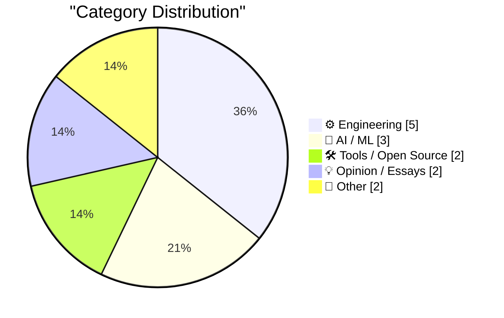
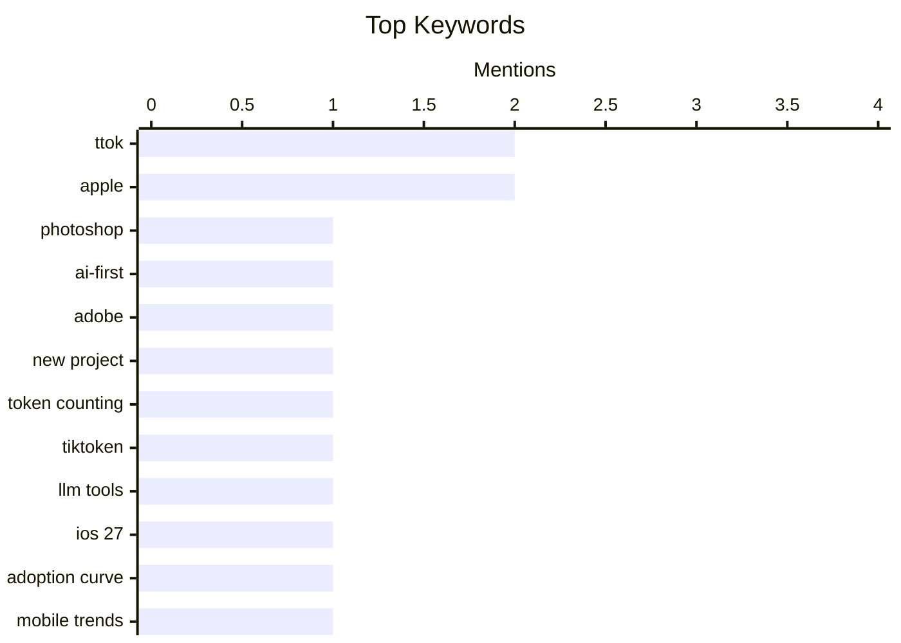

## Today's Highlights
Today's tech highlights reveal a dual focus on advancing AI capabilities and refining engineering strategies. New AI/ML tools like 'ttok' are maturing, alongside innovative applications such as voice integration for digital platforms. Simultaneously, the industry is grappling with product adoption challenges, like Apple's iOS rollout, and critically examining the "modernization treadmill" to foster more sustainable development practices.
---
## Must Read Today
1. **Let’s Deconstruct Photoshop**
[Let’s Deconstruct Photoshop](https://feed.tedium.co/link/15204/17492299/artcraft-vibe-coding-creative-cloud-remake) — tedium.co · 21h ago · 🤖 AI / ML
> Let’s Deconstruct Photoshop
🏷️ Photoshop, AI-first, Adobe, new project
2. **ttok 0.4**
[ttok 0.4](https://simonwillison.net/2026/Oct/8/ttok/) — simonwillison.net · 14h ago · 🤖 AI / ML
> ttok 0.4
🏷️ ttok, token counting, tiktoken, LLM tools
3. **Apple Is Slow-Rolling iOS 27 Adoption, So Far**
[Apple Is Slow-Rolling iOS 27 Adoption, So Far](https://mastodon.social/@_Davidsmith/117355154519434137) — daringfireball.net · 18h ago · ⚙️ Engineering
> Apple Is Slow-Rolling iOS 27 Adoption, So Far
🏷️ iOS 27, Apple, adoption curve, mobile trends
---
## Data Overview
| Sources Scanned | Articles Fetched | Time Window | Selected |
|:---:|:---:|:---:|:---:|
| 86/92 | 2391 -> 14 | 24h | **14** |
### Category Distribution

### Top Keywords

<details>
<summary>Plain Text Keyword Chart (Terminal Friendly)</summary>
```
ttok           │ ████████████████████ 2
apple          │ ████████████████████ 2
photoshop      │ ██████████░░░░░░░░░░ 1
ai-first       │ ██████████░░░░░░░░░░ 1
adobe          │ ██████████░░░░░░░░░░ 1
new project    │ ██████████░░░░░░░░░░ 1
token counting │ ██████████░░░░░░░░░░ 1
tiktoken       │ ██████████░░░░░░░░░░ 1
llm tools      │ ██████████░░░░░░░░░░ 1
ios 27         │ ██████████░░░░░░░░░░ 1
```
</details>
### Topic Tags
**ttok**(2) · **apple**(2) · **photoshop**(1) · ai-first(1) · adobe(1) · new project(1) · token counting(1) · tiktoken(1) · llm tools(1) · ios 27(1) · adoption curve(1) · mobile trends(1) · keynote(1) · announcement(1) · product launch(1) · cli tool(1) · release(1) · upgrade(1) · programming(1) · problem-solving(1)
---
## Engineering
### 1. Apple Is Slow-Rolling iOS 27 Adoption, So Far
[Apple Is Slow-Rolling iOS 27 Adoption, So Far](https://mastodon.social/@_Davidsmith/117355154519434137) — **daringfireball.net** · 18h ago · ⭐ 23/30
> Apple Is Slow-Rolling iOS 27 Adoption, So Far
🏷️ iOS 27, Apple, adoption curve, mobile trends
---
### 2. Joz Announces ‘Welcome Home’ Keynote Coming Tuesday, 13 October
[Joz Announces ‘Welcome Home’ Keynote Coming Tuesday, 13 October](https://x.com/gregjoz/status/2108226096407994858) — **daringfireball.net** · 19h ago · ⭐ 23/30
> Joz Announces ‘Welcome Home’ Keynote Coming Tuesday, 13 October
🏷️ Apple, keynote, announcement, product launch
---
### 3. Quoting Carson Gross
[Quoting Carson Gross](https://simonwillison.net/2026/Oct/8/carson-gross/) — **simonwillison.net** · 16h ago · ⭐ 21/30
> Quoting Carson Gross
🏷️ Programming, problem-solving, complexity, fundamentals
---
### 4. “Getting off the Modernization Treadmill”
[“Getting off the Modernization Treadmill”](https://blog.jim-nielsen.com/2026/talk-notes-modernization-treadmill/) — **blog.jim-nielsen.com** · 19h ago · ⭐ 21/30
> “Getting off the Modernization Treadmill”
🏷️ Modernization, Technical Debt, Software Strategy, Development Practices
---
### 5. Get Player Stats From Your Minecraft Server Logs
[Get Player Stats From Your Minecraft Server Logs](https://jayd.ml/2026/10/08/minecraft-log-analyzer.html) — **jayd.ml** · 19h ago · ⭐ 14/30
> This article discusses a method for extracting player statistics directly from Minecraft server logs. It aims to provide insights into player activity and behavior without requiring in-game plugins or external tracking services. The approach likely involves parsing raw log data to identify key events such as logins, logouts, kills, and resource interactions. While the underlying concept was "vibecoded," the post offers a human-written explanation for implementing such a log analyzer. This provides server administrators with a custom, lightweight way to monitor their player base.
🏷️ Minecraft, Server Logs, Player Stats, Data Extraction
---
## AI / ML
### 6. Let’s Deconstruct Photoshop
[Let’s Deconstruct Photoshop](https://feed.tedium.co/link/15204/17492299/artcraft-vibe-coding-creative-cloud-remake) — **tedium.co** · 21h ago · ⭐ 26/30
> Let’s Deconstruct Photoshop
🏷️ Photoshop, AI-first, Adobe, new project
---
### 7. ttok 0.4
[ttok 0.4](https://simonwillison.net/2026/Oct/8/ttok/) — **simonwillison.net** · 14h ago · ⭐ 23/30
> ttok 0.4
🏷️ ttok, token counting, tiktoken, LLM tools
---
### 8. A new feature for my blog, built using my voice
[A new feature for my blog, built using my voice](https://simonwillison.net/2026/Oct/9/built-using-my-voice/) — **simonwillison.net** · 1h ago · ⭐ 18/30
> A new feature for my blog, built using my voice
🏷️ Blog feature, voice tech, newsletters
---
## Tools / Open Source
### 9. ttok 1.0
[ttok 1.0](https://simonwillison.net/2026/Oct/9/ttok/) — **simonwillison.net** · 13h ago · ⭐ 22/30
> ttok 1.0
🏷️ ttok, CLI tool, release, upgrade
---
### 10. iFlac: Sync your FLAC files to your iPhone from Linux
[iFlac: Sync your FLAC files to your iPhone from Linux](https://jayd.ml/2026/10/08/iflac-sync-flacs-to-iphone.html) — **jayd.ml** · 19h ago · ⭐ 14/30
> This article introduces iFlac, a tool designed to synchronize FLAC audio files from a Linux system to an iPhone. It addresses the common challenge of transferring high-fidelity audio formats to Apple devices without relying on proprietary software like iTunes. The project's core is described as "vibecoded," suggesting an unconventional development approach, though the README is human-written. iFlac provides a direct solution for Linux users to manage their FLAC music library on iOS devices.
🏷️ FLAC, iPhone, Linux, Sync
---
## Opinion / Essays
### 11. Let’s Check In on Trump’s Blog
[Let’s Check In on Trump’s Blog](https://truthsocial.com/@realDonaldTrump/posts/117406176604364910) — **daringfireball.net** · 15h ago · ⭐ 15/30
> Let’s Check In on Trump’s Blog
🏷️ Trump, AI, Super Intelligence, political commentary
---
### 12. 20 Minutes of Political Debate, Brought to You by Commercial Breaks
[20 Minutes of Political Debate, Brought to You by Commercial Breaks](https://idiallo.com/byte-size/20-minutes-of-political-debate) — **idiallo.com** · 9h ago · ⭐ 15/30
> 20 Minutes of Political Debate, Brought to You by Commercial Breaks
🏷️ Political debate, media, commentary, politics
---
## Other
### 13. Concert Review: London Voices - Video Games Go Choral ★★★★☆
[Concert Review: London Voices - Video Games Go Choral ★★★★☆](https://shkspr.mobi/blog/2026/10/concert-review-london-voices-video-games-go-choral/) — **shkspr.mobi** · 2h ago · ⭐ 14/30
> This article reviews the "Video Games Go Choral" concert by London Voices, held at St Martin in the Field. The performance featured monophonic plainchant versions of video game themes, including Halo, leveraging the church's echoey acoustics for an a cappella experience. This unique event blended classical choral tradition with modern gaming culture, offering a distinct musical interpretation. The reviewer awarded it ★★★★☆, indicating a successful and appealing niche performance.
🏷️ Concert review, video game music, choral, London
---
### 14. Commodore’s knockoff Atari joystick from 1982
[Commodore’s knockoff Atari joystick from 1982](https://dfarq.homeip.net/commodores-knockoff-atari-joystick-from-1982/?utm_source=rss&#038;utm_medium=rss&#038;utm_campaign=commodores-knockoff-atari-joystick-from-1982) — **dfarq.homeip.net** · 3h ago · ⭐ 9/30
> This article examines the Commodore VIC-1311 joystick, released in 1982 alongside the VIC-20 computer. The VIC-1311 is characterized as a "knockoff" of the contemporary Atari joystick, featuring a similar two-tone design but cast in white plastic to match the VIC-20. This design choice highlights Commodore's strategy to offer compatible peripherals that mimicked popular market standards while maintaining brand aesthetics. The article delves into the historical context of early computer peripheral design and market competition.
🏷️ Commodore, Atari, Joystick, Vintage Hardware
---
*Generated at 2026-10-09 14:01 | Scanned 86 sources -> 2391 articles -> selected 14*
*Based on the [Hacker News Popularity Contest 2025](https://refactoringenglish.com/tools/hn-popularity/) RSS source list recommended by [Andrej Karpathy](https://x.com/karpathy)*
*Produced by Dongdianr AI. Follow the same-name WeChat public account for more AI practical tips 💡*
